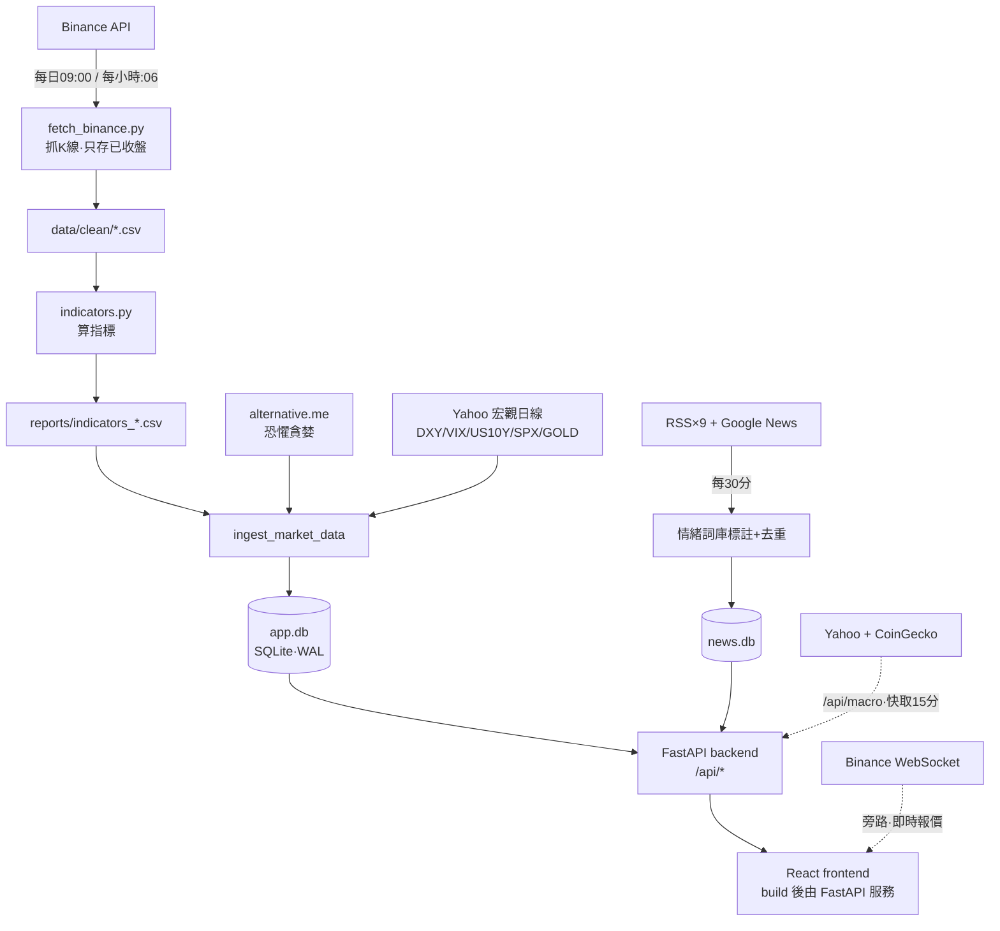
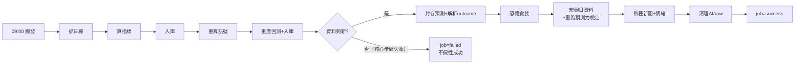
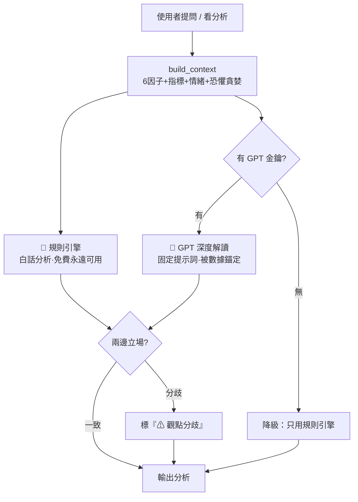
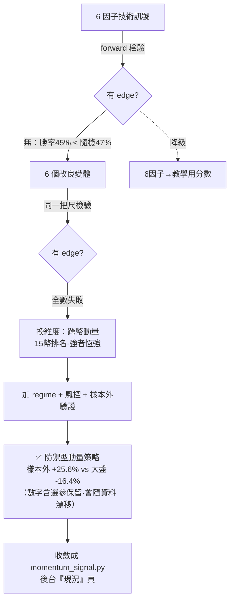
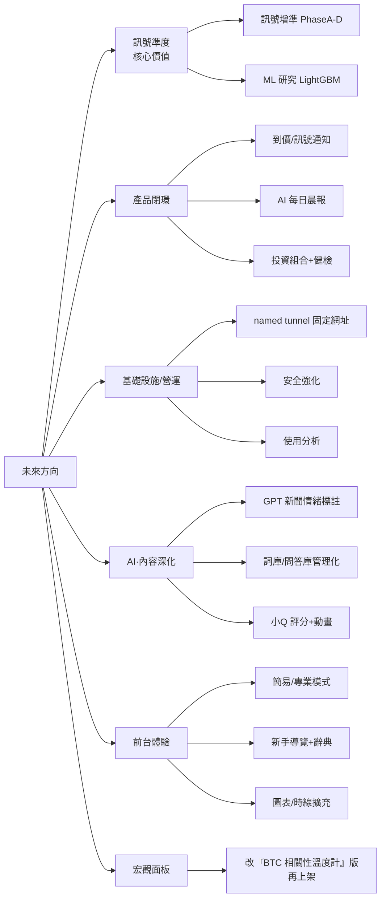

# crypto-quant — 加密貨幣量化分析平台

> **這份文件是專案的入口**：接手開發、回顧架構、或讓 AI 助手了解專案之前，先讀這一份。
> 最後更新：2026-09-01

一句話介紹：一個自架的加密貨幣分析網站 — 自動抓行情與新聞、算技術指標與訊號、
保留「規則引擎 + GPT」雙 AI 解讀能力，新增可拒答、可稽核的研究預測，附**即時報價**，配有管理後台，前台資料自動更新。

---

## 📑 延伸文件（已封存於 `docs/archive/`）

> **README 是主文件**。下列較細的技術與歷史文件封存在 [`docs/archive/`](docs/archive/)，接手同仁需要深入時查閱；主管看 README（另有 Word 版 `docs/`）即可。

| 想做的事 | 看這份 |
|---|---|
| **快速了解 / 接手** | 本檔 README（你在這） |
| **部署、重啟、改前端、換機搬遷、輪密鑰、排錯；本地開發、開發鐵律、測試怎麼跑** | [`docs/archive/部署與運維.md`](docs/archive/部署與運維.md)（**第二部＝開發指南**） |
| **呼叫 API（前台/後台端點規格）、資料庫每張表結構與資料流** | [`docs/archive/API規格.md`](docs/archive/API規格.md)（**第二部＝資料庫說明**） |
| **研究預測成績單（資料契約、發布門檻）與機率校準研究（Platt／Beta、walk-forward）** | [`docs/archive/研究預測評估.md`](docs/archive/研究預測評估.md)（第一部＝成績單規格、第二部＝校準研究） |
| **模型實測指標（F1／Recall／AUC／AP／SHAP 適用性）** | [`docs/crypto-quant_文件合集.docx`](docs/crypto-quant_文件合集.docx) 第柒章 |
| **給主管的成果匯報 / 驗證數據、訊號研究軌跡** | [`docs/archive/成果匯報.md`](docs/archive/成果匯報.md)（**第二部＝訊號研究記錄**） |
| **未來路線圖 / 訊號改良與 ML 計畫** | 進度真相＝後台「工作項目」（`tasks` 表）＋本檔 §12；計畫細節見 [`docs/archive/訊號增準計畫.md`](docs/archive/訊號增準計畫.md)（含**第二部 ML 計畫**） |

> 進度的**單一真相來源**是後台「工作項目」（`app.db` 的 `tasks` 表），本檔 §12 是規劃視角的快照。
>
> **Word 合集怎麼重生**：改動 README／`docs/` 任一來源文件後，跑 `.venv\Scripts\python.exe scripts\merge_docx.py` 一鍵重生 [`docs/crypto-quant_文件合集.docx`](docs/crypto-quant_文件合集.docx)（自動重轉全部來源（合集現為 9 章＋前言）、渲染 mermaid 圖、清理中繼檔；渲染需 node/npx）。章節編號固定在該腳本的 `SECTIONS` 清單，改章序時要同步所有引用「第 X 章」的文件。

---

## 1. 功能總覽

| 區塊 | 內容 |
|---|---|
| 市場總覽 | 15 幣訊號卡片牆、**即時報價**（前端直連 Binance WebSocket、秒級跳動）、恐懼貪婪指數、市場摘要列 |
| 幣種詳細頁 | 蠟燭圖（**日線 / 時線** 切換，MA/布林/成交量/RSI/MACD/KDJ/DMI/BIAS/**ATR/OBV**）、1/5/10 日研究預測決策卡、每日盯市回測、情緒面板 |
| 判斷與預測 | regime 歷史基準：漲跌機率、q10/q50/q90、下行風險、信心與證據；低信心/過期/樣本不足會明確拒答，不輸出假精準結論 |
| AI 智能分析 | 後端與後台設定已保留：🧮 規則引擎（6 因子白話分析）+ 🤖 GPT 深度解讀（需金鑰）；前台 `AIAnalystPanel` 目前暫停顯示 |
| 市場情緒 | 恐懼貪婪錶盤+歷史、**新聞情緒溫度**（每日 -100~+100，全市場+單幣）、新聞牆（10 個來源、中英文） |
| 自動更新 | 前端每 60 秒輪詢資料版本，有新資料才重拉 — 不用手動重整 |
| 管理後台 `/admin` | 監控儀表板、幣種管理、工作項目追蹤、資料庫檢視、訊號成績單、策略現況、AI 設定（金鑰/用量） |

> **暫時下架但程式保留**（取消 `App.jsx` 對應註解即可恢復）：`AIAnalystPanel`、相關性熱圖 `CorrelationHeatmap`、吉祥物小Q 漂浮聊天小幫手 `BotWidget`（2026-07-06，使用者為主管/老闆）、新手導覽 `OnboardingTour`。
>
> **宏觀面板 `MacroPanel` 已於 2026-08-10 重新上架**：補上十年宏觀歷史、預測力檢定與「以 BTC 為主的相關性溫度計」後，不再只是即時數字（見 §9-F）。

## 2. 快速啟動

### Windows（目前的部署機）

```powershell
# 後端 + 前端一起（開發模式）
cd frontend
npm run start          # 本機開發：uvicorn(8001, --reload) + vite(5174)

# 或分開跑（僅限 loopback 本機開發；fallback 帳密必須明確 opt-in）
cd ..
$env:CRYPTO_QUANT_MODE='development'; $env:CRYPTO_QUANT_BIND_HOST='127.0.0.1'; $env:ALLOW_INSECURE_ADMIN_DEFAULTS='1'
.\.venv\Scripts\python.exe -m uvicorn backend.main:app --host 127.0.0.1 --port 8001
cd frontend && npm run ui

# 正式：build 後由 FastAPI 直接服務（10.201.7.12:8000）
cd frontend && npm run build
```

- 正式前台：`http://10.201.7.12:8000`；後台：`http://10.201.7.12:8000/admin`
- 本機開發：前端 `http://localhost:5174`，API `http://localhost:8001`
- 後台：`/admin`，帳密來自環境變數 `ADMIN_USER` / `ADMIN_PASS`；正式/排程啟動由 `secrets.local.cmd`（Windows）／`secrets.local.sh`（macOS，從 `secrets.example.sh` 複製）注入 `ADMIN_PASS` 與 `ADMIN_SECRET`（該檔已 gitignore）。正式/對外模式若簽章密鑰仍是預設值、密鑰少於 32 字元或一般密碼少於 12 字元會拒絕啟動；因既有使用者決策而明確設定的 legacy `admin123` 暫保留相容但會高風險警告，且登入連續失敗 5 次鎖定 15 分鐘。fallback 只允許明確宣告 `CRYPTO_QUANT_BIND_HOST=127.0.0.1` 的 loopback 開發，並須設定 `ALLOW_INSECURE_ADMIN_DEFAULTS=1`。
- GPT 金鑰：後台「AI 設定」頁填入，或環境變數 `OPENAI_API_KEY`（優先）；不填則 AI 只用規則引擎
- **區網對外主入口是 quant-portal（另一個 repo，`:8080`）**：`http://10.201.7.12:8080/` 由 `C:\Users\Administrator\quant-portal`（排程工作 `Portal-LAN-Web`）服務，加密／股票平台切換器在那裡；其 `/crypto/` 是本專案前端的**另一份建置產物**＋API 代理。**改前端要 build 兩次**：`cd frontend && npm run build`（更新 `:8000`）之後，還要到 `quant-portal` 跑 `build.ps1`（更新 `:8080`），否則入口網站看不到變更。細節見 `quant-portal\部署說明.md` 與 [`docs/archive/部署與運維.md`](docs/archive/部署與運維.md)。
- 對外公開（選用）：可將 Cloudflare Quick Tunnel 指向 `10.201.7.12:8000`；啟用前必須先更換預設後台密碼與簽章密鑰。named tunnel、Cloudflare Access/WAF 仍需外部網域與帳號權限，尚未由本 repo 自動完成。
- **正式部署（開機自啟/看門狗/服務化）詳見 [`docs/archive/部署與運維.md`](docs/archive/部署與運維.md)。**

> ⚠️ Windows 上 `.venv\Scripts\python.exe` 是啟動器殼，工作管理員會看到
> 「venv + 系統 Python **成對**的 uvicorn」— 那是**一台**伺服器，不是重複執行；殺掉子進程=殺掉整台。

### macOS / Linux

```bash
./setup.sh                  # 首次：建 .venv、裝 Python 相依、npm ci、build 前端（--dev 另裝驗證/文件相依）
cd frontend && npm run start   # 開發：API :8001（--reload）+ vite :5174，同 Windows
./start_backend.sh             # 正式：FastAPI 直接服務 frontend/dist，預設 127.0.0.1:8000，含看門狗
./start_backend.sh --once      # 不套看門狗、輸出印在畫面上，用來看啟動錯誤
```

- 要讓區網或 Cloudflare Tunnel 連進來：`CRYPTO_QUANT_BIND_HOST=0.0.0.0 ./start_backend.sh`。
  非 loopback 位址會被判定為對外模式，此時 `ADMIN_SECRET` 需 32 字元以上、`ADMIN_PASS` 需 12 字元以上才會啟動。
- 開機自動啟動（等同 Windows 的排程工作 `CryptoQuantBackend`）：把 `scripts/com.cryptoquant.backend.plist`
  裡的 `__REPO__` 換成實際路徑後放進 `~/Library/LaunchAgents/` 再 `launchctl load -w`，說明寫在檔案開頭。
  注意筆電闔蓋睡眠時排程不會跑，醒來後 APScheduler 接續下一個排程點，錯過的那次不補跑。
- **排程用系統本地時區**：`BackgroundScheduler()` 沒有指定 timezone，「每日 09:00」是照
  台灣時間設計的（UTC 01:00＝日 K 棒收盤後 1 小時）。MacBook 若設成別的時區或帶出國，
  抓取時間點會跟著漂移，日線可能固定慢一根。
- `npm run api` 走 `scripts/dev_api.mjs`（跨平台，自動找對應平台的 venv python）。
  找不到 python 時用 `DEV_API_DRY_RUN=1 npm run api` 只印指令、不啟動，方便排查路徑。

### 換一台機器（搬遷）

git 只帶程式碼；**後台帳密、`data/app.db`（工作項目／後台設定／AI 金鑰）、`data/news.db`
與執行期資料都被 gitignore**，必須另外帶。舊機器上執行：

```bash
python scripts/make_migration_bundle.py     # 產生 ../crypto-quant-migration/crypto-quant-migration-<日期>.zip
```

包含 `secrets.local.sh`（由 `secrets.local.cmd` 轉出）、兩個 SQLite 的線上備份快照
（WAL 模式下直接複製檔案會拿到不一致的快照，所以走 sqlite3 backup API）、`data/clean`、
`data/raw`、`reports`。**內含後台密碼，請用私人管道傳**（`--no-secrets` 可排除）。

新機器上：

```bash
git clone <repo> crypto-quant && cd crypto-quant
./setup.sh
unzip -o ~/Downloads/crypto-quant-migration-*.zip -d .   # 還原 DB 與帳密
./start_backend.sh
```

沒有搬遷包也能跑，但要注意兩件事：排程**不會在啟動時補跑**，第一批資料要等下一個
排程點（每小時 `:06`、每日 `09:00`），想立刻有資料就先手動跑一次：

```bash
./.venv/bin/python src/fetch_binance.py BTCUSDT ETHUSDT SOLUSDT
./.venv/bin/python src/indicators.py BTCUSDT --no-plot
```

另外工作項目追蹤、歷史新聞情緒與後台設定都會是空的（那些只存在 `app.db` / `news.db`）。
`data/backups/`（sqlite 自動備份，舊機器上約 640 MB）刻意不放進搬遷包，新機器每日 03:30
的備份排程會自己重新產生。

## 3. 系統架構與資料流

**▸ 圖：系統架構與資料流**（線上 README 可見渲染圖）



原則：**CSV 是中繼/備援，前後台一律讀 SQLite**；所有排程都記錄到 `job_runs` 表（後台監控頁可看成功/失敗）。

**旁路即時資料（不進排程管線、即時取用）**：
- 即時報價：前端**直連 Binance WebSocket**（`lib/useLivePrices.js`），免經後端。
- 宏觀環境（即時面板）：前端打 `/api/macro`，後端**當下**抓 Yahoo Finance + CoinGecko（快取 15 分）。
  這條旁路只負責「現在的數字」；**歷史**另由每日排程寫入 `macro_daily` 表（下方管線步驟 7b），
  兩邊共用 `src/macro_regime.py` 的同一套規則，所以面板今天的判斷與歷史檢定是同一個定義。
  面板每一格都標出**標的代號與該筆收盤日**（可點去 Yahoo 原始頁面自行核對）：各序列交易日並不一致（美股休市當天黃金與美元照常交易），共用一個「更新時間」會讓人誤以為所有數字同時點。

### 設計決策（為什麼這樣做）

- **雙 SQLite（`app.db` / `news.db`）**：零設定、ACID、開 WAL（耐當機、讀寫不互鎖）；資料量萬~百萬列綽綽有餘；`prices`/`indicators`/`daily_signal` 全可由 CSV 或 Binance 重建，遺失≠永久遺失。詳見 [`docs/archive/API規格.md`](docs/archive/API規格.md)（第二部：資料庫說明）。
- **CSV 中繼 + DB 中央**：抓取/計算落 CSV（可備援、可肉眼查），再 ingest 進 DB 當查閱與分析中心。
- **6 因子計分單一真相（`src/scoring.py`）**：前台訊號與回測**共用同一把尺**，回測才能佐證畫面建議（否則兩套邏輯各說各話）。
- **雙 AI 引擎互輔**：GPT 吃規則引擎整理好的結構化事實 + 固定提示詞，被本地數據錨定防幻覺；立場不一致標「觀點分歧」。
- **資料正確性鐵律**：只存**已收盤** K 棒（避免半根 K 棒污染尾端指標）；回測**不前視**（依訊號動作延到隔根開盤成交）。
- **研究預測可追溯**：輸入完成日線做 SHA-256；`reference_close`、預測與 outcome 分開 append-only 封存。同一資料日若歷史 K 線被修訂，另建快照而不覆寫舊紀錄。
- **設定集中 `app_config`**：幣種清單、時線幣種、AI 金鑰等單一來源，不寫死在程式，後台可改。

## 4. 目錄地圖

```
backend/
  main.py                FastAPI 入口（掛路由、服務 frontend/dist）
  scheduler.py           排程：每日 pipeline(09:00,UTC日棒收盤後)、每小時 1h 線(:06)、新聞(每30分)
  routers/               API routers（規格見 docs/archive/API規格.md）
    meta.py              /symbols /intervals /status(data_version=自動更新的心跳) /verify
    prices.py            /prices/{sym}?interval=1d|1h
    indicators.py        /indicators/{sym}?interval=
    signals.py           /signals（6 因子訊號）/signals/{sym}/history
    backtest.py          /backtest/{sym}（日線策略回測）/backtest/db/*（入庫結果）
    forecast.py          /forecast/{sym}（研究預測）＋/forecast/scorecard（後台樣本外成績）
    correlation.py       /correlation
    sentiment.py         新聞抓取+情緒詞庫(中英)+幣種標記；/sentiment/*（news、summary、fear_greed）
    ai.py                /ai/analysis /ai/ask /ai/config（AI 機器人）
    macro.py             /macro（規則式宏觀環境＋證據＋連動強度）/macro/history（逐日環境標籤）
    admin.py             /admin/*（登入、監控、幣種、任務、DB 檢視、AI 設定、成績單、策略、操作）
  services/
    app_db.py            data/app.db 全部表與存取（設定/任務/K線/指標/訊號/預測/AI 快取…）
    forecast_scorecard.py 不可變 ledger 去重、point-in-time 基準與發布閘門
    reader.py            前台讀取層（多週期查詢、data_versions；停用幣如 MATIC 自動隱藏）
    signal_engine.py     6 因子訊號（計分核心在 src/scoring.py）
    ai_analyst.py        ★AI 雙引擎：build_context→規則分析→GPT(固定提示詞)→交叉檢核
    news_store.py        news.db 存取＋news_sentiment_daily 每日情緒彙總
    backtest_engine.py   回測引擎
    macro.py             ★宏觀環境引擎（Yahoo+CoinGecko；規則核心在 src/macro_regime.py）
                         另供 macro_snapshot_for_analysis()：把環境+證據+連動強度餵進 AI 判讀
    coin_facts.py        幣種基本資料（含 MATIC→POL 等歷史脈絡）
    canned_qa.py         AI 固定問答庫
src/
  fetch_binance.py       抓 K 線（多幣/多週期/增量/過濾未收盤K棒）── scheduler 用
  indicators.py          算指標（--interval 1d|1h --no-plot）── scheduler 用
  scoring.py             ★6 因子計分單一真相來源（前台訊號與回測共用）
  backtest.py            ★回測核心（scheduler/app_db/backtest_engine 共用）
  forecasting.py         ★內容定址研究預測、拒答門檻與 outcome 解析
  forecast_evaluation.py Brier/log loss/ECE/risk-coverage/WIS/block-bootstrap 評估
  forecast_replay.py     嚴格 j+h<=t 的歷史 replay CLI（研究證據，不冒充線上預測）
  momentum_signal.py     ★防禦型跨幣動量策略（已驗證有效；後台「現況」頁）
  signal_eval.py         訊號成績單（forward edge 檢驗；後台即時）
  verify_indicators.py   指標交叉驗證（前台信任徽章；後台即時）
  correlation.py         相關性矩陣（手動分析；排程已不再呼叫）
  verify_backtest.py     回測驗證器（改訊號/回測後必跑）
  macro_regime.py        ★宏觀規則單一真相來源（即時面板與歷史檢定共用；門檻已凍結，見檔頭）
  macro_eval.py          宏觀預測力檢定（HAC t 值/不重疊對照/區段數）→ reports/macro_evidence.json
  macro_longrun.py       宏觀檢定的長樣本旁路（2017 起 8 年；已否定「樣本不夠」的退路，不動正式資料）
  cross_sectional*.py …  跨幣動量研究血脈（收斂成 momentum_signal.py，見 docs/archive/成果匯報.md 第二部）
frontend/src/
  App.jsx                根元件：總覽/詳細切換、60 秒輪詢自動更新、時線切換
  api/client.js          公開 API client；api/admin.js 後台 client
  admin/ForecastScorecardPage.jsx 後台模型治理成績單與升級門檻
  lib/useLivePrices.js   ★Binance WebSocket 即時報價 hook
  components/
    CandlestickChart.jsx 主圖（lightweight-charts，多週期時間軸）
    AIAnalystPanel.jsx   AI 分析面板（雙引擎+提問；現暫停掛載）
    MarketOverview.jsx   總覽卡片牆；MarketSummary.jsx 市場摘要列
    MacroPanel.jsx       宏觀環境面板（因子格＋連動強度＋歷史證據＋環境時間軸）
    SentimentPanel.jsx   情緒面板（恐懼貪婪+新聞情緒溫度+新聞牆）
    BotMascot.jsx / BotWidget.jsx  小Q吉祥物（暫時下架，保留可恢復）
    ForecastDecisionCard 1/5/10 日機率、區間、風險、證據與拒答狀態
    HeroSignal / BacktestPanel / CorrelationHeatmap（現暫停掛載） / IndicatorCards ...
  admin/AdminApp.jsx     整個後台（分頁：監控/幣種/工作項目/資料庫/現況/AI 設定）
docs/                    見上方「文件地圖」
data/  clean/*.csv（K線）raw/（原始JSON,gitignore）app.db news.db（gitignore）
reports/ indicators_*.csv backtest_*（json/csv；圖 png 不追蹤）
```

## 5. 資料庫（SQLite×2，皆 WAL）

> 完整表結構、資料流、容量評估見 **[`docs/archive/API規格.md`](docs/archive/API規格.md)**（第二部：資料庫說明）。

**data/app.db**：`prices`/`indicators`（多週期 K 線與指標，PK=symbol+interval+ts）、
`daily_signal`（每日訊號歷史）、`fear_greed`、`app_config`（幣種清單/hourly_symbols/AI 設定 — 集中設定，後台可改）、
`tasks`（★工作項目=**進度的單一真相來源**）、`job_runs`（排程紀錄）、`access_log`、
`forecast_snapshot*` / `forecast_outcome*`（不可變研究預測與事後結果）、
`ai_analysis`（AI 分析快取，重啟不失效）、`ai_chat`（對話 90 天）、`ai_usage`（GPT token 用量）。

**data/news.db**：`news`（url 唯一、標題、來源、情緒、分類、`coins` 幣種標記）、
`news_sentiment_daily`（每日×每幣情緒分數 -100~+100）。

兩個 WAL 資料庫每日以 SQLite online backup API 產生一致快照至 `data/backups/sqlite/`；先在同目錄暫存、執行 `PRAGMA quick_check`，成功後才原子發布，預設每個 DB 保留 14 份（`SQLITE_BACKUP_DIR` / `SQLITE_BACKUP_KEEP` 可覆蓋）。

> 目前啟用清單為 15 幣且包含 `POLUSDT`；`MATICUSDT` 相關 `data/clean` / `reports` 檔案是歷史殘留，不屬目前前台啟用清單。

## 6. 排程一覽（scheduler.py，隨 FastAPI 啟動）

| 時間 | 工作 | 內容 |
|---|---|---|
| 每日 09:00（台灣，=UTC 01:00） | daily_pipeline | 抓各啟用幣日線→算指標→入庫 `prices`/`indicators`→重算 `daily_signal`→重產回測報表並入庫→新鮮度檢查→封存 1/5/10 日研究預測與成熟 outcome→恐懼貪婪→**宏觀日資料+預測力檢定**→幣種級新聞+情緒彙總→清理 |
| 每小時 :06 | hourly_pipeline | BTC/ETH 1h 增量抓取→指標→入庫（幣種清單在 `app_config.hourly_symbols`） |
| 每 30 分 | news_fetch | 9 家 RSS + Google News 中文 → 詞庫標註 → 去重入庫 → 滾動更新今日情緒彙總 |
| 每日 03:30 | sqlite_backup | 以 SQLite online backup API 備份 `app.db` / `news.db`，驗證完整性後原子發布並輪替 |

**▸ 圖：每日 pipeline 步驟與失敗防線**（線上 README 可見渲染圖）



> **核心行情步驟**（抓日線→算指標→入庫→重算訊號→新鮮度檢查）任一失敗，整個 job 標 `failed`、不假性成功；回測報表、恐懼貪婪、宏觀、幣種新聞、清理屬**附屬步驟**，失敗只記錄警告、不阻斷 job（`backend/scheduler.py` 各步 try/except，註解明載「非關鍵」）；研究預測另立獨立 `forecast_pipeline` job 記錄成敗，失敗時 daily job 訊息會附註「預測失敗」。
> （舊版有的「算相關性」步驟已移除：只產 PNG 熱圖無人用，`/api/correlation` 由 `reader` 直接讀 DB 計算。）

## 7. AI 系統設計（雙引擎互輔）

1. **規則引擎**（`ai_analyst.local_analysis`）：把 6 因子、日/時線指標、恐懼貪婪、新聞情緒整理成白話分析 — 零成本、永遠可用。
2. **GPT**（`ai_analyst.gpt_analysis`）：吃規則引擎整理好的結構化事實 + **固定提示詞**（`SYSTEM_PROMPT_ANALYSIS/QA`：禁止捏造、必須引用數據、嚴格 JSON），被本地數據錨定防幻覺。
3. **交叉檢核**：兩邊立場不一致 → 前台標「⚠ 觀點分歧」。
4. 成本控制：每小時 80 次上限、15 分鐘快取（入庫持久化）、token 用量後台可視。
5. 提問走 `/api/ai/ask`，自動帶最近 3 輪對話；無金鑰時降級回規則引擎摘要。

**▸ 圖：AI 雙引擎決策流**（線上 README 可見渲染圖）



## 8. 新聞情緒管線

真實來源（只搬運不創作，每則帶原始網址）：CoinTelegraph、CoinDesk、Decrypt、TheBlock、
CryptoSlate、Blockworks、BitcoinMagazine、動區、鏈新聞 + Google News 中文聚合（市場級+幣種級）。
標題經**中英雙語加權詞庫**判讀（詞庫改動需先過 `docs/情緒詞庫範本.docx` 審核流程），
每日彙總成情緒分數供前台溫度條與 AI 引用。（GPT 批次情緒標註為未來方向，見 §12。）

## 9. 訊號現況（誠實聲明）

- 目前前台 6 因子「信心分數」經成績單檢驗**無預測力**（5 日勝率 45.2% vs 隨機 47.4%），屬教學性質。
- 相對最有據的是後台**防禦型跨幣動量策略**（動量選幣+BTC>100MA regime+波動目標）：樣本外大幅優於等權大盤（2026-08-31 實跑：年化 **+25.6% vs −16.4%**、最大回撤 **−20.6% vs −74.6%**）。**但要誠實**：①策略常數是在**包含該樣本外段**的多組設定比較中選出的（嚴格說「樣本外」不純，參數凍結〔約 2026-06 底〕之後才是乾淨驗證段）；②60/40 切分隨資料成長重算，數字會漂移，現值以後台「現況」頁為準；③回測幣池實為 16 檔、含已下市 MATIC 歷史。研究血脈與完整誠實聲明見 `src/cross_sectional*`、`docs/archive/成果匯報.md`（第二部：訊號研究記錄）。
- 宏觀環境（`/api/macro`）**已上架但刻意不進買賣分數**：事先指定的主檢定「等權籃子・持有 5 日・順風減逆風＝ **+0.66%，HAC t=0.72**」**未達統計顯著**（1/5/20 日方向排序一致，但都測不到證據）。面板照實標示不顯著，只當背景脈絡。重跑：`.venv\Scripts\python.exe src\macro_eval.py`。
- 「樣本不夠才測不出來」這條退路**已經走過並否定**：把加密歷史拉到 2017（同 15 幣、8 年、327 區段，`src/macro_longrun.py`）重測，順風減逆風從 +0.81% 掉到 **+0.29%**、HAC t 從 0.90 掉到 **0.32**。樣本量幾乎翻倍而 t 值反向縮小，是沒有效果的典型指紋——不是資料不夠，是規則本身沒有 edge。
- 宏觀真正可用的是**連動強度**（`linkage`）：BTC 對標普/美元/VIX/黃金的 60 日滾動相關＋歷史百分位——描述性事實，回答「此刻宏觀該給多少權重」，不做預測宣稱。

> 改善方向（把動量策略請上前台、訊號增準、ML 研究）見 **§12 未來規劃**。

**▸ 圖：訊號研究軌跡（為何 6 因子降教學、動量策略上位）**（線上 README 可見渲染圖）



## 10. 開發慣例與注意事項

> 完整版（環境設定、開發鐵律、測試怎麼跑）見 **[`docs/archive/部署與運維.md`](docs/archive/部署與運維.md)**（第二部：開發指南）。

- **進度追蹤**：後台「工作項目」（app.db `tasks` 表）是唯一真相來源 — 做完標 done、新待辦即時補上，notes 欄寫交接說明。
- 設定集中：幣種清單、時線幣種、AI 金鑰等都在 `app_config`，別寫死在程式裡。
- 資料正確性鐵律：只存**已收盤** K 棒；訊號計分只改 `src/scoring.py`（改完要重跑回測與 verify）；回測**不前視**。
- 版控：單人 repo，直接 commit＋push `main`；只提交當次工作的檔，**別把排程器改的 `data/`、`reports/` 一起提交**。
- 安全：對外 launcher 明確標記 external mode，預設 `ADMIN_PASS`/`ADMIN_SECRET` 會 fail closed；HTTP 安全標頭、敏感端點 per-IP quota 與 WAL-safe SQLite 備份已在 repo 落地。Cloudflare named tunnel / Access / WAF 仍需外部權限，保留待辦。
- 未來方向與待辦：見 **§12 未來規劃**與後台「工作項目」（`tasks` 表為進度真相）。

### Runtime 產物版控防線

下列檔案是排程、回測或研究重跑的可重建輸出，不是 feature commit 的來源碼：

| 路徑 | 內容 | 政策 |
|---|---|---|
| `data/clean/*` | 已清理 OHLCV 快照 | runtime generated，不提交 |
| `reports/*.csv` | 指標與交易明細 | runtime generated，不提交 |
| `reports/*.json` | 回測 metrics、forecast replay／research | runtime generated，不提交 |
| `reports/*.png` | 圖表 | runtime generated，不提交 |
| `reports/validation_*.txt`、`reports/crosscheck_*.txt` | 驗證輸出 | 可重跑，不提交 |

應追蹤的例外是可審閱的來源與規格：人工維護文件放 `docs/`（`reports/*.md` 亦可）、程式與重跑腳本放 `src/`／`scripts/`、固定且最小化的測試樣本放 `tests/fixtures/`。若確實需要保存某個市場資料或模型基準，應使用獨立、明確標示資料 vintage／hash 的 snapshot commit，不與功能修改混合。

每次 feature commit 前執行以下只讀檢查；發現產物時會列出全部路徑並以 exit code `1` 阻擋，Git 讀取失敗則回傳 `2`：

```powershell
python scripts/check_staged_runtime_artifacts.py
```

檢查程式只讀取 Git index，**不會**自行 unstage、刪除、`git rm --cached` 或改寫任何資料。`.gitignore` 只會防止新的未追蹤產物被加入；目前已在 Git 歷史中的 runtime 檔仍會繼續顯示修改，是否一次性停止追蹤必須另行審閱與決定。

## 11. 各腳本手動執行

```powershell
python src\fetch_binance.py BTCUSDT --interval 1h    # 抓 K 線（增量）
python src\indicators.py BTCUSDT --interval 1h --no-plot
python src\backtest.py BTCUSDT                        # 回測
python src\verify_backtest.py                         # 回測驗證（改訊號/回測後必跑）
python src\verify_indicators.py 1d                    # 指標交叉驗證
python src\correlation.py                             # 相關性（手動分析）
# 手動觸發排程等價動作：後台監控頁「重新匯入行情」或 python -c 呼叫 scheduler 函式
```

## 12. 未來規劃與可發展方向

> 進度真相在後台「工作項目」（`tasks` 表）；歷史規劃文件已於 2026-09-01 刪除，內容見 git 歷史。下列為六大發展方向的鳥瞰。

**▸ 圖：六大發展方向**（線上 README 可見渲染圖）



**A. 訊號準度（核心價值、最該先做）**
- **訊號增準計畫（規則式）**：Phase A 先把已驗證的防禦型動量策略搬上前台當正式建議、6 因子降級為教學分數；Phase B–D 做因子手術、regime 開關、walk-forward 校準。驗收門檻寫死：樣本外 5 日勝率 ≥ 基準 +0.5pp（見 `docs/archive/訊號增準計畫.md`）。
- **ML 訊號研究**：LightGBM + purged walk-forward，通過六道 Go/No-Go 關卡後成為「第三個 AI 引擎」（規則/GPT/ML 三票制）。需規則式先完成當地基（見 `docs/archive/訊號增準計畫.md` 第二部）。

**B. 產品閉環（從被動查詢 → 主動推播）**
- 到價 / 訊號變化通知（站內鈴鐺 + Telegram Bot，時線資料已就緒）。
- AI 每日晨報（每日 pipeline 後自動生成「今日市場 3 分鐘」，與通知串成閉環）。
- 投資組合追蹤 + AI 健檢（手動輸入持倉 → 損益/配置；AI 用相關性矩陣做組合風險健檢）。

**C. 基礎設施與營運**
- named tunnel 固定對外網址（根治「tunnel 重啟就換網址」）+ 服務化收尾。
- 安全強化：登入失敗鎖定、per-IP 限流、寫入端點驗證與每日 SQLite online backup 已完成；尚待 legacy 密碼輪替、多進程共享防線，以及 Cloudflare Access／named tunnel（#165～#168）。
- 使用分析：`access_log` middleware 已記錄 API 路徑/幣種/耗時；待補後台圖表化（造訪量 / 熱門幣 / API 狀況）。

**D. AI / 內容深化**
- GPT 新聞批次情緒標註（治詞庫版 neutral 佔比偏高，成本 <$0.01/天）。
- 詞庫 / 問答庫後台管理化（主管核可流程確立後，線上即改即生效）。
- 小Q 回答評分 👍👎（微調資料集地基）、情境動畫擴充。

**E. 前台體驗**
- 簡易 / 專業模式切換 + 三大畫面白話版（紅綠燈、preset、進階摺疊）。
- 新手導覽 + 名詞辭典、API 失敗錯誤橫幅、載入骨架。
- 圖表指標與時線擴充（4h / 更多幣，架構已參數化）。

**F. 宏觀面板重新定位 — 2026-08-10 完成**
- 已依此構想重新上架：`macro_daily` 補十年歷史、規則核心抽成 `src/macro_regime.py`（面板與檢定同一套定義）、
  `src/macro_eval.py` 逐日重建環境做預測力檢定，面板加上「**以 BTC 為主的相關性溫度計**」與證據強度標示。
- 檢定結論是**不顯著**，因此宏觀只做背景脈絡層、不寫進 `scoring.py`；措辭一律標示證據不足（見 §9）。
- 紀律：`src/macro_regime.py` 的門檻訂於檢定之前且**不得依檢定結果回頭調整**，否則證據從「事先規則的檢定」
  退化成事後配適（同 #133 被攔阻的理由），必須重新宣告 holdout。
