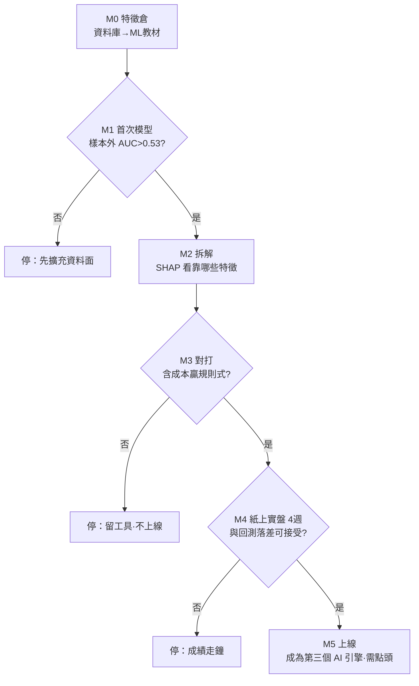

# ML 訊號研究計畫

> 版本：v2（2026-07-02 改寫為白話版）
> 狀態：**給你評估「值不值得做」用；要等規則式計畫完成才會啟動**
> 一句話：讓機器自己從歷史資料學「什麼組合之下容易漲」，取代人手寫死的規則——但要用很嚴格的考試制度防止它「背答案」。

---

# 第一部分：白話版（5 分鐘看懂）

## ML 和現在的規則式差在哪？

| | 規則式（現在） | ML（這份計畫） |
|---|---|---|
| 邏輯來源 | 人寫死：「RSI<30 就加 20 分」 | 機器從 5 年資料自己學 |
| 能學到的 | 單一條件 | **條件組合**：「RSI 低＋大盤多頭＋波動收縮」同時成立才有意義 |
| 像什麼 | 查表 | 有經驗的老手看盤的「直覺」，但可以拆開解釋 |

## 為什麼我說「值得做」？

1. **原料都備好了**：5 年×15 幣的價格指標、恐懼貪婪、剛做好的新聞情緒——全在資料庫裡，零額外成本。
2. **工具是免費的**：用 LightGBM（開源），普通 CPU 幾秒就能訓練完，不用 GPU、不用付錢。
3. **它剛好擅長我們的痛點**：規則式寫不出「多條件交互」的判斷，這正是 ML 的強項。
4. **可以解釋**：每次預測都能拆出「為什麼」（例：偏多主因＝動量排名前3＋波動收縮），能讓小Q翻成白話講給使用者聽，不是黑箱。

## 但你要先接受兩件事（期望管理）

> **① 成功的樣子是 52~55% 勝率，不是 70%。**
> 金融預測跟天氣預報一樣，贏過亂猜幾個百分點＋做好風控就能獲利。誰說能到 70%，那一定是「背答案」。
>
> **② 最大的敵人是「假的好成績」。**
> 模型很會在舊資料上考滿分、遇到新資料就掛。所以整份計畫一半的篇幅都在講「怎麼考試才公平」。

## 怎麼防止它背答案？（考試制度）

```
把 5 年資料照時間切開：
  2021 ──── 2024 教材（給它學）
  2024 ──── 2025 模擬考（挑最好的版本）
  2025 ──── 今天 終極大考（只考一次，考完不准再改）
另外：教材和考卷之間留 5 天空隙（防止「考前偷看到考題」），
      考不贏「規則式」和「動量策略」這兩個學長 → 不准上線。
```

## 六個關卡，任何一關不過就停（你的錢包和時間有保險）

| 關卡 | 要交出什麼 | 不過會怎樣 |
|---|---|---|
| M0 特徵倉（2天） | 把資料庫變成 ML 教材 | — |
| M1 首次模型（3天） | 模擬考成績 > 亂猜 | 停：先擴充資料面 |
| M2 拆解（2天） | 知道模型靠哪些特徵賺錢 | 特徵不合理 → 回 M1 |
| M3 對打（3天） | 含手續費回測贏過規則式 | 停：留下工具，不上線 |
| M4 紙上實盤（4週） | 每天默默出分記錄，不給使用者看 | 成績走鐘 → 停 |
| M5 上線（2天） | 成為第三個 AI 引擎 | 需要你點頭 |

總投入約 2~3 週工作量＋4 週紙上觀察，**金錢成本 0**。就算中途喊停，做好的特徵倉和考試框架也全部留給規則式繼續用，不會白工。

**▸ 圖：M0→M5 六關卡（任一關不過就停）**



## 上線後長什麼樣？

AI 分析面板變成**三票制**：🧮 規則引擎、🤖 GPT、📈 ML 模型，三方立場互相檢核，
意見分歧時明白告訴使用者「訊號存疑、宜保守」。ML 的理由由小Q翻成白話。

## 名詞小辭典

- **LightGBM**：一種「梯度提升決策樹」，很多棵小決策樹投票。表格類資料的世界冠軍常客，資料量幾萬筆剛剛好。
- **不用深度學習？** LSTM/神經網路要百萬級資料才吃得飽，我們只有 2.7 萬列，硬用只會背答案。
- **SHAP**：把模型的每次預測拆成「每個特徵貢獻幾分」的技術，= 模型的說明書。
- **紙上實盤（paper trading）**：模型每天真的出預測、真的記錄成績，但不給使用者看、不影響任何人，純觀察。

---

# 第二部分：技術版（執行細節）

## 方法論

- **模型**：LightGBM 二分類（depth≤4、早停、類別權重平衡）。不做 LSTM/Transformer/RL。
- **Label**：未來 5 日報酬正負，報酬以 20 日波動度標準化；第二輪試 triple-barrier（+1.5σ 停利 / −1σ 停損 / 5 日到期）。
- **特徵（30~40 個，全部取自現有 DB，嚴禁前視）**：
  技術面（RSI、MACD hist、BB 位置/寬度百分位、量比、均線距離%）＋動量（5/10/30/90 日報酬、距 52 週高低點%）＋
  regime（BTC>MA100）＋**跨幣截面**（動量排名、相對 BTC 強弱）＋情緒（恐懼貪婪值與變化、news_sentiment_daily）＋日曆。
- **驗證**：purged walk-forward（6 個滾動窗，訓練 2.5 年→測試 6 個月），5 日 embargo，scaler 只 fit 訓練窗，
  絕不 shuffle。Baseline：亂猜 47%、規則式 v2、動量策略。
- **報告指標**：樣本外 AUC、勝率 vs 基準、含成本回測 Sharpe/MDD。

## Go/No-Go 具體門檻

M1：樣本外 AUC > 0.53。M3：含成本回測優於規則式 v2 且不劣於動量策略。M4：4 週紙上實盤與回測落差在容忍範圍。

## 工程落地

- `src/ml/features.py`（特徵倉）→ `src/ml/train.py`（離線訓練，模型檔存 `models/`）→ `src/ml/score.py`（每日排程出分）。
- 新表 `ml_signal(date, symbol, prob, top_features_json)`；一天 15 列，SQLite 無感。
- 相依：`lightgbm scikit-learn shap`（開源免費，入 requirements-dev）。
- 前置條件：`訊號增準計畫.md` 完成（評估框架與因子清單 v2 是 ML 的地基）。

## 風險對策

過擬合（淺樹+早停+走步驗證+測試窗一次）；資料窺探（實驗全留檔，最終以 M4 為準）；
regime 改變（每季重訓，線上 vs 回測落差超閾值自動降級隱藏）；使用者誤解（UI 標示實驗性+公開紙上實盤成績）。
