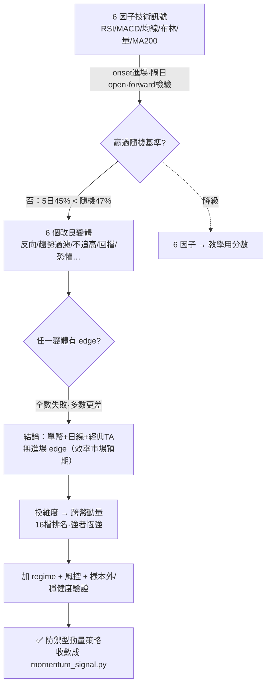

# 成果匯報

> 本檔含兩部：**第一部 成果匯報**、**第二部 訊號研究記錄**（原獨立文件，2026-09-01 併入）。
> 給主管 / 評審。合併自「訊號驗證進度報告」（2026-06-30）＋「驗證成果表」（2026-07-02）。
> **前段** = 結論與待決策；**後段** = 各項強化的可重現量化數據。誠實原則：有量化的給量化，沒改善的明說沒改善。

---

## 一、訊號驗證進度報告（2026-06-30）

> **一句話結論：** 經嚴謹驗證，證實平台原本的技術指標訊號「**無預測力**」，但換維度找到一個有效的新策略（**防禦型跨幣動量**）—— 回測樣本外大贏大盤，惟仍需實盤驗證後才宜投入真實資金。

### 1. 目標
驗證平台的買賣訊號**是否真能預測、賺錢**，避免上線「看似有效、實則無用」的訊號。

### 2. 方法（嚴謹、誠實）
以「**不偷看未來 ＋ 扣交易成本 ＋ 切樣本外 ＋ 抓程式 bug ＋ 壓力測試**」的標準流程檢驗，而非只看漂亮的回測數字。

### 3. 發現

**① 原訊號（6 因子技術指標）無預測力**
- RSI／MACD／均線等訊號出現後，之後漲跌與「隨機進場」幾乎無異（甚至略差）；另測 6 種改良方向皆無效。
- → **主動擋下**，避免上線一個看似會賺、實則無效的訊號。
- 原因：人人看得到同樣指標，早被反映在價格（效率市場的正常結果）。
- 註：指標**數值正確**（已獨立交叉驗證 15／15），缺的是「預測力」，並非「算錯」。

**② 換維度找到有效策略：防禦型跨幣動量**
- 改為「**15 幣互相比較，買相對最強；空頭（BTC 跌破均線）轉現金；亂市自動降低曝險**」。
- 在回測與後段檢驗段（60/40 切分的後 40%；其「樣本外」嚴格性見下方誠實聲明）皆為正報酬、且大幅贏過大盤：

| 關鍵數據（後 40% 檢驗段・2026-08-31 實跑） | 本策略 | 市場（等權大盤） |
|---|---|---|
| 年化報酬 | **+25.6%** | −16.4% |
| 最大回撤（最大虧損幅度） | **−20.6%** | −74.6% |
| 風險調整後報酬（Sharpe） | **0.79** | 負 |

> 首次驗證快照（2026-06-30 報告原數字）：+27%／−19%／0.81；大盤 −19%／逾 −70%。60/40 切分隨資料成長重算，數字會漂移（見下方聲明第 2 點）。

> ⚠️ 誠實聲明（2026-09-01 補註）：
> 1. **「樣本外」不純**——策略常數（mom30／top5／BTC>100 日均 regime／波動目標 30%）是在包含後 40% 檢驗段的多組設定比較中選出的（選參腳本的 ★ 判準直接讀樣本外欄位，見 `src/cross_sectional_validate.py` 等），嚴格來說這段資料「參與過設計」；參數凍結（約 2026-06 底）之後累積的資料才是乾淨的驗證段。
> 2. **數字會漂移**——60/40 切分是對持續成長的歷史重算，「樣本外」不是固定期間。2026-08-31 實跑：本策略 年化 +25.6%／最大回撤 −20.6%／Sharpe 0.79；等權大盤 −16.4%／−74.6%。現值以後台「現況」頁為準。
> 3. **幣池實為 16 檔**——回測讀 data/clean 全部日線，含已下市 MATIC 的歷史資料（至 2024-09-10），非嚴格的「現行 15 幣」。
>
> 仍成立的是防禦性格（空頭轉現金、亂市減碼）與「大幅優於等權大盤」的方向；不成立的是把任何單一數字當可複製的期望報酬。

### 4. 誠實評估
- **性格 — 防禦型**：**崩盤時保命、狂牛時偏弱**（2022 大盤崩 −70%、本策略僅 −13%；但 2023–24 牛市跑輸大盤）。
- **限制**：僅適用大型幣；樣本外僅約 2 年；**目前仍是回測，未經實盤**。回測數字偏樂觀，**不宜當作績效承諾**。
- **結論**：是一個**站得住、值得投入的方向**，但**非「穩賺聖杯」**。

### 5. 建議 ／ 待決策
研究端已備妥可進一步驗證的策略候選。下一步請擇一方向：

| | 方向 | 內容 |
|---|---|---|
| **A** | 接進平台 | 將新策略做成正式訊號，後台儀表板即時呈現 |
| **B** | 實盤前測 | 紙上交易數月，驗證後再談真實資金 |
| **C** | 重新定位 | 以「風險控管 ＋ 誠實研究工具」為產品賣點 |

> **建議順序：B（先驗證穩健度）→ A（再產品化）。** 完整研究軌跡見本檔**第二部**。
>
> 註記（2026-09-01）：本決策表提出於 2026-06-30，至 2026-09-01 尚未拍板（後台任務 #79 仍為 planned）。

---

## 二、量化前後對照（所有數字可重現，2026-07-02）

### 1. 指標計算正確性（交叉驗證）

方法：用**獨立演算法**（不重用產線程式碼）逐點重算所有指標，與產線輸出比對最大誤差。

| 週期 | 範圍 | 結果 | 最大誤差量級 |
|---|---|---|---|
| 日線 1d | 16 幣 × 5 年 × 10 指標 | **16/16 PASS** | 10⁻¹¹ ~ 10⁻¹⁷（浮點雜訊） |
| 時線 1h | BTC/ETH × 2 年 × 10 指標 | **2/2 PASS** | 10⁻⁵ ~ 10⁻¹⁴ |

> 註（2026-09-01）：「16 幣」＝驗證當時的幣池，含後來下市的 MATIC；現行啟用清單為 15 幣（POL 接替 MATIC）。
> 重跑：`python src/verify_indicators.py 1h`（或 `1d`）；後台 API：`/api/admin/verify/indicators?interval=1h`

### 2. 時線資料結構完整性（2026-07-02 全檢）

| 檢查項 | BTCUSDT | ETHUSDT |
|---|---|---|
| K 棒數量 | 17,525 | 17,525 |
| 時間缺洞（間隔≠1小時） | **0** | **0** |
| 尾端為已收盤 K 棒 | ✅ | ✅ |
| CSV ↔ DB 筆數一致 | ✅ | ✅ |
| CSV ↔ DB 尾端時間一致 | ✅ | ✅ |
| RSI 越界（<0 或 >100） | 0 筆 | 0 筆 |
| 布林上下軌反轉 | 0 筆 | 0 筆 |
| OHLC 邏輯異常（高<低等） | 0 筆 | 0 筆 |
| 指標列數與價格列數對齊 | ✅ | ✅ |
| 人工抽樣複算 MA20 | 誤差 **0.00**（分毫不差） | — |

> 補註（2026-09-01）：17,525 根為 2026-07-02 全檢時點的快照，資料持續成長（1h 現已約 37,974 筆，雙幣合計）。

### 3. 資料正確性修復（半根 K 棒）

| | 修復前 | 修復後 |
|---|---|---|
| 未收盤 K 棒入庫 | 會（例：02:22 已存入 02:00 開盤、03:00 才收盤的棒） | **永不**（抓取端以 close_time 過濾） |
| 尾端成交量失真 | 例：半棒量 93 vs 正常 ~600（**低估 85%**），污染 RSI/MACD/量比尾端 | 尾端永遠是完整 K 棒 |
| 影響範圍 | 日線＋時線通用 | 已清除既有污染並重算 |

### 4. 新聞情緒系統（詞庫 v1 → v2）

| 指標 | v1（修復前） | v2（2026-07-02 快照） | 提升 |
|---|---|---|---|
| 新聞來源 | 3 家（全英文） | **10 家**（含中文動區/鏈新聞＋Google News 聚合） | +233% |
| 單輪抓取篇數 | ~75 | ~200 | +167% |
| neutral 佔比（無效標註） | **87.4%** | 新語料 **65.5%**／全庫 75.4%（含歷史技術類連結） | -22pp |
| 幣種標記 | 0（只能整體看） | 686/1,987 篇標到幣（**單幣情緒從無到有**） | 新能力 |
| 每日情緒分數 | 無 | 全市場＋15 幣各自 -100~+100 | 新能力 |
| 人工抽查正確率 | — | 看多 5/5、看空 5/5 | — |
| 面效度驗證 | — | BTC 情緒 -12/-15/-33 對應 6 月大跌 20% 行情；SOL +44 對應該幣連日利多新聞 | 方向一致 |

> 補註（2026-09-01）：表中單輪抓取篇數（~200）、幣種標記（686/1,987）等為 2026-07-02 快照，語料持續成長；現值以後台為準。

### 5. AI 機器人正確性（防答非所問）

| 測試組 | 案例數 | 結果 |
|---|---|---|
| 幣種偵測（中文/別名/代號/英文/邊界） | 11 | **11/11** ✅（含 solution 不誤中 SOL） |
| 固定問答命中與放行 | 10 | **10/10** ✅（RSI是什麼→教學不誤入幣種檔案；不會的問題正確交棒） |
| 知識庫問答 | 7 | **7/7** ✅ |
| 錯字容忍 | 已太幣→以太坊、逼特幣→比特幣（明講猜測） | ✅ |
| 未追蹤幣誠實拒答 | PEPE／殼殼幣→列支援清單，不亂答 | ✅ |
| 問答覆蓋 | 0 條 → **64 條**＋5 類知識意圖×15 幣 | 新能力 |

### 6. ⚠️ 誠實聲明：訊號預測力「尚未」提升

| 指標 | 現況（未變） |
|---|---|
| 6 因子訊號 5 日勝率 | 45.2% vs 隨機 47.4%（**-2.2pp，仍無預測優勢**） |
| 原因 | 修復的是「資料正確性與判讀基礎」；訊號邏輯本身的手術是 [訊號增準計畫](訊號增準計畫.md)（#79，待確認執行） |
| 已驗證有效的 | 防禦型跨幣動量策略（後台現況頁），Phase A 將把它請上前台 |

> 本表的價值：**地基（資料對、判讀準、內容可信）已可量化證明**；上層的訊號準度是下一場戰役，驗收標準已寫死在計畫書（樣本外 5 日勝率 ≥ 基準 +0.5pp）。

---

## 三、補記（2026-09-01）：宏觀面板重新上架

- 宏觀環境面板（DXY／VIX／美債等）已於 **2026-08-10 重新上架**。
- 上架前完成**事先指定的預測力主檢定，結果：不顯著**（+0.66%、HAC t=0.72；拉長樣本自 2017 起 +0.29%、t=0.32、327 區段）。
- linkage（BTC 對標普／美元／VIX／黃金的 60 日滾動相關）為**描述性統計**，可用。
- 產品處理：**照實標示不顯著，只作背景脈絡、不進買賣分數**。

---

# 第二部：訊號研究記錄（原獨立文件，2026-09-01 併入）

> 合併自 `訊號成績單分析`（2026-06-29）＋ `訊號改良實驗`（2026-06-30），並補「跨幣動量」小結。
> 這是一條完整的研究軌跡：**前台 6 因子訊號為何無效 → 6 個改良變體為何全敗 → 換維度做跨幣動量才找到 edge，收斂成後台的防禦型動量策略。**
> 原始兩份（訊號成績單分析、訊號改良實驗）內容已完全併入本檔，原件已移除（git 歷史留存）。相關腳本：`src/signal_scorecard.py`、`src/signal_experiments.py`、`src/cross_sectional*.py`（唯讀，不改資料）。

---

## 一句話

6 因子技術訊號經嚴謹 forward 檢驗**無預測力**；再測 6 個改良變體**全數失敗**；改為「16 檔互相比較（含已下市 MATIC 歷史）」的**跨幣動量**才找到有效 edge，最後收斂成後台 `momentum_signal.py`。

**共用的檢驗尺（無偷看未來）**：訊號在第 `i` 天收盤可知 → 隔天 `open[i+1]` 進場 → `N` 天後 `open[i+1+N]` 結算；只取「首次出現(onset)」進場；基準＝「任一天進場」（代表躺著抱）；跳過暖身 200 天；15 幣彙總。

**▸ 圖：訊號研究軌跡（為何 6 因子降教學、動量策略上位）**（線上檢視渲染圖）

---

## 1. 成績單：現行 6 因子訊號有沒有預測力？（2026-06-29）

> 檢驗信心分數 ≥65 偏多 / ≤35 偏空到底有沒有 forward edge。重跑 `python src/signal_scorecard.py`。

**結果（15 幣彙總）**

| 持有 | 訊號 | 樣本 | 命中率 | vs 基準 | 基準上漲率 |
|---|---|---|---|---|---|
| 5 天 | 偏多 | 1406 | 45.4% | **−2.3pp** | 47.7% |
| **10 天** | **偏多** | **1399** | **42.7%** | **−4.0pp** | 46.7% |
| 20 天 | 偏多 | 1397 | 40.7% | **−3.7pp** | 44.4% |
| 10 天 | 偏空 | 2438 | 53.1% | −0.2pp | — |

各幣（10 天）偏多 edge 最差：LINK −14.2pp、XRP −11.7pp、ATOM −10.5pp、DOT −9.3pp、UNI −8.0pp。

> 補註（2026-09-01）：成績單是**滾動統計**，本表為 2026-06-29 執行時點的快照；README／[訊號增準計畫](訊號增準計畫.md) 引用的另一組數字（5 日 45.2% vs 47.4%、10 日 43.1% vs 46.7%）為不同時點快照，兩組並不矛盾。結論（顯著輸基準、無 edge）不隨時點改變；現值以後台「訊號成績單」頁為準。

**結論**：**目前訊號沒有 forward edge。** 偏多訊號剛出現時進場，各持有期一致地略低於「任一天進場」基準（偏多甚至略負）；偏空大致等同基準、無效。1,400+ 樣本，非雜訊。
**原因（推測）**：訊號是「**事後確認**」型 —— RSI 高、MACD 翻正、站上均線等條件湊齊時，漲勢通常已發生，接著容易回檔。
**不矛盾於回測賺錢**：先前回測看似 OK，主因是 (1) 大盤整體往上 + (2) 停損停利在管理部位，而非進場時機準。成績單抓到了回測藏起來的真相。

---

## 2. 改良實驗：6 個變體能不能把 edge 做出來？（2026-06-30）

> 用同一把尺並排測 6 個「改良變體」。重跑 `python src/signal_experiments.py`。edge = 變體平均報酬 − 基準平均報酬（要跨持有期一致為正才算數）。

**結果（持有 10 天，15 幣彙總；基準上漲率 46.7%）**

| 變體 | 規則 | 樣本 | vs基準(命中) |
|---|---|---|---|
| baseline | 現行 BULL（score≥65） | 1393 | −3.7pp |
| A_反向 | 把 BEAR（≤35）當買點 | 2437 | −0.2pp |
| B1_趨勢過濾 | BULL 且站上 MA200 且 MA200 上彎 | 911 | **−5.6pp** |
| B2_不追高 | BULL 且 RSI<60 且布林位置<0.8 | 1028 | −4.2pp |
| B3_回檔買 | 站上 MA200 且 RSI<45 且動能轉上 | 291 | −1.4pp |
| D1_極度恐懼 | 恐懼貪婪 FNG≤20 | 643 | −3.8pp |
| D2_BULL恐懼 | BULL 且 FNG≤30 | 222 | −3.0pp |

**結論**
- **沒有任何一個變體 beat 基準**，多數更差（5/20 天持有期結論一致）。
- **趨勢/動能過濾（B1、B2）反而最差** → 印證「訊號在追高」：站上 MA200＋多頭排列湊齊時，漲勢多半已走完。
- **反向（A）≈ 基準** → BEAR 也沒預測力；不是「反著做就會贏」。
- **買極度恐懼（D1）更差** → 本樣本極端恐懼多叢集在下跌段，短線續跌。

**意義（重要）**：這是**方法在做它該做的事** —— 用嚴謹 forward 檢驗，省下數週調參、避免上線一個假 edge。**單資產 + 日線 + 經典 TA/情緒，在高流動性幣上沒有可提取的進場 edge**，這是效率市場的預期結果，不是 bug。

---

## 3. 換維度：跨幣動量找到 edge（研究血脈 `src/cross_sectional*`）

改良實驗的結論指向「不要再調同一類因子，換維度」。於是把研究從「單幣看自己」換成「**跨幣互相比較、排名**」（幣池寫實：回測讀 `data/clean` 全部 **16 檔**日線，含已下市 MATIC 的歷史資料、止於 2024-09-10，非嚴格的「現行 15 幣」）。這條血脈的嚴謹度要誠實界定：**切分與成交規則本身無前視**（訊號當天收盤可知、隔日 open 成交），但**多組設定的挑選判準讀了樣本外欄位**（`cross_sectional_validate`／`_regime`／`_hardened` 的 ★ 判準直接看樣本外成績），因此最終常數的「樣本外成績」含選擇偏誤：

| 腳本 | 這一步做什麼 | 發現 |
|---|---|---|
| `cross_sectional.py` | 全方法掃描：每天排名，做多前段/放空後段 | 跨幣動量（強者恆強）有毛 edge |
| `cross_sectional_validate.py` | 扣成本 + 樣本外（純做多 top-K、每 R 天換倉） | 邊際、絕對報酬負、回撤 −75%（空頭還抱爛幣） |
| `cross_sectional_regime.py` | 加 regime：BTC 跌破均線就轉現金 | 回撤與絕對報酬明顯改善 |
| `cross_sectional_hardened.py` | 加風控：K5→8、反波動加權、波動度目標 | 壓回撤、保報酬 |
| `cross_sectional_robust.py` | Walk-forward 分年 + 倖存者偏差壓力測試 | 段段穩健、量化倖存者偏差 |
| `cross_sectional_sanity.py` | 隨機訊號/延遲/獨立重算 抓 bug | 評估流程沒有無中生有 |

**成品策略**：動量 mom30 + BTC>100 日均 regime + top5 等權 + 波動度目標 30%。

**後 40% 檢驗段成績**（60/40 切分，切分隨資料成長重算；2026-08-31 實跑）：

| 指標 | 本策略 | 市場（等權大盤） |
|---|---|---|
| 年化報酬 | **+25.6%** | −16.4% |
| 最大回撤 | **−20.6%** | −74.6% |
| Sharpe | **0.79** | 負 |

>（首次驗證快照 2026-06-30：+27%／−19%／0.81；大盤 −19%／逾 −70%。全期則為 +11.7%／−30.8%／Sharpe 0.50。）

> ⚠️ 誠實聲明（2026-09-01 補註）：
> 1. **「樣本外」不純**——策略常數（mom30／top5／BTC>100 日均 regime／波動目標 30%）是在包含後 40% 檢驗段的多組設定比較中選出的（選參腳本的 ★ 判準直接讀樣本外欄位，見 `src/cross_sectional_validate.py` 等），嚴格來說這段資料「參與過設計」；參數凍結（約 2026-06 底）之後累積的資料才是乾淨的驗證段。
> 2. **數字會漂移**——60/40 切分是對持續成長的歷史重算，「樣本外」不是固定期間。2026-08-31 實跑：本策略 年化 +25.6%／最大回撤 −20.6%／Sharpe 0.79；等權大盤 −16.4%／−74.6%。現值以後台「現況」頁為準。
> 3. **幣池實為 16 檔**——回測讀 data/clean 全部日線，含已下市 MATIC 的歷史資料（至 2024-09-10），非嚴格的「現行 15 幣」。
>
> 仍成立的是防禦性格（空頭轉現金、亂市減碼）與「大幅優於等權大盤」的方向；不成立的是把任何單一數字當可複製的期望報酬。

> 收斂成正式服務 `src/momentum_signal.py`（後台「現況」頁即時呼叫：今日持幣建議＋績效）。

---

## 4. 誠實聲明與產品含義

- **性格＝防禦型**：崩盤保命、狂牛偏弱（2022 大盤崩 −70%、本策略僅 −13%；但 2023–24 牛市跑輸大盤）。
- **限制**：僅適用大型幣；樣本外約 2 年；**目前仍是回測，未經實盤**，數字偏樂觀，**不宜當績效承諾**。
- **產品定位**：前台 6 因子分數**降級為教學參考**（誠實標示無 edge）；已驗證有效的動量策略是值得投入的方向。
- **下一步**：見 [訊號增準計畫](訊號增準計畫.md)（Phase A 先把動量策略請上前台）→ 之後才評估 [訊號增準計畫.md](訊號增準計畫.md)（ML 計畫在其第二部）。
  （狀態補註 2026-09-01：Phase A **尚未開工**，後台任務 #79 仍為 planned；`GET /api/strategy/today` **尚未建立**，現況僅後台 `/api/admin/strategy`（backend/routers/admin.py）。）

> 誠實註記：以上為 in-sample / 回測歷史統計，非未來保證；但「一致地無 edge」在 1,400+ 樣本下不是雜訊。
> （2026-09-01 擴充）本註記同樣適用於動量策略的成績：無論 +27%（首次快照）或 +25.6%（2026-08-31 實跑），其「樣本外」皆含選參保留（挑選判準讀過樣本外欄位，見 §3 誠實聲明），且是隨資料成長漂移的回測統計——可信的是「大幅優於等權大盤＋防禦性格」的方向，不是任何單一數字。
