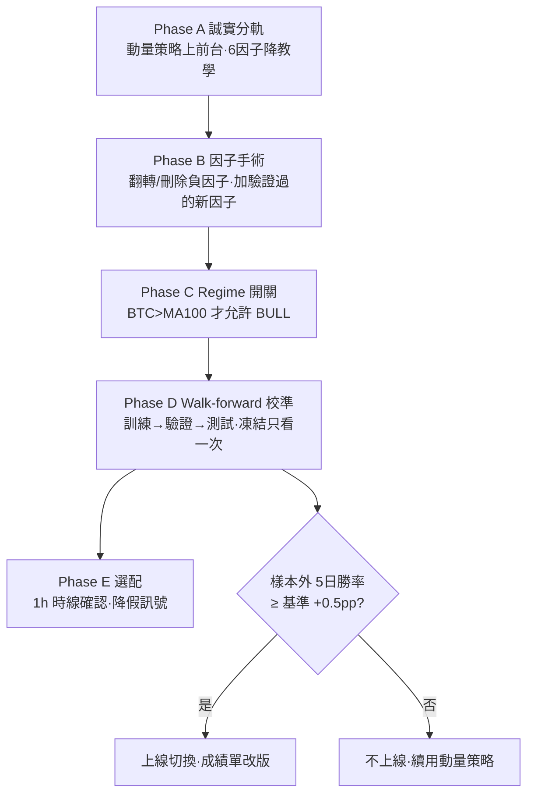
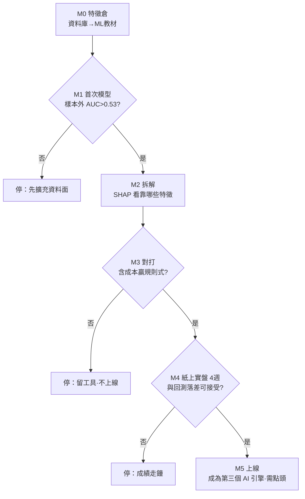

# 訊號增準計畫（規則式＋ML）

> 本檔含兩部：**第一部 訊號增準計畫（規則式）**、**第二部 ML 訊號研究計畫**（原獨立文件，2026-09-01 併入）；ML 需第一部完成後才啟動。
> 版本：v2（2026-07-02 改寫為白話版）
> 狀態：**（2026-09-01 更新）尚未開工**——等待主管 A/B/C 拍板（見 [成果匯報](成果匯報.md) §一.5；後台任務 #79 仍為 planned）。文末時程「週 1／週 2／週 3」以實際開工日起算。
> 一句話：現在的訊號經檢驗「不準」，這份計畫分五步把它修到「可驗證的準」。

---

# 第一部分：白話版（5 分鐘看懂）

## 現在的問題是什麼？

我們給每顆幣打的「信心分數」（0~100，越高越看多），拿歷史資料考試的結果：

> **聽它的話買，5 天後賺錢的機率是 45.2%；閉著眼睛隨便買，是 47.4%。**（2026-07-02 快照；現值以後台「訊號成績單」頁為準）
> 也就是說——它比丟銅板還差一點點。

為什麼會這樣？拆開看 6 個計分因子，抓到三個「幫倒忙」的：

| 因子 | 它的邏輯 | 為什麼錯 |
|---|---|---|
| RSI | 「跌多了會反彈」→ 跌深加分 | 幣市一跌常常繼續跌，這叫**接刀** |
| 布林通道 | 「跌破下軌算超賣」→ 加分 | 同上，接刀 |
| 均線排列 | 「排成多頭了」→ 加分 | 等排好隊，行情已走完一段，這叫**追高** |

一句話總結病因：**用「會回到平均」的邏輯，去玩一個「漲就繼續漲、跌就繼續跌」的市場。**

## 好消息：我們手上已經有一套「考試及格」的策略

後台有一套「防禦型跨幣動量策略」，邏輯超簡單：

1. **BTC 在 100 日均線之上才進場**（= 大盤天氣好才出門）
2. 買**最近 30 天漲最兇的前 5 名**（= 跟著強者走，不接刀）
3. 控制整體波動、定期換倉

它通過了回測與後段資料檢驗，但目前只有管理者在後台看得到，一般使用者看不到。

>（2026-09-01 補註：動量基準本身**含選參保留**——其「樣本外」成績的常數是在讀了樣本外欄位的多組比較中選出的，見 [成果匯報](成果匯報.md) 誠實聲明；本計畫凡以動量策略成績作 baseline／驗收比較，應以其**參數凍結後累積的驗證段**為準。）

## 所以計畫就是三件事

```
第 1 步（先做，1-2 天）   把「及格的策略」搬到前台當正式建議；
                          把「不及格的分數」降級標示為教學參考。→ 先誠實
第 2 步（1-2 週）         動手術：錯的因子翻轉或刪掉，換上驗證過的新因子。→ 再變準
第 3 步（1 週）           嚴格考試：用「沒看過的資料」驗證，及格才上線。→ 最後驗證
```

## 怎麼樣算成功？（驗收標準，寫死不可調整）

> 修好的訊號，在**它從沒看過的一段歷史**上，5 天勝率要**贏過隨便買至少 +0.5 個百分點**。
> 做不到就不換上線，老實用第 1 步的動量策略。
>
>（2026-09-01 補註：「沒看過」採嚴格定義＝該段資料**凍結、只看一次**、不得用它挑設定——避免重蹈動量選參「判準讀了樣本外欄位」的覆轍，見上方補註與 [成果匯報](成果匯報.md) 誠實聲明。）

## 名詞小辭典

- **edge（優勢）**：聽訊號 vs 隨便買的成績差。正 = 有用，負 = 幫倒忙。
- **regime（市場天氣）**：大盤處於多頭還是空頭。同一招在不同天氣下效果天差地遠。
- **walk-forward（滾動考試）**：用 2021~2024 學、2024~2025 考、2025~今天終極大考。三段互不透題，防止「背答案」。
- **過擬合（背答案）**：參數調到在歷史上完美，換一段新資料就掛。是量化最大的敵人，所以我們刻意把可調的東西弄很少。

---

# 第二部分：技術版（執行細節）

**▸ 圖：Phase A→E 執行流程與驗收關卡**



## 0. 現況證據（signal_eval.py，2026-07-02 實測）

| 持有 | 訊號後勝率 | 隨機基準 | 差距 | 平均報酬差 |
|---|---|---|---|---|
| 5 日 | 45.2% | 47.4% | **-2.2pp** | -0.35pp |
| 10 日 | 43.1% | 46.7% | -3.5pp | -0.41pp |

因子別 edge：RSI -0.66 / 均線排列 -0.69 / 布林 -0.72（全負）；MACD、成交量、MA200 ≈ 0。

> 補註（2026-09-01）：成績單為**滾動統計**，上表是 2026-07-02 時點快照；[成果匯報.md](成果匯報.md)（第二部 訊號研究記錄）引用的另一組數字（45.4%/47.7%、42.7%/46.7%）為不同時點快照，兩組並不矛盾，結論（顯著輸基準、無 edge）不隨時點改變。現值以後台「訊號成績單」頁為準。

## Phase A — 誠實分軌（1–2 天）

- A1. 開公開 API `GET /api/strategy/today`（來源=既有 `momentum_signal.cached_strategy()`，只回建議與績效摘要）。（2026-09-01 現況：此端點**尚未建立**；現僅後台 `/api/admin/strategy`，見 `backend/routers/admin.py`）
- A2. 前台 HeroSignal 加「正式策略」區塊（今日持幣建議/抱現金 + 回測績效標示）。
- A3. 6 因子分數改標「技術指標綜合分（教學用）」＋說明文案。
- A4. AI 機器人 context 加入策略建議，讓小Q口徑一致。

## Phase B — 因子手術（3–5 天）

工具：新增 `src/factor_lab.py`（擴充 signal_eval 的因子檢驗框架；2026-09-01：規劃中，檔案尚不存在）。
對照組：現有 6 因子完整報告存檔。

實驗矩陣（每項輸出 edge、觸發數、分年穩定性；pooled 15 幣 + BTC/ETH 單獨）：

| 實驗 | 內容 |
|---|---|
| B2a | 負因子「翻轉」：RSI 突破 50 向上加分（動量化）、布林上軌突破加分 |
| B2b | 負因子「刪除」 |
| B2c | 負因子「條件化」：僅 regime 多頭時計分 |
| B3 | 新因子：30/90 日跨幣動量排名、距 52 週高點 %、BB 寬度百分位（波動收縮）、恐懼貪婪極端值、新聞情緒日分數 |

產出：因子清單 v2（僅保留 edge ≥ 0 且分年不翻車者）+ `reports/factor_report.md`（2026-09-01：規劃中，尚不存在）。

## Phase C — Regime 開關（與 B 並行）

BTC 收盤 > MA100 才允許 BULL 訊號（對照 MA200、ADX>25 取樣本外最穩者）；空頭天氣最高只給中立。

> ⚠️ 紀律警語（2026-09-01 補註）：本 Phase **不得回頭調整已凍結的 `src/macro_regime.py` 門檻**——依檢定結果回調參數＝事後配適（README §12-F 紀律）；若要把宏觀因子納入買賣訊號，需**另行宣告新的 holdout 期**再驗證。

## Phase D — Walk-forward 校準（3–5 天）

- 切分：訓練 2021-07~2024-06 → 驗證 2024-07~2025-06 → 測試 2025-07~今（**凍結，只看一次**）。
- 參數空間刻意小：權重 {0, 0.5, 1, 1.5, 2}、門檻 {60,65,70}×{30,35,40}。
- 流程：訓練窗選前 3 組 → 驗證窗擇一 → 測試窗報告成績即定案。
- `src/backtest.py` 含成本重跑 vs buy&hold。

## Phase E —（選配）1h 時線確認（2 天）

日線訊號成立後需 1h 動能同向（1h MACD hist>0 或站上 1h MA20）才升級「行動訊號」；用 BTC/ETH 驗證假訊號率是否下降。

## 時程

| 週 | 內容 |
|---|---|
| 1 | Phase A 上線 + Phase B 實驗跑批 |
| 2 | 因子清單 v2 + Phase C |
| 3 | Phase D 校準凍結測試 + 上線切換 + 成績單改版 |

## 風險對策

過擬合（小參數空間+三段切分+測試只看一次）；市場改變（成績單每週重算，劣化亮紅燈）；
樣本不足（pooled+單幣雙軌）；誠實聲明（前台標示回測性質）。

---

# 第二部：ML 訊號研究計畫（原獨立文件，2026-09-01 併入）

> 版本：v2（2026-07-02 改寫為白話版）
> 狀態：**給你評估「值不值得做」用；要等本檔第一部（規則式計畫）完成才會啟動**
> 一句話：讓機器自己從歷史資料學「什麼組合之下容易漲」，取代人手寫死的規則——但要用很嚴格的考試制度防止它「背答案」。

---

# 第一部分：白話版（5 分鐘看懂）

## ML 和現在的規則式差在哪？

| | 規則式（現在） | ML（這份計畫） |
|---|---|---|
| 邏輯來源 | 人寫死：「RSI<30 就加 20 分」 | 機器從 5 年資料自己學 |
| 能學到的 | 單一條件 | **條件組合**：「RSI 低＋大盤多頭＋波動收縮」同時成立才有意義 |
| 像什麼 | 查表 | 有經驗的老手看盤的「直覺」，但可以拆開解釋 |

## 為什麼我說「值得做」？

1. **原料都備好了**：5 年×16 檔（寫實：含已下市 MATIC 的歷史、其資料止於 2024-09-10；現行啟用 15 幣）的價格指標、恐懼貪婪、剛做好的新聞情緒——全在資料庫裡，零額外成本。
2. **工具是免費的**：用 LightGBM（開源），普通 CPU 幾秒就能訓練完，不用 GPU、不用付錢。
3. **它剛好擅長我們的痛點**：規則式寫不出「多條件交互」的判斷，這正是 ML 的強項。
4. **可以解釋**：每次預測都能拆出「為什麼」（例：偏多主因＝動量排名前3＋波動收縮），能讓小Q翻成白話講給使用者聽，不是黑箱。

## 但你要先接受兩件事（期望管理）

> **① 成功的樣子是 52~55% 勝率，不是 70%。**
> 金融預測跟天氣預報一樣，贏過亂猜幾個百分點＋做好風控就能獲利。誰說能到 70%，那一定是「背答案」。
>
> **② 最大的敵人是「假的好成績」。**
> 模型很會在舊資料上考滿分、遇到新資料就掛。所以整份計畫一半的篇幅都在講「怎麼考試才公平」。

## 怎麼防止它背答案？（考試制度）

```
把 5 年資料照時間切開：
  2021 ──── 2024 教材（給它學）
  2024 ──── 2025 模擬考（挑最好的版本）
  2025 ──── 今天 終極大考（只考一次，考完不准再改）
另外：教材和考卷之間留 5 天空隙（防止「考前偷看到考題」），
      考不贏「規則式」和「動量策略」這兩個學長 → 不准上線。
```

## 六個關卡，任何一關不過就停（你的錢包和時間有保險）

| 關卡 | 要交出什麼 | 不過會怎樣 |
|---|---|---|
| M0 特徵倉（2天） | 把資料庫變成 ML 教材 | — |
| M1 首次模型（3天） | 模擬考成績 > 亂猜 | 停：先擴充資料面 |
| M2 拆解（2天） | 知道模型靠哪些特徵賺錢 | 特徵不合理 → 回 M1 |
| M3 對打（3天） | 含手續費回測贏過規則式 | 停：留下工具，不上線 |
| M4 紙上實盤（4週） | 每天默默出分記錄，不給使用者看 | 成績走鐘 → 停 |
| M5 上線（2天） | 成為第三個 AI 引擎 | 需要你點頭 |

總投入約 2~3 週工作量＋4 週紙上觀察，**金錢成本 0**。就算中途喊停，做好的特徵倉和考試框架也全部留給規則式繼續用，不會白工。

**▸ 圖：M0→M5 六關卡（任一關不過就停）**



## 上線後長什麼樣？

AI 分析面板變成**三票制**：🧮 規則引擎、🤖 GPT、📈 ML 模型，三方立場互相檢核，
意見分歧時明白告訴使用者「訊號存疑、宜保守」。ML 的理由由小Q翻成白話。

>（2026-09-01 補註：前台 AI 分析面板 AIAnalystPanel 目前**已卸載**——`App.jsx` 中掛載處被註解；M5 的驗收畫面上線前，需先恢復掛載、或改為後台呈現。）

## 名詞小辭典

- **LightGBM**：一種「梯度提升決策樹」，很多棵小決策樹投票。表格類資料的世界冠軍常客，資料量幾萬筆剛剛好。
- **不用深度學習？** LSTM/神經網路要百萬級資料才吃得飽，我們的表格資料只有數萬列（2026-09-01 實測：daily_signal 28,289 列；prices／indicators 各 66,277 列），硬用只會背答案。
- **SHAP**：把模型的每次預測拆成「每個特徵貢獻幾分」的技術，= 模型的說明書。
- **紙上實盤（paper trading）**：模型每天真的出預測、真的記錄成績，但不給使用者看、不影響任何人，純觀察。

---

# 第二部分：技術版（執行細節）

## 方法論

- **模型**：LightGBM 二分類（depth≤4、早停、類別權重平衡）。不做 LSTM/Transformer/RL。
- **Label**：未來 5 日報酬正負，報酬以 20 日波動度標準化；第二輪試 triple-barrier（+1.5σ 停利 / −1σ 停損 / 5 日到期）。
- **特徵（30~40 個，全部取自現有 DB，嚴禁前視）**：
  技術面（RSI、MACD hist、BB 位置/寬度百分位、量比、均線距離%）＋動量（5/10/30/90 日報酬、距 52 週高低點%）＋
  regime（BTC>MA100）＋**跨幣截面**（動量排名、相對 BTC 強弱）＋情緒（恐懼貪婪值與變化、news_sentiment_daily）＋日曆。
- **驗證**：purged walk-forward（6 個滾動窗，訓練 2.5 年→測試 6 個月），5 日 embargo，scaler 只 fit 訓練窗，
  絕不 shuffle。Baseline：亂猜 47%、規則式 v2、動量策略。
- **報告指標**：樣本外 AUC、勝率 vs 基準、含成本回測 Sharpe/MDD。

## Go/No-Go 具體門檻

M1：樣本外 AUC > 0.53。M3：含成本回測優於規則式 v2 且不劣於動量策略。M4：4 週紙上實盤與回測落差在容忍範圍。

>（2026-09-01 補註：M3 的動量基準本身**含選參保留**——其「樣本外」成績的常數是在讀了樣本外欄位的多組比較中選出的，見成果匯報誠實聲明；與動量策略的比較應以其**參數凍結後累積的驗證段**成績為準。）

## 工程落地

- `src/ml/features.py`（特徵倉）→ `src/ml/train.py`（離線訓練，模型檔存 `models/`）→ `src/ml/score.py`（每日排程出分）。
- 新表 `ml_signal(date, symbol, prob, top_features_json)`；一天 15 列，SQLite 無感。
- 相依：`lightgbm scikit-learn shap`（開源免費，入 requirements-dev）。
- 前置條件：本檔**第一部（訊號增準計畫）**完成（評估框架與因子清單 v2 是 ML 的地基）。

## 風險對策

過擬合（淺樹+早停+走步驗證+測試窗一次）；資料窺探（實驗全留檔，最終以 M4 為準）；
regime 改變（每季重訓，線上 vs 回測落差超閾值自動降級隱藏）；使用者誤解（UI 標示實驗性+公開紙上實盤成績）。
