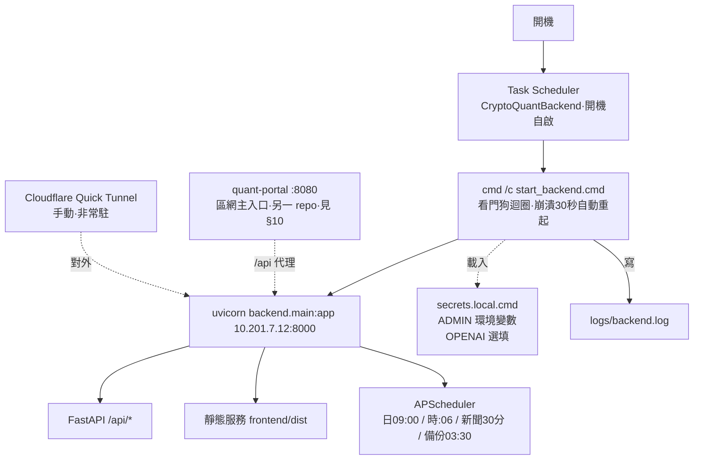

# 部署與運維（Ops Runbook）

> 這台機器（Windows Server）的**實際**部署與日常維運。給接手者：照這份就能部署、重啟、改東西、排錯。
> 最後更新：2026-09-01 · 搭配 [README](../../README.md) 一起看；開發規範見本檔**第二部**。

---

## 1. 部署架構一覽

**▸ 圖：部署架構（開機自啟 → 看門狗 → uvicorn）**（線上檢視渲染圖）



以下為對應文字版：

```
開機
 └─ Task Scheduler 工作「CryptoQuantBackend」(State: Running,開機自啟)
     └─ cmd /c start_backend.cmd   ← 看門狗迴圈:uvicorn 掛了等 30 秒自動重起
         └─ .venv\Scripts\python.exe -m uvicorn backend.main:app --host 10.201.7.12 --port 8000
             ├─ FastAPI /api/*        (後端 API)
             ├─ 靜態服務 frontend/dist  (前端 build 產物,同一個 8000 埠)
             └─ APScheduler           (排程隨 app 啟動:每日09:00 / 每小時:06 / 新聞每30分 / 每日03:30 SQLite備份)

區網主入口:quant-portal http://10.201.7.12:8080/ ──▶ /crypto/ 另一份前端靜態檔 + /api 代理到 :8000 (另一 repo,見 §10)
對外(需要時才開,非常駐):Cloudflare Quick Tunnel ──▶ 10.201.7.12:8000
密鑰:secrets.local.cmd (gitignored) 由 start_backend.cmd 載入
日誌:logs\backend.log
```

**一句話**：一台機器、一個 uvicorn 進程、前後端同吃區網位址 `10.201.7.12:8000`；由 Task Scheduler ＋看門狗保證開機自啟與崩潰自癒。本機開發另用 API 8001（loopback），與正式 8000 區隔。同機另有兩套服務：**quant-portal 區網主入口 `:8080`**（排程工作 `Portal-LAN-Web`，見 §10）與**台股 Stock**（`:8011` / `:5188`），維運操作勿誤殺它們。

| 元件 | 怎麼跑 | 位置 / 埠 |
|---|---|---|
| 後端 API + 前端靜態 | uvicorn（單進程） | `10.201.7.12:8000` |
| 排程器 | APScheduler，隨 uvicorn 進程內啟動 | `backend/scheduler.py` |
| 前端產物 | `vite build` 出的靜態檔，FastAPI 掛載服務 | `frontend/dist/` |
| 看門狗 / 自啟 | `start_backend.cmd` 迴圈 + Task Scheduler 工作 | `CryptoQuantBackend` |
| 區網主入口 | 另一 repo `quant-portal`（排程工作 `Portal-LAN-Web`） | `10.201.7.12:8080` → `/crypto/` 靜態＋`/api` 代理到 `:8000`（§10） |
| 對外通道 | Cloudflare Quick Tunnel（手動、非常駐） | → `10.201.7.12:8000` |
| 密鑰 | `secrets.local.cmd`（目前注入 ADMIN 變數；OPENAI 可選填） | 專案根、gitignored |
| 日誌 | 看門狗每次啟停與 uvicorn 輸出 | `logs\backend.log` |

> ⚠️ `.venv\Scripts\python.exe` 是 launcher 殼，工作管理員會看到「venv + 系統 Python **成對**」的 uvicorn — 那是**一台**伺服器不是兩份；殺子進程=殺整台。

---

## 2. 環境變數

### 密鑰類（由 `secrets.local.cmd` 注入，`start_backend.cmd` 啟動時 `call` 載入）

| 變數 | 用途 | 必填 |
|---|---|---|
| `ADMIN_USER` | 後台帳號；未設定時預設 `admin` | 建議設定 |
| `ADMIN_PASS` | 後台密碼 | ✅（對外必改預設） |
| `ADMIN_SECRET` | 簽發 `/admin` token 的簽章密鑰 | ✅（對外必改，否則 token 可偽造） |
| `OPENAI_API_KEY` | GPT 金鑰；不填則 AI 只走規則引擎 | 選填 |
| `OPENAI_BASE_URL` | 自訂 OpenAI 相容端點（如代理） | 選填 |
| `OPENAI_MODEL` | 指定模型名 | 選填 |
| `AI_HOURLY_CAP` | AI 每小時呼叫上限（預設 80） | 選填 |

> **fail-closed 規則**（`secrets.example.sh`、`backend/services/security_hardening.py`）：對外模式（bind 非 loopback，或 `CRYPTO_QUANT_MODE=external/production`）下 `ADMIN_SECRET` 須 **≥32 字元**且非預設值、`ADMIN_PASS` 須 **≥12 字元**，否則拒絕啟動。唯一例外：**明確設定**的 legacy `admin123` 會放行，但啟動時記高風險警告（輪替追蹤 #166）。
>
> 目前本機 `secrets.local.cmd` 只有 `ADMIN_PASS` / `ADMIN_SECRET`。GPT 金鑰可在**後台「AI 設定」頁**填（存 `app_config`），或加到 `secrets.local.cmd`；環境變數 `OPENAI_API_KEY` 優先。

### 部署模式類（由 `start_backend.cmd` 第 9–15 行設定，不在 secrets 檔）

| 變數 | 用途 |
|---|---|
| `CRYPTO_QUANT_MODE` | 正式啟動固定 `external` → 憑證驗證走對外規則（fail closed） |
| `CRYPTO_QUANT_BIND_HOST` | 正式綁 `10.201.7.12`（非 loopback 也是「對外模式」的判定依據之一） |
| `HTTP_PROXY` / `HTTPS_PROXY` / `ALL_PROXY`（清空）＋ `NO_PROXY` | 常駐服務不繼承開發者的臨時代理設定 |

### 其他可用環境變數（皆選填，有安全預設值）

| 變數 | 用途 |
|---|---|
| `ALLOW_INSECURE_ADMIN_DEFAULTS` | 本機 **loopback 開發**沿用 fallback 帳密的明確 opt-in；對外模式一律無效 |
| `SQLITE_BACKUP_DIR` | 每日 03:30 SQLite 備份的輸出目錄（預設 `data/backups/sqlite/`） |
| `SQLITE_BACKUP_KEEP` | 備份保留份數（預設 14） |
| `CRYPTO_QUANT_PORT` | `start_backend.sh`（macOS/Linux 正式啟動器）的服務埠（預設 8000） |
| `CRYPTO_QUANT_DEV_HOST` / `CRYPTO_QUANT_DEV_PORT` | `scripts/dev_api.mjs`（`npm run api`）開發後端的 host/port（預設 `127.0.0.1:8001`） |
| `CRYPTO_QUANT_APP_DB` / `CRYPTO_QUANT_NEWS_DB` | 覆寫兩個 SQLite 檔路徑（測試／一次性腳本改道用） |

**`secrets.local.cmd` 範本**（勿提交；本檔已 gitignore。**純 ASCII + CRLF**，見 §8 雷區）：

```bat
@echo off
REM 後台帳密與金鑰 — 本機專用,勿提交
set "ADMIN_USER=admin"
set "ADMIN_PASS=<改成強密碼>"
set "ADMIN_SECRET=<改成一段隨機長字串>"
REM set "OPENAI_API_KEY=<sk-... 選填,不填 AI 走規則引擎>"
```

---

## 3. 首次部署（從零到跑起來）

```powershell
# 0) 前置：Python 3.x、Node.js、git（皆已裝於本機）
git clone <repo> C:\Users\Administrator\crypto-quant
cd C:\Users\Administrator\crypto-quant

# 1) Python 虛擬環境 + 相依（見下方「三個 requirements 檔」）
python -m venv .venv
.\.venv\Scripts\python.exe -m pip install -r backend/requirements.txt -r requirements.txt
# 開發/驗證/產 docx 才需要：
.\.venv\Scripts\python.exe -m pip install -r requirements-dev.txt

# 2) 前端相依 + build（正式環境由 FastAPI 服務 dist/）
cd frontend
npm install
npm run build
cd ..

# 3) 建密鑰檔（見 §2 範本）
notepad secrets.local.cmd

# 4) 起服務（此 launcher 會標記 external/bind、載入 secrets 並啟動 watchdog）
.\start_backend.cmd
```

**三個 `requirements` 檔的分工**（別搞混）：

| 檔案 | 給誰 | 內容 |
|---|---|---|
| `backend/requirements.txt` | **跑 app**（正式必裝） | fastapi / uvicorn[standard] / apscheduler / pandas / numpy / feedparser / aiofiles / requests |
| `requirements.txt`（根） | **`src/` 離線管線** | matplotlib / numpy / pandas / requests（indicators 畫 PNG 用 matplotlib） |
| `requirements-dev.txt` | **開發 / 驗證 / 產 docx** | pandas_ta（指標交叉驗證）/ python-docx（產計畫書·詞庫 docx）/ pytest + httpx2（API smoke test） |

**設定開機自啟（Task Scheduler）**：本機已建工作 `CryptoQuantBackend`，動作 = `cmd /c "C:\Users\Administrator\crypto-quant\start_backend.cmd"`，觸發 = 開機。重建時照此設定即可；`start_backend.cmd` 本身是看門狗迴圈（崩潰 30 秒後自動重起）。

### macOS / Linux

不在這裡重複，見 **[README §2 快速啟動](../../README.md#2-快速啟動)**：首次 `./setup.sh`（建 venv＋npm ci＋build＋自動產 `secrets.local.sh` 與強 `ADMIN_SECRET`）、正式 `./start_backend.sh`（`--once` 前景執行看啟動錯誤）、開機自啟用 `scripts/com.cryptoquant.backend.plist`（launchd）。

---

## 4. 日常維運

### 重啟後端（改了後端程式碼、或要套用 `secrets.local.cmd` 變更）
正式環境是**看門狗迴圈**（無 `--reload`），改碼後必須重啟工作才生效：

```powershell
schtasks /end /tn CryptoQuantBackend          # 停掉看門狗
# 清掉殘留的 Crypto Quant 10.201.7.12:8000 進程（勿終止 quant-portal 的 :8080 與 Stock 的 :8011/:5188）
Get-NetTCPConnection -LocalAddress 10.201.7.12 -LocalPort 8000 -State Listen -EA SilentlyContinue |
  ForEach-Object { Stop-Process -Id $_.OwningProcess -Force }
schtasks /run /tn CryptoQuantBackend          # 重新啟動
```

### 改前端 → **一定要重新 build，而且要 build 兩次**（最常見的坑）
正式環境服務的是 `frontend/dist/`，**不是**原始碼。改了前端沒 build＝線上還是舊的：

```powershell
cd frontend; npm run build        # 產物直接被 FastAPI 服務，不必重啟後端
```

> ⚠️ 上面這次只更新本站 `:8000`。區網主入口 `:8080/crypto/` 用的是 **quant-portal 另外建置的一份**，要再跑 `C:\Users\Administrator\quant-portal\build.ps1` 才會同步 —— 見 **§10 對外入口**。

### 其他常見操作
| 要做的事 | 怎麼做 |
|---|---|
| 改後台帳密 / 金鑰 | 改 `secrets.local.cmd` → 重啟後端（§4） |
| 設 / 換 GPT 金鑰 | 後台「AI 設定」頁貼上（即時生效）；或改 `OPENAI_API_KEY` 後重啟 |
| 手動觸發抓取 / 重算 | 後台監控頁按鈕；或 `python -c "from backend.scheduler import run_pipeline; run_pipeline()"` |
| 對外公開（網際網路） | 開 Cloudflare Quick Tunnel 指向 `10.201.7.12:8000`（網址每次會變 → 根治見待辦 #64 named tunnel）。**區網主入口**則是常駐的 quant-portal `:8080`（§10），不需 tunnel |
| 搬遷 / 換一台機器 | `python scripts/make_migration_bundle.py` 產搬遷包（帳密＋DB 一致快照＋資料；詳見 [README §2「換一台機器」](../../README.md#2-快速啟動)） |
| 看服務狀態 | `schtasks /query /tn CryptoQuantBackend`、`Get-NetTCPConnection -LocalAddress 10.201.7.12 -LocalPort 8000` |

### 開發模式（本機開發，非正式）
```powershell
cd frontend; npm run start   # = uvicorn(:8001 --reload) + vite(:5174) 一起跑，改碼熱重載
```

---

## 5. 資料與備份

- **兩個 SQLite（皆 WAL）**：`data/app.db`、`data/news.db`。
- **⚠️ 備份禁止直接複製活的 `.db` 檔**：WAL 模式＋排程器常駐在寫，尚未 checkpoint 的資料留在 `.db-wal`（實測常態十幾 MB）——只複製 `.db` 會拿到**缺尾巴的不一致快照**。備份必須走 **SQLite online backup API**。
- **自動備份已內建**：每日 03:30 排程 `sqlite_backup`（`backend/scheduler.py:527-530` 註冊，`run_sqlite_backup`）以 online backup API 產出一致快照到 `data/backups/sqlite/`（`SQLITE_BACKUP_DIR` 可改），保留 `SQLITE_BACKUP_KEEP` 份（預設 14）。
- **換機搬遷**：`python scripts/make_migration_bundle.py`（同樣走 backup API，含帳密與資料；詳見 [README §2「換一台機器」](../../README.md#2-快速啟動)）。任何情況都**不要**手動複製執行中的 `.db`。
- **可重建**：`prices` / `indicators` / `daily_signal` 都能由 CSV 或 Binance 重跑重建 → 遺失≠永久遺失。
- **不可重建（要顧好）**：`tasks`（工作項目）、`news`（部分）、以及**全部 forecast ledger**（`forecast_snapshot*` / `forecast_outcome*`，append-only 研究紀錄，重跑只會生成新快照、舊紀錄無法重算）—— 靠上述每日備份與搬遷包保全。
- `data/raw/*.json` 由每日排程自動保留 7 天後清除（`scheduler.run_pipeline` **步驟 10**，`backend/scheduler.py:419-432`；步驟 9 是 AI 紀錄保留政策，別搞混）。
- **版控**：`data/clean/` 已**整目錄 gitignore**（連同 `data/raw/`、`data/*.db*`、`data/backups/`）；`reports/` 只有 `*.md` **應追蹤**，csv/json/png/validation/crosscheck 產物不追蹤（`.gitignore:36-41`）。commit 前跑 `python scripts/check_staged_runtime_artifacts.py`（staged 出現執行期產物會 exit 1 阻擋）。

---

## 6. 監控與日誌

| 來源 | 看什麼 |
|---|---|
| `logs\backend.log` | 看門狗每次「啟動 / 退出(含 exit code) / 30 秒後重起」；uvicorn 與例外輸出 |
| 後台「監控」頁 | `job_runs` 每次排程/操作的成功失敗與時間、各幣資料新鮮度、DB 各表筆數 |
| `/api/status` | `data_version`（前端自動更新心跳）、最新資料日期 |

**排程時間表**（`backend/scheduler.py`，隨 app 啟動）：

| 時間 | 工作 | 內容 |
|---|---|---|
| 每日 09:00（台灣，=UTC 01:00） | `daily_pipeline` | 抓日線→指標→入庫→重算訊號→重產回測→新鮮度檢查→封存研究預測+解析 outcome→恐懼貪婪→宏觀日資料+預測力檢定→幣種新聞+情緒→清理 |
| 每小時 :06 | `hourly_pipeline` | BTC/ETH 1h 增量→指標→入庫 |
| 每 30 分 | `news_fetch` | RSS + Google News → 詞庫標註 → 去重入庫 |
| 每日 03:30 | `sqlite_backup` | 以 SQLite online backup API 備份 `app.db` / `news.db` → `data/backups/sqlite/`，輪替保留 14 份（`backend/scheduler.py:527-530`，見 §5） |

> **核心行情步驟**（抓日線→算指標→入庫→重算訊號→新鮮度檢查）每步檢查子行程結束碼，任一失敗整個 job 標 `failed`（不假性成功）；回測報表、恐懼貪婪、宏觀、幣種新聞、清理屬附屬步驟，失敗只記錄警告、不阻斷 job；研究預測另立獨立 `forecast_pipeline` job 記錄成敗（詳見 README §6）。

---

## 7. 疑難排解

| 症狀 | 可能原因 | 處置 |
|---|---|---|
| `10.201.7.12:8000` 連不上 | 看門狗沒跑 / 進程崩在重啟空窗 | `schtasks /query /tn CryptoQuantBackend`；看 `logs\backend.log` 末段；§4 重啟 |
| 區網 8000 被佔、起不來 | Crypto Quant 殘留進程 | 只清除綁定 `10.201.7.12:8000` 的程序；勿終止 quant-portal 的 `:8080`（`Portal-LAN-Web`）與 Stock 的 `:8011` / `:5188` |
| 前端改了沒生效 | **忘了 `npm run build`** | `cd frontend; npm run build`（最常見） |
| 資料不更新 | fetch 失敗 / Binance 429 / 排程沒跑 | 後台監控頁看 `job_runs` 的 failed 訊息；新鮮度防線會標紅 |
| `/admin` 進不去 | 密碼錯 / `ADMIN_SECRET` 變了（舊 token 失效）/ `secrets.local.cmd` 沒載入 | 確認 `secrets.local.cmd` 存在且被 `start_backend.cmd` `call` 到；重登 |
| AI 沒反應 / 只出規則引擎 | 沒金鑰 / 超過 `AI_HOURLY_CAP` / GPT 失敗降級 | 後台「AI 設定」查金鑰與用量；無金鑰屬正常降級 |
| tunnel 網址失效 | Quick Tunnel 重啟就換址 | 重開 tunnel 拿新址；根治見 #64 named tunnel |
| `.cmd` 改了整個沒反應 | 存成 UTF-8/BOM 或 LF、用了相對路徑 | 見 §8：純 ASCII + CRLF、`call` 用 `%~dp0` 絕對路徑 |
| 後端顯示 `startup refused` | 對外模式仍是 fallback，或本機 fallback 沒有明示 loopback/override | 正式環境確認 `secrets.local.cmd` 已由 `start_backend.cmd` 載入；本機開發依本檔**第二部** §2 設定三個安全環境變數 |

---

## 8. 這台機器的雷區（硬規則，違反會**靜默失敗**）

1. **`.cmd` 檔**：必須**純 ASCII + CRLF 換行**；`call` 其他 .cmd 要用 `%~dp0` **絕對路徑**。存成含中文/BOM/LF 或用相對路徑 → 不報錯、直接不動作。
2. **改前端必 build**：正式服務 `dist/`，改原始碼不 build＝沒生效。
3. **改後端必重啟工作**：正式沒有 `--reload`。
4. **`.venv` 成對進程**：venv + 系統 Python 兩個 uvicorn = 一台伺服器，別誤殺。
5. **勿提交排程產物**：`data/clean/` 等已由 `.gitignore` 整目錄擋掉；`reports/` 只有 `*.md` 應追蹤，其餘產物（csv/json/png/validation/crosscheck）不追蹤（`.gitignore:36-41`）。commit 前跑 `python scripts/check_staged_runtime_artifacts.py`——staged 有產物會 exit 1 阻擋。

---

## 9. 對外上線前安全檢查清單

- [x] `ADMIN_SECRET` 已換強值（≥32 字元，值在 `secrets.local.cmd`，滿足對外模式門檻）
- [ ] `ADMIN_PASS` **仍為 legacy `admin123`**（2026-07-06 依使用者要求改回；因屬明確設定，啟動放行但記高風險警告）——輪替追蹤 #166
- [x] 登入失敗鎖定 / per-IP 限流（#70，2026-07-24 已完成 repo 內階段）
- [x] `/sentiment/news/backfill` 等寫入端點加驗證與 quota（#70，2026-07-24）
- [x] 每日 SQLite online backup、完整性驗證與輪替（#70，2026-07-24）
- [ ] Cloudflare Access 保護 `/admin`、named tunnel 固定網址（#64 / #70）

> 安全強化完整清單見後台「工作項目」#70 與 #165–#168。

---

## 10. 對外入口：quant-portal（:8080）

> 給主管／區網看的**主入口不是本 repo 的 `:8000`**，而是**另一個 repo** `C:\Users\Administrator\quant-portal` 服務的 **`http://10.201.7.12:8080/`**（加密貨幣／台股切換器在那）。本節只講與 crypto-quant 維運相關的部分；完整說明見 `quant-portal\部署說明.md`。

| 項目 | 內容 |
|---|---|
| 入口網址 | `http://10.201.7.12:8080/`（首頁）→ `/crypto/`（本平台前台）、`/crypto/admin`（後台） |
| 服務方式 | 排程工作 `Portal-LAN-Web`（開機自啟＋30 秒 watchdog），日誌 `quant-portal\logs\portal.log` |
| 重啟 | `C:\Users\Administrator\quant-portal\tools\restart.ps1`（只動 portal 自己，不碰 `:8000` / `:8011` / `:5188`） |
| 與本 repo 的關係 | `/crypto/` 是本 repo 前端**另外建置的一份**（`build.ps1` 以 `--base=/crypto/` 建到 `quant-portal\static\crypto\`）；頁面打的 `/api/*` 由 portal **反向代理**到本後端 `10.201.7.12:8000` |

**改前端要 build 兩次**（兩份靜態檔互不影響、互不覆蓋）：

```powershell
# (1) 更新本站 :8000（frontend/dist/）
cd C:\Users\Administrator\crypto-quant\frontend; npm run build

# (2) 更新入口 :8080/crypto/（quant-portal\static\crypto\）
cd C:\Users\Administrator\quant-portal
.\build.ps1 -Target crypto      # 或 .\build.ps1 兩邊全建
```

建完 (2) 不必重啟 portal，瀏覽器 **Ctrl + F5** 強制重新整理即生效。只跑 (1) → `:8080/crypto/` 還是舊版；只跑 (2) → `:8000` 還是舊版。

**改後端**不用碰 portal：API 是代理到 `:8000`，照 §4 重啟 `CryptoQuantBackend` 即可。

**主機 IP 換掉時**（`10.201.7.12` 變更；出處 `quant-portal\部署說明.md` §8）要一起改三處：
① 本 repo `start_backend.cmd` 的 `CRYPTO_QUANT_BIND_HOST`；
② `Stock\frontend\.env.local` 的 `VITE_API_BASE_URL`（改完要重跑 `build.ps1`）；
③ `quant-portal\portal_app.py` 的 `CRYPTO_API_CANDIDATES` 與 `STOCK_ORIGINS`。

---

# 第二部：開發指南（原獨立文件，2026-09-01 併入）

> 本地開發、開發鐵律、測試怎麼跑。新人 / AI 助手接手前先讀這份 + [README](../../README.md)。部署與運維見本檔**第一部**。

---

## 1. 環境準備

需求：**Python 3.x**、**Node.js**、**git**。

```powershell
python -m venv .venv
.\.venv\Scripts\python.exe -m pip install -r backend/requirements.txt -r requirements.txt
.\.venv\Scripts\python.exe -m pip install -r requirements-dev.txt   # 開發/驗證/產docx 才需要
cd frontend; npm install; cd ..
```

**macOS / Linux**：上面整段換成一支 `./setup.sh`（會建 `.venv`、npm ci、build 前端，並自動產生 `secrets.local.sh` 與隨機強 `ADMIN_SECRET`）；之後的開發流程與 Windows 完全相同（`cd frontend && npm run start`）。詳見 [README §2](../../README.md#2-快速啟動)。

**三個 `requirements` 檔分工**（別搞混）：

| 檔案 | 給誰 | 內容重點 |
|---|---|---|
| `backend/requirements.txt` | 跑 app（必裝） | fastapi / uvicorn / apscheduler / pandas / numpy / feedparser / aiofiles / requests |
| `requirements.txt`（根） | `src/` 離線管線 | matplotlib / numpy / pandas / requests |
| `requirements-dev.txt` | 開發 / 驗證 / 產 docx | pandas_ta（前端指標驗證）/ python-docx / pytest + httpx2 |

---

## 2. 本地開發

```powershell
# 前後端一起（推薦）：uvicorn(:8001 --reload) + vite(:5174)，改碼熱重載
cd frontend; npm run start

# 或分開跑
$env:CRYPTO_QUANT_MODE='development'
$env:CRYPTO_QUANT_BIND_HOST='127.0.0.1'
$env:ALLOW_INSECURE_ADMIN_DEFAULTS='1'
.\.venv\Scripts\python.exe -m uvicorn backend.main:app --port 8001 --reload
cd frontend; npm run ui        # vite :5174
```

- 開發時前端走 vite `:5174`（proxy `/api` → `:8001`）；正式環境是 `npm run build` 出 `dist/` 由 FastAPI 服務（見部署文件）。
- `npm run api` = `node ../scripts/dev_api.mjs`（`frontend/package.json`）：自動挑對應平台的 venv python（Windows `.venv\Scripts\python.exe`、macOS/Linux `.venv/bin/python`）啟動 uvicorn `:8001 --reload` — 確保套件版本一致。排查「找不到 python」這類問題時，`DEV_API_DRY_RUN=1 npm run api` 只印出要執行的指令、不實際啟動。
- 後台 `/admin` 讀 `ADMIN_USER` / `ADMIN_PASS`。正式與排程啟動會由 `start_backend.cmd` 先載入 `secrets.local.cmd`；預設簽章密鑰或過短的正式憑證會直接拒絕啟動。本機 fallback 也必須同時明示 development、loopback bind 與 `ALLOW_INSECURE_ADMIN_DEFAULTS=1`。

---

## 3. 開發鐵律（違反會出微妙的錯或安全洞）

1. **訊號計分只改 `src/scoring.py`**（前台訊號與回測共用這一把尺）。改完**必跑**：`verify_backtest` + `verify_indicators`，並重產回測報告（見 §4）。
2. **只存已收盤 K 棒**：抓取端以 `close_time` 過濾未收盤的半根 K 棒（否則污染尾端 RSI/MACD/量比）。
3. **回測不前視**：訊號在第 t 天收盤算出 → 動作延到**隔根開盤**（`open[t+1]`）成交。改回測邏輯後跑 `verify_backtest` 確認「買賣點無前視」項 PASS。
4. **設定集中 `app_config`**：幣種清單、時線幣種、AI 金鑰等**別寫死在程式**；讀 `app_db.get_coins()` 之類。
5. **分析邏輯英文、對外顯示中文**：引擎內部用英文 enum（`impact`/`verdict`），對外欄位一律加中文 `*_zh`。
6. **版控**：單人 repo，直接 `commit` + `push main`（別開 feature 分支）。**只提交當次工作的檔**：`data/clean/` 已**整目錄 gitignore**；`reports/` 只有 `*.md` **應追蹤**，其餘產物（csv/json/png/validation/crosscheck）不追蹤（`.gitignore:36-41`）。feature commit 前跑 `python scripts/check_staged_runtime_artifacts.py` —— staged 出現執行期產物會 exit 1 阻擋。
7. **換行雷區（兩個方向都會咬人）**：Windows `.cmd` 檔必須**純 ASCII + CRLF**、`call` 其他 .cmd 用 `%~dp0` **絕對路徑**（違反 → 不報錯、靜默失敗）；反向，repo 的 `.gitattributes` 已強制 `*.sh` / `*.mjs` / `*.plist` 一律 **LF**（存成 CRLF 在 macOS 會 `bad interpreter: ^M`）。`.cmd` / `.json` **刻意不納入** .gitattributes（避免既有 CRLF blob 被整批重新正規化成無意義 diff）。
8. **進度追蹤**：後台「工作項目」（`tasks` 表）是進度的**單一真相來源** — 做完標 `done`、新待辦即時補、`notes` 寫交接說明。
9. **安全（對外前必做）**：改掉 `ADMIN_PASS` / `ADMIN_SECRET` 預設值。對外模式的 fail-closed 對 `ADMIN_SECRET` **絕對成立**（預設值或 <32 字元一律拒絕啟動）；`ADMIN_PASS` 有一個 legacy 例外：**明確設定**的 `admin123` 會放行、但啟動時記高風險警告（`backend/services/security_hardening.py:109-113`），輪替追蹤 #166。

---

## 4. 測試與驗證

| 指令 | 檢什麼 | 何時跑 |
|---|---|---|
| `.venv\Scripts\python.exe -m pytest tests -q` | **API 煙霧測試**：主要端點組裝後可回應、序列化正常、未知幣回 404 | 改後端路由 / 服務後 |
| `python src\verify_backtest.py [SYMBOL]` | **回測正確性**：逐項 PASS/FAIL，含「買賣點**無前視**」「進場價比對」等 | **改訊號 / 回測後必跑** |
| `python src\verify_indicators.py [1d\|1h]` | **指標交叉驗證**：用獨立演算法逐點重算比對；後台 `/api/admin/verify/indicators` 同源（routers 掛在 `/api` prefix） | 改指標計算後 |
| `python scripts\verify_frontend_indicators.py [SYMBOLS]` | **前端指標正確性**：用 pandas_ta 逐點比對 `frontend/src/lib/indicators.js`（需 Node + pandas_ta） | 改前端指標計算後 |
| `python src\validate.py [SYMBOL]` | **資料清潔**：缺天 / 重複 / OHLC 邏輯 / 時間序 / 空值 | 懷疑資料有問題時 |
| `python src\cross_check.py` | **跨來源比對**：Binance vs CoinGecko 價格一致性（抓錯幣/單位/日期錯位） | 懷疑抓取有誤時 |

> `pandas_ta` / `pytest` / `httpx2` 在 `requirements-dev.txt`；正式跑 app 不需要。

---

## 5. 常見開發流程

**改訊號因子（最需謹慎）**
```
改 src/scoring.py
 → python src/verify_backtest.py BTCUSDT   （確認無前視、邏輯對）
 → python src/verify_indicators.py 1d
 → 重產回測報告（後台「操作」按每日管線，或 python -c "from src.backtest import regenerate_reports; regenerate_reports()"）
 → 後台「訊號成績單」看 forward edge 有沒有變（快取會依 scoring.py mtime 自動重算）
```

**新增一顆幣**：後台「幣種管理」→ 新增（會實際抓 Binance 資料並入庫、即時生效）。不必改程式（幣種在 `app_config`）。

**改前端**：本地 `npm run start` 熱重載開發；**正式環境改完一定要 `cd frontend; npm run build`**（線上服務的是 `dist/`）。

**加 API 端點**：在 `backend/routers/` 對應檔加 `@router.get/post`；公開端點直接加，後台端點加 `_: str = Depends(require_admin)`。加完更新 [API規格.md](API規格.md) 與 `pytest`。

---

## 6. 目錄地圖

見 [README §4 目錄地圖](../../README.md#4-目錄地圖)。重點：`backend/`（FastAPI app）、`src/`（離線管線 + 研究 + 驗證腳本）、`frontend/`（React）、`docs/`（本資料夾）。線上實際接用的 `src/` 模組與研究血脈的區分見 README。

---

## 7. 文件維護規則（2026-09-01 起）

1. **`README.md` 是唯一「活文件」**：系統一有變動就改它（合集第壹章隨之重生）。
2. **`docs/系統規格書.md` 是帶日期的正式交付快照**：平常不逐次維護，只在重大交付節點重新同步並更新文件日期。
3. **`frontend/README.md` 只保留指標**（指向根 README 與本指南），**不得再寫入實質內容**——重複文件必然腐化（2026-09-01 盤點時它仍寫著 MacroPanel 已下架，實際 8/10 已重新上架）。
4. **歷史規劃文件（專案路線圖、PROJECT_PLAN）已於 2026-09-01 刪除**，內容見 git 歷史；未來規劃唯一入口＝後台「工作項目」＋ README §12。
5. **改任何合集來源後**，執行 `.venv\Scripts\python.exe scripts\merge_docx.py` 一鍵重生合集（現為 **9 章＋前言**主管摘要）。
6. **追蹤的 .md 來源共 9 份**：README、frontend/README（指標版）、docs/主管摘要.md、docs/系統規格書.md，加上 docs/archive/ 的 部署與運維／API規格／成果匯報／訊號增準計畫／研究預測評估。開發指南、資料庫說明、訊號研究記錄、ML訊號研究計畫、forecast-scorecard-p0、forecast-calibration 已於 2026-09-01 併入對應檔案（見 git 歷史）。
