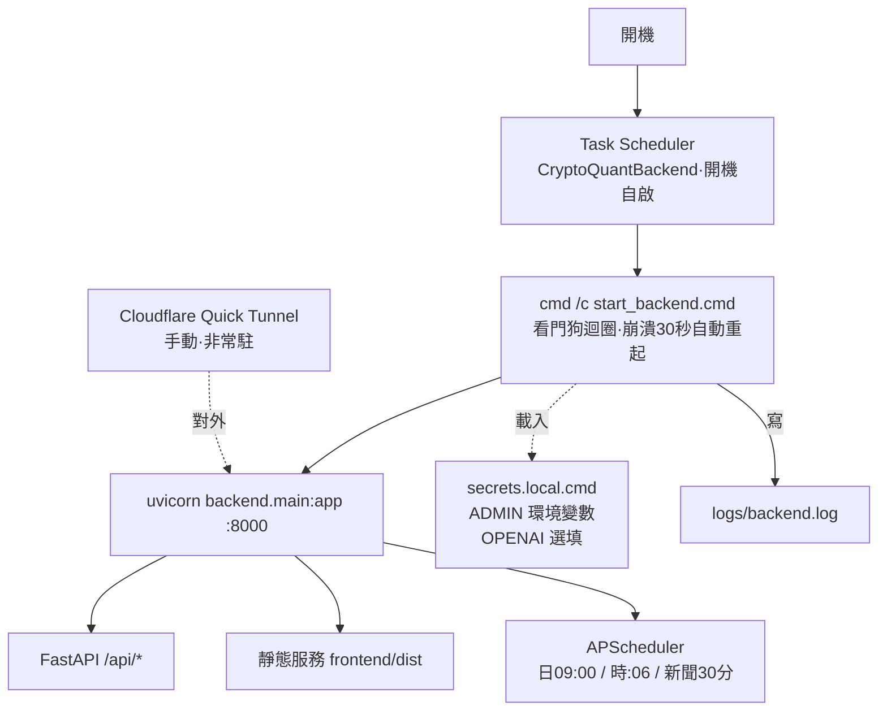

# 部署與運維（Ops Runbook）

> 這台機器（Windows Server）的**實際**部署與日常維運。給接手者：照這份就能部署、重啟、改東西、排錯。
> 最後更新：2026-07-13 · 搭配 [README](../../README.md)、[開發指南](開發指南.md) 一起看。

---

## 1. 部署架構一覽

**▸ 圖：部署架構（開機自啟 → 看門狗 → uvicorn）**（線上檢視渲染圖）



以下為對應文字版：

```
開機
 └─ Task Scheduler 工作「CryptoQuantBackend」(State: Running,開機自啟)
     └─ cmd /c start_backend.cmd   ← 看門狗迴圈:uvicorn 掛了等 30 秒自動重起
         └─ .venv\Scripts\python.exe -m uvicorn backend.main:app --host 0.0.0.0 --port 8000
             ├─ FastAPI /api/*        (後端 API)
             ├─ 靜態服務 frontend/dist  (前端 build 產物,同一個 8000 埠)
             └─ APScheduler           (排程隨 app 啟動:每日09:00 / 每小時:06 / 新聞每30分)

對外(需要時才開,非常駐):Cloudflare Quick Tunnel ──▶ localhost:8000
密鑰:secrets.local.cmd (gitignored) 由 start_backend.cmd 載入
日誌:logs\backend.log
```

**一句話**：一台機器、一個 uvicorn 進程、前後端同吃 8000 埠；由 Task Scheduler ＋看門狗保證開機自啟與崩潰自癒。

| 元件 | 怎麼跑 | 位置 / 埠 |
|---|---|---|
| 後端 API + 前端靜態 | uvicorn（單進程） | `0.0.0.0:8000` |
| 排程器 | APScheduler，隨 uvicorn 進程內啟動 | `backend/scheduler.py` |
| 前端產物 | `vite build` 出的靜態檔，FastAPI 掛載服務 | `frontend/dist/` |
| 看門狗 / 自啟 | `start_backend.cmd` 迴圈 + Task Scheduler 工作 | `CryptoQuantBackend` |
| 對外通道 | Cloudflare Quick Tunnel（手動、非常駐） | → `:8000` |
| 密鑰 | `secrets.local.cmd`（目前注入 ADMIN 變數；OPENAI 可選填） | 專案根、gitignored |
| 日誌 | 看門狗每次啟停與 uvicorn 輸出 | `logs\backend.log` |

> ⚠️ `.venv\Scripts\python.exe` 是 launcher 殼，工作管理員會看到「venv + 系統 Python **成對**」的 uvicorn — 那是**一台**伺服器不是兩份；殺子進程=殺整台。

---

## 2. 環境變數（由 `secrets.local.cmd` 注入）

| 變數 | 用途 | 必填 |
|---|---|---|
| `ADMIN_USER` | 後台帳號；未設定時預設 `admin` | 建議設定 |
| `ADMIN_PASS` | 後台密碼 | ✅（對外必改預設） |
| `ADMIN_SECRET` | 簽發 `/admin` token 的簽章密鑰 | ✅（對外必改，否則 token 可偽造） |
| `OPENAI_API_KEY` | GPT 金鑰；不填則 AI 只走規則引擎 | 選填 |
| `OPENAI_BASE_URL` | 自訂 OpenAI 相容端點（如代理） | 選填 |
| `OPENAI_MODEL` | 指定模型名 | 選填 |
| `AI_HOURLY_CAP` | AI 每小時呼叫上限（預設 80） | 選填 |

> 目前本機 `secrets.local.cmd` 只有 `ADMIN_PASS` / `ADMIN_SECRET`。GPT 金鑰可在**後台「AI 設定」頁**填（存 `app_config`），或加到 `secrets.local.cmd`；環境變數 `OPENAI_API_KEY` 優先。

**`secrets.local.cmd` 範本**（勿提交；本檔已 gitignore。**純 ASCII + CRLF**，見 §8 雷區）：

```bat
@echo off
REM 後台帳密與金鑰 — 本機專用,勿提交
set "ADMIN_USER=admin"
set "ADMIN_PASS=<改成強密碼>"
set "ADMIN_SECRET=<改成一段隨機長字串>"
REM set "OPENAI_API_KEY=<sk-... 選填,不填 AI 走規則引擎>"
```

---

## 3. 首次部署（從零到跑起來）

```powershell
# 0) 前置：Python 3.x、Node.js、git（皆已裝於本機）
git clone <repo> C:\Users\Administrator\crypto-quant
cd C:\Users\Administrator\crypto-quant

# 1) Python 虛擬環境 + 相依（見下方「三個 requirements 檔」）
python -m venv .venv
.\.venv\Scripts\python.exe -m pip install -r backend/requirements.txt -r requirements.txt
# 開發/驗證/產 docx 才需要：
.\.venv\Scripts\python.exe -m pip install -r requirements-dev.txt

# 2) 前端相依 + build（正式環境由 FastAPI 服務 dist/）
cd frontend
npm install
npm run build
cd ..

# 3) 建密鑰檔（見 §2 範本）
notepad secrets.local.cmd

# 4) 起服務（開發手動起；正式用 Task Scheduler，見 §4）
.\.venv\Scripts\python.exe -m uvicorn backend.main:app --host 0.0.0.0 --port 8000
```

**三個 `requirements` 檔的分工**（別搞混）：

| 檔案 | 給誰 | 內容 |
|---|---|---|
| `backend/requirements.txt` | **跑 app**（正式必裝） | fastapi / uvicorn[standard] / apscheduler / pandas / numpy / feedparser / aiofiles / requests |
| `requirements.txt`（根） | **`src/` 離線管線** | matplotlib / numpy / pandas / requests（indicators 畫 PNG 用 matplotlib） |
| `requirements-dev.txt` | **開發 / 驗證 / 產 docx** | pandas_ta（指標交叉驗證）/ python-docx（產計畫書·詞庫 docx）/ pytest + httpx2（API smoke test） |

**設定開機自啟（Task Scheduler）**：本機已建工作 `CryptoQuantBackend`，動作 = `cmd /c "C:\Users\Administrator\crypto-quant\start_backend.cmd"`，觸發 = 開機。重建時照此設定即可；`start_backend.cmd` 本身是看門狗迴圈（崩潰 30 秒後自動重起）。

---

## 4. 日常維運

### 重啟後端（改了後端程式碼、或要套用 `secrets.local.cmd` 變更）
正式環境是**看門狗迴圈**（無 `--reload`），改碼後必須重啟工作才生效：

```powershell
schtasks /end /tn CryptoQuantBackend          # 停掉看門狗
# 清掉殘留的 8000 進程（保險）
Get-NetTCPConnection -LocalPort 8000 -State Listen -EA SilentlyContinue |
  ForEach-Object { Stop-Process -Id $_.OwningProcess -Force }
schtasks /run /tn CryptoQuantBackend          # 重新啟動
```

### 改前端 → **一定要重新 build**（最常見的坑）
正式環境服務的是 `frontend/dist/`，**不是**原始碼。改了前端沒 build＝線上還是舊的：

```powershell
cd frontend; npm run build        # 產物直接被 FastAPI 服務，不必重啟後端
```

### 其他常見操作
| 要做的事 | 怎麼做 |
|---|---|
| 改後台帳密 / 金鑰 | 改 `secrets.local.cmd` → 重啟後端（§4） |
| 設 / 換 GPT 金鑰 | 後台「AI 設定」頁貼上（即時生效）；或改 `OPENAI_API_KEY` 後重啟 |
| 手動觸發抓取 / 重算 | 後台監控頁按鈕；或 `python -c "from backend.scheduler import run_pipeline; run_pipeline()"` |
| 對外公開 | 開 Cloudflare Quick Tunnel 指向 `:8000`（網址每次會變 → 根治見待辦 #64 named tunnel） |
| 看服務狀態 | `schtasks /query /tn CryptoQuantBackend`、`Get-NetTCPConnection -LocalPort 8000` |

### 開發模式（本機開發，非正式）
```powershell
cd frontend; npm run start   # = uvicorn(:8000 --reload) + vite(:5173) 一起跑，改碼熱重載
```

---

## 5. 資料與備份

- **兩個 SQLite（皆 WAL）**：`data/app.db`、`data/news.db`。
- **備份 = 直接複製 `.db` 檔**即可；`.db-wal` / `.db-shm` 旁檔**不用**備份。
- **可重建**：`prices` / `indicators` / `daily_signal` 都能由 CSV 或 Binance 重跑重建 → 遺失≠永久遺失。
- **不可重建（要顧好）**：`tasks`（工作項目）、`news`（部分）—— 量小，定期複製即可。
- `data/raw/*.json` 由每日排程自動保留 7 天後清除（見 `scheduler.run_pipeline` 步驟 9）。
- **勿提交**：排程器每天改寫的 `data/clean/*`、`reports/*` 不進版控（見 [開發指南](開發指南.md)）。

---

## 6. 監控與日誌

| 來源 | 看什麼 |
|---|---|
| `logs\backend.log` | 看門狗每次「啟動 / 退出(含 exit code) / 30 秒後重起」；uvicorn 與例外輸出 |
| 後台「監控」頁 | `job_runs` 每次排程/操作的成功失敗與時間、各幣資料新鮮度、DB 各表筆數 |
| `/api/status` | `data_version`（前端自動更新心跳）、最新資料日期 |

**排程時間表**（`backend/scheduler.py`，隨 app 啟動）：

| 時間 | 工作 | 內容 |
|---|---|---|
| 每日 09:00（台灣，=UTC 01:00） | `daily_pipeline` | 抓日線→指標→入庫→重算訊號→重產回測→新鮮度檢查→恐懼貪婪→新聞→清理 |
| 每小時 :06 | `hourly_pipeline` | BTC/ETH 1h 增量→指標→入庫 |
| 每 30 分 | `news_fetch` | RSS + Google News → 詞庫標註 → 去重入庫 |

> 每步都檢查子行程結束碼 + 收尾「資料新鮮度」防線；任一步失敗整個 job 標 `failed`（不再假性成功）。

---

## 7. 疑難排解

| 症狀 | 可能原因 | 處置 |
|---|---|---|
| 8000 連不上 | 看門狗沒跑 / 進程崩在重啟空窗 | `schtasks /query /tn CryptoQuantBackend`；看 `logs\backend.log` 末段；§4 重啟 |
| 8000 被佔、起不來 | 殘留舊 python 進程 | §4 的 `Stop-Process` 清掉 8000 佔用者再 `schtasks /run` |
| 前端改了沒生效 | **忘了 `npm run build`** | `cd frontend; npm run build`（最常見） |
| 資料不更新 | fetch 失敗 / Binance 429 / 排程沒跑 | 後台監控頁看 `job_runs` 的 failed 訊息；新鮮度防線會標紅 |
| `/admin` 進不去 | 密碼錯 / `ADMIN_SECRET` 變了（舊 token 失效）/ `secrets.local.cmd` 沒載入 | 確認 `secrets.local.cmd` 存在且被 `start_backend.cmd` `call` 到；重登 |
| AI 沒反應 / 只出規則引擎 | 沒金鑰 / 超過 `AI_HOURLY_CAP` / GPT 失敗降級 | 後台「AI 設定」查金鑰與用量；無金鑰屬正常降級 |
| tunnel 網址失效 | Quick Tunnel 重啟就換址 | 重開 tunnel 拿新址；根治見 #64 named tunnel |
| `.cmd` 改了整個沒反應 | 存成 UTF-8/BOM 或 LF、用了相對路徑 | 見 §8：純 ASCII + CRLF、`call` 用 `%~dp0` 絕對路徑 |

---

## 8. 這台機器的雷區（硬規則，違反會**靜默失敗**）

1. **`.cmd` 檔**：必須**純 ASCII + CRLF 換行**；`call` 其他 .cmd 要用 `%~dp0` **絕對路徑**。存成含中文/BOM/LF 或用相對路徑 → 不報錯、直接不動作。
2. **改前端必 build**：正式服務 `dist/`，改原始碼不 build＝沒生效。
3. **改後端必重啟工作**：正式沒有 `--reload`。
4. **`.venv` 成對進程**：venv + 系統 Python 兩個 uvicorn = 一台伺服器，別誤殺。
5. **勿提交排程產物**：`data/clean/*`、`reports/*` 每天被改，不進版控。

---

## 9. 對外上線前安全檢查清單

- [x] 改掉 `ADMIN_PASS` / `ADMIN_SECRET` 預設值（2026-07-06 已做，值在 `secrets.local.cmd`）
- [ ] 登入失敗鎖定 / per-IP 限流（#70）
- [ ] `/sentiment/news/backfill` 等寫入端點加驗證（#70）
- [ ] 夜間 DB 備份排程（#70）
- [ ] Cloudflare Access 保護 `/admin`、named tunnel 固定網址（#64 / #70）

> 安全強化完整清單見後台「工作項目 #70」與 [專案路線圖](專案路線圖.md)。
