# crypto-quant 系統文件與交接手冊

> 版本：v1.0（2026-09-02 定版）｜基準：`main` @ f71f464（2026-09-01）＋本次文件改版
> 內容：主管摘要 × 導讀 × 第 01–13 章核心文件 × 附錄 A–D（GPT 啟用規格／備份與搬遷 Runbook／成績單與檢定 Runbook／文件沿革）
> 性質：全套系統文件與交接文件的合併版；同主題以附錄 D「主來源規則」判定哪裡是最後答案。

[[TOC]]

# 主管摘要（Executive Summary）

用五個問題一次講完，不需要任何技術背景；名詞不熟悉時看本章末的小辭典，細節與依據在第 07 章（完成度）、第 11 章（訊號研究）與第 12 章（後續規劃）。本頁數字截至 2026-09-02；績效數字會隨每日資料更新而漂移，現值以管理後台「現況」頁為準。

## 1. 這是什麼、做什麼

crypto-quant 是一個自架、自動運作的加密貨幣分析網站。它每天自動做四件事：抓 15 種主流幣的行情與新聞 → 算出技術指標與買賣訊號 → 產生可回溯、可拒答的研究預測 → 把數字翻成白話。前台有秒級跳動的即時報價、互動蠟燭圖、市場情緒與宏觀環境面板；另有一個管理後台看排程狀態、管幣種、追進度、設 AI 金鑰。白話講：把原本要東看西看、還得手動算的「看盤＋算指標＋查新聞＋做研究」，整合成一個隨時打開就有、資料自動更新、不用人顧的平台。

## 2. 有沒有用（證據，與誠實的但書）

- 資料是對的：技術指標以獨立演算法逐點重算交叉驗證，16/16 全對（驗證當時 16 幣，含後來下市的 MATIC）；修掉了「半根 K 棒」污染尾端指標的問題；後端 141 項自動測試全數通過。
- 訊號有沒有預測力，我們用嚴格的方法考過了：前台原本的「六因子信心分數」經 1,400 筆以上的 forward 檢驗，5 日勝率約 45%，比隨機進場（約 47%）還差一點。我們主動把它擋下，前台改標「教學用途」，不讓一個看起來會賺、其實無效的訊號誤導人。
- 換個維度找到相對有據的策略：「防禦型跨幣動量」（15 幣互比強弱只買最強的 5 個；BTC 跌破 100 日均線就轉現金；市場太亂自動減碼）。在後 40% 檢驗段（2026-08-31 實跑）年化 +25.6%、最大回撤 −20.6%，同期等權大盤 −16.4%、−74.6%。
- 誠實的但書：①仍是回測、尚未實盤；②那段「檢驗資料」在挑參數時被看過，數字偏樂觀，參數凍結（2026-06 底）之後累積的成績才是乾淨的驗證；③數字隨資料更新漂移（首次快照 +27%／−19%）。它的性格是「崩盤時保命、牛市時偏弱」。
- 宏觀環境面板照實標示「不顯著」：事先指定的統計檢定測不到宏觀對加密報酬的預測力（拉長到 8 年樣本也一樣），所以它只當背景脈絡、不進買賣分數——又一次「寧可不用，也不誇大」。

## 3. 現在狀態：已完成的

行情與指標（15 幣日線＋BTC／ETH 時線全自動更新、只存已收盤 K 棒、指標交叉驗證徽章）；訊號與回測（六因子計分單一真相、無前視回測、逐幣回測入庫、訊號成績單）；研究預測（1／5／10 日機率與區間、內容定址、資料庫層 append-only、成績單與發布閘門）；市場情緒（恐懼貪婪、10 家來源新聞牆、中英雙語詞庫每日情緒分數、幣種標記）；宏觀環境（規則式判讀＋十年歷史＋預測力檢定＋BTC 連動強度）；AI 雙引擎（規則引擎恆可用；GPT 深度解讀程式就緒、金鑰未設）；管理後台（監控、幣種、工作項目、資料庫檢視、現況、模型成績）；正式部署（開機自啟＋看門狗、每日 SQLite 線上備份保留 14 份、換機搬遷包、macOS 亦可跑）。

## 4. 現在狀態：誠實地還沒好的

- 前台的「六因子信心分數」仍是教學用途，還沒換成上述動量策略（訊號增準計畫 Phase A，後台 #79，等主管拍板 A／B／C）。
- 動量策略還沒實盤或紙上實盤驗證過（後台 #127 進行中）。
- 研究預測上線至今全數「拒答」（設計如此：信心不足就不給結論），但「持續全拒答」是否代表門檻過嚴，需要再評估（後台 #191）。
- 對外固定網址、後台密碼輪替、多進程共享防線等安全與營運待辦仍在（後台 #165–#168）。
- GPT 深度解讀與 GPT 新聞情緒標註因金鑰未設而擱置（後台 #63／#77）。

上述完成之前，系統以「內網主入口 + 需要時才開的臨時對外通道」運作，不對外承諾預測績效。

## 5. 需要主管決定或協助的

| 事項 | 為什麼需要主管 | 研究端建議 |
|---|---|---|
| 策略去向 A／B／C（後台 #79，2026-06-30 提案至今未拍板） | A 接進平台當正式訊號、B 先紙上實盤數月、C 重新定位為風控＋誠實研究工具，牽動前台呈現與對外說法 | B → A：先驗證穩健度數月，再產品化搬上前台 |
| 是否申請 GPT 金鑰（後台 #63） | 啟用後 AI 深度解讀、新聞批次情緒標註、每日晨報才能開；成本已估約每日不到 0.01 美元（新聞標註） | 若要用，於後台「AI 設定」頁貼上即時生效，免重啟 |
| 對外固定網址與網域（後台 #165） | Cloudflare named tunnel／Access／WAF 需外部網域與帳號權限，非本倉庫可自動完成 | 先決定「只給區網看」還是「要對外」，再申請網域 |
| 後台密碼輪替（後台 #166） | 目前沿用 2026-07-06 依當時決策保留的 legacy 密碼，啟動時記高風險警告 | 由主管指定新密碼（≥12 字元）並保管於私人密碼工具，工程端 5 分鐘完成輪替 |
| 新聞來源授權（後台 #156） | Google News RSS 用於正式環境的商用條款風險需公司判斷 | 內部使用維持現狀；對外前由法務確認 |

## 名詞小辭典

| 名詞 | 白話 |
|---|---|
| K 棒（K 線） | 一段時間的開盤、最高、最低、收盤價與成交量；本系統只存「已收盤」的 K 棒 |
| 技術指標 | 用價格與量算出的參考數字（均線、RSI、MACD、布林通道…），本系統以獨立演算法逐點驗證過 |
| 六因子信心分數 | 前台每顆幣 0–100 的綜合分數；經檢驗無預測力，現為教學用途 |
| 訊號成績單 | 檢驗「聽訊號進場」是否贏過「隨便一天進場」的統計報表，後台即時重算 |
| 回測 | 用歷史資料模擬照訊號買賣的結果；本系統依訊號的動作延到隔天開盤才成交，避免「偷看未來」 |
| 樣本外 | 沒有拿來設計策略的資料段；本系統誠實標註動量策略的樣本外含「選參保留」 |
| 防禦型跨幣動量 | 多幣互比只買最強、空頭轉現金、亂市減碼的策略；後台「現況」頁可看今日建議與績效 |
| 研究預測／拒答 | 1／5／10 日漲跌機率與區間；信心不足、資料過期或樣本不夠時明確不給結論（abstain） |
| append-only | 只能新增、不能修改刪除；研究預測紀錄在資料庫層以觸發器強制，成績無法事後美化 |
| 恐懼貪婪指數 | alternative.me 的市場情緒指標，0 極度恐懼～100 極度貪婪 |
| 新聞情緒分數 | 每天把新聞標題以中英詞庫判讀後彙總成 −100～+100 的分數，全市場與各幣分開算 |
| 宏觀環境 | 美元指數、VIX、美債殖利率、標普 500、黃金等的規則式判讀；檢定不顯著，只當背景 |
| 看門狗 | 服務崩潰後 30 秒自動重啟的機制；搭配開機自啟，機器重開也不用人 |
| 搬遷包 | 把不跟著程式碼走的東西（帳密、兩個資料庫的一致快照、資料）打成一個 zip，換機器用 |

# 導讀：如何使用本手冊

本手冊是 crypto-quant 全套系統文件與交接文件的合併版（2026-09-02）：開頭的「主管摘要（Executive Summary）」是給主管的白話總結；第 01–13 章為核心文件，附錄 A–C 為專題 Runbook，附錄 D 為文件沿革與主來源規則。前面的目錄列出每一章、每一節與頁碼，要找什麼先看目錄；在 Word 中編修後若頁碼跑動，按 Ctrl+A 再按 F9 即可更新目錄。另有一份依軟體系統規格書（SDD）格式重排的《crypto-quant 系統規格書》，給需要「設計文件」形式的審閱者；兩份的 Markdown 原始檔都在 `docs/src/`，修改後執行 `scripts/build_docs.py` 重新產生 Word。

## 你是誰、要做什麼：先看哪一章

| 你是誰、要做什麼 | 先看 |
|---|---|
| 主管，想在 5 分鐘內知道現況與要決定什麼 | 主管摘要；再看第 07 章 0-F（最新交付線）與第 12 章「給主管討論的一頁摘要」 |
| 接手開發的工程師，第一天要把系統跑起來 | 第 10 章（元件與資料庫使用手冊）§7 快速操作；再看第 02 章架構、第 03 章資料庫 |
| 要維運：重啟、改前端、換機、排錯 | 第 10 章 §7–§8、附錄 B（備份與搬遷）、第 08 章 §7 |
| 要接 API 或改後端端點 | 第 05 章（API 規格書）、第 03 章（資料表） |
| 要改前台畫面或後台頁面 | 第 06 章（前端頁面與後台規劃）、第 10 章 §4 |
| 要改訊號、回測或研究預測邏輯 | 第 02 章 §5、第 04 章、第 11 章、第 13 章、附錄 C |
| 要評估「訊號到底準不準」與下一步該做什麼 | 第 11 章（訊號研究與策略試行方案）、第 12 章（後續規劃） |
| 要審核詞庫或 AI 問答內容 | 第 09 章、附錄 A |
| 要確認安全與資料防護做到哪 | 第 08 章、第 10 章 §7.6 雷區 |

## 章節總覽：哪一章找什麼

| 章 | 找什麼 |
|---|---|
| 01 專案規劃書 | 立項背景、目標與 KPI、範圍、使用者角色、User Stories、風險、擴充藍圖（原規劃保留，不用來判斷完成度） |
| 02 系統架構設計 | 架構總覽、技術選型、模組切分、資料管線、訊號／回測／預測／動量／宏觀五個引擎的設計原則、部署方案、非功能需求 |
| 03 資料庫設計 | 兩個 SQLite 的 19＋2 張表、主鍵與索引、append-only 觸發器、資料生命週期與容量 |
| 04 行情抓取、指標與訊號流程 | Binance 抓取、只存已收盤 K 棒、指標計算、增量與去重、新鮮度防線、品質保證 |
| 05 API 規格書 | 53 個端點的通用規格、認證、限流、快取與逐群組端點表 |
| 06 前端頁面與後台規劃 | Sitemap、角色 × 頁面矩陣、前台與後台每個頁面的規格、暫停掛載的元件、UX 原則 |
| 07 開發時程與里程碑 | 交付線（最新在前）、甘特圖、各階段驗收條件、里程碑總表、品質守則、資源與成本 |
| 08 資訊安全與資料保護 | 威脅模型、密鑰管理、登入防護、限流與安全標頭、稽核、備份與災難復原、事件應變、檢查清單 |
| 09 新聞情緒管線與詞庫／問答庫審核 | 10 家來源、中英詞庫判讀規則、幣種標記、詞庫審核流程、AI 固定問答庫、品質量測 |
| 10 系統元件與資料庫使用手冊（維護版） | 白話架構、實際資料表清單、前台／後端／後台各是什麼、Windows 與 macOS 操作、雷區、驗證指令 |
| 11 訊號研究與策略試行方案 | 業界做法、六因子成績單、六個改良變體、跨幣動量血脈與誠實聲明、校準實驗、下一步 |
| 12 後續規劃（Backlog + Plan） | 狀態校正、波次、A–H 各項待辦的做法／估時／完成定義／相依／風險、起手順序、主管一頁摘要 |
| 13 研究預測成績單與發布閘門操作規格 | 快照欄位、拒答規則、結算、不可覆寫、計分與 gate、API 範例、指標定義與禁止誤用、UAT 清單 |
| 附錄 A | GPT 深度解讀：兩引擎畫面、規則引擎範例、啟用方式、回傳格式、啟用前驗收 |
| 附錄 B | SQLite 每日備份與換機搬遷 Runbook |
| 附錄 C | 訊號成績單、回測驗證器、指標交叉驗證、宏觀預測力檢定的操作與指標 |
| 附錄 D | 文件沿革與主來源規則 |

# 01. 專案規劃書

文件版本：v1.0（2026-09-02，依 2026-06-17 立項時的 README 與後台工作項目回溯整理）｜目標讀者：專案發起人、主管、開發團隊

> 文件定位：保留立項時的目標、範圍與 KPI 基準，不用來判斷目前完成度；最新完成度與交付線以第 07 章為準，未完成工作以第 12 章為準。

## 1. 背景與痛點

| 痛點 | 立項時的狀況 | 影響 |
|---|---|---|
| 看盤資訊分散 | 行情在交易所、指標在看盤軟體、新聞在十幾個網站、情緒指數又在另一個站 | 每天東看西看，決策依據不一致、無法回溯 |
| 指標要自己算、算了也不確定對不對 | 沒有獨立驗證，半根 K 棒（未收盤）混進資料會污染尾端指標 | 看似精準的數字可能是錯的 |
| 「訊號」多半沒有驗證過 | 市面工具給訊號不給勝率；沒有人用不偷看未來的方式檢驗 | 容易上線一個看起來會賺、其實無效的訊號 |
| 預測無法稽核 | 預測說過就算，事後可以改、可以只講對的那幾次 | 無法建立可信的成績單 |
| 更新靠人 | 資料要手動抓、手動算、手動整理給主管 | 人不在系統就停 |

## 2. 專案目標與效益指標

### 2.1 目標

1. 自動化資料管線：每日自動抓 15 幣行情與新聞、算指標、算訊號、入庫，前台資料自動更新不用人顧。
2. 資料正確可驗證：只存已收盤 K 棒；指標以獨立演算法交叉驗證並在前台掛「信任徽章」。
3. 訊號誠實可檢驗：前台建議與回測共用同一把計分尺；回測無前視；成績單即時檢驗有沒有預測力。
4. 研究預測可稽核：預測快照內容定址、資料庫層 append-only；成熟後自動結算並有發布閘門。
5. 白話解讀：規則引擎把數字翻成白話（永遠可用），GPT 深度解讀選配（被本地數據錨定、觀點分歧會標示）。
6. 可維運可交接：開機自啟＋看門狗、每日備份、換機搬遷包、單一入口文件。

### 2.2 效益指標（KPI）

| 指標 | 立項現況（2026-06） | 目標 | 現況（2026-09-02） |
|---|---|---|---|
| 行情與指標更新 | 手動抓、手動算 | 全自動、每日 09:00 前台自動刷新 | 達成（`daily_pipeline` 27 次成功／1 次失敗） |
| 指標正確率（獨立交叉驗證） | 未驗證 | 100% 通過 | 達成（16/16，1h 2/2） |
| 訊號預測力（5 日勝率 vs 隨機基準） | 未知 | ≥ 基準 +0.5pp | 未達（45.2% vs 47.4%；六因子降為教學用途，改推動量策略） |
| 新聞來源 | 3 家（全英文） | ≥ 10 家、含中文、可標到單幣 | 達成（9 家 RSS＋Google News 聚合，15,359 篇） |
| 研究預測可稽核 | 無 | 每筆預測可回溯、不可竄改、有成績單 | 達成（v2 ledger 1,623 筆快照／1,383 筆成熟結果） |
| 服務可用性 | 人工啟動 | 開機自啟、崩潰 30 秒內自癒、每日備份 | 達成（看門狗＋14 份輪替備份） |
| 資料新鮮度告警 | 無 | 落後 > 2 天標紅、核心步驟失敗不假性成功 | 達成（後台監控頁與 `job_runs`） |

KPI 現況欄為 2026-09-02 唯讀實測；正式驗收時以後台「監控」與「現況」頁重讀。

## 3. 使用者角色

| 角色 | 做什麼 | 進入點 |
|---|---|---|
| 一般使用者（訪客） | 看即時報價、蠟燭圖、指標、訊號、研究預測、情緒與宏觀面板；免登入 | 區網主入口 `http://10.201.7.12:8080/` → `/crypto/`；本站 `:8000` |
| 主管／審閱者 | 讀主管摘要與成績單、拍板策略去向與金鑰等決策 | 本手冊；後台「現況」與「模型成績」頁 |
| 管理者 | 登入後台看排程與新鮮度、管幣種、追工作項目、查資料庫、設 AI 金鑰 | `/admin`（帳密由環境變數注入） |
| 開發／維運接手者 | 部署、重啟、改碼、驗證、換機 | 第 10 章、附錄 B、C |
| 排程器（系統） | 每日／每小時／每 30 分／每日備份四個排程自動執行 | `backend/scheduler.py` 隨服務啟動 |

## 4. 專案範圍

### 4.1 本期範圍（In Scope）

- 行情：15 幣日線（5 年）、BTC／ETH 小時線（2 年）；Binance 公開 API；只存已收盤 K 棒；增量抓取。
- 指標：MA20／60／200、RSI、MACD、布林、量均（後端）；KDJ、DMI、BIAS、ATR、OBV（前端即時計算，另以 pandas_ta 驗證）。
- 訊號：六因子計分（`src/scoring.py` 單一真相）；BULL／BEAR／NEUTRAL；每日訊號歷史入庫。
- 回測：無前視、含手續費與滑價、停損停利、隨機進場對照、參數掃描、走勢前後段對照；每日重產並入庫。
- 研究預測：1／5／10 日機率、q10／q50／q90、下行風險、信心與證據；拒答；append-only ledger；成績單與發布閘門。
- 市場情緒：恐懼貪婪指數（可追溯 2018）；新聞牆（9 家 RSS＋Google News）；中英詞庫每日情緒分數（全市場＋各幣）。
- 宏觀環境：DXY／VIX／US10Y／SPX／GOLD 規則式判讀＋十年歷史＋預測力檢定＋BTC 連動強度；日經／KOSPI／日圓對照。
- AI：規則引擎白話分析；GPT 深度解讀（選配）；固定問答庫與幣種知識庫。
- 管理後台：登入、監控、幣種、工作項目、資料庫檢視、現況（動量策略）、模型成績、AI 設定。
- 維運：Windows 開機自啟＋看門狗；macOS／Linux 啟動腳本與 launchd；每日 SQLite 線上備份；換機搬遷包；版控產物防線。

### 4.2 本期不做（Out of Scope）

- 下單或任何真實資金操作（本系統只分析、不交易）。
- 保證或宣稱預測績效；所有績效數字附誠實聲明。
- 會員系統、多使用者權限（前台免登入、後台單一管理帳號）。
- 分鐘線與高頻資料（容量評估見第 03 章 §9，需換資料庫）。
- 自動登入交易所帳號、爬非公開資料（只用公開 API 與 RSS）。

> 現況註記（2026-09-02）：立項後新增而未列於原範圍的能力——即時報價（Binance WebSocket）、宏觀環境面板、研究預測 ledger 與成績單、macOS 支援——皆已交付並納入上表；原規劃的「AI 智能分析面板」「幣種相關性熱圖」「小Q 聊天小幫手」「新手導覽」程式保留但於 2026-07-06 依決策暫停掛載（見第 06 章 §3.6）。

## 5. 核心使用情境（User Stories）

| # | 身分 | 情境 | 驗收條件 |
|---|---|---|---|
| US-01 | 訪客 | 打開網站立刻看到 BTC 即時報價與蠟燭圖，不需登入 | 首頁即 BTC 詳細頁；報價秒級跳動 |
| US-02 | 訪客 | 切換幣種、日線／時線、區間，圖表與指標同步 | 15 幣可切；BTC／ETH 有時線；區間 1M–全部 |
| US-03 | 訪客 | 看到買賣訊號，同時看到它「有沒有預測力」的誠實標示 | 六因子分數標「教學用途」；後台成績單可查 |
| US-04 | 訪客 | 看研究預測決策卡；信心不足時看到明確拒答而非假精準數字 | 拒答顯示原因；不顯示 0% 或空機率 |
| US-05 | 訪客 | 看恐懼貪婪、新聞情緒溫度與新聞牆，並能追回原始出處 | 每則新聞帶原始網址；來源分布查 DB 實況 |
| US-06 | 訪客 | 看宏觀環境判讀，並知道證據有多強 | 面板標示「不顯著」與檢定數字；每格標資料日期與代號 |
| US-07 | 管理者 | 登入後台看每次排程成功／失敗與各幣資料新鮮度 | `job_runs` 最近 50 筆；落後 > 2 天標 `stale` |
| US-08 | 管理者 | 新增或停用一顆幣，不改程式、不重啟 | 幣種在 `app_config`；新增即抓 Binance 入庫 |
| US-09 | 管理者 | 維護工作項目，作為全專案進度的唯一真相 | 後台 CRUD；done／in_progress／planned |
| US-10 | 管理者 | 看訊號成績單與動量策略今日建議 | 改訊號後成績單自動重算（快取鍵含 `scoring.py` mtime） |
| US-11 | 管理者 | 設定 GPT 金鑰、看用量 | 後台貼上即時生效；金鑰只回遮罩 |
| US-12 | 系統 | 每日自動抓取、計算、封存預測、備份，失敗不假性成功 | 核心步驟失敗整個 job 標 `failed` |
| US-13 | 接手者 | 換一台機器後一小時內恢復服務與歷史資料 | `make_migration_bundle.py` 搬遷包＋`setup.sh` |

## 6. 端到端流程

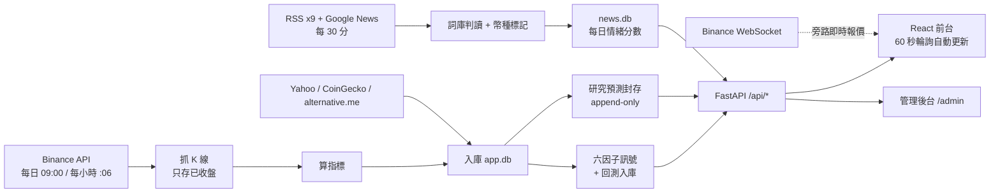

圖：端到端流程——排程抓取與計算落地 SQLite，前後台一律讀資料庫，即時報價走旁路

## 7. 階段規劃摘要（詳見第 07 章）

| 階段 | 期間 | 內容 | 狀態 |
|---|---|---|---|
| Phase 0 骨架 | 2026-06-17 | React 前端＋FastAPI 後端＋市場情緒模組；蠟燭圖與回測標記 | 完成 |
| Phase 1 平台化 | 2026-06-29～07-02 | 統一計分、後台、資料入庫、RWD、指標驗證、時線、AI 雙引擎、新聞升級、自動更新 | 完成 |
| Phase 2 驗證與誠實化 | 2026-06-29～07-06 | 訊號成績單、六變體實驗、跨幣動量研究、無前視修正、回測入庫、服務化部署 | 完成 |
| Phase 3 研究預測 | 2026-07-21～07-24 | 可稽核預測、成績單 P0、校準 challenger、模型指標與門檻、後台模型成績頁 | 完成 |
| Phase 4 可用性與宏觀 | 2026-08-04～08-10 | 撕裂 CSV 修復、自我修復、誠實指標、宏觀十年歷史與檢定、全站出處標註 | 完成 |
| Phase 5 交接 | 2026-09-01～09-02 | macOS 支援、搬遷包、文件總體檢、系統規格書與交接手冊 | 完成 |
| Phase 6 策略產品化 | 待拍板 | 訊號增準 Phase A–E、紙上實盤、ML 研究 | 未開工 |

## 8. 風險與因應

| 風險 | 影響 | 因應 |
|---|---|---|
| 訊號無預測力卻被當成建議 | 使用者依教學分數操作 | 前台標「教學用途」；成績單公開；動量策略上前台前先紙上實盤 |
| 動量策略「樣本外」含選參保留 | 績效偏樂觀 | 誠實聲明寫進所有文件；凍結參數後宣告新 holdout（#175） |
| Binance API 限流或改版 | 管線失敗 | 429 依 Retry-After 重試；核心步驟失敗整個 job 標 failed；新鮮度標紅 |
| 半根 K 棒污染 | 尾端指標錯 | 抓取端以 `close_time` 過濾未收盤 K 棒 |
| WAL 資料庫被直接複製 | 備份不一致 | 一律走 SQLite online backup API；搬遷包同法 |
| 排程產物被提交進版控 | 倉庫膨脹、diff 混亂 | `.gitignore` 整目錄擋；提交前跑 `check_staged_runtime_artifacts.py` |
| 後台預設帳密對外曝險 | 未授權操作 | 對外模式 fail-closed（密鑰 ≥32、密碼 ≥12）；登入鎖定；per-IP 限流 |
| 單機單進程 | 機器掛就全掛 | 看門狗＋開機自啟；每日備份；搬遷包一小時恢復 |
| 文件與程式脫節 | 交接失真 | README 為活文件；本手冊為定版快照；附錄 D 主來源規則 |

## 9. 未來擴充藍圖（Phase 2+）

- 訊號增準（規則式 Phase A–E）與 ML 訊號研究（LightGBM＋purged walk-forward，六道 Go／No-Go）。
- 產品閉環：到價／訊號通知（Telegram）、AI 每日晨報、投資組合追蹤與 AI 健檢。
- 研究預測 P1／P2：校準與區間監控、champion／challenger 組合、exact-vintage 快照。
- 基礎設施：named tunnel 固定網址、Cloudflare Access／WAF、外部看門狗與異地備份、多進程共享防線。
- 內容深化：GPT 新聞批次情緒標註、詞庫／問答庫後台管理化、宏觀／政治文字解讀。
- 前台體驗：簡易／專業模式、新手導覽與辭典恢復、4h 週期與更多時線幣。
# 02. 系統架構設計

文件版本：v1.0（2026-09-02）

> 文件定位：保留架構原則與技術決策。實際已存在的元件、資料表與啟動／部署方式，以第 10 章及目前程式碼為準。

## 1. 架構總覽

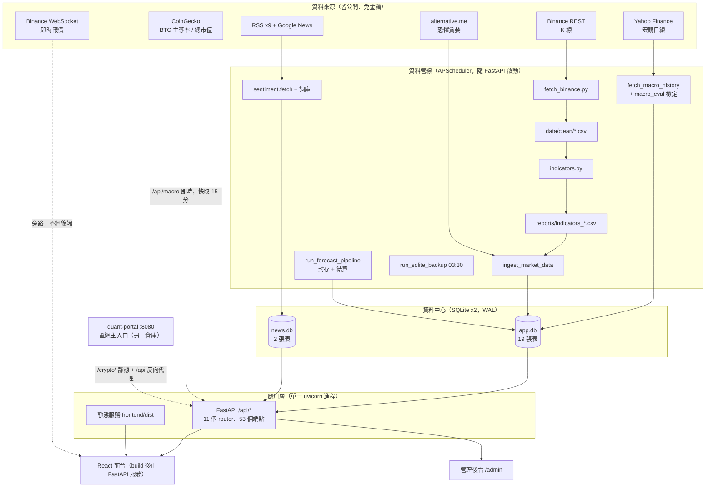

圖：架構總覽——資料管線落地 SQLite，前後台一律讀資料庫；即時報價與宏觀即時面板走旁路

一句話：一台機器、一個 uvicorn 進程，前後端同吃區網位址 `10.201.7.12:8000`；排程隨服務啟動；CSV 是抓取／計算的中繼與備援，前後台一律讀 SQLite。區網主入口是另一倉庫 quant-portal 的 `:8080`（加密／台股切換器），其 `/crypto/` 是本前端另外建置的一份靜態檔，`/api` 反向代理到本後端。

> 現況註記（2026-09-02）：沒有訊息佇列、沒有獨立 worker 進程、沒有反向代理（`:8000` 直接由 uvicorn 服務）；對外公開時才手動開 Cloudflare Quick Tunnel（網址每次重啟會變，named tunnel 為待辦 #165）。

## 2. 技術選型與理由

| 層 | 選型 | 理由 |
|---|---|---|
| 資料管線與研究 | Python 3.12＋pandas＋numpy | 指標、回測、統計檢定、bootstrap 都是表格與時間序列運算，Python 生態最成熟；排程、後端與研究腳本同一語言 |
| 後端 | FastAPI＋Uvicorn＋APScheduler | 型別驗證與自動 OpenAPI；排程隨 app 啟動，一個進程搞定；單機負載小 |
| 資料庫 | SQLite ×2（WAL 模式） | 零設定、單一檔案、ACID；資料量萬～百萬列綽綽有餘；WAL 讀寫不互鎖；線上備份 API 可做一致快照 |
| 前端 | React 19＋Vite 8＋lightweight-charts＋recharts | 互動蠟燭圖與多指標面板；build 後純靜態檔由 FastAPI 服務，免另起 Node 服務 |
| 即時報價 | 前端直連 Binance WebSocket | 秒級跳動而不加後端負載；後端只管「已收盤」資料 |
| AI | 規則引擎（純 Python）＋OpenAI 相容 API（選配） | 規則引擎零成本永遠可用；GPT 只吃規則引擎整理好的結構化事實，被本地數據錨定 |
| 部署 | Windows Task Scheduler＋看門狗批次檔；macOS launchd | 現有主機是 Windows Server；不引入容器與服務框架 |
| 文件 | Markdown → python-docx → Word（mermaid 由 mermaid-cli 渲染） | 版控友善的來源＋主管可讀的 Word 交付 |

選型原則：單一語言（Python 同時吃排程、後端、研究）、單一檔案資料庫、單一進程——把維運面積壓到最小，這是單人專案能長期活下去的關鍵。

## 3. 後端模組切分（對應 backend/ 與 src/）

| 模組 | 位置 | 職責 |
|---|---|---|
| 入口 | `backend/main.py` | 掛 11 個 router（前綴 `/api`）、安全標頭、存取紀錄 middleware、服務 `frontend/dist`、啟動安全檢查 |
| 排程 | `backend/scheduler.py` | 四個排程：每日 09:00 管線、每小時 :06 時線、每 30 分新聞、每日 03:30 備份；核心步驟失敗整個 job 標 failed |
| 路由 | `backend/routers/`（11 支） | meta、prices、indicators、signals、backtest、forecast、correlation、sentiment、ai、macro、admin |
| 資料存取 | `backend/services/app_db.py`、`news_store.py` | `app.db` 19 張表與 `news.db` 2 張表的建立與存取；append-only 觸發器 |
| 讀取層 | `backend/services/reader.py` | 前台多週期查詢、資料版本心跳、停用幣自動隱藏 |
| 訊號 | `backend/services/signal_engine.py`＋`src/scoring.py` | 六因子計分單一真相；前台建議與回測同一把尺 |
| 回測 | `backend/services/backtest_engine.py`＋`src/backtest.py` | 無前視回測、績效指標、隨機進場對照、LRU 參數快取 |
| 研究預測 | `src/forecasting.py`、`forecast_evaluation.py`、`backend/services/forecast_scorecard.py` | 內容定址預測、拒答、結算、point-in-time 成績單與發布閘門 |
| 動量策略 | `src/momentum_signal.py` | 防禦型跨幣動量今日建議與績效（後台「現況」） |
| 宏觀 | `backend/services/macro.py`＋`src/macro_regime.py`、`macro_eval.py` | 即時面板與歷史檢定共用同一套凍結規則 |
| 情緒 | `backend/routers/sentiment.py`＋`news_store.py` | RSS 抓取、中英詞庫判讀、幣種標記、每日彙總、恐懼貪婪 |
| AI | `backend/services/ai_analyst.py`、`canned_qa.py`、`coin_facts.py` | 規則引擎、GPT（固定提示詞）、交叉檢核、固定問答庫、幣種知識庫 |
| 安全 | `backend/services/security_hardening.py`、`rate_limiter.py` | 啟動 fail-closed 檢查、安全標頭、登入鎖定、11 組限流 |
| 備份 | `backend/services/sqlite_backup.py` | 線上備份 API、quick_check、原子發布、保留 14 份 |
| 驗證 | `src/verify_backtest.py`、`verify_indicators.py`、`signal_eval.py` | 回測驗證器、指標交叉驗證、訊號成績單 |
| 研究血脈 | `src/cross_sectional*.py`、`signal_scorecard.py`、`signal_experiments.py`、`macro_longrun.py` | 唯讀研究腳本；是線上模組的驗證來源，清理時勿刪 |

> 現況註記（2026-09-02）：`src/` 不是 Python package（無 `__init__.py`），各模組以雙路徑匯入，直接執行與被後端 import 皆可。前端 `CoinSidebar.jsx`、`MarketOverview.jsx` 已無任何 import（改版遺留的死碼），待清理（#161）。

## 4. 資料管線（細節見第 04 章）

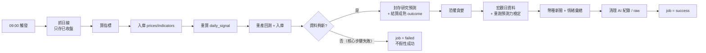

圖：每日管線步驟與失敗防線——核心行情步驟任一失敗整個 job 標 failed；附屬步驟失敗只記警告

失敗語意：核心行情步驟（抓日線→算指標→入庫→重算訊號→新鮮度檢查）任一失敗，整個 job 標 `failed`；回測報表、恐懼貪婪、宏觀、幣種新聞、清理屬附屬步驟，失敗只記錄警告；研究預測另立獨立的 `forecast_pipeline` job 記錄成敗。

## 5. 訊號與研究引擎設計

### 5.1 六因子計分（單一真相）

`src/scoring.py` 是純函式、零外部相依；前台建議（`signal_engine.py`）與回測（`backtest.py`）共用同一份，確保「畫面上的建議」與「被回測驗證的策略」是同一把尺。以 50 分為中立基準加總各因子分數，夾在 0–100：

| 因子 | 分數規則 |
|---|---|
| RSI 動量 | `<30` +20、`<35` +12、`<45` +5；`>70` −20、`>65` −12、`>55` −5 |
| MACD | 黃金交叉 +18、死亡交叉 −18；動能增強 +10、動能減弱 −10 |
| 均線排列 | 多頭排列（`close>MA20>MA60`）+15、僅站上 MA20 +5；空頭排列 −15、僅跌破 MA20 −5 |
| 長期趨勢 MA200 | 站上 +10、跌破 −10 |
| 成交量 | 量比 `>1.5x` +7、`>1.1x` +4；`<0.6x` −7、`<0.9x` −4 |
| 布林通道 | 跌破下軌 +12、`<20%` +7、`<40%` +3；突破上軌 −12、`>80%` −7、`>60%` −3 |
| 新聞情緒（第 7 因子，選用） | `≥+40` +8、`≥+15` +4、`≤−40` −8、`≤−15` −4；線上以 `news_scoring=False` 只顯示方向、得分固定 0 |

行動判定：分數 `≥65` 為 BULL、`≤35` 為 BEAR、其餘 NEUTRAL。

> 現況註記（2026-09-02）：此分數經 forward 檢驗無預測力（第 11 章），前台標示為教學用途；改動計分必須重跑 `verify_backtest.py`、`verify_indicators.py` 並重產回測報表，後台成績單快取鍵含 `scoring.py` 的 mtime 會自動重算。

### 5.2 回測成交規則（無前視）

`signals[t]` 需第 `t` 根收盤才可知，故一律延到 `t+1` 根開盤成交：進場為訊號首次轉 BULL → `open[t+1]` 買入；訊號出場為首次轉 BEAR → `open[t+1]` 賣出。停損／停利視為預掛單，含進場當根盤中觸價即成交；同一根出場優先序：開盤訊號出場 → 盤中停損 → 盤中停利（同根皆觸及取保守先停損）。成本 `fee_rate=0.001`（單邊 0.1%）、`slippage_rate=0.0005`；預設 `stop_loss=−0.06`、`take_profit=0.20`；全額單一持倉、不重疊、不加槓桿、逐筆複利。指標另附買入持有對照（報酬、回撤、Sharpe）、曝險占比、每筆報酬 t 統計量與「隨機進場」蒙地卡羅百分位（約 50 表示選時無異於隨機）。

### 5.3 研究預測（內容定址、可拒答）

`src/forecasting.py` 對每幣、每個天期（1／5／10 日）以「同 regime 的歷史 h 日報酬」為經驗分布：regime 由 `close vs MA60` 與近 20 日報酬定 bull／bear／sideways；不足 `MIN_OUTCOMES=30` 筆退回全歷史並標記 fallback。上漲機率用 Laplace 平滑 `(k+1)/(n+2)`；分位取 q10／q50／q90。輸入的完成日線做 SHA-256 內容定址，`forecast_id = "fc_" + sha256(版本|幣|天期|as_of|input_hash)[:24]`，同輸入必得同 id；快照與結果分開 append-only 封存，資料庫層觸發器禁止 UPDATE／DELETE。拒答閘門（任一成立即 `abstain`）：資料過期 `>2` 天、方向優勢 `|p_up−0.5|<0.07`、信心 `<40`、區間 `q90−q10>35` 個百分點。詳細契約見第 13 章。

### 5.4 防禦型跨幣動量策略

`src/momentum_signal.py`：動量回看 `L=30` 日；持股 top-5 等權；每 `R=10` 根換倉；僅在 `BTC 收盤 > 100 日均線` 時進場，否則全現金；波動估計 20 日、年化 √365，曝險 `= min(1, 0.30 / 籃子年化波動)`；交易成本 0.15%／單位換手；暖身 200 根；60/40 切樣本內／外。即時建議與歷史回測刻意共用同一份換倉行事曆與目標權重函式，所以後台「現況」頁描述的就是產生那份績效的策略。可投資宇宙為 `data/clean/*_1d.csv` 全部檔案（16 支，含已下市 MATIC 的歷史）。

### 5.5 宏觀環境規則（門檻凍結）

`src/macro_regime.py` 零 I/O 純函式，即時面板（`services/macro.py`）、歷史檢定（`macro_eval.py`）與前台三邊共用：DXY 5 日變動 `>+0.5%` 逆風／`<−0.5%` 順風；VIX 水位 `≥25` 逆風／`≤16` 順風；US10Y 5 日變動 `>+2%` 逆風／`<−2%` 順風；SPX 5 日變動 `<−1%` 逆風／`>+1%` 順風；黃金一律中立只參考。`net = 順風數 − 逆風數`，`≥2` RISK_ON、`≤−2` RISK_OFF、其餘 NEUTRAL；四個驅動因子齊備才表態，缺值只 `ffill(limit=5)`。門檻訂於檢定之前，禁止依 `macro_eval` 結果回頭調整——回調即從「事先規則的檢定」退化為「事後配適」。

## 6. 部署方案

### 6.1 Windows Server（目前實際運行的內網部署）

開機 → Task Scheduler 工作 `CryptoQuantBackend` → `cmd /c start_backend.cmd`（看門狗迴圈：uvicorn 掛了等 30 秒自動重起）→ `.venv\Scripts\python.exe -m uvicorn backend.main:app --host 10.201.7.12 --port 8000`。同一進程內：FastAPI `/api/*`、靜態服務 `frontend/dist`、APScheduler 四個排程。密鑰由 `secrets.local.cmd`（gitignored）在啟動時 `call` 載入；日誌 `logs\backend.log`。啟動器固定 `CRYPTO_QUANT_MODE=external`、`CRYPTO_QUANT_BIND_HOST=10.201.7.12` 並清空 proxy 環境變數。同機另有兩套服務：quant-portal 區網主入口 `:8080`（排程工作 `Portal-LAN-Web`）與台股平台 `:8011`／`:5188`，維運時勿誤殺。

### 6.2 macOS／Linux

`./setup.sh`（建 `.venv`、裝相依、`npm ci`、build 前端、產生 `secrets.local.sh` 並隨機化 `ADMIN_SECRET`）→ `./start_backend.sh`（同款 30 秒看門狗；`--once` 前景執行看啟動錯誤）；開機自啟用 `scripts/com.cryptoquant.backend.plist`（launchd，`KeepAlive=true` 即 launchd 版看門狗）。注意 LaunchAgent 在使用者登入後才啟動，筆電闔蓋睡眠時排程不跑、醒來後接續下一個排程點、錯過那次不補跑；排程用系統本地時區，設計基準為台灣時間。

### 6.3 環境規劃

| 環境 | 服務與埠 | 說明 |
|---|---|---|
| 本機開發 | API `127.0.0.1:8001`（`--reload`）、Vite `5174`（proxy `/api` → 8001） | `cd frontend && npm run start` 一次起兩個；fallback 帳密須明示 `CRYPTO_QUANT_MODE=development`、loopback bind 與 `ALLOW_INSECURE_ADMIN_DEFAULTS=1` |
| 正式（本站） | `10.201.7.12:8000` | 看門狗迴圈，無 `--reload`；改後端要重啟工作、改前端要 `npm run build` |
| 區網主入口 | `10.201.7.12:8080`（quant-portal） | `/crypto/` 為本前端另外建置的一份；改前端要 build 兩次（本站與 portal） |
| 對外（選用） | Cloudflare Quick Tunnel → `:8000` | 手動、非常駐；啟用前必須先換掉預設密碼與密鑰 |

所有設定走環境變數（密鑰檔 `secrets.local.cmd`／`.sh` 不進版控）；對外模式下 `ADMIN_SECRET` 未達 32 字元或為預設值即拒絕啟動，`/docs`、`/redoc`、`/openapi.json` 自動關閉。

## 7. 非功能需求

| 面向 | 要求 | 現況 |
|---|---|---|
| 可用性 | 開機自啟；崩潰 30 秒內自癒；排程錯過不補跑但不重疊 | 達成；`hourly_pipeline` 626 成功／27 失敗（多為 Binance 429 或撕裂 CSV，已修）|
| 資料正確性 | 只存已收盤 K 棒；指標交叉驗證 100%；回測無前視 | 達成，驗證器可重跑 |
| 效能 | 前台首屏一次讀 DB；回測單幣 LRU 64 組；圖表最多 600 點＋極值 | 達成 |
| 安全 | 對外 fail-closed；登入鎖定；11 組限流；安全標頭；寫入端點需登入 | 達成；named tunnel／Access 待辦 |
| 備份 | 每日一致快照、完整性驗證、保留 14 份；搬遷包 | 達成；異地推送待辦 #178 |
| 可維護性 | 設定集中 `app_config`；單一真相計分；驗證腳本；文件單一入口 | 達成 |
| 誠實揭露 | 所有績效數字附聲明；預測可拒答；不顯著就標不顯著 | 達成（貫穿前台文案與本手冊） |

# 03. 資料庫設計

文件版本：v1.0（2026-09-02）｜資料庫：SQLite（Python 內建 `sqlite3`），`data/app.db` 與 `data/news.db`，皆 WAL 模式

> 本文件保存資料模型與核心欄位；實際已部署結構以 `backend/services/app_db.py`、`news_store.py` 的 `CREATE TABLE` 為準；目前完整資料表清單與維運方式見第 10 章 §3。

## 1. ER 總覽

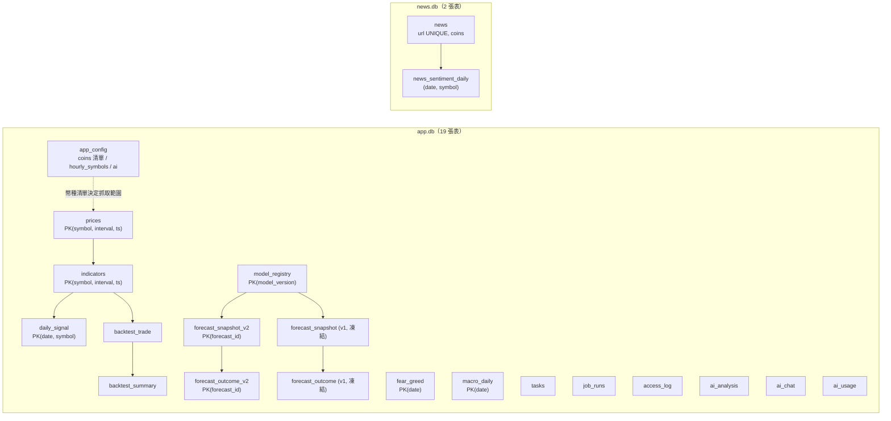

圖：ER 總覽——行情表以（幣、週期、時間）為主鍵；研究預測四張表為 append-only

## 2. 行情主表 prices／indicators

```sql
prices(symbol TEXT, interval TEXT DEFAULT '1d', ts TEXT,
       open REAL, high REAL, low REAL, close REAL, volume REAL,
       PRIMARY KEY (symbol, interval, ts))
indicators(symbol TEXT, interval TEXT DEFAULT '1d', ts TEXT,
           close, ma20, ma60, ma200, rsi, macd, signal, hist,
           bb_upper, bb_lower, vol_ma20,          -- 皆 REAL
           PRIMARY KEY (symbol, interval, ts))
```

### 2.1 多週期主鍵

主鍵是 `(symbol, interval, ts)`：`interval` 為 `'1d'`／`'1h'`，`ts` 是完整時間戳（日線 `2026-06-17 00:00:00`、小時線 `2026-06-17 14:00:00`），同一天的 24 根小時線不會互相覆蓋，1d 與 1h 並存於同一張表。加新週期只需把 `fetch_binance`／`indicators` 的週期參數化、產生 `*_<interval>.csv`、再 `ingest_market_data("<interval>")`。

### 2.2 填入與可重建性

`ingest_market_data(interval)` 從 `data/clean/*_<interval>.csv` 與 `reports/indicators_*_<interval>.csv` 匯入（`INSERT OR REPLACE`，重跑只覆蓋不重複）。兩表皆可由 CSV 或 Binance 重建，遺失不等於永久遺失。2026-09-02 實測各 66,334 列（15 幣日線各 1,888 根＋POL 719 根＋MATIC 歷史 1,167 根＋BTC／ETH 小時線各 19,008 根）。

## 3. 訊號與回測表

```sql
daily_signal(date TEXT, symbol TEXT, signal TEXT, score INTEGER,
             close REAL, rsi REAL, PRIMARY KEY (date, symbol))
backtest_trade(symbol, interval, entry_date, exit_date, entry_price, exit_price,
               entry_trigger_price, exit_trigger_price,
               return_pct, gross_return_pct, cost_pct, hold_days, …)
backtest_summary(symbol, interval, total_trades, win_rate, total_return_pct, cagr_pct,
                 max_drawdown_pct, sharpe_ratio, avg_hold_days, profit_factor,
                 avg_win_pct, avg_loss_pct, …)
```

- `daily_signal`：逐日逐幣的信心分數與多空歷史，由 `backfill_daily_signals()` 用全部歷史指標經 `scoring.score_row()` 重算，供前台畫信心分數走勢（28,304 列）。
- `backtest_trade`／`backtest_summary`：每日排程 `backfill_backtests()` 與 `/api/backtest` 同一套計算，避免靜態報表漂移；前台與後台直接查 DB（1,035 筆交易、15 幣摘要）。

## 4. 情緒與宏觀表

```sql
fear_greed(date TEXT PRIMARY KEY, value INTEGER, label TEXT)
macro_daily(date TEXT PRIMARY KEY, dxy REAL, vix REAL, us10y REAL, spx REAL, gold REAL)
```

- `fear_greed`：自有的恐懼貪婪歷史（可追溯 2018，3,132 列），外部 API 失敗時前台退回讀此表。
- `macro_daily`：美元指數／VIX／美債 10Y／標普／黃金每日收盤（2,536 列）。只存原始值不存判讀，改規則不必重抓；`fetch_macro_history()` 逐欄 upsert，單一序列失敗不影響其他；每日排程回補近 1 年並重跑預測力檢定。

## 5. 研究預測 ledger（append-only）

```sql
model_registry(model_version PK, name, status,
               research INTEGER CHECK (research = 1),   -- 強制只能是研究性質
               methodology_json, created_at)
forecast_snapshot_v2(forecast_id PK, symbol, horizon_days CHECK IN (1,5,10),
                     as_of, generated_at, model_version,
                     input_hash, data_version, reference_close,
                     status, payload_json, created_at,
                     UNIQUE (symbol, horizon_days, as_of, model_version, input_hash))
forecast_outcome_v2(forecast_id PK, target_as_of, resolved_at,
                    realized_return_pct, actual_direction, payload_json, created_at)
forecast_snapshot / forecast_outcome   -- v1 舊版，各 90 列，已凍結不再新增
```

建表時對 `model_registry` 與四張 forecast 表都掛了 `BEFORE UPDATE`／`BEFORE DELETE` 觸發器，任何 UPDATE／DELETE 直接 ABORT——不可變是資料庫層的性質，不只是 Python 端的約定。歷史 K 線被修訂時只會依新的 `input_hash` 另存新快照，舊預測永遠留底。2026-09-02 實測：`model_registry` 2 版（`historical-baseline-v1`／`v2`，皆 `research`）、v2 快照 1,623 列（`as_of` 2026-07-20～2026-09-01，15 幣）、v2 結果 1,383 列。

## 6. AI 表

```sql
ai_analysis(cache_key PK, symbol, generated_at, json)
ai_chat(id PK, ts, symbol, question, answer, source, model)   -- source = gpt/local/error
ai_usage(id PK, ts, kind, model, prompt_tokens, completion_tokens, ok, error)  -- kind = analysis/ask/test
```

分析快取持久化（重啟不失效，`cleanup_ai()` 清過期）；問答歷史保留 90 天；GPT 用量與成敗供後台「AI 設定」統計。三張表皆可捨棄。

## 7. 系統與管理表

```sql
app_config(key TEXT PRIMARY KEY, value_json TEXT, updated_at TEXT)
tasks(id PK, title, detail, notes, status, phase, planned_date, done_date,
      sort_order, created_at, updated_at)   -- status: planned / in_progress / done
job_runs(id PK, job_type, status, started_at, finished_at, message)
access_log(id PK, ts, path, symbol, status_code, latency_ms)
```

- `app_config`：集中設定，目前只有 `coins`（15 幣清單，單一真相來源，2026-07-24 更新）；`hourly_symbols`、`ai`（含金鑰）可存在但目前未設定。
- `tasks`：後台「工作項目」，全專案進度的單一真相（183 列：done 137、in_progress 2、planned 44）；`notes` 寫交接說明。
- `job_runs`：每次排程／手動操作的成功失敗與時間（1,742 列），後台監控頁顯示；另有 2 筆 `news_fetch` 停在 `running` 的殭屍紀錄（行程被砍），後台已改用排程模組的鎖判定執行狀態，不再被誤擋。
- `access_log`：只記 `/api/*` 的路徑、幣種、狀態碼、耗時（14,669 列），不記個資；後台「使用分析」圖表待補。

## 8. news.db

```sql
news(id PK, url TEXT UNIQUE, title, domain, category, sentiment,
     published_at, fetched_at, coins TEXT, summary TEXT)
     -- 索引 idx_published / idx_category / idx_fetched
news_sentiment_daily(date, symbol, score, n_total, n_bull, n_bear, top_json, updated_at)
```

- `news`：URL 唯一防重複；`coins` 為整字比對算出的幣種標記（逗號分隔 ticker），是幣種過濾的唯一依據；`summary` 為 RSS 摘要純文字（2026-08-12 加入，納入幣種比對、不參與情緒判讀）。15,359 列、747 個網域（`GN:` 前綴為 Google News 聚合帶進的第三方媒體）。
- `news_sentiment_daily`：每日 × 每幣（或 `MARKET`）情緒分數 −100～+100（1,141 列，2025-01-01 起），30 分排程滾動更新今日、幣種級每日回補。

## 9. 資料生命週期與容量

| 資料 | 進來 | 可否重建 | 清理／保留 |
|---|---|---|---|
| `prices`／`indicators`／`daily_signal` | 每日與每小時排程 | 可（CSV 或 Binance 重跑） | 永久保留 |
| `backtest_*` | 每日排程重產 | 可 | 每次覆蓋 |
| `fear_greed`／`macro_daily` | 每日排程 | 可（外部 API 回補） | 永久保留 |
| `forecast_*`／`model_registry` | 每日 forecast pipeline | 不可（append-only，重跑只生新快照） | 永久保留，靠每日備份保全 |
| `tasks` | 後台人工維護 | 不可 | 永久保留 |
| `news`／`news_sentiment_daily` | 每 30 分與每日排程 | 部分（RSS 只有近期，歷史回補靠 HackerNews） | 永久保留 |
| `ai_analysis`／`ai_chat`／`ai_usage` | 使用時 | 可捨棄 | 快取 15 分過期、7 天清除；對話與用量保留 90 天（`cleanup_ai()`） |
| `access_log`／`job_runs` | 每次請求／排程 | 可捨棄 | 各保留 30 天（`cleanup_logs()`，每日管線步驟 13） |
| `data/raw/*.json` | 抓取原始檔 | 可 | 每日排程保留 7 天後清除 |
| `data/backups/sqlite/` | 每日 03:30 | — | 每庫保留 14 份（28 檔約 645 MB） |

容量評估：日線每年約 1.1 萬列、5 年約 17 MB；小時線每年約 26 萬列、5 年約 210 MB，SQLite 仍輕鬆；分鐘線每年約 1,600 萬列、5 年約 12 GB，屆時該換 PostgreSQL。2026-09-02 實測 `app.db` 37.7 MB（另 WAL 14.5 MB）、`news.db` 10.3 MB。
# 04. 行情抓取、指標與訊號流程

文件版本：v1.0（2026-09-02）

> 文件定位：保存行情合法取得、抓取、指標計算、訊號與入庫的流程基準；實際支援欄位、參數與操作指令以程式（`src/fetch_binance.py`、`src/indicators.py`、`backend/scheduler.py`）及第 10 章為準。

## 1. 資料的合法取得方式（前提）

| 資料 | 來源 | 取得方式 | 條件 |
|---|---|---|---|
| K 線（日線／小時線） | Binance Spot 公開 REST API `klines` | 免金鑰、免登入，單次上限 1,000 根，分段抓取 | 遇 HTTP 429 依 `Retry-After` 等待重試（最多 5 次）；每幣間隔 5 秒 |
| 即時報價 | Binance 公開 WebSocket | 前端直連，不經後端 | 只顯示、不落地 |
| 恐懼貪婪指數 | alternative.me 公開 API | 每日排程；外部失敗退回讀自有歷史表 | 免金鑰 |
| 宏觀日線 | Yahoo Finance 公開歷史行情 | 每日回補近 1 年，逐欄 upsert | 免金鑰；面板每格標示標的代號與該筆收盤日 |
| BTC 主導率／總市值 | CoinGecko Global API | 即時面板打一次，快取 15 分鐘 | 免金鑰 |
| 新聞 | 9 家 RSS＋Google News 聚合 | 每 30 分鐘抓標題（只搬運不創作，每則帶原始網址） | Google News 商用授權待公司判斷（#156） |

### 為什麼不做交易所帳號自動化？

本系統只分析、不交易：不需要 API 金鑰、不登入任何帳號、不觸碰真實資金，因此沒有帳號停權與資金安全的風險面；所有來源皆為公開端點，接手者不需要向任何供應商申請憑證即可重建全部資料。

## 2. 支援的資料週期與幣種

| 週期 | 幣種 | 歷史深度 | 排程 |
|---|---|---|---|
| 日線 `1d` | `app_config.coins` 的 15 幣（BTC、ETH、SOL、BNB、XRP、DOGE、LINK、ADA、AVAX、DOT、ATOM、POL、UNI、LTC、NEAR） | 預設回補 1,825 天（約 5 年，2021-07 起；POL 自 2024-09 起） | 每日 09:00（台灣） |
| 小時線 `1h` | BTC、ETH（清單在 `app_config.hourly_symbols`，未設定時預設兩幣） | 預設回補 730 天 | 每小時 :06 |

`MATICUSDT` 的日線停在 2024-09-10（Polygon 已遷移為 POL），不在啟用清單，前台 reader 自動隱藏；其 `data/clean` 與 `reports` 檔案為歷史殘留，回測幣池因此實為 16 檔。新增一顆幣只需後台「幣種管理」→ 新增（會實際抓 Binance 資料入庫、即時生效），不必改程式。

## 3. 管線（Pipeline）

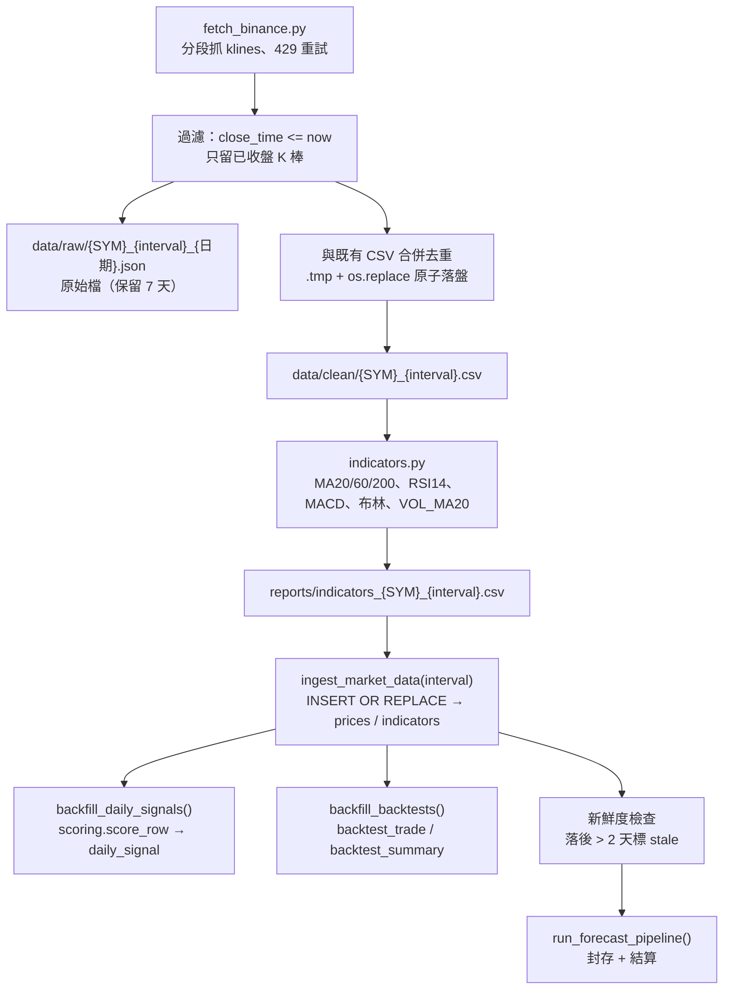

圖：行情管線——抓取、過濾未收盤、原子落盤、指標、入庫、訊號與回測，新鮮度檢查後才進研究預測

| 步驟 | 程式 | 說明 | 失敗語意 |
|---|---|---|---|
| ① 抓 K 線 | `src/fetch_binance.py SYM --interval 1d` | 以既有 CSV 最後一根時間增量續抓；檔案損毀則整段重抓 | 核心，任一幣失敗整個 job failed |
| ② 只存已收盤 | 同上 `fetch_history` | 只保留 `close_time <= now`，進行中的半根一律丟棄 | 鐵律 |
| ③ 原子落盤 | `save_clean` | 先寫 `.csv.tmp` 再 `os.replace()`；2026-08-04 修復「撕裂 CSV 癱瘓管線 6 天」後加入 | 核心 |
| ④ 算指標 | `src/indicators.py SYM --no-plot` | 純 pandas，只用收盤價與成交量；RSI 用 Wilder `alpha=1/14`，布林 20 期 ±2σ（`ddof=0`） | 核心 |
| ⑤ 入庫 | `app_db.ingest_market_data(interval)` | 重跑只覆蓋不重複 | 核心 |
| ⑥ 重算訊號 | `backfill_daily_signals()` | 全歷史經 `score_row` 重算 | 核心 |
| ⑦ 重產回測 | `backfill_backtests()`／`regenerate_reports()` | 與 `/api/backtest` 同一套計算 | 附屬，失敗只警告 |
| ⑧ 新鮮度檢查 | `scheduler` | 各幣最後日期落後 > 2 天標 `stale`，後台標紅 | 核心 |
| ⑨ 研究預測 | `run_forecast_pipeline()` | 封存當日快照、結算成熟 outcome、即時算成績單摘要 | 獨立 job `forecast_pipeline` |
| ⑩ 附屬 | 恐懼貪婪、宏觀回補＋檢定、幣種新聞＋情緒、清理 | 失敗只記警告 | 附屬 |

## 4. 欄位對應表（Binance klines → CSV → 資料表）

| Binance klines 欄位 | CSV 欄位 | 資料表欄位 | 處理 |
|---|---|---|---|
| `open_time`（ms） | `date`（UTC） | `ts`（日線 `YYYY-MM-DD 00:00:00`；小時線到小時） | 轉 UTC 時間戳 |
| `open`／`high`／`low`／`close` | 同名 | 同名 | 轉 float |
| `volume` | `volume` | `volume` | 轉 float |
| `close_time` | —（過濾用） | — | `> now` 的 K 棒丟棄 |
| 其餘（quote volume、trades、taker…） | 不保留 | — | 只留 OHLCV 六欄 |
| — | — | `indicators.*`（ma20、ma60、ma200、rsi、macd、signal、hist、bb_upper、bb_lower、vol_ma20） | 由 `indicators.py` 計算 |

前端另以純函式即時計算 KDJ、DMI、BIAS、ATR、OBV 與可自訂週期的均線（`frontend/src/lib/indicators.js`），並以 `scripts/verify_frontend_indicators.py` 用 pandas_ta 逐點比對。

## 5. 增量抓取與去重

- 增量：`last_saved_ms()` 讀既有 clean CSV 最後一根時間做起點；找不到或損毀回 `None` 即整段重抓。
- 去重：`merge_with_existing()` 新舊資料以 `date` 去重（新值為準）後升冪合併；DB 端主鍵 `(symbol, interval, ts)` 加 `INSERT OR REPLACE` 保證重跑冪等。
- 新聞：`url` 唯一鍵；另以近 7 日標題正規化去重。
- 研究預測：同 `(symbol, horizon, as_of, model_version)` 若歷史 K 線被修訂產生新 `input_hash`，另存新快照，成績單只採 `created_at` 最早的第一個實際發布版本，其餘列入 `revisions_excluded`。

## 6. 只存已收盤 K 棒與新鮮度防線

| | 修復前（2026-07-02 前） | 修復後 |
|---|---|---|
| 未收盤 K 棒入庫 | 會（02:22 就存入 02:00 開盤、03:00 才收盤的棒） | 永不（抓取端以 `close_time` 過濾） |
| 尾端成交量失真 | 半棒量 93 vs 正常約 600（低估 85%），污染 RSI／MACD／量比 | 尾端永遠是完整 K 棒 |
| 排程假性成功 | 2026-06-30 前子行程 env 被清空致 DNS 失敗卻標成功 | 每步檢查結束碼，核心步驟失敗整個 job failed |
| 撕裂 CSV | 2026-08-04 前並發寫入可能留下半行，日線與時線管線癱瘓 6 天 | 原子落盤；手動與排程管線互斥（同型 job 執行中回 409） |
| 新鮮度 | 無 | 落後 > 2 天標 `stale`；前台 `/api/status` 的 `data_version` 讓前端只在有新資料時重拉 |

## 7. GPT／ML 輔助（選配，目前未啟用）

現行管線完全不經 GPT 或機器學習。已規劃但未啟用的三條加值路徑：GPT 新聞批次情緒標註（治詞庫版 neutral 占比偏高，#77）、GPT 深度解讀（附錄 A，金鑰未設）、ML 訊號（LightGBM，第 12 章 D5）。三者都設計成「加在既有管線之後、失敗即降級」，不會讓核心行情步驟依賴外部 AI 服務。

## 8. 手動操作流程（現行介面）

- 後台「監控」頁按鈕：重新匯入行情（`POST /api/admin/ingest`，3 次／時）、一鍵跑 `daily`／`hourly`／`news` 管線（`POST /api/admin/ops/run/{job}`，背景執行、同型 job 執行中回 409）。
- 指令列（專案根目錄，Windows 用 `.venv\Scripts\python.exe`）：

```powershell
python src\fetch_binance.py BTCUSDT --interval 1h        # 抓 K 線（增量）
python src\indicators.py BTCUSDT --interval 1h --no-plot  # 算指標
python -c "from backend.scheduler import run_pipeline; run_pipeline()"   # 等價於每日排程
python -c "from backend.scheduler import run_forecast_pipeline; print(run_forecast_pipeline())"
```

- 冷啟動（沒有搬遷包）：排程不會在啟動時補跑，第一批資料要等下一個排程點；想立刻有資料先手動跑上面兩支腳本再入庫。

## 9. 管線品質保證

| 工具 | 檢什麼 | 何時跑 |
|---|---|---|
| `python src\verify_indicators.py 1d` | 用獨立演算法逐點重算 MA／RSI／MACD／布林／量均比對；RSI 絕對容差 0.05、其餘相對 1e-3；跳過前 250 列暖身 | 改指標計算後；後台 `/api/admin/verify/indicators` 同源，前台信任徽章 |
| `python src\verify_backtest.py [SYMBOL]` | 十組檢查：檔案完整、進出場價 > 0、無重疊倉位、手算勝率與總報酬差 < 0.1%、進場價＝當日原始開盤價、停損停利方向、出場筆數相加、訊號時序無前視 | 改訊號／回測後必跑 |
| `python src\validate.py [SYMBOL]` | 缺天、重複、時間序、OHLC 邏輯、空值 | 懷疑資料有問題時 |
| `python src\cross_check.py` | Binance vs CoinGecko 近 360 天價格差異（> 2% 列出） | 懷疑抓錯幣、單位或日期錯位時 |
| `python scripts\verify_frontend_indicators.py` | 前端 KDJ／DMI／BIAS／SMA／EMA 與 pandas_ta 逐點比對 | 改前端指標後 |
| `pytest tests -q` | 141 項：API 煙霧、回測快取、預測契約、校準、評估指標、排程、限流、安全、備份、reader 日期區間 | 改後端後 |

# 05. API 規格書

文件版本：v1.0（2026-09-02）｜Base path：`/api`；共 53 個端點（30 個公開、23 個需登入）。實作後以 FastAPI 自動生成的 OpenAPI（開發模式 `/docs`；對外模式自動關閉）為準；本文件定義端點框架與慣例。

## 1. 通用規格

| 項目 | 規格 |
|---|---|
| Base path | 所有端點掛在 `/api` 之下（`main.py` 以 `prefix="/api"` 掛載 11 個 router），例 `GET /api/prices/BTCUSDT` |
| 權限 | 公開（免驗證）／需登入（帶 `Authorization: Bearer <token>`，token 由 `POST /api/admin/login` 取得，HMAC-SHA256 簽章、8 小時有效） |
| 幣種代號 | path 的 `{symbol}` 大小寫皆可（後端轉大寫）；多數接受 `BTC` 或 `BTCUSDT` |
| 共用查詢參數 | `days`（往回天數）、`start`／`end`（`YYYY-MM-DD`，閉區間）、`interval`（`1d` 預設／`1h`，僅 BTC、ETH 有 1h） |
| 錯誤格式 | FastAPI 標準 `{"detail": "訊息"}`：400 參數錯誤、401 未登入／逾時、404 不存在、409 衝突（同型排程執行中；預測快照併發寫入）、422 驗證失敗（`horizon` 只接受 1／5／10）、429 超過限流（一律含 `Retry-After`）、502 上游失敗 |
| 快取 | 恐懼貪婪 1 小時、新聞 30 分、宏觀 15 分、AI 分析 15 分、`/forecast/ledger-status` 600 秒；指標驗證與成績單以檔案 mtime 為快取鍵 |
| CORS | 只允許 `localhost:5173`／`5174`、`127.0.0.1:5174`、`localhost:3000`（開發） |
| 安全標頭 | `SecurityHeadersMiddleware`（含 CSP；HTTPS 時補 HSTS 一年） |
| 存取紀錄 | `access_log_middleware` 只記 `/api/*` 的路徑、幣種、狀態碼、耗時 |

限流一覽（皆為每 client 計算，超限回 429＋`Retry-After`）：

| 端點 | 限流 |
|---|---|
| `POST /admin/login` | 5 次／60 秒；另計連續失敗 5 次鎖 15 分鐘 |
| `GET /ai/analysis/{symbol}` | `force=1`：3 次／分・30 次／日；`gpt=1`：20／分・300／日；`gpt=0`：60／分・1000／日 |
| `POST /ai/ask` | 10 次／分・120 次／日 |
| `POST /sentiment/news/backfill` | 2 次／時・10 次／日 |
| `GET /forecast/scorecard` | 12 次／60 秒 |
| `GET /forecast/{symbol}` | 30 次／60 秒 |
| `GET /backtest/{symbol}` | 12 次／60 秒 |
| `POST /admin/ingest` | 3 次／時 |
| `POST /admin/ops/run/{job}` | 每類 job 各 6 次／時 |
| `POST /admin/coins` | 5 次／時 |
| `POST /admin/ai/test` | 5 次／10 分 |

## 2. 認證 Auth

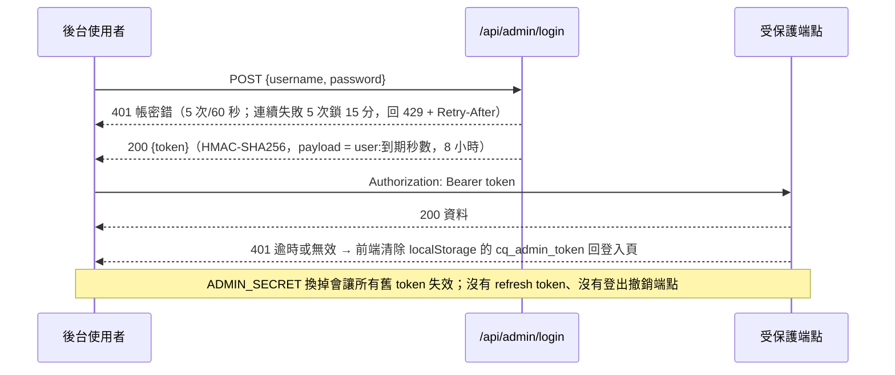

圖：Token 生命週期——一次登入換 8 小時 token；失敗鎖定與密鑰輪替即失效

| 端點 | 權限 | body | 回應 |
|---|---|---|---|
| `POST /admin/login` | 公開 | `{username, password}`（來自環境變數 `ADMIN_USER`／`ADMIN_PASS`，常數時間比對） | `{ok, token, user}`；401 帳密錯；429 超限或鎖定 |

前端把 token 存 `localStorage`（鍵 `cq_admin_token`）；收到 401 自動清除並退回登入頁。對外模式（bind 非 loopback 或 `CRYPTO_QUANT_MODE=external`）啟動時檢查 `ADMIN_SECRET` ≥ 32 字元且非預設、`ADMIN_PASS` ≥ 12 字元，不合即拒絕啟動；唯一例外是明確設定的 legacy `admin123` 會放行但記高風險警告（#166）。

## 3. 中繼 Meta（公開）

| 端點 | 用途 | 回應摘要 |
|---|---|---|
| `GET /symbols` | 啟用中的幣種清單 | `["BTCUSDT", …]` |
| `GET /intervals` | 各週期有資料的幣種 | `{"1d":[…], "1h":["BTCUSDT","ETHUSDT"]}` |
| `GET /status` | 前端自動更新心跳 | `{last_updated, verification:{ok,passed,total}, data_version}`；前端每 60 秒輪詢 `data_version`，變了才重拉 |
| `GET /verify` | 指標交叉驗證完整結果（前台信任徽章彈窗） | `{ok, passed, total, coins:[{symbol, ok, max_err}]}` |

## 4. 行情 Prices／Indicators（公開）

| 端點 | 參數 | 回應摘要 |
|---|---|---|
| `GET /prices/{symbol}` | `days`（1–1825，預設 180）、`start`、`end`、`interval`（預設 1d） | OHLCV 陣列 `[{ts, open, high, low, close, volume}]`；400 interval 不支援；404 該幣無此週期 |
| `GET /indicators/{symbol}` | 同上 | `[{ts, close, ma20, ma60, ma200, rsi, macd, signal, hist, bb_upper, bb_lower, vol_ma20}]` |

## 5. 訊號 Signals（公開）

| 端點 | 參數 | 回應摘要 |
|---|---|---|
| `GET /signals` | — | 所有幣的當前訊號陣列 |
| `GET /signals/{symbol}` | — | `{symbol, signal(BULL/BEAR/NEUTRAL), score, factors…}` |
| `GET /signals/{symbol}/history` | `days`（7–1825，預設 360）、`start`、`end` | 信心分數歷史 `[{date, signal, score, close, rsi}]`（讀 `daily_signal`） |

> 誠實聲明：此六因子分數經檢驗無 forward edge，屬教學性質（第 11 章）。

## 6. 回測 Backtest（公開）

| 端點 | 參數 | 回應摘要 |
|---|---|---|
| `GET /backtest` | — | 所有幣已入庫績效摘要（`/backtest/db/summary` 的有界別名；刻意不冷跑全幣） |
| `GET /backtest/{symbol}` | `stop_loss`（−0.30～−0.01，步進 0.01）、`take_profit`（0.05～1.0）、`fee_rate`（0～0.01，步進 0.0001）、`slippage_rate`（0～0.02） | 單幣即時回測 `{metrics, recent_trades, equity_curve, validation, parameter_sweep…}`；64 組 LRU；圖表最多 600 個等距點加極值，指標仍用完整曲線 |
| `GET /backtest/db/summary` | — | 已入庫績效摘要（依總報酬排序） |
| `GET /backtest/db/{symbol}/trades` | `limit`（0–2000，0=全部） | 已入庫逐筆進出場明細 |

回測不前視：依訊號的動作延到隔根開盤成交（第 02 章 §5.2）。2026-07-21 起 `/backtest` 集合端點改回持久化摘要，避免公開端點資源耗盡。

## 7. 研究預測 Forecast

| 端點 | 權限 | 參數 | 回應摘要 |
|---|---|---|---|
| `GET /forecast/ledger-status` | 公開 | — | ledger 累積狀態（只有彙總數字，不含單筆預測），供前台「統一判斷摘要」第②格；快取 600 秒；失敗且無舊快取回 `{ok:false, error}` |
| `GET /forecast/{symbol}` | 公開 | `horizon`（1、5、10，預設 5） | 不可變研究快照：漲跌機率、q10／q50／q90、下行風險、regime、confidence、證據、拒答原因、`input_hash`、`data_version`、`reference_close`；快取未命中時封存新快照；併發寫入衝突改讀已寫入者，失敗回 409 |
| `GET /forecast/scorecard` | 需登入 | `horizon`（選）、`model_version`、`symbol`、`window`（正整數日）、`include_legacy`（預設 false） | v2 ledger 的 point-in-time 成績單：provenance、樣本數、Brier／BSS、log loss、ECE、F1／Recall／MCC／ROC-AUC／AP、ready coverage、risk–coverage、區間／WIS、block-bootstrap CI 與 promotion gates |

預測只使用已完成 UTC 日線；低信心、資料過期或樣本不足時回 `status=abstain`。此功能為研究基準，不是投資建議或報酬承諾。

### 7.1 成績單 scorecard 規則

未登入回 401；無成熟 outcome 回 HTTP 200＋`status=unverifiable`、`metrics=null`（不把「沒有資料」當 0 分）。正式 promotion gate 必須明確指定單一 `model_version + horizon`，且不得帶 `symbol`／`window` 篩選；aggregate 與 filtered view 只供診斷（`single_model_horizon_scope=not_applicable`）。完整資料契約與方法見第 13 章。

## 8. 情緒 Sentiment

| 端點 | 權限 | 參數 | 回應摘要 |
|---|---|---|---|
| `GET /sentiment/fear_greed` | 公開 | `limit`（預設 30，夾 1–100） | 恐懼貪婪指數（快取 1h）；外部失敗先回舊快取，再退回讀 `fear_greed` 表 |
| `GET /sentiment/fear_greed/history` | 公開 | `days`（預設 365） | 歷史（可追溯 2018） |
| `GET /sentiment/summary` | 公開 | `symbol`（預設 MARKET）、`days`（預設 30，夾 1–120） | 每日新聞情緒分數 −100～+100 |
| `GET /sentiment/news` | 公開 | `symbol`（選）、`limit`（預設 40） | 最新新聞（即時抓 RSS 並入庫）：`{categories, total, symbol, coin_total, fell_back_to_market}`；幣種新聞不足 5 則時退回全市場並標 `fell_back_to_market=true`，每則附 `about_this_coin` |
| `GET /sentiment/news/history` | 公開 | `date`（必填）、`category` | 指定日期歷史新聞（去重） |
| `GET /sentiment/news/dates` | 公開 | — | 有資料的日期清單＋總筆數 |
| `GET /sentiment/sources` | 公開 | — | 實際來源分布 `{rss:[9 家], aggregator, total, domains, top:[{domain, count, via_aggregator}]}`（查 DB 實況，非寫死清單） |
| `POST /sentiment/news/backfill` | 需登入 | `from_date`、`to_date`（query） | 從 HackerNews 回補歷史；全數失敗或非預期例外皆回 502（不假性成功） |

## 9. AI 分析機器人（公開）

| 端點 | 參數 | 回應摘要 |
|---|---|---|
| `GET /ai/analysis/{symbol}` | `gpt`（預設 1；0 只跑規則引擎）、`force`（1 略過快取） | 雙引擎分析 `{local:{…}, gpt:{…}, divergence…}`；404 無此幣 |
| `POST /ai/ask` | body `{question(≤500 字), symbol?, context_symbol?, history?}` | `{answer, source(canned/canned+gpt/local/gpt), symbol, name_zh, detected, guessed}`；命中固定問答附 `intent`；未追蹤幣誠實拒答附 `unsupported`；全站模式 `symbol=null`；自動帶最近 3 輪對話 |
| `GET /ai/config` | — | `{gpt_enabled, model}`（不洩漏金鑰） |

## 10. 宏觀 Macro／相關性 Correlation（公開）

| 端點 | 參數 | 回應摘要 |
|---|---|---|
| `GET /macro` | — | `{ok, as_of, verdict, verdict_zh, tone, net, n_drivers, summary_zh, note_zh, factors:[{key, label_zh, value, impact, impact_zh, note_zh, group}], groups, evidence, linkage, sources}`；`group` 分「判讀依據／加密自身／背景對照」；`evidence` 為歷史預測力檢定、`linkage` 為 BTC 與各序列 60 日滾動相關；免金鑰、快取 15 分 |
| `GET /macro/history` | `days`（預設 365，夾 30–2500） | 逐日環境標籤 `{ok, points:[{date, verdict, net}], counts, labels_zh}` |
| `GET /correlation` | — | 相關性矩陣＋年化波動度 `{symbols, matrix, volatility}`（前台熱圖已暫停掛載） |

## 11. 後台 Admin（除登入外全需登入）

| 群組 | 端點 | 用途 | 備註 |
|---|---|---|---|
| 監控 | `GET /admin/health` | 系統時間、各幣新鮮度（落後 > 2 天 `stale`）、最後一次日線／新聞工作 | |
| 監控 | `GET /admin/db/stats` | 兩個 DB 統計（分類、來源 Top 8、各表列數、檔案大小） | |
| 監控 | `GET /admin/jobs` | 最近 50 筆 `job_runs` | |
| 工作項目 | `GET/POST /admin/tasks`、`PUT/DELETE /admin/tasks/{id}` | 進度單一真相 CRUD | 未給分類／預計日會自動估 |
| 操作 | `POST /admin/ingest` | 手動匯入最新 K 線／指標 | 3 次／時 |
| 操作 | `POST /admin/ops/run/{job}` | 背景跑 `daily`／`hourly`／`news` | 6 次／時；同型執行中回 409 |
| 幣種 | `GET/POST /admin/coins`、`PUT/DELETE /admin/coins/{symbol}` | 清單＋資料狀態；新增會實際抓 Binance；改名／停用即時生效；刪除保留歷史資料 | 新增 5 次／時；設定寫入序列化 |
| 資料庫 | `GET /admin/db/tables`、`GET /admin/db/table/{name}` | 白名單 11 表唯讀瀏覽（`limit` ≤ 500）；不在白名單回 404 | `macro_daily` 與 forecast 各表不在範圍，需直接開 SQLite |
| AI 設定 | `GET/PUT /admin/ai/config`、`POST /admin/ai/test`、`GET /admin/ai/stats` | 金鑰只回遮罩；環境變數優先（`env_locked`）；測試連線 5 次／10 分；用量統計 | |
| 研究 | `GET /admin/verify/indicators` | 指標交叉驗證（`interval`） | 與前台 `/status` 共用快取 |
| 研究 | `GET /admin/signal/scorecard` | 訊號成績單 | 快取鍵含 `scoring.py` mtime |
| 研究 | `GET /admin/strategy` | 防禦型跨幣動量今日建議＋績效 | 來源 `momentum_signal.cached_strategy()` |

> 現況註記（2026-09-02）：訊號增準計畫 Phase A 規劃的公開端點 `GET /api/strategy/today` 尚未建立，動量策略現況僅後台 `/admin/strategy` 可見。加端點的慣例：在 `backend/routers/` 對應檔加 `@router.get/post`；後台端點加 `_: str = Depends(require_admin)`；加完更新本章與 `pytest`。
# 06. 前端頁面與後台規劃

文件版本：v1.0（2026-09-02）｜技術：React 19＋Vite 8＋lightweight-charts＋recharts（前台與 `/admin` 後台為同一個 SPA，`main.jsx` 依路徑 lazy 載入 `AdminApp` 或 `App`）

> 文件定位：保存頁面規格與 UX 原則；元件實際掛載狀態以 `frontend/src/App.jsx` 內註解為準（暫停的元件連同掛載處一併註解，取消註解即可恢復）。

## 1. 資訊架構（Sitemap）

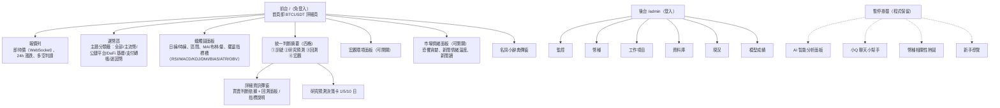

圖：Sitemap——前台單頁、後台六個分頁；四個元件暫停掛載但程式保留

## 2. 角色 × 頁面權限矩陣

| 頁面 | 訪客 | 管理者（登入後台） |
|---|---|---|
| 前台全部（報價、圖表、摘要、預測、情緒、宏觀） | ✔ | ✔ |
| 後台 監控／幣種／工作項目／資料庫／現況／模型成績 | ✖（未登入 401） | ✔ |
| 寫入型 API（回補新聞、觸發管線、改幣種、改 AI 設定） | ✖ | ✔（各有限流） |
| 成績單 `GET /api/forecast/scorecard` | ✖ | ✔ |

權限由後端強制（`require_admin` 依賴），前端只隱藏入口；後台 token 存 `localStorage`，401 即清除。

## 3. 前台頁面規格

### 3.1 報價列與蠟燭圖（首頁＝BTC 詳細頁）

- 公開入口所有非 `/admin` 路徑進前台；不再先顯示市場總覽，直接顯示 BTCUSDT 詳細頁；即使幣種 API 尚未回傳，選幣器仍保留 BTCUSDT 作為穩定 fallback。
- 報價列：Binance WebSocket 即時價與 24h 漲跌（`lib/useLivePrices.js`，前端直連不經後端）；多空判讀與幣價移入圖表標題列（2026-08）。
- 選幣：主題分類籤只篩選下拉選單；目前幣不屬於新分類時自動切到該分類第一個可用幣；切回「全部」保留目前幣。
- 圖表（`CandlestickChart.jsx`，方案 B：主圖＋單一擺盪指標槽）：日線區間 1M／3M／6M／1Y／全部（30／90／180／365／1825 天）；時線 24H／3D／7D／1M／3M（僅 BTC、ETH）；自訂起訖日；MA 週期可自訂；布林、成交量疊層；擺盪指標槽切換 RSI／MACD／KDJ／DMI／BIAS／ATR／OBV；懸停資訊框；放大彈窗（focus trap、Esc）。
- 自動更新：每 60 秒輪詢 `/api/status` 的 `data_version`，變了才重拉；回前景時立即檢查；另有 5 分鐘保險絲全量刷新。

### 3.2 統一判斷摘要與研究預測決策卡

- 統一判斷摘要（`DecisionSummary.jsx`）四格：①六因子訊號（標「教學用途」）②研究預測 ledger 累積狀態（讀 `/forecast/ledger-status`，畫面數字與 `forecast_diagnose.py` 同一組）③回測證據（含買入持有 Sharpe、曝險、每筆報酬 t 統計量）④宏觀環境（標示證據強度）。
- 研究預測決策卡（`ForecastDecisionCard.jsx`）：1／5／10 日切換；顯示上漲機率、q10／q50／q90、下行風險、regime、信心與證據；拒答時顯示原因（資料過期／方向優勢不足／信心不足／區間過寬），不顯示 0% 或空機率；資料載入前以「—」顯示。
- 決策詳情預設收合、圖表上移（2026-08-04）。

### 3.3 買賣判斷依據與回測面板（詳細資訊彈窗）

- 買賣判斷依據（`SignalRulesPanel.jsx`）：進出場規則、六因子即時計分明細表（起始基準 50、逐項加減、合計）、停損停利設定、自訂訊號實驗室（`lib/signalLab.js` 純函式模擬，含均線交叉規則）。
- 回測面板（`BacktestPanel.jsx`）：報酬、勝率、回撤、三基準（買入持有、隨機進場百分位、市場）、參數掃描、資產曲線（含買入持有對照線）、逐筆交易（點列展開完整明細卡，與後台一致）；停損停利可調（`PctInput`）。
- 指標白話卡（`IndicatorCards.jsx`／`IndicatorDetail`）：選擇指標時顯示「怎麼看」。

### 3.4 宏觀環境面板

`MacroPanel.jsx`（lazy）：因子格分「判讀依據（DXY／VIX／US10Y／SPX）／加密自身（BTC 主導率、總市值）／背景對照（黃金、日經、KOSPI、日圓）」；每格標示標的代號與該筆收盤日（可點去 Yahoo 原始頁核對）；證據區顯示事先指定檢定的數字與「不顯著」標示；連動強度（BTC 對標普／美元／VIX／黃金 60 日滾動相關與歷史百分位）；環境時間軸（`/macro/history`）。2026-07-07 首版、2026-07-07 下架、2026-08-10 補十年歷史與檢定後重新上架。

### 3.5 市場情緒面板

`SentimentPanel.jsx`（lazy）：恐懼貪婪錶盤＋歷史；新聞情緒溫度（全市場＋單幣，每日 −100～+100）；新聞牆（分類、來源標示、幣種相關優先、不足 5 則退回全市場並提示）；歷史新聞回補按鈕需後台 token。

### 3.6 暫停掛載的元件

| 元件 | 用途 | 狀態與恢復方式 |
|---|---|---|
| `AIAnalystPanel.jsx` | AI 雙引擎分析（規則引擎＋GPT）與提問 | 2026-07-06 暫停；`App.jsx` 取消 import 與折疊區塊註解即恢復；後端 `/api/ai/*` 照常可用 |
| `BotWidget.jsx`＋`BotMascot.jsx` | 全站漂浮小Q 聊天小幫手（6 種表情動畫） | 2026-07-06 暫停（使用者為主管／老闆）；取消 import 與底部掛載註解 |
| `CorrelationHeatmap.jsx` | 幣種相關性熱圖 | 2026-07-06 暫停；連同 `fetchCorrelation`、`PANELS.correlation` 一併註解 |
| `OnboardingTour.jsx` | 4 步新手導覽 | 2026-07-06 暫停；含 Header 的「導覽」按鈕 |
| `CoinSidebar.jsx`、`MarketOverview.jsx` | 左側幣種選單、市場總覽卡片牆 | 改版後無任何 import（死碼），待清理（#161） |

## 4. 管理後台頁面規格

| 分頁 | 內容 | 資料來源 |
|---|---|---|
| 4.1 監控 | 系統健康與各幣資料新鮮度（落後天數、`stale` 標紅）、最近 50 筆排程／操作紀錄、兩個 DB 統計；按鈕：重新匯入行情、一鍵跑 daily／hourly／news | `/admin/health`、`/admin/jobs`、`/admin/db/stats`、`/admin/ingest`、`/admin/ops/run/{job}` |
| 4.2 幣種 | 清單（中文名、ticker、啟用、筆數、最後日期、落後天數）；新增（實際抓 Binance）、編輯、停用、移除 | `/admin/coins` |
| 4.3 工作項目 | 全專案進度單一真相：篩選 全部／待辦／進行中／完成；新增、編輯（標題、說明、備註、狀態、分類、預計日、完成日、排序）、刪除；視覺化儀表板 | `/admin/tasks` |
| 4.4 資料庫 | 白名單 11 表唯讀瀏覽（欄位篩選、幣種／週期篩選、點列看細節）；每張表附「怎麼來的／怎麼算」說明 | `/admin/db/tables`、`/admin/db/table/{name}` |
| 4.5 現況 | 防禦型跨幣動量策略：今日持倉建議（regime、曝險、picks、執行狀態）、全期與樣本外績效 vs 等權大盤；訊號成績單（forward edge）；指標交叉驗證；指標計算方法面板 | `/admin/strategy`、`/admin/signal/scorecard`、`/admin/verify/indicators` |
| 4.6 模型成績 | 研究預測成績單：model_version／horizon／幣種／時間窗篩選、動態治理判讀階梯、promotion gates、新手導覽與優化路線圖；空樣本顯示「—」不轉 0 | `/forecast/scorecard` |
| （停用）分析 | 「分析（即將推出）」分頁停用（P3：使用分析圖表化，`access_log` 已有資料） | — |

AI 設定（金鑰遮罩、模型、base_url、測試連線、用量）目前以 API 提供（`/admin/ai/*`），後台頁面隨 AI 面板暫停而未突出，金鑰可透過 `PUT /admin/ai/config` 或環境變數設定。

## 5. 系統後台（帳號與權限）

單一管理帳號：`ADMIN_USER`（預設 `admin`）／`ADMIN_PASS` 由 `secrets.local.cmd`／`.sh` 注入，沒有註冊、沒有多角色、沒有忘記密碼流程；改密碼＝改密鑰檔後重啟服務（第 10 章 §7.2）。對外模式 fail-closed 規則見第 08 章 §2。

## 6. 全站 UX 原則

- 誠實優先：無預測力就標教學用途；預測信心不足就拒答；宏觀不顯著就標不顯著；每個數字都能追回原始出處（2026-08-10 全站出處標註）。
- 空狀態與缺值一律顯示「—／樣本不足」，不補 0、不補綠燈、不沿用舊快照。
- 錯誤回饋：API 失敗顯示橫幅並可重試；載入態用骨架，避免點下去空白。
- 自動更新不打擾：有新資料才重拉；回前景立即檢查。
- 手機 RWD：儀表板兩欄、放大彈窗、詳細彈窗在窄螢幕可用；對話框 focus trap 與 Esc。
- 介面繁體中文；分析引擎內部用英文 enum，對外欄位一律加中文 `*_zh`。
- 前端指標純函式且可獨立驗證；圖表最多 600 點＋極值，指標仍用完整曲線。

實際畫面（2026-09-01 擷取自正式站）：

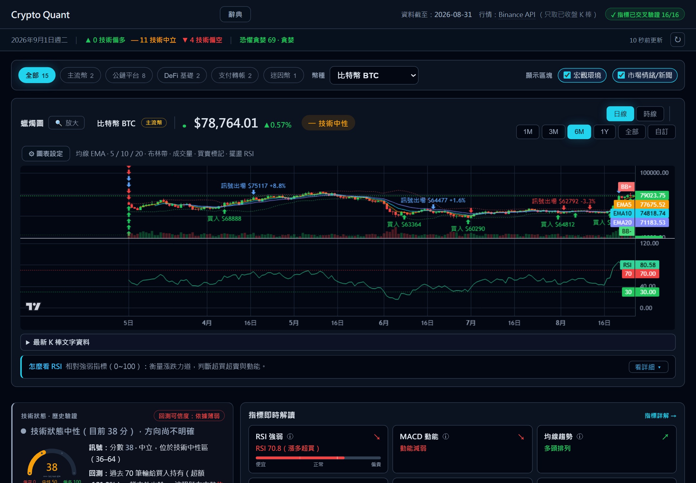

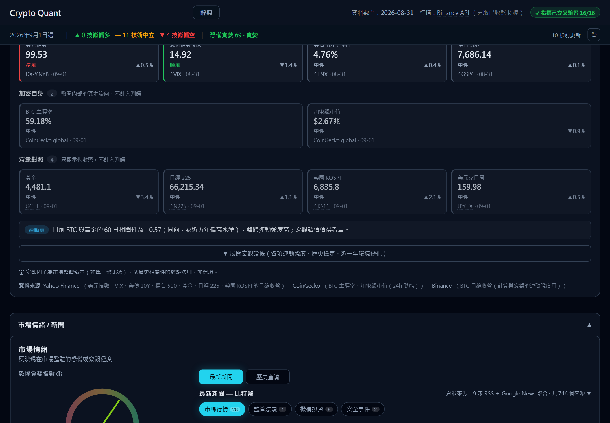

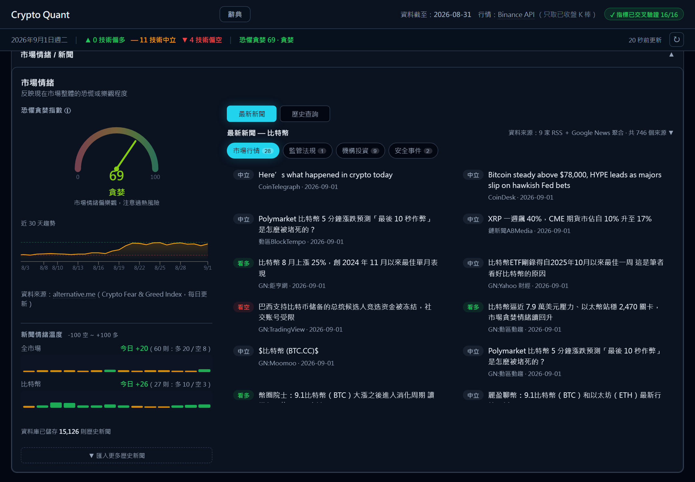

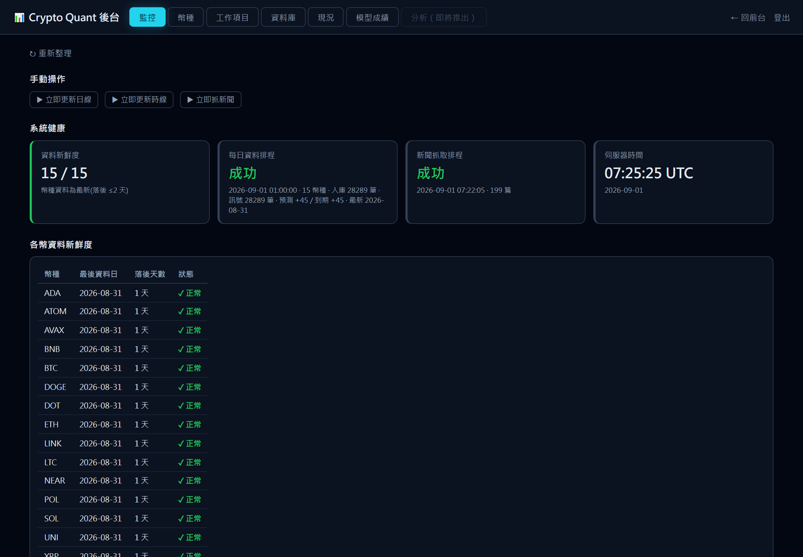

# 07. 開發時程與里程碑

文件版本：v1.0（2026-09-02）｜前提：1 名全端工程師＋AI 輔助開發全職投入，主管 0.1 人力（決策與審閱）；2026-06-17 啟動，2026-09-02 共 121 個 commit、後台工作項目 183 項（完成 137、進行中 2、待辦 44）。

> 主管請先看「主管摘要（Executive Summary）」章：本章是工程細節版（含程式術語與提交依據），交付線依日期新到舊排列——最新現況看 0-F 即可，更早的節次為歷史紀錄；正式對外或投入資金的條件見各表「發布閘門」列。

## 0-F. 2026/09/01 文件總體檢與交接交付線

| 項目 | 狀態 | 依據 |
|---|---|---|
| macOS 支援（`setup.sh`、`start_backend.sh`、launchd plist、跨平台 `dev_api.mjs`） | 🟢 完成 | commit 37293b5、1dc2992 |
| 換機搬遷包（`make_migration_bundle.py`，DB 走線上備份 API） | 🟢 完成 | commit 37293b5 |
| 交接文件總體檢（合集 16 章校正→精簡 9 章；系統規格書初版；Word 主題改版） | 🟢 完成 | commit c8db8ce、f71f464；後台 #192 |
| 本手冊與系統規格書改版為 SDD／交接手冊格式（`docs/src` → `build_docs.py`） | 🟢 完成 | 2026-09-02 |
| 安全強化（#70）：登入鎖定、限流、寫入端點驗證、每日備份 | 🟡 進行中（repo 內階段完成；密碼輪替 #166、named tunnel #165、多進程 #167 待辦） | 後台 #70 |
| 發布閘門（對外公開） | 🔴 未達：需先輪替密碼、申請網域與 named tunnel／Access | 第 08 章 §9 |

## 0-E. 2026/08/10 宏觀面板重新上架交付線

| 項目 | 狀態 | 依據 |
|---|---|---|
| `macro_daily` 補十年歷史；規則核心抽成 `src/macro_regime.py`（門檻凍結） | 🟢 | commit 307a44a、aa1074a、696b097 |
| `macro_eval.py` 事先指定檢定（等權籃子・5 日・順風減逆風 +0.66%、HAC t=0.72，不顯著）；`macro_longrun.py` 8 年複核（+0.29%、t=0.32） | 🟢 | `reports/macro_evidence.json`；後台 #187 |
| 面板加證據強度、BTC 連動強度、每格資料出處與日期；日經／KOSPI／日圓對照 | 🟢 | commit c13683e、13b68cb |
| 回測補買入持有 Sharpe／曝險／每筆報酬 t 統計量並上前台 | 🟢 | 後台 #173、#174 |
| UI 審查修正 17 項（含 2 個誤導顯示） | 🟢 | 後台 #190；commit a47391c |

## 0-D. 2026/08/04 可用性加固交付線

| 項目 | 狀態 | 依據 |
|---|---|---|
| 修復撕裂 CSV 癱瘓日線／時線管線 6 天（原子落盤） | 🟢 | 後台 #170；commit 44d0eb6 |
| 移除 72 小時上限並加自我修復觸發；手動與排程管線互斥（409） | 🟢 | 後台 #171、#168；commit 7662c46 |
| 儀表板版面：圖表上移、決策詳情預設收合 | 🟢 | 後台 #172 |

## 0-C. 2026/07/24 研究預測成績單交付線

| 項目 | 狀態 | 依據 |
|---|---|---|
| 可稽核研究預測（內容定址、append-only 觸發器、拒答）與 quant reliability 加固 | 🟢 | commit 2330242 |
| Forecast Scorecard P0（point-in-time、prequential baseline、block bootstrap、promotion gates） | 🟢 | commit 3b094a1；第 13 章 |
| Platt／Beta 校準 challenger（六組 gate 全 `keep_identity`）、模型指標與參考門檻 | 🟢 | commit 65ee053、8903f3a、f4e5d2f；第 11 章 |
| 後台「模型成績」頁（幣種篩選、動態治理判讀、新手導覽） | 🟢 | 後台 #148、#163；commit 76130d7、6ea1a4e |
| 首頁改 BTC 預設詳細頁；預測 horizon 與狀態統一 | 🟢 | 後台 #147、#154 |
| 發布閘門（研究預測對外宣稱） | 🔴 未達：全數 abstain、`insufficient_evidence`（#191） | 第 13 章 §13 |

## 0-B. 2026/07/06 正式部署與安全修補交付線

| 項目 | 狀態 | 依據 |
|---|---|---|
| 部署服務化：開機自啟＋看門狗、單一實例保證、排程跨進程防重複 | 🟢 | 後台 #64、#44 |
| 後台操作頁、內容管理（幣種）、使用分析 middleware | 🟢 | 後台 #7、#9、#10、#113 |
| 回測賣點前視偏誤修正＋無前視自動驗證；回測入庫；買賣判斷依據面板 | 🟢 | 後台 #131、#132、#106 |
| 寫入端點掛登入保護（新聞回補）；歷史回補假成功修正 | 🟢 | 後台 #117、#118 |
| 前端 lint 門檻、bundle 分割、a11y、自動化測試 | 🟢 | 後台 #110、#29、#32、#33 |
| 暫停掛載：小Q、AI 面板、相關性熱圖、新手導覽（依決策） | 🟢 | 後台 #103、#137 |

## 0-A. 2026/07/02 驗證成果交付線

| 項目 | 狀態 | 依據 |
|---|---|---|
| 指標交叉驗證 16/16、時線 2/2；半根 K 棒修復 | 🟢 | 後台 #36、#43、#92 |
| 1h 小時線（抓取參數化＋回補） | 🟢 | 後台 #18 |
| 新聞升級：3→10 家、中文、幣種標記、每日情緒分數；詞庫 v2 範本 | 🟢 | 後台 #75、#80 |
| AI 雙引擎、固定問答庫 54→62 條＋知識庫、小Q、自動更新 | 🟢 | 後台 #60、#84、#98、#61 |
| 驗證成果表（量化前後對照） | 🟢 | 後台 #93；第 11 章 |

## 0. 2026/06/30 訊號驗證決策線

| 項目 | 狀態 | 依據 |
|---|---|---|
| 訊號成績單：六因子無 forward edge（5 日 45.4% vs 47.7%） | 🟢 | commit 855f411；後台 #47 |
| 六個改良變體全數失敗 | 🟢 | commit eb370db |
| 跨幣動量研究血脈（掃描→驗證→regime→風控→健全性→穩健度）；動量策略接進後台 | 🟢 | commit f7a9baf、a777a97 |
| 給主管的一頁報告與 A／B／C 決策提案 | 🟢 提案；🔴 未拍板 | commit 954e7ec；後台 #79 |

## 1. 甘特圖（2026-06-17 啟動）

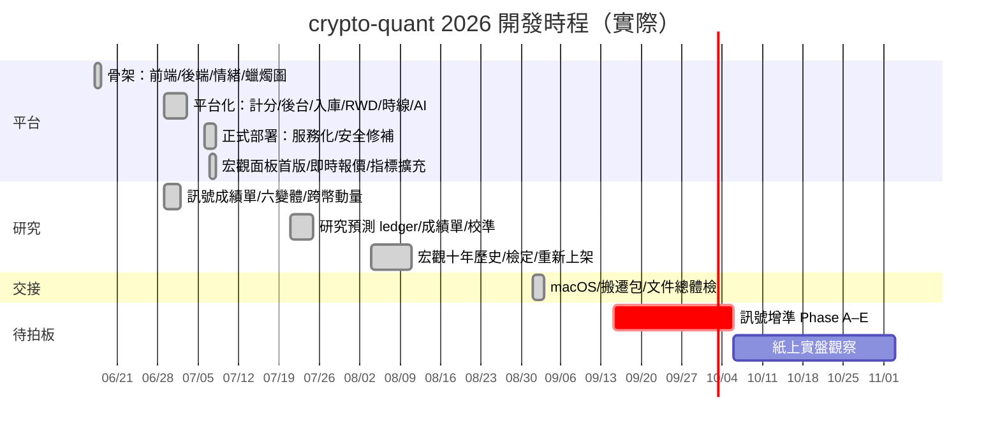

圖：甘特圖——實際交付集中於 2026-06-29～07-07 與 07-21～07-24、08-04～08-10 三個密集期；策略產品化待拍板

## 2. 各階段內容與驗收條件

| 階段 | 內容 | 驗收條件 | 結果 |
|---|---|---|---|
| Phase 0 骨架（06-17） | React＋FastAPI＋情緒模組；蠟燭圖與回測標記；七因子分數 | 前後端可 build、Render 部署設定 | 通過 |
| Phase 1 平台化（06-29～07-02） | 統一計分、後台管理台、資料入庫、RWD、指標驗證、時線、AI 雙引擎、新聞升級、自動更新 | 指標交叉驗證全對；前台改讀 SQLite；後台可登入管幣種 | 通過 |
| Phase 2 驗證與誠實化（06-29～07-06） | 成績單、六變體、跨幣動量、無前視修正、回測入庫、服務化 | `verify_backtest` 全 PASS；成績單公開；開機自啟 | 通過 |
| Phase 3 研究預測（07-21～07-24） | 可稽核預測、成績單 P0、校準 challenger、模型指標與門檻 | P0 驗收清單 30 項全勾（第 13 章 §10）；62→141 測試 | 通過 |
| Phase 4 可用性與宏觀（08-04～08-10） | 撕裂 CSV、自我修復、誠實指標、宏觀歷史與檢定、出處標註 | 管線連續運作；檢定結論寫進面板 | 通過 |
| Phase 5 交接（09-01～09-02） | macOS、搬遷包、文件總體檢、SDD 與交接手冊 | 新機一小時內恢復；文件單一入口 | 通過 |
| Phase 6 策略產品化（待拍板） | 訊號增準 Phase A–E、紙上實盤、ML | 樣本外 5 日勝率 ≥ 基準 +0.5pp（寫死不可調） | 未開工 |

## 3. 里程碑總表

| 里程碑 | 日期 | 內容 | 狀態 |
|---|---|---|---|
| M0 | 2026-06-17 | 專案骨架上線 | 🟢 |
| M1 | 2026-06-30 | 訊號驗證結論與 A／B／C 提案 | 🟢（提案）／🔴（拍板） |
| M2 | 2026-07-02 | 驗證成果表：資料正確、新聞升級、AI 可靠 | 🟢 |
| M3 | 2026-07-06 | 正式部署服務化＋安全修補 | 🟢 |
| M4 | 2026-07-24 | 研究預測成績單 P0 與模型指標 | 🟢 |
| M5 | 2026-08-10 | 宏觀面板重新上架（含檢定） | 🟢 |
| M6 | 2026-09-02 | 交接文件定版（本手冊＋SDD） | 🟢 |
| M7 | 待定 | 訊號增準 Phase A（動量策略上前台） | ⚪ 待拍板 |
| M8 | 待定 | 紙上實盤數月後決定是否投入真實資金 | ⚪ |

## 4. 開發節奏與品質守則

- 進度單一真相在後台「工作項目」：做完標 done、新待辦即時補、`notes` 寫交接說明；文件是規劃視角快照。
- 改訊號因子最需謹慎：改 `src/scoring.py` → `verify_backtest.py` → `verify_indicators.py` → 重產回測報表 → 看後台成績單有沒有變（快取自動重算）。
- 資料正確性鐵律：只存已收盤 K 棒；回測不前視；研究 ledger 不可改；宏觀門檻不回調。
- 版控：單人倉庫直接 commit＋push `main`；只提交當次工作的檔；提交前跑 `check_staged_runtime_artifacts.py`；兩個遠端（SSH 舊帳號、HTTPS 新帳號）同步推。
- 測試：`pytest tests -q`（141 項）改後端必跑；`npm run lint`、`npm run build` 改前端必跑；`npm run test:forecast` 改預測 view model 時跑。
- 文件：README 是唯一活文件；本手冊與 SDD 是帶日期的定版快照，重大交付節點重新同步。

## 5. 資源方案比較

| 方案 | 人力 | 適用 | 影響 |
|---|---|---|---|
| A 現況：1 名全端＋AI 輔助 | 1 人 | 維護與小幅演進 | 訊號增準 Phase A–E 約 3 週；ML 研究約 2～3 週＋4 週紙上觀察 |
| B 加 1 名研究人員 | 2 人 | 同時推進策略研究與產品 | 研究（Phase B–D、ML、預測 P1）與產品（通知、晨報、投組）並行，總時程壓縮約 40% |
| C 只維運不研發 | 0.2 人 | 系統持續自動運作、不新增功能 | 每月檢查排程、備份、密碼輪替；風險是策略決策懸置 |

## 6. 成本概估（量級參考）

| 項目 | 金額 | 說明 |
|---|---|---|
| 資料來源 | 0 | Binance、alternative.me、Yahoo、CoinGecko、RSS 皆公開免金鑰 |
| 主機 | 既有 Windows Server（與台股平台、portal 共用） | 單一進程，記憶體與 CPU 負載小 |
| GPT（若啟用） | 每日新聞批次標註不到 0.01 美元；深度解讀每小時上限 80 次、15 分鐘快取 | 金鑰未設；後台可看 token 用量 |
| ML 研究 | 0（LightGBM 開源，CPU 秒級訓練） | 需人力 2～3 週 |
| 對外網域與 Cloudflare | 網域年費（公司申請）；Quick Tunnel 免費但網址不固定 | named tunnel／Access 需帳號權限 |
| 儲存 | `app.db` 37.7 MB、`news.db` 10.3 MB、備份 645 MB／14 天 | 日線與小時線十年內不需換資料庫 |
# 08. 資訊安全與資料保護

文件版本：v1.0（2026-09-02）｜定位：本系統不儲存任何個人資料（前台免登入、後台單一管理帳號、存取紀錄不記使用者身分），安全重點是「後台憑證與密鑰」「研究紀錄不可竄改」「服務不被濫用」三件事。本文件為設計依據；對外公開前應由公司 IT 覆核網路層。

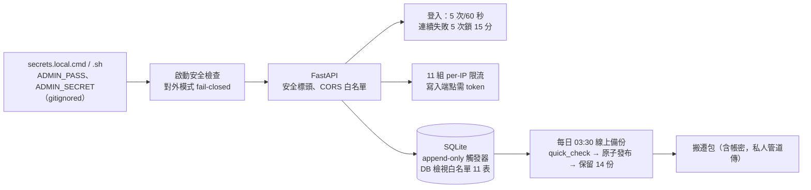

圖：安全與資料防護總覽——從密鑰注入到備份的每一道防線

## 1. 威脅模型與資料分級

| 資產 | 等級 | 威脅 | 防線 |
|---|---|---|---|
| 後台憑證（`ADMIN_PASS`、`ADMIN_SECRET`） | 機密 | 外洩即可偽造 token 操作後台 | 密鑰檔 gitignored；對外模式長度門檻；token 8 小時；密鑰輪替即全部失效 |
| GPT 金鑰（`OPENAI_API_KEY` 或 `app_config.ai`） | 機密 | 外洩即產生費用 | 後台只回遮罩（前 6 後 4）；環境變數優先；金鑰未設時全站降級 |
| 研究預測 ledger、`tasks` | 不可重建 | 事後竄改成績、進度遺失 | 資料庫層 append-only 觸發器；每日備份；搬遷包 |
| 行情、指標、訊號、回測 | 可重建 | 損毀 | 由 CSV／Binance 重跑 |
| 新聞 | 部分可重建 | RSS 滾動視窗過期 | 每日備份；HackerNews 回補 |
| 服務可用性 | — | 公開端點被打爆、Binance 429 | 11 組限流；回測 LRU；集合端點只回摘要；排程互斥 |
| 存取紀錄 | 非個資 | — | 只記路徑、幣種、狀態碼、耗時，不記 IP 與使用者 |

## 2. 憑證與密鑰管理

| 變數 | 用途 | 規則 |
|---|---|---|
| `ADMIN_USER` | 後台帳號（預設 `admin`） | 建議設定 |
| `ADMIN_PASS` | 後台密碼 | 對外模式 ≥ 12 字元；唯一例外：明確設定的 legacy `admin123` 放行但啟動記高風險警告（#166） |
| `ADMIN_SECRET` | 簽發 `/admin` token 的 HMAC 密鑰 | 對外模式 ≥ 32 字元且非預設值 `dev-secret-change-me`，否則拒絕啟動 |
| `OPENAI_API_KEY`／`OPENAI_BASE_URL`／`OPENAI_MODEL`／`AI_HOURLY_CAP` | GPT（選填） | 環境變數優先於後台設定；預設模型 `gpt-4o-mini`、每小時 80 次 |
| `ALLOW_INSECURE_ADMIN_DEFAULTS` | 本機 loopback 開發沿用預設帳密的明確 opt-in | 對外模式一律無效；需同時 `CRYPTO_QUANT_MODE=development` 與 bind `127.0.0.1` |
| `CRYPTO_QUANT_MODE`／`CRYPTO_QUANT_BIND_HOST` | 對外模式判定 | `external`／`production`／`public`／`staging` 或 bind 非 loopback 即對外 |

密鑰檔：Windows `secrets.local.cmd`（純 ASCII＋CRLF，`start_backend.cmd` 以 `call %~dp0secrets.local.cmd` 載入）；macOS／Linux `secrets.local.sh`（`setup.sh` 自 `secrets.example.sh` 產生並用 `openssl rand -hex 32` 隨機化 `ADMIN_SECRET`，`chmod 600`）。兩者皆 `.gitignore`。搬遷包內含密鑰檔，必須用私人管道傳送（`--no-secrets` 可排除）。

> 現況註記（2026-09-02）：`ADMIN_SECRET` 已換強值（≥ 32 字元）；`ADMIN_PASS` 仍為 legacy 密碼（2026-07-06 依當時決策沿用），輪替步驟：改密鑰檔 → 重啟排程工作 `CryptoQuantBackend` → 以新密碼登入驗證；新密碼由主管指定並保管於私人密碼工具。

## 3. 認證與登入防護

- `POST /api/admin/login`：帳密常數時間比對；每 client 5 次／60 秒；`FailedLoginLockout` 連續失敗 5 次鎖 900 秒（失敗計數視窗 900 秒），鎖定期間回 429＋`Retry-After`；成功即清除失敗紀錄。
- Token：純標準庫 HMAC-SHA256，`base64url(payload).base64url(sig)`，payload 為 `user:到期秒數`，8 小時；沒有 refresh token、沒有登出撤銷端點，換 `ADMIN_SECRET` 即全部失效。
- `require_admin` 依賴：缺 header 或驗證失敗一律 401；前端收到 401 清除 `localStorage` 的 token 退回登入頁。
- 客戶端身分只採伺服器驗證過的 `request.client.host`，刻意忽略轉發標頭（無反向代理，避免被偽造 `X-Forwarded-For` 繞過限流）。

## 4. 存取控制（公開／後台）與寫入端點

| 類別 | 端點 | 控制 |
|---|---|---|
| 公開讀取 | 行情、指標、訊號、回測、預測快照、情緒、AI、宏觀（30 個） | 免驗證；各有限流與快取；集合端點只回持久化摘要 |
| 需登入讀取 | `/admin/*` 讀取、`/forecast/scorecard` | `require_admin` |
| 需登入寫入 | `/admin/ingest`、`/admin/ops/run`、`/admin/coins`、`/admin/tasks`、`/admin/ai/config`、`/sentiment/news/backfill` | `require_admin`＋限流；同型管線執行中回 409 |
| 資料庫檢視 | `/admin/db/table/{name}` | 白名單 11 表、`limit ≤ 500`、只讀；不在白名單回 404，防注入 |
| API 文件 | `/docs`、`/redoc`、`/openapi.json` | 對外模式自動關閉 |
| 靜態檔 | `/{full_path}` SPA fallback | `resolve()` 防路徑越界；`api/` 開頭一律 JSON 404 |

## 5. 稽核（job_runs／access_log）

- `job_runs`：每次排程與後台手動操作的 `job_type`、`status`（running／success／failed）、起訖時間、訊息；後台監控頁顯示最近 50 筆；保留 30 天。2026-09-02 統計：`daily_pipeline` 27 成功／1 失敗、`hourly_pipeline` 626／27、`news_fetch` 1,005、`forecast_pipeline` 27、`sqlite_backup` 27。
- `access_log`：`/api/*` 的路徑、幣種、狀態碼、耗時（14,669 列），寫入丟 threadpool、失敗吞掉不影響請求；保留 30 天；不記使用者身分。
- AI 用量：`ai_usage` 記每次 GPT 呼叫的 token 與成敗（90 天），後台可看今日與近 7 日統計。
- 研究 ledger 本身即稽核軌跡：`generated_at`、`created_at`、`input_hash`、`data_version`、`model_version` 全數封存。

> 現況註記（2026-09-02）：`job_runs` 有 2 筆 `news_fetch` 停在 `running`（行程被砍、`finished_at` 為 NULL）；後台已改用排程模組的鎖判定執行狀態，殭屍紀錄不再誤擋手動觸發，可忽略或待 30 天清理。

## 6. 技術性安全措施

| 措施 | 內容 | 狀態 |
|---|---|---|
| 啟動 fail-closed | 對外模式憑證不合即拋 `SecurityConfigurationError` 拒絕啟動 | 已落地 |
| 安全標頭 | CSP（`default-src 'self'`、`frame-ancestors 'none'`、`connect-src 'self' wss://stream.binance.com:9443`…）、`nosniff`、`X-Frame-Options: DENY`、`Referrer-Policy`、`Permissions-Policy`；HTTPS 時 HSTS 一年；敏感路徑 `no-store` | 已落地 |
| CORS | 只允許本機開發來源 | 已落地 |
| 限流 | 11 組滑動視窗（第 05 章 §1），槽位滿寧可拒絕新客戶端也不驅逐既有項目 | 已落地（單進程） |
| 寫入端點驗證 | 新聞回補、管線觸發、幣種與設定變更皆需 token | 已落地（2026-07-06 修補） |
| 排程互斥 | `max_instances=1`、`coalesce=True`；手動與排程共用同一把鎖 | 已落地 |
| 原子落盤 | CSV `.tmp`＋`os.replace()`；備份暫存＋`quick_check` 後換上 | 已落地 |
| 版控防線 | `.gitignore` 擋資料庫、資料、報表產物、密鑰檔；`check_staged_runtime_artifacts.py` 提交前唯讀檢查 | 已落地 |
| 研究不可竄改 | 5 張研究表 10 個 `BEFORE UPDATE/DELETE` 觸發器 | 已落地 |
| Cloudflare named tunnel／Access／WAF | 對外固定網址與存取保護 | 待辦 #165（需網域與帳號權限） |
| 多進程共享限流與備份鎖 | 目前限流與鎖為行程內狀態 | 待辦 #167（單進程下不影響） |
| 外部看門狗＋dead man's switch | 補崩潰迴圈與機器層級盲區 | 待辦 #177 |

## 7. 備份與災難復原

- 每日 03:30 `sqlite_backup`：以 SQLite online backup API（含仍在 WAL 的已提交列）備份 `app.db` 與 `news.db` 至 `data/backups/sqlite/`，先寫暫存檔、`PRAGMA quick_check` 通過、`fsync`、算 SHA-256 後 `os.replace()` 原子換上；每庫保留 14 份（28 檔約 645 MB）。`SQLITE_BACKUP_DIR`／`SQLITE_BACKUP_KEEP` 可覆寫。
- 禁止直接複製執行中的 `.db`：WAL 模式下未 checkpoint 的資料留在 `.db-wal`（實測十幾 MB），只複製 `.db` 會拿到缺尾巴的不一致快照。
- 換機：`python scripts/make_migration_bundle.py` 產生搬遷包（密鑰檔、兩庫一致快照、`data/clean`、`data/raw`、`reports`）；新機 `git clone` → `./setup.sh` → `unzip -o` → 啟動；`data/backups/` 刻意不放進搬遷包，新機每日排程會自己重新產生。
- 目標：RPO ≤ 24 小時（每日備份）、RTO ≤ 1 小時（搬遷包還原）。
- 待辦：備份改為獨立排程工作並推送異地（#178）；還原演練建議每季一次（沒演練過的備份等於沒有備份）。

## 8. 事件應變

| 事件 | 處置 |
|---|---|
| 後台密碼或密鑰疑似外洩 | 立即改 `secrets.local.*` 的 `ADMIN_PASS` 與 `ADMIN_SECRET` → 重啟服務（舊 token 全部失效）→ 檢查 `job_runs` 與 `access_log` 有無異常操作（改幣種、觸發管線、回補新聞）→ 若有 tunnel 先關閉 |
| GPT 金鑰外洩 | 到供應商後台撤銷金鑰 → 後台「AI 設定」清空或改環境變數 → 看 `ai_usage` 有無異常用量 |
| 公開端點被濫用 | 看 `access_log` 路徑分布；限流已回 429；必要時關閉 tunnel、只留區網 |
| 資料庫損毀 | 停服務 → 從 `data/backups/sqlite/` 取最近一份 `quick_check` 通過的快照還原 → 可重建的表用管線重跑補齊 → 研究 ledger 只能還原到備份時點（append-only 無法回推） |
| 排程連續失敗 | 後台監控頁看 `job_runs` 訊息（Binance 429、DNS、撕裂 CSV）；`logs\backend.log` 看看門狗重啟紀錄；依第 10 章 §7.7 排解 |
| 機器故障 | 以最近搬遷包或備份在新機還原（第 10 章 §7.5、附錄 B） |

## 9. 上線前檢查清單

- [x] `ADMIN_SECRET` 已換強值（≥ 32 字元），對外模式門檻通過
- [ ] `ADMIN_PASS` 輪替為 ≥ 12 字元新密碼並驗證登入（#166）
- [x] 登入失敗鎖定、per-IP 限流、寫入端點需 token（#70，2026-07-24）
- [x] 每日 SQLite 線上備份、完整性驗證與輪替（#70）
- [x] 對外模式關閉 `/docs`；安全標頭與 CSP 落地
- [x] `.gitignore` 與提交前檢查擋住資料庫、密鑰、產物
- [ ] Cloudflare named tunnel 固定網址＋Access 保護 `/admin`（#165）
- [ ] 備份異地推送與還原演練（#178）
- [ ] 多進程共享限流／備份鎖（#167；單進程部署可暫緩）
- [ ] Google News RSS 商用授權由公司確認（#156）

# 09. 新聞情緒管線與詞庫／問答庫審核

文件版本：v1.0（2026-09-02）｜定位：平台有三套彼此獨立的文字系統——①新聞情緒詞庫（本章 §1–§4）、②AI 機器人提示詞（附錄 A）、③規則引擎與固定問答文案（本章 §5）；詞庫與問答庫的變更都需先經審核再進系統。

## 1. 來源與抓取

| 來源 | 語言 | 方式 | 排程 |
|---|---|---|---|
| CoinTelegraph、CoinDesk、Decrypt、TheBlock、CryptoSlate、Blockworks、BitcoinMagazine | 英文 | 直接訂閱 RSS | 每 30 分（`news_fetch`） |
| 動區 BlockTempo、鏈新聞 ABMedia | 中文 | 直接訂閱 RSS | 每 30 分 |
| Google News 中文聚合（市場級） | 中文 | 聚合查詢（`GN:` 前綴標示原始媒體） | 每 30 分 |
| Google News 幣種級 | 中文 | 逐幣查詢 | 每日管線步驟 11 |
| HackerNews Algolia | 英文 | 後台手動回補歷史（需 token，2 次／時） | 手動 |

只搬運標題與摘要、不改寫不創作，每則帶原始網址；去重：`url` 唯一鍵＋近 7 日標題正規化（小寫、去非英數、去 Google News 的「 - 來源」尾巴）。2026-09-02 實測 15,359 篇、747 個網域；前 8 大來源：動區 1,746、CoinTelegraph 1,337、CoinDesk 1,260、鏈新聞 1,114、Decrypt 781、TheBlock 742、CryptoSlate 720、GN:Bybit 708。分類：市場行情 10,976、機構投資 2,093、監管法規 1,047、技術發展 681、安全事件 562。

## 2. 情緒詞庫（中英雙語）與判讀規則

四步運作：①標題逐字比對詞庫，命中「看多詞」加分、「看空詞」扣分（權重 1＝一般、2＝強烈）；②多空分數相減：`>0` 看多、`<0` 看空、`=0` 中立；③每則新聞存 `sentiment`（只依標題判讀，刻意不納入 `summary`，否則歷史曲線會在改版日出現人為斷層）；④每日彙總成情緒分數（§3）。

| 詞庫 | 詞數（v2，2026-07-02） | 說明 |
|---|---|---|
| 英文 | 105 詞（看多 48、看空 57） | 標題約六成為英文；判讀結果一律以繁體中文顯示 |
| 繁體中文 | 101 詞（看多 51、看空 50） | 含少量簡體「比對鍵」（部分中文媒體以簡體發稿），只存在於比對層、介面不顯示 |

判讀示範（真實標題）：「比特幣強彈收復近 6.1 萬鎂！4.5 億爆倉空軍遭血洗，恐慌指數仍躺 19」命中 +強彈(2)、+收復(1)、−血洗(2)、−爆倉(2)、−恐慌(1) → 看空；「Bitcoin ETFs lose record $4.5B in June」命中 +record(1) → 看多（已知限制：「record」在壞消息裡也會出現，這正是需要審核詞彙、避免歧義詞的原因）。

## 3. 幣種標記與每日情緒分數

- 幣種標記：`sentiment.py` 的 `_match_coins()` 以整字比對標題與摘要，寫入 `news.coins`（逗號分隔 ticker），是幣種過濾的唯一依據；中文別名（比特幣、以太坊…）已補入。
- 每日分數：`aggregate_daily()` 對每日 × 每幣（或 `MARKET`）算 `(多 − 空) ÷ 總數 × 100`，四捨五入夾在 −100～+100，附 `n_total`／`n_bull`／`n_bear` 與代表性標題最多 3 則（優先非中立）；30 分排程滾動更新今天與昨天，幣種級每日回補近 3 天。
- 前台使用：情緒面板溫度條；六因子的第 7 因子「新聞情緒」目前 `news_scoring=False` 只顯示方向不計分（A/B 回測尚未證明穩定有效）；AI 規則引擎與 GPT 上下文引用近 3 天新聞（優先該幣，共 8 則）。
- 幣種新聞不足 5 則時 `/sentiment/news` 退回全市場並標 `fell_back_to_market=true`，相關的排最前面。

## 4. 詞庫審核流程（情緒詞庫範本.docx）

1. 提案：在 `docs/情緒詞庫範本.docx` 第五節「新增詞彙申請表」填詞彙、多／空、權重（1 或 2）、語言、理由。
2. 驗證：新增前先抽 20 則含該詞的真實標題人工驗證；每批新增 ≤ 20 詞；避免歧義詞（如 record、high 單獨出現）。
3. 核可：主管於申請表勾選核可並簽名。
4. 上線：工程師改 `backend/routers/sentiment.py` 的詞庫常數 → 重啟服務（詞庫存於程式碼，純文字常數約 8 KB）。
5. 回填：新詞只影響之後抓取的新聞判讀；需要時以 `aggregate_daily(dates)` 重算指定日期。

容量與速度：現行 206 詞比對 200 則標題僅 12 毫秒；擴大 10 倍仍 < 0.15 秒／輪。下一步是把詞庫搬到後台設定頁，主管核可後線上增修即時生效（#81）。

## 5. AI 固定問答庫與知識庫

- `backend/services/canned_qa.py` 的 `QA_TEMPLATES` 共 65 條（教學 26、行情 16、平台 9、觀念 8、閒聊 3、信任 3），每條為（分類、問題示例、觸發關鍵詞、答案模板）；`KNOWLEDGE_INTENTS` 五類幣種知識意圖（起源、供應量、購買人數、用途、是什麼）× `coin_facts.py` 15 幣知識檔（定位、起源、用途、供應、共識、採用度、風險）。
- 比對：所有條目取最長命中關鍵詞者；「是什麼」因過於泛用降權，只在無具體條目命中時才走幣種小檔案；歷史查詢優先（口語化時間解析，單日快照或區間回顧直接查 DB，零幻覺）。
- 回答架構：固定答案為骨幹（帶入即時 DB 數據約 30 個模板變數），GPT 可用時只做潤飾（`enhance_answer`：數字、價位、立場結論原封保留，不得新增基底沒有的事實），不可用則直接回固定答案。未追蹤幣誠實拒答並列支援清單；全站模式未指定幣時反問是哪一顆。
- 審核文件：`python scripts/export_qa_docs.py` 直接讀系統實裝模組產生 `docs/AI機器人固定問答範本.docx`（回答架構、模板變數、逐條問答、知識意圖、實際輸出示範、新增／修訂申請表、知識庫全文），與線上永遠一致；改了問答庫後跑一次即更新審核文件。

> 現況註記（2026-09-02）：`canned_qa.py` 檔頭 docstring 仍寫「54 條」，實際為 65 條；文件以程式為準。前台 AI 面板與小Q 暫停掛載，問答 API `/api/ai/ask` 照常可用。

## 6. 品質量測（v1→v2）

| 指標 | v1（修復前） | v2（2026-07-02 快照） | 現況（2026-09-02） |
|---|---|---|---|
| 新聞來源 | 3 家（全英文） | 10 家（含中文＋Google News 聚合） | 747 個網域（含聚合） |
| 單輪抓取篇數 | 約 75 | 約 200 | 每 30 分約 199 篇 |
| neutral 占比 | 87.4% | 新語料 65.5%／全庫 75.4% | 72.0%（bullish 14.7%、bearish 13.3%） |
| 幣種標記 | 0 | 686／1,987 篇標到幣 | 幣種級新聞每日回補；`summary` 納入比對 |
| 每日情緒分數 | 無 | 全市場＋15 幣 −100～+100 | 1,141 列（2025-01-01 起） |
| 人工抽查 | — | 看多 5/5、看空 5/5 | — |
| 面效度 | — | BTC 情緒 −12／−15／−33 對應 6 月大跌 20%；SOL +44 對應連日利多 | 方向一致 |
| AI 問答正確性 | — | 幣種偵測 11/11、固定問答 10/10、知識庫 7/7、錯字容忍、未追蹤幣拒答 | 固定問答 65 條 |

## 7. 已知限制與下一步

- 詞庫法 neutral 占比仍高（約 72%）；GPT 批次情緒標註（成本約每日不到 0.01 美元）可大幅降低，待金鑰（#77）。
- 歧義詞誤判（record、high、low）靠審核準則控管，無法根治。
- Google News RSS 用於正式環境的商用條款風險待公司判斷（#156）；內部使用維持現狀。
- 新聞分析建議引擎（規則版先行）、新聞建議 API 與有效性驗證報表為規劃項（#119–#122）。
- 詞庫與問答庫後台管理化（主管核可後線上即改即生效，#81）。

# 10. 系統元件與資料庫使用手冊（維護版）

> 文件基準：2026-09-02 目前程式碼。本文以 `backend/`、`src/`、`frontend/`、啟動腳本與後台實況為準；規劃文件中尚未落地的功能不視為已完成。文件角色與主來源關係見本手冊導讀與附錄 D。

## 1. 系統全貌

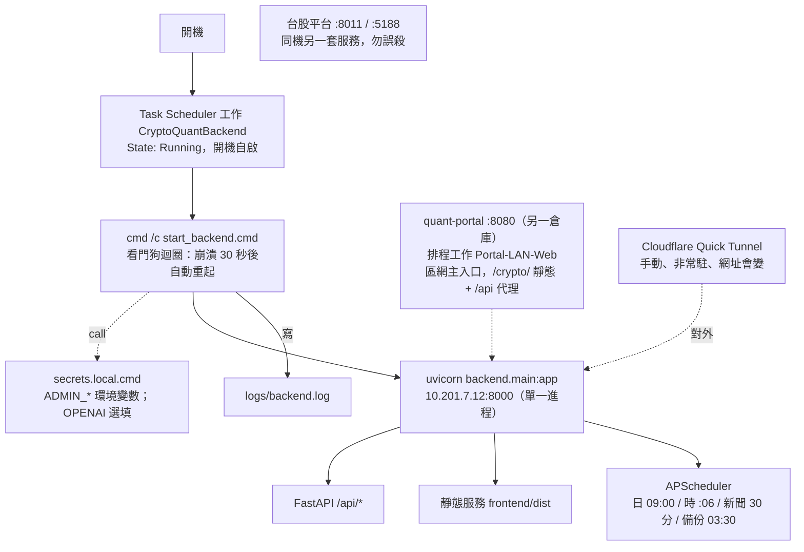

圖：Windows 部署拓撲——一個排程工作、一個看門狗、一個 uvicorn 進程；區網入口與台股平台是同機的另兩套服務

crypto-quant 目前由五個主要部分組成：

| 部分 | 位置 | 說明 |
|---|---|---|
| 資料管線與研究腳本 | `src/` | 抓 K 線、算指標、計分、回測、研究預測、動量策略、宏觀規則與檢定、驗證器；排程以子行程呼叫 |
| Backend API 與排程 | `backend/` | FastAPI 11 個 router、APScheduler 四個排程、15 個服務模組 |
| 資料庫 | `data/app.db`、`data/news.db` | SQLite WAL；19＋2 張表 |
| 前台與後台 | `frontend/` | 同一個 React SPA；`/admin` lazy 載入後台；build 後由 FastAPI 服務 `dist/` |
| 部署與工具 | `start_backend.cmd`／`.sh`、`setup.sh`、`scripts/` | 看門狗、環境建置、搬遷包、產物防線、文件產生 |

主要資料流：

```
Binance ─→ src/fetch_binance.py ─→ data/clean/*.csv ─→ src/indicators.py ─→ reports/indicators_*.csv
        ─→ app_db.ingest_market_data() ─→ app.db: prices / indicators ─→ daily_signal / backtest_*
RSS x9 / Google News ─→ routers/sentiment.py ─→ news.db: news ─→ news_sentiment_daily
alternative.me / Yahoo ─→ app.db: fear_greed / macro_daily ─→ src/macro_eval.py ─→ reports/macro_evidence.json
app.db ─→ src/forecasting.py ─→ forecast_snapshot_v2 / forecast_outcome_v2 ─→ services/forecast_scorecard.py
瀏覽器 ─→ /api/* ─→ services/reader.py（只讀 SQLite）；即時報價 ─→ 直連 Binance WebSocket
```

實際核心流程：每日 09:00 管線把行情、指標、訊號、回測、預測、情緒、宏觀全部更新入庫；前台每 60 秒輪詢 `/api/status` 的 `data_version`，變了才重拉；後台讀同一個資料庫顯示排程與新鮮度；任何寫入型操作都走需 token 的後台端點。

### 1.1 為什麼前後端使用不同技術？

可以把 crypto-quant 想成一間氣象站：

- 前端是螢幕牆與播報員：負責讓使用者看得懂、切得快、立刻知道哪個數字有問題（React 圖表與面板）。
- Backend 是分析室：負責驗證資料、算指標、跑回測與預測、決定資料可以怎麼被使用（FastAPI＋Python 研究腳本）。
- 資料庫是檔案櫃與帳本：負責長期、正確地保存行情、訊號、研究紀錄與操作紀錄（SQLite WAL）。
- 排程器是自動觀測儀：每天固定時間抓資料、算完、歸檔，人不在也照跑（APScheduler）。

各層工作不同，因此選擇最適合該工作的工具，比強迫全部使用同一種語言更容易維護。

### 1.2 技術選擇對照表

| 層 | 技術 | 版本（2026-09-02 實測） |
|---|---|---|
| 語言 | Python | 3.12.7（`.venv`） |
| 後端 | FastAPI＋Uvicorn＋APScheduler | 0.137.1／`uvicorn[standard]`／3.11.2 |
| 資料處理 | pandas＋numpy | 3.0.3／2.2.6 |
| 資料庫 | SQLite（Python 內建） | WAL 模式 |
| 前端 | React＋Vite | 19.2＋8.0 |
| 圖表 | lightweight-charts＋recharts | 5.2＋3.8 |
| Node.js | 主機實測 | v24.14.1、npm 11 |
| 驗證 | pytest＋httpx2、pandas_ta | 141 項；前端指標比對 |
| 文件 | python-docx、mermaid-cli（npx）、Word COM | `scripts/build_docs.py` |

### 1.3 從畫面到資料庫的架構圖

```
┌──────────────────────── 使用者看到的畫面 ────────────────────────┐
│  訪客 → 前台（React，免登入；首頁即 BTC 詳細頁）                 │
│  管理者 → 後台 /admin（同一個 SPA，登入取 token）                │
│  即時報價：瀏覽器直連 Binance WebSocket（不經後端）              │
└────────────────────────────┬─────────────────────────────────────┘
                             │ /api/*　·　Authorization: Bearer <token>（後台）
                             ▼
┌──────────────────────── 系統處理中心 ────────────────────────────┐
│  FastAPI（Python 3.12）＋APScheduler（同一進程）                 │
│  驗證參數與 token → 限流 → 讀取層（只讀 SQLite）→ 回應           │
│  排程：抓 K 線 → 算指標 → 入庫 → 訊號／回測 → 預測封存 → 備份    │
└───────────────────────┬───────────────────┬──────────────────────┘
                        │ 行情／訊號／研究   │ 新聞
                        ▼                   ▼
              ┌──────────────────┐  ┌──────────────────────────┐
              │ data/app.db      │  │ data/news.db             │
              │ 19 張表（WAL）   │  │ 2 張表（WAL）            │
              │ 研究表 append-only│  │ url 唯一、coins 標記     │
              └──────────────────┘  └──────────────────────────┘
                        ▲
              data/clean/*.csv、reports/*.csv（抓取／計算中繼與備援）
```

### 1.4 各項選擇的白話原因

前端使用 React＋Vite

- 互動蠟燭圖、指標切換、面板開關、彈窗與手機版面都是狀態很多的畫面，React 元件化最好維護。
- build 後是純靜態檔，FastAPI 直接服務，正式環境不用多起一個 Node 服務。
- 指標的前端計算是純函式，可用 Python＋pandas_ta 逐點驗證。

Backend 使用 Python＋FastAPI

- 本系統的核心是資料處理與統計：指標、回測、bootstrap、HAC 檢定、校準實驗，Python 生態最完整。
- 排程、後端 API 與研究腳本同一種語言，研究結果可以直接被線上模組重用（`scoring.py`、`macro_regime.py` 就是這樣的單一真相）。
- FastAPI 自動驗證參數上下界（例如回測參數的 `ge/le/multiple_of`），並自動產生 OpenAPI。

資料庫使用 SQLite

- 資料量萬～百萬列，單機單寫入者（排程＋少量後台寫），SQLite 完全足夠且零設定、跟著專案檔案走。
- WAL 模式讓讀寫不互鎖、更耐當機；線上備份 API 能做一致快照。
- 分鐘線等量級再換 PostgreSQL；用標準 SQL，遷移平滑。

為什麼不全部使用同一種語言？

全部用 JavaScript 會放棄 Python 在統計與資料處理上的優勢；全部用 Python 做前端則做不出這種互動圖表。目前的分工讓 React 專注畫面、Python 專注規則與研究、SQLite 專注可靠保存。不同層透過清楚的 HTTP API 溝通，因此能分開測試、替換與維護。

## 2. 資料庫選型、連線與備份

### 2.1 SQLite 的定位

| 檔案 | 用途 | 大小（2026-09-02） |
|---|---|---|
| `data/app.db` | 行情、指標、訊號、回測、研究預測、宏觀、恐懼貪婪、設定、工作項目、排程紀錄、AI | 37.7 MB（另 WAL 14.5 MB） |
| `data/news.db` | 新聞與每日情緒分數 | 10.3 MB |

兩檔都會隨時間持續成長（行情、新聞、預測 ledger 每天累積）。

### 2.2 檔案位置與環境變數

Backend 以延遲初始化建表（`ensure_ready()` 由 lifespan 呼叫，import 不動正式 DB）；路徑可用 `CRYPTO_QUANT_APP_DB`／`CRYPTO_QUANT_NEWS_DB` 覆寫（測試或一次性腳本改道用）。直接查詢可用任何 SQLite 工具：

```sql
SELECT date, signal, score FROM daily_signal WHERE symbol='BTCUSDT' ORDER BY date DESC LIMIT 10;
SELECT interval, COUNT(*) FROM prices GROUP BY interval;
SELECT status, COUNT(*) FROM forecast_snapshot_v2 GROUP BY status;
```

後台「資料庫」頁只開放 11 張白名單表（prices、indicators、daily_signal、backtest_trade、backtest_summary、fear_greed、tasks、app_config、job_runs、access_log、news）；`macro_daily` 與 forecast／model 各表要直接開 SQLite。

### 2.3 每日備份

每日 03:30 排程 `sqlite_backup`：`Connection.backup(pages=256)` 讀取交易一致快照（含仍在 WAL 的已提交列）→ 同目錄暫存檔 → `PRAGMA quick_check` → `fsync` → SHA-256 → `os.replace()` 原子換上；檔名 `app-YYYYMMDDTHHMMSSffffffZ.sqlite3`／`news-…`；每庫保留 14 份。操作細節與還原見附錄 B。

### 2.4 備份基本原則（WAL）

- 永遠不要手動複製執行中的 `.db`；要一致快照就走備份 API（排程、搬遷包都是）。
- 還原時先停服務、把快照複製回 `data/app.db`（刪除舊的 `-wal`／`-shm`）、再啟動；可重建的表用管線補齊。
- 研究 ledger 只能還原到備份時點；`tasks` 亦然，這兩類是交接時最不能誤刪的資料。

## 3. 實際資料表清單

`app.db` 共 19 張應用資料表（另有 SQLite 內部的 `sqlite_sequence`）、13 個索引、10 個 append-only 觸發器；`news.db` 2 張表。欄位與約束仍以 `app_db.init_db()`／`news_store.init_db()` 為準（第 03 章）。

### 3.1 行情與訊號

| 資料表 | 列數 | 主鍵 | 可重建 |
|---|---|---|---|
| `prices` | 66,334 | (symbol, interval, ts) | 是 |
| `indicators` | 66,334 | (symbol, interval, ts) | 是 |
| `daily_signal` | 28,304 | (date, symbol) | 是 |
| `backtest_trade` | 1,035 | (symbol, interval, entry_date) | 是 |
| `backtest_summary` | 15 | (symbol, interval) | 是 |

### 3.2 研究預測

| 資料表 | 列數 | 主鍵 | 備註 |
|---|---|---|---|
| `model_registry` | 2 | model_version | append-only；`research` 強制為 1 |
| `forecast_snapshot_v2` | 1,623 | forecast_id | append-only；UNIQUE 含 `input_hash` |
| `forecast_outcome_v2` | 1,383 | forecast_id | append-only |
| `forecast_snapshot`／`forecast_outcome` | 90／90 | forecast_id | v1 凍結 |

### 3.3 情緒與宏觀

| 資料表 | 列數 | 主鍵 | 可重建 |
|---|---|---|---|
| `fear_greed` | 3,132 | date | 是 |
| `macro_daily` | 2,536 | date | 是 |
| `news`（news.db） | 15,359 | id；url UNIQUE | 部分 |
| `news_sentiment_daily`（news.db） | 1,141 | (date, symbol) | 是 |

### 3.4 系統與管理

| 資料表 | 列數 | 備註 |
|---|---|---|
| `app_config` | 1（`coins`） | 設定唯一真相；`coins` 有預設值可回種 |
| `tasks` | 183 | 進度唯一真相；表空時植入 11 筆預設 |
| `job_runs` | 1,742 | 30 天保留 |
| `access_log` | 14,669 | 30 天保留 |
| `ai_analysis`／`ai_chat`／`ai_usage` | 0／139／0 | 7／90／90 天保留 |

## 4. 前台（React）

### 4.1 是什麼

`frontend/` 是瀏覽器中的前台與後台（同一個 SPA）。前台免登入：首頁即 BTC 詳細頁、報價列、蠟燭圖、統一判斷摘要、研究預測決策卡、宏觀與情緒面板；後台走 `/admin`。指標的前端計算在 `src/lib/indicators.js`（純函式，可驗證）；即時報價在 `src/lib/useLivePrices.js`（直連 Binance WebSocket）。

### 4.2 本機啟動

```powershell
cd frontend
npm install
npm run start        # = concurrently：npm run api（uvicorn :8001 --reload）+ npm run ui（vite :5174）
```

`npm run api` 走 `scripts/dev_api.mjs`：自動挑對應平台的 venv python，設 `CRYPTO_QUANT_MODE=development`、bind `127.0.0.1`、`ALLOW_INSECURE_ADMIN_DEFAULTS=1`（僅本機開發）；`DEV_API_DRY_RUN=1 npm run api` 只印指令不啟動。Vite 把 `/api` proxy 到 `http://localhost:8001`。

### 4.3 改前端要 build 兩次

正式環境服務的是 `frontend/dist/`（不是原始碼），改了沒 build＝線上還是舊的：

```powershell
cd C:\Users\Administrator\crypto-quant\frontend; npm run build      # (1) 本站 :8000，不必重啟後端
cd C:\Users\Administrator\quant-portal; .\build.ps1 -Target crypto   # (2) 區網入口 :8080/crypto/
```

只跑 (1) → `:8080/crypto/` 還是舊版；只跑 (2) → `:8000` 還是舊版。建完 (2) 不必重啟 portal，瀏覽器 Ctrl+F5 即生效。

## 5. Backend API

### 5.1 是什麼與啟動方式

Backend 是 FastAPI 應用，所有讀取、驗證、限流、排程與商業規則都在這一層。正式啟動：

```powershell
.\start_backend.cmd      # Windows：載入 secrets.local.cmd、標記 external、綁 10.201.7.12:8000、看門狗迴圈
./start_backend.sh       # macOS/Linux：同款；--once 前景執行看啟動錯誤；CRYPTO_QUANT_BIND_HOST=0.0.0.0 開給區網
```

- Health／狀態：`GET /api/status`、後台 `GET /api/admin/health`
- API base：`/api`；OpenAPI 只在非對外模式提供（`/docs`）
- `.venv\Scripts\python.exe` 是啟動器殼：工作管理員會看到「venv＋系統 Python」成對的 uvicorn，那是一台伺服器不是兩份；殺子進程＝殺整台。

### 5.2 API 分類

見第 05 章：中繼、行情、訊號、回測、研究預測、情緒、AI、宏觀／相關性、後台，共 53 個端點；後台與兩個寫入型端點需 `Authorization: Bearer <token>`（8 小時）。

### 5.3 排程

| 時間（系統本地時區，設計基準台灣） | 工作 | 內容 |
|---|---|---|
| 每日 09:00（＝UTC 01:00，日棒收盤後 1 小時） | `daily_pipeline` | 抓日線→指標→入庫→重算訊號→重產回測→新鮮度檢查→封存預測＋結算→恐懼貪婪→宏觀回補＋檢定→幣種新聞＋情緒→清理 AI／log／raw |
| 每小時 :06 | `hourly_pipeline` | BTC／ETH 1h 增量→指標→入庫 |
| 每 30 分 | `news_fetch` | RSS＋Google News→詞庫標註→去重入庫→更新今日情緒 |
| 每日 03:30 | `sqlite_backup` | 兩庫線上備份→`quick_check`→原子發布→保留 14 份 |

四個工作 `max_instances=1`、`coalesce=True`；`misfire_grace_time` 日線 3600 秒、時線 1800 秒、新聞 600 秒；排程不會在啟動時補跑（錯過的那次不補）。

## 6. 管理後台

### 6.1 是什麼

`/admin` 是同一個 SPA 的後台入口；登入取 token 存 `localStorage`，API 401 即清除退回登入頁；沒有多帳號、沒有忘記密碼。

### 6.2 現有頁面

| 分頁 | 內容 |
|---|---|
| 監控 | 系統健康、各幣新鮮度、最近 50 筆排程紀錄、DB 統計；重新匯入行情；一鍵跑 daily／hourly／news |
| 幣種 | 清單與資料狀態；新增（實際抓 Binance）、編輯、停用、移除 |
| 工作項目 | 進度單一真相 CRUD 與儀表板 |
| 資料庫 | 11 張白名單表唯讀瀏覽與說明 |
| 現況 | 動量策略今日建議與績效；訊號成績單；指標交叉驗證；指標計算方法 |
| 模型成績 | 研究預測成績單（篩選、治理判讀、gates） |

## 7. Windows 與 macOS 快速操作

### 7.1 Windows 正式部署（首次）

```powershell
git clone <repo> C:\Users\Administrator\crypto-quant
cd C:\Users\Administrator\crypto-quant
python -m venv .venv
.\.venv\Scripts\python.exe -m pip install -r backend/requirements.txt -r requirements.txt
.\.venv\Scripts\python.exe -m pip install -r requirements-dev.txt   # 開發/驗證/產文件才需要
cd frontend; npm install; npm run build; cd ..
notepad secrets.local.cmd                                             # 見第 08 章 §2 範本
.\start_backend.cmd
```

三個 requirements 檔：`backend/requirements.txt`（跑 app 必裝：fastapi、uvicorn、apscheduler、pandas、numpy、feedparser、aiofiles、requests）、根 `requirements.txt`（`src/` 離線管線：matplotlib、numpy、pandas、requests）、`requirements-dev.txt`（pandas_ta、python-docx、pytest、httpx2）。開機自啟：Task Scheduler 工作 `CryptoQuantBackend`，動作 `cmd /c "C:\Users\Administrator\crypto-quant\start_backend.cmd"`，觸發＝開機。`start_backend.cmd` 硬編路徑與 `10.201.7.12`，換機或換 IP 必改（另需改 `quant-portal\portal_app.py` 的 `CRYPTO_API_CANDIDATES` 與台股 `Stock\frontend\.env.local`）。

### 7.2 日常維運

| 要做的事 | 怎麼做 |
|---|---|
| 重啟後端（改後端程式、改密鑰檔） | `schtasks /end /tn CryptoQuantBackend` → 清掉綁 `10.201.7.12:8000` 的殘留進程（`Get-NetTCPConnection -LocalAddress 10.201.7.12 -LocalPort 8000 -State Listen \| % { Stop-Process -Id $_.OwningProcess -Force }`）→ `schtasks /run /tn CryptoQuantBackend`；勿終止 `:8080`、`:8011`、`:5188` |
| 改前端 | `cd frontend; npm run build`，再到 quant-portal `.\build.ps1 -Target crypto`（§4.3） |
| 改後台帳密／密鑰 | 改 `secrets.local.cmd` → 重啟後端 |
| 設／換 GPT 金鑰 | 後台 AI 設定（即時生效）或改 `OPENAI_API_KEY` 後重啟 |
| 手動抓取／重算 | 後台監控頁按鈕；或 `python -c "from backend.scheduler import run_pipeline; run_pipeline()"` |
| 新增一顆幣 | 後台「幣種」→ 新增；不必改程式 |
| 對外公開（臨時） | 開 Cloudflare Quick Tunnel 指向 `10.201.7.12:8000`；啟用前先換掉預設密碼與密鑰 |
| 看服務狀態 | `schtasks /query /tn CryptoQuantBackend`；`Get-NetTCPConnection -LocalAddress 10.201.7.12 -LocalPort 8000`；`logs\backend.log` |

### 7.3 macOS／Linux

```bash
./setup.sh                   # 首次：建 .venv、裝相依、npm ci、build 前端、產生 secrets.local.sh（--dev 另裝驗證相依）
cd frontend && npm run start # 開發：API :8001 + vite :5174
./start_backend.sh           # 正式：預設 127.0.0.1:8000，含看門狗；--once 前景執行
CRYPTO_QUANT_BIND_HOST=0.0.0.0 ./start_backend.sh   # 開給區網／tunnel（此時 ADMIN_SECRET ≥32、ADMIN_PASS ≥12 才會啟動）
```

開機自啟：把 `scripts/com.cryptoquant.backend.plist` 的 `__REPO__` 換成實際路徑 → 放進 `~/Library/LaunchAgents/` → `launchctl load -w`（停用 `unload -w`；重啟 `launchctl kickstart -k gui/$(id -u)/com.cryptoquant.backend`）。LaunchAgent 在使用者登入後才啟動；闔蓋睡眠排程不跑、醒來接續下一個排程點。`.gitattributes` 強制 `*.sh`／`*.mjs`／`*.plist` 一律 LF（存成 CRLF 在 macOS 會 `bad interpreter: ^M`）。

### 7.4 對外入口與 tunnel

區網主入口 `http://10.201.7.12:8080/`（quant-portal，排程工作 `Portal-LAN-Web`，開機自啟＋30 秒看門狗，日誌 `quant-portal\logs\portal.log`）→ `/crypto/` 本平台前台、`/crypto/admin` 後台；重啟只動 portal：`quant-portal\tools\restart.ps1`。改後端不用碰 portal（API 代理到 `:8000`）。對外網際網路：Cloudflare Quick Tunnel 手動、非常駐、網址每次會變；根治見 #165。

### 7.5 換機搬遷

舊機：`python scripts/make_migration_bundle.py`（產生 `../crypto-quant-migration/crypto-quant-migration-<日期>.zip`：`secrets.local.sh`（由 `.cmd` 轉出）、兩庫線上備份快照、`data/clean`、`data/raw`、`reports`；`--no-secrets` 排除帳密）。新機：`git clone` → `./setup.sh` → `unzip -o …zip -d .` → `./start_backend.sh`。沒有搬遷包也能跑，但排程不會補跑、工作項目與歷史新聞會是空的；想立刻有資料先手動跑 `fetch_binance.py` 與 `indicators.py` 再入庫。

### 7.6 這台機器的雷區（硬規則，違反會靜默失敗）

1. `.cmd` 檔必須純 ASCII＋CRLF；`call` 其他 .cmd 用 `%~dp0` 絕對路徑。存成含中文／BOM／LF 或用相對路徑 → 不報錯、直接不動作。
2. 改前端必 build（而且要 build 兩次）；改後端必重啟工作（正式無 `--reload`）。
3. `.venv` 成對進程是一台伺服器，別誤殺；同機另有 `:8080`、`:8011`、`:5188` 三個埠屬於別的服務。
4. 勿提交排程產物：`data/clean/`、`data/*.db*`、`data/backups/`、`reports/` 的 csv／json／png／validation／crosscheck 皆 gitignore；提交前跑 `python scripts/check_staged_runtime_artifacts.py`（有產物 exit 1）。
5. 排程用系統本地時區；主機改時區或筆電出國，抓取時間點會漂移，日線可能固定慢一根。
6. `.gitattributes` 刻意不寫 `*.cmd`／`*.json`（既有 CRLF blob 會被整批重新正規化成無意義 diff）。

### 7.7 疑難排解

| 症狀 | 可能原因 | 處置 |
|---|---|---|
| `10.201.7.12:8000` 連不上 | 看門狗沒跑／重啟空窗 | `schtasks /query /tn CryptoQuantBackend`；看 `logs\backend.log` 末段；§7.2 重啟 |
| 8000 被佔起不來 | 殘留進程 | 只清綁 `10.201.7.12:8000` 的程序 |
| 前端改了沒生效 | 忘了 build | `npm run build`（＋portal build） |
| 資料不更新 | fetch 失敗／Binance 429／排程沒跑 | 後台監控頁看 `job_runs` failed 訊息；新鮮度標紅 |
| `/admin` 進不去 | 密碼錯／`ADMIN_SECRET` 變了／密鑰檔沒載入 | 確認 `secrets.local.cmd` 存在且被 `call`；重登 |
| 後端顯示 `startup refused` | 對外模式仍是預設憑證；本機 fallback 沒明示 loopback／override | 正式：確認密鑰檔；本機：設 `CRYPTO_QUANT_MODE=development`、bind `127.0.0.1`、`ALLOW_INSECURE_ADMIN_DEFAULTS=1` |
| AI 只出規則引擎 | 沒金鑰／超過 `AI_HOURLY_CAP`／GPT 失敗降級 | 後台 AI 設定查金鑰與用量；無金鑰屬正常降級 |
| tunnel 網址失效 | Quick Tunnel 重啟就換址 | 重開拿新址；根治 #165 |
| `.cmd` 改了整個沒反應 | 編碼／換行／相對路徑 | §7.6 第 1 條 |
| 排程時間怪 | 主機時區 | §7.6 第 5 條 |

## 8. 常見驗證指令

```powershell
.\.venv\Scripts\python.exe -m pytest tests -q                 # 141 項後端測試
python src\verify_backtest.py BTCUSDT                         # 改訊號/回測後必跑
python src\verify_indicators.py 1d                            # 指標交叉驗證（1h 亦可）
python scripts\verify_frontend_indicators.py                  # 前端指標 vs pandas_ta
python scripts\check_staged_runtime_artifacts.py              # 提交前產物檢查
python src\signal_eval.py                                     # 訊號成績單 JSON
python src\macro_eval.py                                      # 宏觀預測力檢定 → reports/macro_evidence.json
Set-Location frontend; npm run lint; npm run build; npm run test:forecast
schtasks /query /tn CryptoQuantBackend                        # 服務狀態
.\.venv\Scripts\python.exe scripts\build_docs.py              # 重生本手冊與系統規格書
```

## 9. 後續文件補充清單

- 使用分析後台圖表（`access_log` 已有資料，頁面待補）。
- Cloudflare named tunnel／Access 的申請與設定 Runbook（待網域）。
- 備份異地推送與還原演練紀錄。
- 前端元件死碼清理與 lint warnings 清零（#158、#161）。
- 訊號增準 Phase A–E 開工後的 `src/factor_lab.py` 與 `reports/factor_report.md`。
- ML 訊號研究的特徵倉與訓練腳本（`src/ml/`，未建立）。
# 11. 訊號研究與策略試行方案

更新日：2026-09-02

> 定位：這是一條完整的研究軌跡——前台六因子訊號為何無效 → 六個改良變體為何全敗 → 換維度做跨幣動量才找到 edge，收斂成後台的防禦型動量策略；另附研究預測的校準實驗。原則：先以可解釋、可驗證的規則做 shadow 試行，不讓任何未經實盤驗證的訊號自動觸碰真實資金。相關腳本皆唯讀不改資料：`src/signal_scorecard.py`、`signal_experiments.py`、`cross_sectional*.py`、`forecast_calibration.py`。

## 可直接採用的業界做法

| 做法 | 出處 | 本專案怎麼用 |
|---|---|---|
| 跨幣動量（cross-sectional momentum）：多資產互比排名、買強賣弱 | Jegadeesh & Titman（1993）動量效應；加密市場多篇複製研究 | `mom30` 排名、top-5 等權（§換維度） |
| 趨勢／regime 過濾：大盤在均線之上才做多 | 趨勢跟隨與 time-series momentum（Moskowitz, Ooi & Pedersen 2012） | `BTC > 100 日均線` 才進場，否則現金 |
| 波動目標（volatility targeting） | 風險平價與 vol-scaling 文獻 | 曝險 `= min(1, 30% / 籃子年化波動)` |
| forward 檢驗＋隨機基準：訊號出現後 N 天的報酬 vs 任一天進場 | 事件研究法 | 成績單 `signal_eval.py`（onset 進場、隔日 open、5／10／20 天） |
| 樣本外與 walk-forward、測試段只看一次 | Tashman（2000） | 60/40 切分；增準計畫 Phase D 凍結測試段 |
| proper scoring rules 評機率而非只看命中率 | Brier（1950）、Gneiting & Raftery（2007） | 研究預測成績單（第 13 章） |
| 相依樣本的 block bootstrap 信賴區間 | moving-block bootstrap | 成績單 paired Brier advantage CI |
| HAC（Newey–West）修正重疊報酬的 t 值 | Newey & West（1987） | 宏觀預測力檢定（附錄 C） |

## 訊號引擎檢驗與改良（本次）

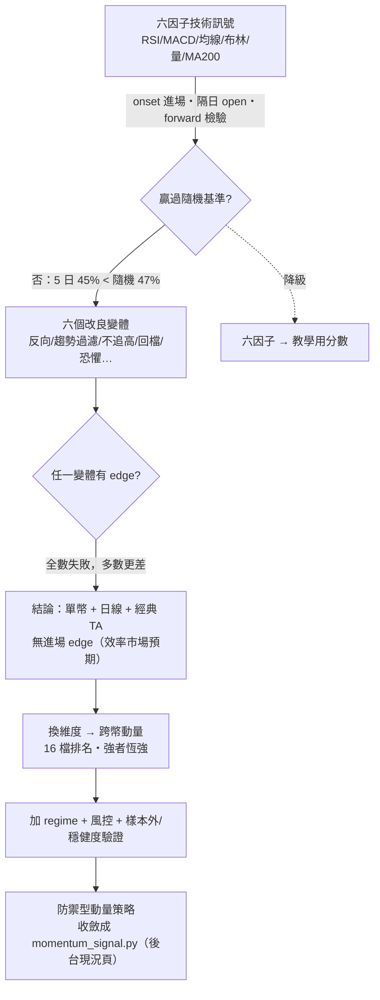

圖：研究軌跡——為何六因子降為教學用、動量策略上位

共用的檢驗尺（無偷看未來）：訊號在第 `i` 天收盤可知 → 隔天 `open[i+1]` 進場 → `N` 天後 `open[i+1+N]` 結算；只取「首次出現（onset）」進場；基準＝「任一天進場」（代表躺著抱）；跳過暖身 200 天；15 幣彙總。

### 六因子成績單（2026-06-29）

| 持有 | 訊號 | 樣本 | 命中率 | vs 基準 | 基準上漲率 |
|---|---|---|---|---|---|
| 5 天 | 偏多 | 1,406 | 45.4% | −2.3pp | 47.7% |
| 10 天 | 偏多 | 1,399 | 42.7% | −4.0pp | 46.7% |
| 20 天 | 偏多 | 1,397 | 40.7% | −3.7pp | 44.4% |
| 10 天 | 偏空 | 2,438 | 53.1% | −0.2pp | — |

各幣（10 天）偏多 edge 最差：LINK −14.2pp、XRP −11.7pp、ATOM −10.5pp、DOT −9.3pp、UNI −8.0pp。因子別 edge（2026-07-02 `signal_eval.py`）：RSI −0.66、均線排列 −0.69、布林 −0.72（全負）；MACD、成交量、MA200 ≈ 0。結論：目前訊號沒有 forward edge；偏多訊號是「事後確認」型——RSI 高、MACD 翻正、站上均線湊齊時漲勢已發生，接著容易回檔。1,400 筆以上樣本，不是雜訊。先前回測看似賺錢，主因是大盤整體往上加停損停利在管理部位，不是進場時機準。成績單是滾動統計，README 引用的另一組快照（5 日 45.2% vs 47.4%）為不同時點，結論不變；現值以後台「現況」頁為準。

### 六個改良變體（2026-06-30）

用同一把尺並排測，持有 10 天、15 幣彙總、基準上漲率 46.7%：

| 變體 | 規則 | 樣本 | vs 基準（命中） |
|---|---|---|---|
| baseline | 現行 BULL（score ≥ 65） | 1,393 | −3.7pp |
| A 反向 | 把 BEAR（≤ 35）當買點 | 2,437 | −0.2pp |
| B1 趨勢過濾 | BULL 且站上 MA200 且 MA200 上彎 | 911 | −5.6pp |
| B2 不追高 | BULL 且 RSI < 60 且布林位置 < 0.8 | 1,028 | −4.2pp |
| B3 回檔買 | 站上 MA200 且 RSI < 45 且動能轉上 | 291 | −1.4pp |
| D1 極度恐懼 | 恐懼貪婪 ≤ 20 | 643 | −3.8pp |
| D2 BULL 恐懼 | BULL 且恐懼貪婪 ≤ 30 | 222 | −3.0pp |

沒有任何一個變體 beat 基準，多數更差（5／20 天結論一致）；趨勢／動能過濾反而最差（印證訊號在追高）；反向≈基準（BEAR 也沒預測力，不是反著做就贏）；買極度恐懼更差（極端恐懼多叢集在下跌段）。意義：這是方法在做它該做的事——用嚴謹 forward 檢驗省下數週調參、避免上線一個假 edge。單資產＋日線＋經典技術指標／情緒在高流動性幣上沒有可提取的進場 edge，是效率市場的預期結果，不是 bug。

### 換維度：跨幣動量血脈（`src/cross_sectional*`）

幣池寫實：回測讀 `data/clean` 全部 16 檔日線，含已下市 MATIC 的歷史（至 2024-09-10）。切分與成交規則本身無前視（訊號當天收盤可知、隔日 open 成交），但多組設定的挑選判準讀了樣本外欄位（★ 判準直接看樣本外成績），因此最終常數的「樣本外成績」含選擇偏誤。

| 腳本 | 這一步做什麼 | 發現 |
|---|---|---|
| `cross_sectional.py` | 全方法掃描：每天排名，做多前 1/3、放空後 1/3；動量、反轉、低波動、距均線、相對 BTC | 跨幣動量（強者恆強）有毛 edge |
| `cross_sectional_validate.py` | 扣成本＋樣本外（純做多 top-K、每 R 天換倉、成本 0.15%） | 邊際、絕對報酬負、回撤 −75%（空頭還抱爛幣） |
| `cross_sectional_regime.py` | 加 regime：BTC 跌破均線就轉現金 | 回撤與絕對報酬明顯改善 |
| `cross_sectional_hardened.py` | 加風控：反波動加權、波動度目標 | 壓回撤、保報酬 |
| `cross_sectional_robust.py` | walk-forward 分年＋倖存者偏差壓力測試（持股以 1%／2%／5% 機率暴崩 −90%） | 段段穩健、量化倖存者偏差 |
| `cross_sectional_sanity.py` | 隨機訊號／延遲 1 天／獨立重算市場 CAGR 抓 bug | 評估流程沒有無中生有 |

成品策略：`mom30`＋`BTC > 100 日均` regime＋top-5 等權＋波動目標 30%（`src/momentum_signal.py`）。後 40% 檢驗段成績（60/40 切分隨資料成長重算；2026-08-31 實跑）：

| 指標 | 本策略 | 市場（等權大盤） |
|---|---|---|
| 年化報酬 | +25.6% | −16.4% |
| 最大回撤 | −20.6% | −74.6% |
| Sharpe | 0.79 | 負 |

首次驗證快照（2026-06-30）：+27%／−19%／0.81；大盤 −19%／逾 −70%；全期則為 +11.7%／−30.8%／Sharpe 0.50。

> 誠實聲明：①「樣本外」不純——策略常數是在包含後 40% 檢驗段的多組設定比較中選出的，嚴格說這段資料「參與過設計」；參數凍結（約 2026-06 底）之後累積的資料才是乾淨的驗證段（宣告正式 holdout 起點為 #175）。②數字會漂移——60/40 切分對持續成長的歷史重算，「樣本外」不是固定期間，現值以後台「現況」頁為準。③幣池實為 16 檔含 MATIC 歷史。仍成立的是防禦性格（空頭轉現金、亂市減碼）與「大幅優於等權大盤」的方向；不成立的是把任何單一數字當可複製的期望報酬。

## 平台試行方式

1. 動量策略先以 shadow 方式存在：後台「現況」頁每日顯示今日持倉建議（regime、曝險、picks、執行狀態 pending／executed／partially_filled／unfilled）與績效，不進前台、不觸碰資金。
2. 紙上實盤（方案 B）：每日記錄建議與隔日開盤成交價，累積數月後比較「凍結參數後的實際成績」與回測（後台 #127 建立紙上交易與前瞻正確率監控，進行中）。
3. 驗收門檻（寫死不可調）：增準後的訊號在從沒看過的一段歷史上 5 日勝率贏過隨便買至少 +0.5pp；做不到就不換上線，老實用動量策略。「沒看過」採嚴格定義＝該段資料凍結、只看一次、不得用它挑設定。
4. 上線後的成績單每週重算，劣化亮紅燈；前台一律標示回測性質。

## 評估報表

| 報表 | 位置 | 回答什麼 |
|---|---|---|
| 訊號成績單 | 後台「現況」→ `GET /api/admin/signal/scorecard`（`src/signal_eval.py`） | 聽訊號進場 vs 任一天進場：命中率、平均報酬、5／10／20 天、逐因子 edge；有意義門檻 +0.5pp（約覆蓋來回成本 0.3%） |
| 動量策略現況 | 後台「現況」→ `GET /api/admin/strategy`（`momentum_signal.cached_strategy()`） | 今日建議、全期與樣本外 CAGR／MDD／Sharpe、市場 CAGR |
| 回測誠實指標 | 前台回測面板（`/api/backtest/{symbol}`） | 買入持有對照、隨機進場百分位、曝險、每筆報酬 t 統計量、參數掃描 |
| 回測驗證器 | `python src/verify_backtest.py` | 十組 PASS／FAIL，含無前視時序 |
| 宏觀預測力檢定 | `reports/macro_evidence.json`（`src/macro_eval.py`）與面板證據區 | 順風減逆風 5 日籃子報酬、HAC t、區段數（附錄 C） |

## 研究預測的校準實驗（challenger，keep_identity）

評估日期 2026-07-21；原始模型 `historical-baseline-v2`；校準器 `monotone-platt-beta-v1`；狀態：研究 challenger，不可上線，production 未變更。在 69,877 筆可校準的 paired walk-forward 樣本（訓練列須 `target_date < 發布日`，同 model × horizon 分組、跨幣 pooling，暖身門檻 180 筆／90 個發布日／正負各 30 筆）上，Platt 與 Beta 都改善了 raw 的 Brier、log loss 與 equal-width ECE，但不能解讀成方向更準：

| 方法 | Brier ↓ | Log loss ↓ | ECE ↓ | ROC-AUC ↑ | AP ↑ | F1 @0.5 ↑ | Recall @0.5 ↑ |
|---|---|---|---|---|---|---|---|
| Raw／Identity | 0.252097 | 0.697751 | 0.032438 | 0.509037 | 0.479344 | 0.416146 | 0.364464 |
| Platt | 0.250821 | 0.694863 | 0.010666 | 0.493021 | 0.470363 | 0.001796 | 0.000901 |
| Beta | 0.250822 | 0.694866 | 0.010777 | 0.493027 | 0.470590 | 0.003167 | 0.001593 |

校準把大多數機率壓到 0.5 以下，固定 0.5 門檻的 up prediction 幾乎消失；所有 horizon 的 paired Brier improvement 95% block-bootstrap CI 都跨 0；5 日與 10 日 challenger 對 forecast-time baseline 的 BSS 為負；equal-mass reliability gap 未改善（診斷不一致不能被隱藏）；資料不是 exact vintage。六組正式比較（3 horizon × 2 方法）全部 `keep_identity`：保留原始機率，校準器只保留為研究產物。SHAP 標 N/A：現行模型是 regime-conditioned empirical baseline，沒有固定 feature schema，不能填 0 也不能偽造。重跑：`python -m src.forecast_replay …` → `python -m src.forecast_calibration --input … --output …`（第 13 章 §8）。

## 現階段結論

目前平台適合進行「可解釋規則基線」的內部 shadow 試行：六因子分數在前台誠實標示教學用途；動量策略在後台每日出建議並累積凍結後的成績；研究預測持續封存並累積成熟結果。尚不應直接宣稱任何訊號可預測漲跌，也不應在沒有紙上實盤與凍結 holdout 前，讓策略觸碰真實資金或對外宣傳績效。

## 下一步（未做，需資料／決策）

- 主管拍板 A（接進平台）／B（實盤前測）／C（重新定位）；研究端建議 B → A（#79）。
- 凍結策略參數並宣告真正的 holdout 起點（#175）；紙上交易與前瞻正確率監控（#127）。
- 訊號增準計畫 Phase A–E（第 12 章 D1–D4）：先誠實分軌，再因子手術、regime 開關、walk-forward 校準。
- 研究預測「持續全數 abstain」再評估與 confidence 尺度重設計（#191、#176）；預測力驗證 1–8（#179–#186）。
- ML 訊號研究（LightGBM＋purged walk-forward，六道關卡，#76）；需規則式增準先完成當地基。
- 改測「宏觀 → 波動度」而非「宏觀 → 報酬」（#189）。

## 參考

- Jegadeesh & Titman（1993），Returns to Buying Winners and Selling Losers。
- Moskowitz, Ooi & Pedersen（2012），Time Series Momentum。
- Brier（1950），Verification of Forecasts Expressed in Terms of Probability；Gneiting & Raftery（2007），Strictly Proper Scoring Rules。
- Tashman（2000），Out-of-sample tests of forecasting accuracy。
- Kull, Silva Filho & Flach（2017），Beta calibration。
- Newey & West（1987），A Simple, Positive Semi-definite, Heteroskedasticity and Autocorrelation Consistent Covariance Matrix。
- Geifman & El-Yaniv（2017），Selective Classification；Gibbs & Candès（2021），Adaptive Conformal Inference。

# 12. 後續規劃：待辦、做法與製作順序（Backlog + Plan）

文件版本：v1.0（2026-09-02）｜用途：盤點目前尚未完成的項目與可延伸方向，並把每項展開成可跟主管討論、可交接延續的實作規劃——每項含說明／價值、做法與製作順序、觸及程式、估時、完成定義、相依、風險與延伸。完成度基準見第 07 章；進度的單一真相是後台「工作項目」（`tasks` 表：待辦 44、進行中 2）。

> 主管請先看「主管摘要（Executive Summary）」章：需要主管決策或協助的事項已在該章白話彙整；本章是給工程與交接用的完整規劃（含估時、相依與風險）。

估時以「1 名工程師＋AI 輔助」的人天概估，實際依範圍調整。分類：A 可直接做（自包含、無外部相依）｜B 可做但需設定或決策｜C 需公司 IT／維運（非寫程式）｜D 訊號準度的下一批｜E 研究預測方向｜F 產品閉環｜G 宏觀面板紀律｜H 內容與 AI 深化。規模：S 小／M 中／L 大。

### 2026-09-02 狀態校正

| 項目 | 後台編號 | 狀態 |
|---|---|---|
| 安全強化：後台預設帳密與對外曝險 | #70 | 進行中（repo 內完成；#165–#168 待辦） |
| 紙上交易與前瞻正確率監控 | #127 | 進行中 |
| 執行訊號增準計畫（規則式） | #79 | 待拍板 |
| 設定 GPT 金鑰、GPT 新聞標註、每日簡報、AI 來源信心分級、政治事件解讀 | #63、#77、#40、#128、#146 | 擱置：待金鑰 |
| 研究預測全數 abstain 再評估；confidence 尺度重設計 | #191、#176 | 待辦 |
| 預測力驗證 1–8 | #179–#186 | 待辦（規劃已拆成八步） |
| 凍結策略參數並宣告 holdout | #175 | 待辦 |
| named tunnel／Access／WAF；密碼輪替；多進程安全；外部看門狗；備份異地 | #165、#166、#167、#177、#178 | 待辦 |
| 前端品質：測試／typecheck／lint warnings、DecisionSummary 鍵盤與 ARIA、手機排序、死碼清理 | #158–#161 | 待辦 |
| 新聞分析建議引擎四件組 | #119–#122 | 待辦 |
| 時線擴充（更多幣／4h）；到價通知；投資組合；詞庫管理化；會員系統 | #66、#71、#72、#81、#78 | 待辦（#78 規劃擱置） |

## 0. 整體製作順序（建議波次）

| 波次 | 內容 | 目的 |
|---|---|---|
| Wave 0（決策＋誠實） | 主管拍板 A／B／C；B2 密碼輪替；A1 Phase A 誠實分軌；E1 abstain 再評估 | 先把「誠實」與「安全」做到位，1～2 週內可見成果 |
| Wave 1（準度地基） | D1 因子手術、D2 regime 開關、D3 walk-forward 校準；A5 凍結參數宣告 holdout；紙上實盤累積 | 訊號準度是核心價值 |
| Wave 2（正式化硬化） | C 系列：named tunnel／Access、備份異地、外部看門狗、多進程 | 對外前必備 |
| Wave 3（需資料或大改） | D5 ML 研究、E2／E3 預測 P1／P2、F 產品閉環（通知、晨報、投組）、H 內容深化 | 累積資料後才有意義 |

原則：先做「看得見成效」與「誠實安全」（Wave 0），再做「變準」（Wave 1），對外前補「正式化硬化」（Wave 2），最後才是需資料／大改的進階（Wave 3）。

## A. 可直接做（自包含、無外部相依）

### A1. 訊號增準 Phase A：誠實分軌　S（後端＋前端）｜估時 1–2 人天｜#79 Phase A

- 說明：把已驗證的動量策略搬到前台當正式建議；六因子分數降級標示為教學參考。
- 價值：前台不再以無 edge 的分數當唯一建議；口徑與後台一致。
- 做法與製作順序：①開公開 API `GET /api/strategy/today`（來源 `momentum_signal.cached_strategy()`，只回建議與績效摘要）②`HeroSignal` 加「正式策略」區塊（今日持幣建議／抱現金＋回測績效標示與誠實聲明）③六因子分數改標「技術指標綜合分（教學用）」④AI 規則引擎 context 加入策略建議讓小Q 口徑一致。
- 觸及程式：`backend/routers/`（新 `strategy.py` 或併入 meta）、`frontend/src/components/HeroSignal.jsx`、`DecisionSummary.jsx`、`services/ai_analyst.build_context`。
- 完成定義：前台看得到今日策略建議與樣本外聲明；`pytest` 補端點測試；`npm run build` 過。
- 前置：主管拍板 A 或 B→A。相依：無。風險：低；文案必須帶誠實聲明（含選參保留）。
- 延伸：策略歷史持倉時間軸；紙上實盤成績公開。

### A2. 使用分析後台圖表化　S（前端）｜估時 1 人天

- 說明：`access_log` 已有 14,669 列（路徑、幣種、狀態碼、耗時），後台「分析」分頁停用中。
- 做法：後台加端點彙總（造訪量／熱門幣／慢端點／錯誤率）→ 分頁圖表（recharts）。
- 觸及程式：`routers/admin.py`、`admin/AdminApp.jsx`。完成定義：分頁啟用、圖表可看近 7／30 天。風險：低。

### A3. 前端品質門檻　S–M（前端）｜估時 2 人天｜#158–#161

- 說明：lint warnings（21 個既有）清零、`test:forecast` 納入常規、DecisionSummary 鍵盤與 ARIA、手機版 MarketSummary 排序、清理 `CoinSidebar.jsx`／`MarketOverview.jsx` 死碼。
- 完成定義：`npm run lint` 0 warnings；死碼刪除後 build 過。風險：低。

### A4. 時線擴充：更多幣／4h 週期＋後台管理　M（後端＋前端）｜估時 2–3 人天｜#66

- 說明：抓取與指標已參數化，`hourly_symbols` 在 `app_config`；缺後台 UI 與 4h 週期。
- 做法：後台幣種頁加「時線」開關 → `hourly_symbols` 寫入；`fetch_binance`／`indicators` 加 `4h`；前端 `HOUR_OPTIONS` 擴充。
- 完成定義：後台勾選即下一個 :06 抓取；前台可切 4h。風險：Binance 請求量增加（每幣間隔 5 秒已有）。

### A5. 凍結策略參數並宣告 holdout 起點　S（研究）｜估時 0.5 人天｜#175

- 說明：把 `momentum_signal.py` 常數與凍結日期寫進 `model_registry` 式的紀錄，之後累積的資料才是乾淨驗證段。
- 做法：加 `reports/strategy_freeze.md`（常數、日期、理由）；後台「現況」頁標示凍結日與凍結後成績。完成定義：凍結後成績與全期成績分開顯示。

### A6. 一次性停止追蹤 runtime artifacts　S（版控）｜估時 0.5 人天｜#169

- 說明：`.gitignore` 只擋新產物；歷史中已追蹤的 `data/clean`、`reports/*.csv|json` 仍會顯示修改。
- 做法：`git rm --cached` 一次性移除並驗證可由管線重建；獨立 snapshot commit 標示資料 vintage。風險：需確認無人依賴 git 內的資料快照。

## B. 可做但需設定或決策

### B1. 啟用 GPT 金鑰　S（設定）｜估時 0.5 人天｜#63

- 說明：GPT 深度解讀、問答潤飾、新聞批次情緒標註、每日晨報都等這把鑰匙。
- 做法：後台 `PUT /admin/ai/config` 貼上（即時生效）或 `OPENAI_API_KEY` 環境變數；`POST /admin/ai/test` 驗證；看 `ai_usage`。
- 前置：主管決定是否申請與預算（新聞標註約每日不到 0.01 美元；分析每小時上限 80 次）。相依：H1、H2、F2。

### B2. 後台密碼輪替　S｜估時 0.2 人天｜#166

- 做法：主管指定 ≥ 12 字元新密碼 → 改 `secrets.local.cmd` → 重啟 `CryptoQuantBackend` → 登入驗證 → 保管於私人密碼工具。完成定義：啟動 log 不再出現高風險警告。

### B3. 到價／訊號變化通知　M（後端＋Telegram）｜估時 3 人天｜#71

- 說明：站內鈴鐺＋Telegram Bot；時線資料已就緒。
- 做法：`app_config` 存規則（幣、價位、訊號變化）→ 排程每小時檢查 → Telegram Bot 推播；前台鈴鐺列表。
- 前置：Telegram Bot token；決定誰收。風險：訊號本身無 edge，通知內容需標示。

### B4. AI 每日晨報　M（後端）｜估時 2 人天｜#40

- 說明：每日管線後自動生成「今日市場 3 分鐘」，與 B3 串成閉環。前置：B1。

### B5. 詞庫／問答庫後台管理化　M（後端＋前端）｜估時 3 人天｜#81

- 說明：詞庫與 `QA_TEMPLATES` 從程式常數搬到 `app_config`（或新表），主管核可後線上增修即時生效。
- 做法：新表 `lexicon(word, polarity, weight, lang, approved_by, approved_at)` → 後台頁 CRUD＋核可流程 → `sentiment.py` 讀 DB（快取 5 分）。前置：主管核可流程確立。風險：需保留審核紀錄；改詞只影響之後的判讀。

## C. 需公司 IT／維運（非寫程式，正式上公網前必備）

> 性質：非寫程式，列為對外上線前置。工程端能配合的是提供設定與健康檢查（多已完成）。

- named tunnel 固定對外網址＋Cloudflare Access 保護 `/admin`＋WAF（#165）：需公司網域與 Cloudflare 帳號權限。
- 備份改為獨立排程工作並推送異地（#178）；每季還原演練。
- 外部看門狗＋dead man's switch（#177）：機器層級或第三方 uptime 監控，補崩潰迴圈盲區。
- 多進程共享 quota 與 SQLite 備份鎖（#167）：若未來改多 worker 部署才需要。
- 主機 IP 或位置變更時同步改三處（`start_backend.cmd`、quant-portal、台股 `.env.local`）。

## D. 訊號準度的下一批（多需累積資料）

> 順序：D1→D2→D3 為訊號增準計畫 Phase B–D（#79），需 A1 先做；D4 選配；D5 ML 需 D1–D3 完成當地基（#76）。驗收門檻寫死：樣本外 5 日勝率 ≥ 基準 +0.5pp。

### D1. Phase B 因子手術　M（研究）｜估時 3–5 人天

- 說明：新增 `src/factor_lab.py`（擴充 `signal_eval` 的因子檢驗框架）；對照組為現有六因子完整報告。
- 實驗矩陣（每項輸出 edge、觸發數、分年穩定性；pooled 15 幣＋BTC／ETH 單獨）：B2a 負因子翻轉（RSI 突破 50 向上加分、布林上軌突破加分）；B2b 負因子刪除；B2c 負因子條件化（僅 regime 多頭計分）；B3 新因子（30／90 日跨幣動量排名、距 52 週高點 %、BB 寬度百分位、恐懼貪婪極端值、新聞情緒日分數）。
- 完成定義：因子清單 v2（僅保留 edge ≥ 0 且分年不翻車者）＋`reports/factor_report.md`。

### D2. Phase C regime 開關　S（研究）｜與 D1 並行

- 說明：BTC 收盤 > MA100 才允許 BULL（對照 MA200、ADX > 25 取樣本外最穩者）；空頭天氣最高只給中立。
- 紀律：不得回頭調整已凍結的 `src/macro_regime.py` 門檻；若要把宏觀因子納入買賣訊號，需另行宣告新的 holdout 期再驗證。

### D3. Phase D walk-forward 校準　M（研究）｜估時 3–5 人天

- 切分：訓練 2021-07～2024-06 → 驗證 2024-07～2025-06 → 測試 2025-07～今（凍結、只看一次）；參數空間刻意小（權重 {0, 0.5, 1, 1.5, 2}、門檻 {60,65,70}×{30,35,40}）；訓練窗選前 3 組 → 驗證窗擇一 → 測試窗報告即定案；`src/backtest.py` 含成本重跑 vs buy&hold。
- 完成定義：達門檻→上線切換＋成績單改版；未達→不上線、續用動量策略。

### D4. Phase E 1h 時線確認　S（選配）｜估時 2 人天

- 日線訊號成立後需 1h 動能同向（1h MACD hist > 0 或站上 1h MA20）才升級「行動訊號」；用 BTC／ETH 驗證假訊號率是否下降。

### D5. ML 訊號研究（LightGBM＋purged walk-forward）　L（研究）｜估時 2–3 週＋4 週紙上觀察｜#76

- 方法：LightGBM 二分類（depth ≤ 4、早停、類別權重平衡）；label 為未來 5 日報酬正負（20 日波動標準化；第二輪 triple-barrier）；30～40 個特徵全取自現有 DB（技術、動量、regime、跨幣截面、情緒、日曆）；purged walk-forward（6 個滾動窗、訓練 2.5 年→測試 6 個月、5 日 embargo、scaler 只 fit 訓練窗、不 shuffle）；baseline 亂猜 47%、規則式 v2、動量策略。
- 六道 Go／No-Go：M0 特徵倉（2 天）→ M1 首次模型（樣本外 AUC > 0.53，否則停）→ M2 SHAP 拆解 → M3 含成本回測贏規則式且不劣於動量（否則留工具不上線）→ M4 紙上實盤 4 週 → M5 成為第三個 AI 引擎（三票制，需主管點頭）。成功的樣子是 52～55% 勝率，不是 70%。
- 工程：`src/ml/features.py`→`train.py`→`score.py`；新表 `ml_signal(date, symbol, prob, top_features_json)`；相依 `lightgbm scikit-learn shap`（開源免費）。前置：D1–D3；前台 AI 面板恢復掛載或改後台呈現。

## E. 研究預測方向

### E1. 持續全數 abstain 的再評估　S（研究）｜估時 1 人天｜#191、#176

- 說明：上線至今 1,623 筆快照全數 abstain、ready coverage 0%。符合「低信心就拒答」的設計，但規格沒有為「持續全拒答」訂再評估條款。`forecast_diagnose.py` 顯示門檻 40 需 `P(上漲) ≥ 70%` 才及格。
- 做法：分析信心三乘項分布（edge、sample_strength、區間寬度懲罰）→ 提出新的 confidence 尺度或門檻，但只能在 training fold 決定、在 untouched fold 評估，不得為畫面好看而調低。
- 完成定義：書面決策（維持／調整）＋若調整則新 `model_version`。風險：任何調整都是新模型版本，成績從零累積。

### E2. P1 校準、區間與線上監控　M–L（研究）

- chronological validation 比較 Platt／Beta；calibration intercept／slope、equal-mass reliability、rolling Brier；rolling conformal／ACI／EnbPI 建立時間序列適用區間；drift monitor 先觸發擴大拒答／回退，不自動重訓。

### E3. P2 模型組合與決策價值　L（研究）

- champion／challenger 組合（等權起）、ensemble 後重新校準、階層式 symbol／regime shrinkage、多分位報酬分布與 expected utility。

### E4. exact-vintage 資料快照　M（資料）

- 保存每日原始 K 線版本與歷史 universe membership，消除 `vintage_exact=false` 與 survivorship blocker；可與 A6 的 snapshot commit 結合。

## F. 產品閉環（從被動查詢 → 主動推播）

### F1. 投資組合追蹤＋AI 健檢　M（前端＋後端）｜估時 4 人天｜#72

- 手動輸入持倉 → 損益／配置；AI 用相關性矩陣（`/api/correlation` 已在）做組合風險健檢。前置：無；若要 GPT 文字則 B1。

### F2. 簡易／專業模式與新手導覽恢復　S（前端）｜估時 1–2 人天

- 2026-07-02 曾實作簡易／專業模式後依決策改單一介面；`OnboardingTour`、辭典程式保留。做法：取消註解＋依現行版面調整。前置：主管決定介面取向。

### F3. 前台 AI 面板與小Q 恢復　S（前端）｜估時 0.5 人天

- `AIAnalystPanel`、`BotWidget` 取消註解即恢復；建議與 B1 同步，否則只有規則引擎。

### F4. 會員／裝置配對　L｜#78（規劃擱置）

- 目前前台免登入、單一管理帳號；若要個人化（自選幣、持倉）才需要。風險：引入個資即需第 08 章升級為個資保護。

## G. 宏觀面板紀律

- 已於 2026-08-10 完成重新上架：十年歷史、規則核心 `src/macro_regime.py`、預測力檢定、BTC 連動強度、每格出處。
- 紀律：門檻訂於檢定之前且不得依檢定結果回頭調整；若要納入買賣分數必須重新宣告 holdout。
- 下一步：改測「宏觀 → 波動度」而非「宏觀 → 報酬」（#189）——宏觀對報酬方向不顯著，對波動或許有訊息，可用於曝險調整而非方向。

## H. 內容與 AI 深化

### H1. GPT 新聞批次情緒標註　S（後端）｜估時 1 人天｜#77

- 治詞庫版 neutral 占比偏高（72%）；成本約每日不到 0.01 美元；只標「之後抓的」，歷史另批次。前置：B1。風險：GPT 判讀不可重現，需保留詞庫版並列。

### H2. AI 答案加入資料來源與信心分級；宏觀／政治事件文字解讀　M｜#128、#146

- 分析引擎內部英文邏輯、對外中文顯示；政治文字解讀為 GPT 加值層，須標示非本站驗證數據。前置：B1。

### H3. 新聞分析建議引擎（規則版先行）　M｜估時 3–4 人天｜#119–#122

- 規則版先行（不需金鑰）：由每日情緒分數與分類產生「新聞面建議」→ API 與快取 → 前台情緒面板區塊 → 有效性驗證報表（與訊號成績單同一把尺）。風險：情緒因子 A/B 尚未證明有效，建議只作背景不進分數。

## 建議起手順序

1. Wave 0：主管拍板 A／B／C（#79）＋ B2 密碼輪替（#166）＋ A1 誠實分軌 ＋ E1 abstain 再評估——皆自包含、1～2 週內可見成果。
2. Wave 1：A5 凍結參數宣告 holdout → D1 因子手術與 D2 regime 開關 → D3 walk-forward 校準；同時紙上實盤（#127）累積凍結後成績。
3. 要對外：先推 C 系列（named tunnel／Access、備份異地、外部看門狗）。
4. 要 AI：B1 金鑰 → H1 新聞標註 → F3 面板恢復 → B4 晨報 → H2。
5. 較大的研究項另約：D5 ML、E2／E3 預測 P1／P2，各先做 0.5～1 天設計 spike。

更新方式：每完成一項，於後台「工作項目」標 done 並同步第 07 章交付線與相關章節（05 API／08 安全／10 手冊）。

## 給主管討論的一頁摘要

- 現況：資料管線、指標驗證、誠實的訊號檢驗、動量策略（後台）、可稽核研究預測、情緒與宏觀面板、後台與部署、macOS 與搬遷都已完成並穩定運作；對外公開卡在 C 系列（網域與 Cloudflare 權限）與密碼輪替。
- 建議先做：Wave 0（拍板策略去向、輪替密碼、動量策略上前台、預測拒答再評估）——約 1～2 週。
- 策略方向（待拍板）：研究端建議 B → A：先紙上實盤數月確認穩健度，再產品化搬上前台；C（重新定位為風控＋誠實研究工具）也是誠實的選項。
- 需公司決定／提供：GPT 金鑰與預算、對外時程與網域、新密碼、Google News 授權判斷。
- 追蹤：後台「工作項目」為唯一真相；本手冊第 07 章與第 12 章在重大交付節點重新同步。
# 13. 研究預測成績單與發布閘門操作規格

更新日期：2026-09-02（原 Forecast Scorecard P0 規格 2026-07-21，含 2026-09-02 現況）

適用範圍：`GET /api/forecast/{symbol}`、`GET /api/forecast/ledger-status`、`GET /api/forecast/scorecard`、每日 `forecast_pipeline`、後台「模型成績」頁與前台決策卡

目前狀態：程式、後端自動測試（預測契約 10 項、評估指標 18 項、校準 22 項、replay 6 項、排程 4 項、成績單 API 6 項）與 P0 驗收清單已完成；live ledger 累積 1,623 筆快照、1,383 筆成熟結果；成績單 top-level 為 `insufficient_evidence`，快照全數 `abstain`（#191 追蹤）。

## 1. 目的與不可妥協原則

本功能用不可回寫、可重播、完全樣本外的資料回答：模型給的機率是否誠實（長期被預測 70% 的事件是否約 70% 發生）、是否優於當時可取得的簡單基準、拒答後是否真的降低錯誤與代價、q10–q90 區間是否接近標稱 80% 覆蓋且仍有決策價值、證據是否足以讓某個 `model_version + horizon_days` 進入人工發布審查。它不是價格預言機，也不是買賣指令。

- 只使用已完成的 UTC 日線；當天尚未收完的 K 棒不可進快照。
- 快照、結果與模型登錄一律 append-only，資料庫層觸發器禁止 UPDATE／DELETE。
- 實現報酬永遠用快照封存的 `reference_close`，不回頭讀已修訂的收盤價。
- 拒答不可隱藏弱模型：只要快照有原始機率就同時計入 all-forecast 成績，另計 ready 子集。
- 缺值不可補造：機率為 `null` 的樣本只計狀態與數量，不填 0.5 參與評分；沒有成熟結果就顯示 `unverifiable`，不顯示 0% 或 100%。
- 基準只能用預測發出當下已成熟的結果（prequential），不得用評估區間的事後正例率。
- 不因成績單結果自動下單、自動調整部位、自動升級模型或自動改門檻。
- 模型方法、特徵、校準器、訓練窗、閾值或輸入處理任一改變，就必須建立新 `model_version`。

## 2. 角色與資料範圍

| 角色 | 看得到 | 做得到 |
|---|---|---|
| 訪客 | 單幣快照（`/forecast/{symbol}`，30 次／分）、ledger 累積狀態（只有彙總數字） | 無寫入；快照未命中時由系統封存，不由使用者決定 |
| 管理者 | 完整成績單（`/forecast/scorecard`，12 次／分）、後台「模型成績」頁的篩選與 gates | 觸發每日管線；不能改任何已封存紀錄 |
| 排程器 | 全部 | 每日封存當日快照、結算成熟結果、即時算成績單摘要附在 `forecast_pipeline` job |
| 研究者 | replay 與校準 artifact（`reports/*.json`，不入版控） | 只讀 CLI；結果寫隔離 store，不冒充 production |

## 3. 快照欄位與拒答規則

### 3.1 每筆快照欄位（`forecast_snapshot_v2`）

| 欄位 | 約束與用途 |
|---|---|
| `forecast_id` | content-addressed 主鍵：`"fc_" + sha256(版本｜幣｜天期｜as_of｜input_hash)[:24]` |
| `symbol` | 大寫交易對 |
| `horizon_days` | 只允許 1、5、10 |
| `as_of` | 最後一根被模型使用的已完成 UTC 日線日期 |
| `generated_at` | 實際封存時間（UTC） |
| `model_version` | 連到 `model_registry`（`research` 必為 1） |
| `input_hash` | 正規化輸入（逐列 `YYYY-MM-DD|float.hex()`）的 lowercase SHA-256 |
| `data_version` | `as_of:observations:hash-prefix(16)` |
| `reference_close` | 封存的基準收盤價，必須為正 |
| `status` | `ready` 或 `abstain` |
| `payload_json` | `probabilities.up/down`、`return_quantiles_pct.q10/q50/q90`、`downside_risk.threshold_pct/probability`、`regime`、`confidence.score/level`、`abstain_reason`、`data_quality.stale/observations`、證據（schema v2：supporting／opposing） |

### 3.2 統一天期與門檻

| 項目 | 值 |
|---|---|
| 天期 | 1／5／10 日 |
| 下跌風險門檻 | 1 日 −3%、5 日 −7%、10 日 −10% |
| regime | `close vs MA60`＋近 20 日報酬 → bull／bear／sideways；不足 61 根 unknown |
| 同 regime 最少成熟結果 | 30 筆（不足退回全歷史並標 fallback） |
| 最少完成日線 | 120 根 |
| 資料過期 | `as_of` 落後 > 2 天即拒答（交付時 `apply_freshness_guard` 也會改判） |
| 機率 | Laplace `(k+1)/(n+2)`；分位 `np.quantile([0.1, 0.5, 0.9])` |
| 信心 | `100 × edge × sample_strength × width_penalty`；`edge = |p_up−0.5|×2`、`sample_strength = min(1, n/200)`、`width_penalty = max(0.25, 1−max(0,(q90−q10)−20)/60)`；≥ 70 high、≥ 40 medium |
| ready 門檻 | 信心 ≥ 40 |

### 3.3 拒答原因

任一成立即 `abstain`：資料過期（`data_stale`）、方向優勢不足（`|p_up−0.5| < 0.07`）、信心 < 40、區間 `q90−q10 > 35` 個百分點。通過後 `p_up ≥ 0.57` → `research_watch_upside`、`≤ 0.43` → `research_watch_downside`、其餘 `wait`。前台決策卡把原因白話顯示，不顯示假精準數字。

## 4. 結果（outcome）結算

`forecast_outcome_v2` 只能在 horizon 成熟後 append：`target_as_of` 為 `as_of` 後第 N 根已完成日線（不是日曆日）；`realized_return_pct = (outcome_close / reference_close − 1) × 100`；`actual_direction` 為 up／down／flat；`payload_json.outcome_up` 報酬 > 0 為 1；`reference_close`、`model_version`、`input_hash` 必須與快照一致。未到第 N 根、價格缺口未補齊或無有效基準價，維持 pending，不用日曆日近似、不做內插。`resolve_mature_forecast_outcomes()` 每次掃描 `max(10000, limit×10)` 筆避免單一缺資料幣阻塞其他預測。

## 5. 封存、成熟、修訂與不可覆寫

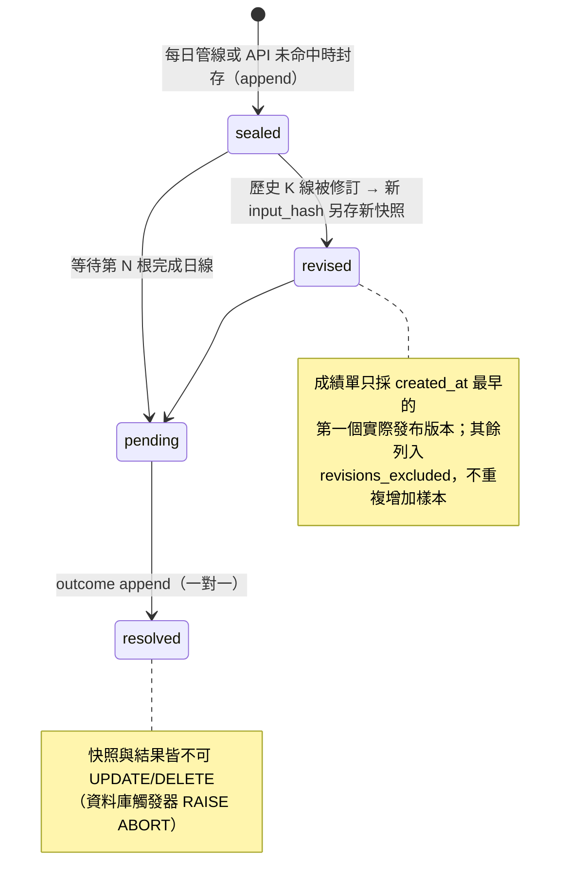

圖：快照狀態機——封存後只會新增結果或新版本，永遠不會被改寫

- 同一 `(symbol, horizon_days, as_of, model_version)` 因修訂而有多個 `input_hash` 時，canonical record 是 `created_at`＋SQLite rowid 最早的那筆；其他列入 `revisions_excluded` 供資料品質診斷。
- 若未來加入「同日修訂後確實再次曝光給使用者」的 exposure ledger，才可改以 exposure 為計分單位；在此之前不得把同日所有修訂快照都視為獨立預測。
- 快照未命中時 API 也會封存；`AppendOnlyConflict` 競態改讀已寫入者，失敗回 409。

## 6. 成績單計分與 point-in-time 規則

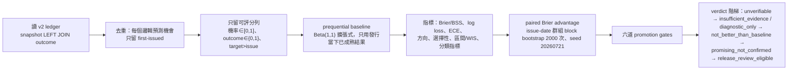

圖：成績單流程——去重、可評分過濾、時點基準、指標、相依樣本信賴區間、發布閘門

1. 取 `model_version + horizon_days` 的 v2 快照；inner join outcome，無 outcome 者計 pending。
2. 檢查快照與結果的 symbol、horizon、model version、input hash、reference close 一致。
3. 用快照內的原始機率、分位數、狀態與當時 regime 計分。
4. 基準：對每筆快照只用相同 `symbol + horizon`、`target_as_of <= issue_date` 的較早成熟結果，`(up_count+1)/(resolved_count+2)`；完全沒有歷史結果時回到 0.5；同一市場事件跨模型只計一次。
5. 決定性：相同 ledger、查詢條件、schema 與 seed 下，除 `generated_at` 外結果必須逐位一致；排序固定 `as_of` → `symbol` → `horizon_days` → `model_version` → `forecast_id`。
6. 相依樣本：抽樣單位保留同一 `as_of` 的全部 symbols；block 長度 `max(7, 2×horizon)` 日曆日；API 2,000 次重抽、seed 20260721；CLI 預設 1,000 次、seed 0；issue dates 少於 block 時縮短並回傳實際 `block_size`。

## 7. 版本與歷史不可覆蓋

- `model_registry` 目前兩版：`historical-baseline-v1`（legacy，缺完整 `input_hash` 與 sealed `reference_close`）、`historical-baseline-v2`（現行）；方法皆為 `Laplace-smoothed empirical returns in the same regime`，`point_in_time: true`。
- legacy 表預設排除於正式閘門；`include_legacy=true` 只供相容性研究，provenance 分列 counts、加 warning、`v2_only_provenance` gate 失敗、`release_eligible=false`。
- 重跑只會產生新快照，舊紀錄無法重算；replay 寫隔離 store 並標 `vintage_exact=false`（目前 DB 保存的是修訂後行情、`data/raw` 只留 7 天）。

## 8. API 操作範例

### 8.1 取單幣快照

```text
GET /api/forecast/BTCUSDT?horizon=5
→ 200 {"status":"abstain","abstain_reason":"...","probabilities":{"up":0.515,"down":0.485},
       "return_quantiles_pct":{"q10":-6.58,"q50":0.4,"q90":7.9},"regime":"sideways",
       "confidence":{"score":12.3,"level":"low"},"input_hash":"…","data_version":"2026-09-01:1888:…",
       "reference_close":…,"model_version":"historical-baseline-v2"}
→ 422 horizon 不是 1/5/10；409 併發封存衝突且無法讀回
```

### 8.2 取成績單（後台）

```text
GET /api/forecast/scorecard?model_version=historical-baseline-v2&horizon=5
Authorization: Bearer <admin token>
→ 200 {"status":"insufficient_evidence","filters":{…},"provenance":{"release_eligible":true,"v2_snapshots":…},
       "overall":{"resolved_count":…,"issue_dates":36,"metrics":{…},"intervals":{…},
                  "brier_advantage_ci":{"estimate":…,"lower":…,"upper":…,"block_size":10,"n_resamples":2000,"random_seed":20260721},
                  "promotion_gates":[{"gate":"minimum_observations","status":"failed","actual":…,"required":1000},…]},
       "by_horizon":[…],"assessment":{"verdict":"insufficient_evidence","trust_score":…},"generated_at":"…","warnings":[]}
→ 401 未登入；422 horizon 不合法；200 + status=unverifiable 當沒有成熟結果
```

### 8.3 重跑 replay 與校準（研究）

```powershell
.\.venv\Scripts\python.exe -m src.forecast_replay --symbols BTCUSDT,ETHUSDT --horizons 1,5,10 `
  --start-date 2025-01-01 --end-date 2026-06-30 --bootstrap-samples 2000 --seed 20260721 --output reports/forecast_replay.json
.\.venv\Scripts\python.exe -m src.forecast_calibration --input reports/forecast_replay.json `
  --output reports/forecast-calibration-research.json --min-samples 180 --min-issue-dates 90 --min-class-samples 30
.\.venv\Scripts\python.exe src\forecast_diagnose.py        # 為何永遠拒答、以及準不準
```

正式研究報告應明確傳 `--symbols`，不要依「今天啟用中的幣」決定歷史 universe；JSON 會記錄 `vintage_exact=false`、universe source、模型版本、maturity rule 與每個來源 CSV 的 SHA-256。

## 9. 報表計算與禁止誤用

### 9.1 指標定義

| 指標 | 回答什麼 | 正確解讀／null 規則 |
|---|---|---|
| Brier score `mean((p−y)²)` | 機率品質（校準＋辨別） | 越低越好；優先與相同 forecast IDs 的 point-in-time baseline paired 比較 |
| Brier Skill Score `1 − BS_model/BS_baseline` | 是否勝過 forecast-time baseline | > 0 才表示優於基準；仍須 paired CI 下界 > 0 |
| Log loss | 重罰過度自信的錯誤 | clip 到 `[1e-15, 1−1e-15]` 只為數值穩定，不改資料庫原值 |
| ECE（10 等寬 bins） | 宣稱機率與實際頻率的加權落差 | 對分箱敏感，只能輔助；每 bin 計數必須一起顯示；equal-mass 版本亦報 |
| Accuracy／Precision／Recall／Specificity／F1 | threshold 0.5 的分類表現 | 必須連同 majority baseline、Balanced accuracy、MCC 與 coverage；沒有 predicted-up 時分母為 0 顯示 null 不填 0 |
| ROC-AUC、Average Precision | 排序品質 | 0.5 近似隨機；AP 必須和同切片 prevalence 比 |
| publication coverage | 可計分預測中 `status=ready` 的比例 | 與區間 coverage 不同 |
| risk–coverage 曲線 | 依 `max(p, 1−p)` 排序在每個 confidence tie 後的 coverage、風險、選擇性準確率、Brier | 與 ready／abstain 狀態是兩個概念，後台分開呈現 |
| 區間 coverage／width／interval score／WIS | q10–q90 是否接近 80% 且仍有決策價值 | coverage、width 與 interval score 必須一起報；`q10 > q50` 或 `q50 > q90` 的列不進區間指標 |
| SHAP | feature attribution | 現行模型無固定 feature schema，一律 N/A，不填 0、不偽造 |

### 9.2 固定 replay 的目前數值（2026-07-24 定版，15 幣、73,881 筆成熟 replay observations，issue dates 2021-10-30～2026-07-19）

| 類別 | 指標 | 目前數值 | 正確解讀 | 判定 |
|---|---|---|---|---|
| Proper | Brier／baseline | 0.252671／0.251558 | 模型較差；BSS = −0.4424% | 不合格 |
| Proper | Log loss／baseline | 0.698954／0.696363 | 模型較差 | 不合格 |
| Calibration | ECE（10 bins） | 0.035678 | 約 3.57 個百分點的 gap；不可抵銷負 BSS | 不合格 |
| Threshold | Accuracy／majority | 0.510551／0.526861 | 低於永遠預測 non-up | 低於基準 |
| Threshold | Precision | 0.477891 | 僅比 prevalence 0.473139 高 0.48pp | 不合格 |
| Threshold | Recall／Specificity | 0.372554／0.634477 | 漏掉約 62.7% 的 up events | 不合格 |
| Threshold | F1、Balanced accuracy、MCC | 0.418699、0.503515、0.007275 | 接近隨機 | 接近隨機 |
| Ranking | ROC-AUC、AP／prevalence | 0.504585、0.470341／0.473139 | 接近 0.5；沒有 PR lift | 無 lift |
| Uncertainty | 80% interval | coverage 82.6775%、width 22.9604pp、WIS 4.504830 | coverage 落在暫定帶，但尚無 interval baseline／cluster CI | 僅 coverage 落在規劃帶 |
| Evidence | Paired Brier advantage 95% CI | [−0.003007, 0.000843] | 跨 0 | 不合格 |

各 horizon：1 日 N=24,692、BSS −0.1979%、AUC 0.500；5 日 N=24,632、BSS −0.4319%、AUC 0.503；10 日 N=24,557、BSS −0.6963%、AUC 0.496（三個 horizon BSS 全為負；10 日 AUC 低於 0.5 且 Brier、log loss、ECE 最差）。依目前 prevalence，永遠預測 up 可得 Recall 1.0、F1 0.642，卻沒有任何辨別能力——F1 或 Recall 的漂亮數字可能只是退化成單一類別策略。

### 9.3 多少才有參考意義（P1 內部研究里程碑，不是通用及格線）

| 指標／條件 | 目前 | 最低有參考意義的證據 | 下一階段內部目標 |
|---|---|---|---|
| 證據量與 provenance | pooled N=73,881；`vintage_exact=false`；ready N=0 | 每個 model＋horizon ≥ 1,000 筆、180 個 issue dates、正負類各 100；完整 universe、唯一 forecast ID、exact vintage | 另累積同規模 live／shadow matured outcomes |
| Brier／BSS | 0.252671／−0.4424% | BSS > 0 且 baseline − model 95% CI 下界 > 0 | 每個 horizon BSS ≥ +1% |
| Log loss | 0.698954 | 低於相同 IDs 的 baseline 且 paired CI 下界 > 0 | ≥ 0.5% relative improvement |
| ECE | 0.035678 | equal-width 與 equal-mass 都優於 identity 且 Brier／AUC 不退步 | 兩種 ≤ 0.02 |
| ROC-AUC | 0.504585 | clustered CI 下界 > 0.5 且各 horizon／regime 穩定 | ≥ 0.53 弱訊號；≥ 0.55 較強 |
| Average Precision | 0.470341 | AP > 同切片 prevalence 且 lift CI 下界 > 0 | ≥ prevalence +5% relative |
| Balanced accuracy／MCC | 0.503515／0.007275 | 95% CI 下界 > 0.5／> 0 | ≥ 0.52／≥ 0.05 |
| Ready coverage | 0% | 預先登錄 coverage floor 再評分 ≥ 1,000 筆 ready outcomes | ≥ 10% 作 shadow 里程碑；不得看完測試再調低 |
| 80% interval | 82.68%／22.96pp／WIS 4.50 | coverage 落在預先登錄 77%–83% 且 WIS 優於同口徑 baseline | WIS relative improvement ≥ 5% |

最重要的判定規則：達到 point target 但 CI 仍跨過基準，只能稱為「值得繼續研究」；最低可依賴證據仍是「優於正確 forecast-time baseline，且 paired CI 排除無改善」。

禁止誤用：不得把方向命中率當主要模型分數；不得只展示最好看的幣種或期間；不得因 Recall 太低就在 test set 上調 0.5 門檻；不得在看完 frozen scorecard 後自動改 `MIN_READY_CONFIDENCE`、MA window、classification threshold 或校準器再重跑同一份資料（feedback loop）；不得把「顯示了」寫成「已通過發布門檻」。

## 10. UAT 最小驗收清單

- [x] 同一輸入、版本與 seed 重跑，分數與 bootstrap CI 一致；`as_of` 後加入未來價格，既有 forecast ID、hash、機率、區間、狀態與 baseline 不變。
- [x] replay 與 production `generate_forecast()` 的 scoring fields 對照一致；DB helper 與觸發器拒絕 snapshot／outcome UPDATE、DELETE。
- [x] 同 origin 的第二個 input hash 不增加 canonical sample count；同秒寫入的修訂以 rowid 保留實際第一筆；pending 只在第 N 根完成日線存在時成熟。
- [x] 預設只讀 v2；混入 legacy 時 provenance gate 失敗；replay 輸出資料檔 hash、universe source 與 `vintage_exact=false`。
- [x] perfect probabilities 的 Brier／log loss 為 0；BSS 與逐筆 prequential baseline 公式一致；probability 1.0 落入最後 bin；risk–coverage 不拆 confidence ties；q10／q90 邊界值視為 covered；block bootstrap 保留同日群組且固定 seed 可重現；0 outcome 回 null 不產生 NaN。
- [x] scorecard GET 需有效 admin token 且前後 ledger row counts 不變；不支援 horizon 回 422；未指定單一 model＋horizon 時 aggregate gate 為 `not_applicable`；symbol／window 篩選只供診斷。
- [x] 每日 outcome 解析完成後才算成績單摘要；摘要失敗不阻斷或回寫已完成的 pipeline。
- [x] 後台同時顯示 resolved count、ready coverage 與 ready accuracy；BSS 標示 forecast-time expanding baseline；空樣本顯示「—」；區間同時顯示 coverage、width 與 WIS；介面只描述「可進入人工審查」。
- [ ] 2026-09-02 重跑：top-level `insufficient_evidence`、1,383 筆成熟結果、全數 abstain——屬預期行為，非驗收失效；「持續全拒答」再評估另案（#191）。

獨立 API 驗收檔：`tests/test_forecast_api.py`、`test_forecast_scorecard_api.py`；指標：`test_forecast_evaluation.py`；replay：`test_forecast_replay.py`；校準：`test_forecast_calibration.py`；排程：`test_forecast_scheduler.py`。

## 11. IT 後台與維運檢核

### 11.1 上線前

- 每日備份涵蓋 `forecast_*` 與 `model_registry`（不可重建）；還原演練後確認觸發器仍在（`SELECT name FROM sqlite_master WHERE type='trigger'` 應有 10 個）。
- `pytest tests -q` 全綠；前端 `npm run build` 與 `npm run test:forecast` 通過。
- 後台「模型成績」頁顯示 `data_as_of`／`generated_at`，重新整理只重算成績、不改模型或門檻。

### 11.2 上線後監控

- 監看 `forecast_pipeline` job 的成敗與訊息（scorecard 計算失敗會記在摘要但不回寫 ledger）。
- 監看 ready coverage 與 abstain 原因分布；連續多週 0% 屬預期但需依 §13 再評估條款處理。
- 所有錯誤 log 應含 job ID、model version、horizon、資料截止日與受影響 forecast IDs；不得記錄管理員密碼或 token。
- 若同 origin 修訂快照突然增加，先查 K 線來源是否被修訂（`revisions_excluded` 上升）。

## 12. 誠實揭露與發布阻擋項

| Gate | P0 要求 | 失敗結果 |
|---|---|---|
| Scope | 單一 model version、單一 horizon、完整 symbol universe、完整歷史 | aggregate／symbol／window slice 只供診斷，`not_applicable` |
| Provenance | 預設只用 v2；`include_legacy=true` 必定失敗 | legacy 可研究，不可當發布證據 |
| Sample | ≥ 1,000 筆 scorable observations | `failed`，top-level 至多 `insufficient_evidence` |
| Independent dates | ≥ 180 個不同 issue dates | 同上 |
| Point skill | Brier Skill Score > 0 | `failed` 或樣本不足時 `not_testable` |
| Uncertainty | paired Brier advantage 95% CI lower > 0 | `failed`／`not_testable` |

top-level 證據狀態：`unverifiable`（沒有可評分的成熟預測）→ `insufficient_evidence`（有成熟預測但未達 1,000 筆或 180 個 issue dates）→ `evaluated`（已達證據量，仍需逐 gate 判斷）。`release_eligible=true` 只表示沒有混入 legacy，絕不等於模型通過。即使所有 gate 都通過也只能進入人工審查：人工確認資料來源、模型版本與限制；確認沒有在測試段挑門檻或模型；與既有 champion 做同期間 paired 比較；保留回退版本與書面批准紀錄。前六項未通過不得對外宣稱預測能力；前台永遠以「研究預測、非投資建議」呈現。

## 13. 現況與發布狀態

| 項目 | 2026-07-21（P0 驗收） | 2026-09-02 |
|---|---|---|
| `forecast_snapshot_v2` | 45 筆（只有 2026-07-20） | 1,623 筆（`as_of` 2026-07-20～2026-09-01，15 幣） |
| 狀態 | 45 筆全部 `abstain` | 全數 `abstain`（ready coverage 持續 0%） |
| `forecast_outcome_v2` | 0 | 1,383 筆成熟 |
| scorecard top-level | `unverifiable` | `insufficient_evidence`（每 horizon 數百筆、36 個 issue dates，未達 1,000／180） |
| Python 測試 | 62 passed | 141 collected |

未解決議題：上線至今快照全數 abstain。這符合「低信心就拒答」的設計，但規格沒有為「持續全拒答」訂再評估條款——拒答門檻是否過嚴、baseline 樣本是否永遠餵不飽 gate，需另行檢討（#191、#176）；任何門檻調整都是新 `model_version`，且只能在 training fold 決定。發布決策：NO-GO——維持 identity、不得對外宣稱預測能力；先累積 live／shadow 成熟結果與 exact-vintage replay，再以每個 horizon 的 BSS／log-loss CI、AUC、AP、BA、MCC、coverage、成本與風險共同審查。

# 附錄A. GPT 深度解讀：實作與啟用規格

> crypto-quant 已具備 GPT 選配路徑，但金鑰未設定（後台 #63）；未啟用、逾時、超過每小時上限或回傳格式驗證失敗時，一律回退到規則引擎的白話分析與固定問答，前台功能不受影響。送往 GPT 的資料只有規則引擎整理好的結構化事實（指標、訊號、情緒、宏觀摘要、近 3 天新聞標題），不含任何個人資料。

更新日期：2026-09-02

> 文件定位：本文件只維護「GPT 如何被呼叫、如何安全啟用、回傳格式與驗收」。規則引擎的白話分析、固定問答庫與詞庫審核以第 09 章為準；是否已啟用以後台 `GET /api/ai/config` 為準。

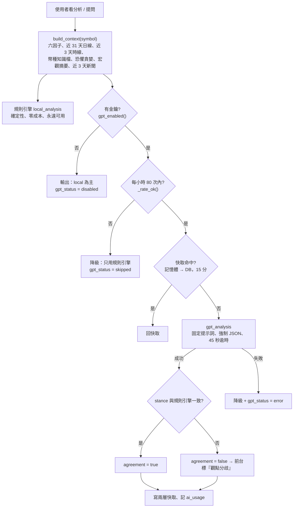

圖：GPT 決策與備援——無金鑰、超額、逾時或格式錯誤都回退規則引擎

## 目前畫面應呈現的兩引擎

規則引擎（永遠可用）：`local_analysis(ctx)` 純規則、確定性，產出立場（偏多／偏空／中性）、趨勢／動能／量能／位置／短線／情緒／宏觀逐面向解讀、最多 4 條風險與條件式操作參考；六因子即時計分明細在前台「買賣判斷依據」面板。無金鑰時 `/api/ai/analysis` 只回 `local`，`gpt_status="disabled"`。

GPT 深度解讀（選配）：`gpt_analysis(ctx, local)` 把結構化事實加規則引擎初步結論餵給 GPT，強制 JSON 回傳；兩邊立場不一致時 `agreement=false`，前台顯示「兩個分析來源觀點不一致」提醒。問答 `POST /api/ai/ask`：命中固定問答時 GPT 只做潤飾（`source="canned+gpt"`），未命中才自由回答（帶最近 3 輪對話），資料範圍外的歷史問題是唯一允許 GPT 動用訓練知識的場景（開頭固定聲明非本站驗證數據）。

> 現況註記（2026-09-02）：前台 `AIAnalystPanel` 與小Q 暫停掛載（第 06 章 §3.6），後端與 API 照常；啟用金鑰後建議同步恢復面板。

## 預覽範例（不呼叫 GPT）

輸入（規則引擎整理的結構化事實，節錄）：

```json
{
  "symbol": "BTCUSDT", "name_zh": "比特幣",
  "signal": {"signal": "NEUTRAL", "score": 52, "factors": ["RSI 48 中性", "MACD 動能減弱", "站上 MA20 未達多頭排列", "站上 MA200", "量比 0.9x", "布林位置 55%"]},
  "daily_tail": [{"date": "2026-09-01", "close": 109012.5, "rsi": 48.1, "ma20": 108300.2, "ma200": 96540.8}],
  "fear_greed": {"value": 41, "label": "Fear"},
  "macro": {"verdict": "NEUTRAL", "verdict_zh": "多空拉鋸", "evidence_strength": "DIRECTIONAL_ONLY"},
  "news": [{"title": "...", "sentiment": "neutral", "domain": "CoinDesk"}]
}
```

規則引擎輸出（前台實際顯示的形狀）：

```json
{
  "stance": "中性",
  "headline": "站穩長期均線但動能轉弱，觀望為主",
  "sections": {"trend": "...", "momentum": "...", "volume": "...", "position": "...", "short_term": "...", "sentiment": "...", "macro": "..."},
  "risks": ["MACD 動能減弱，若跌破 MA20 108,300 可能回測 MA60", "恐懼貪婪 41 偏恐懼，情緒面無助攻"],
  "watch": ["站回 MA20 且量比 >1.1x", "RSI 突破 55"],
  "disclaimer": "技術面教學分析，不是投資建議，資金請自行控管"
}
```

## GPT 啟用方式（程式已實作，正式啟用仍需核准）

設定（擇一；環境變數優先於後台）：

```text
OPENAI_API_KEY=只放在後端環境變數（secrets.local.cmd / .sh）或後台「AI 設定」，不放前端、不提交 Git
OPENAI_MODEL=gpt-4o-mini（預設）
OPENAI_BASE_URL=https://api.openai.com/v1（預設；可指向 OpenAI 相容代理）
AI_HOURLY_CAP=80（每小時 GPT 呼叫上限）
```

建議流程：

1. 主管核准申請金鑰與預算（分析每小時上限 80 次、15 分鐘快取；新聞批次標註約每日不到 0.01 美元）。
2. 後台 `PUT /api/admin/ai/config` 貼上金鑰（即時生效，免重啟）或寫入密鑰檔後重啟；`GET /api/admin/ai/config` 只回遮罩（前 6 後 4）與來源（env／db）。
3. `POST /api/admin/ai/test` 發一個極小請求驗證金鑰、模型與網路。
4. 前台恢復 `AIAnalystPanel` 掛載（取消註解、`npm run build` 兩次）。
5. 觀察 `GET /api/admin/ai/stats`：今日與近 7 日呼叫數、失敗數、token；`ai_usage` 保留 90 天。

用量控管：分析結果同（幣 × 是否用 GPT × 日線版本 × 時線版本 × 模型）快取 15 分鐘（記憶體上限 200 筆＋DB 持久化 7 天），每小時與每日 ingest 後自動失效；問答潤飾另有獨立快取；`gpt-5` 與 `o` 系列不帶 `temperature`，其餘 0.3；逾時 45 秒。限流：`gpt=1` 20 次／分・300 次／日，`force=1` 3 次／分・30 次／日，問答 10 次／分・120 次／日。

## 實際的 GPT 回傳格式

`SYSTEM_PROMPT_ANALYSIS` 六條鐵則：只能用提供的數據推理、嚴禁捏造數字／價位／新聞；每個論點引用具體數據；數據缺失直說「該項資料不足」；禁止保證式語句，一律機率與條件式語氣；教育性技術分析、非投資建議，正文不重複免責；可同意或反對規則引擎結論但要講依據。輸出限定嚴格 JSON：

```json
{
  "stance": "偏多 | 偏空 | 中性",
  "headline": "30 字內",
  "analysis": "250~450 字：日線趨勢動能 → 小時線 → 情緒新聞 → 綜合研判，每點帶數據",
  "risks": ["最多 4 條"],
  "watch": ["最多 3 條"],
  "agree_with_rules": true,
  "disagree_reason": ""
}
```

`SYSTEM_PROMPT_ENHANCE`（問答潤飾）：基底答案的數字、價位、立場結論原封保留；不得新增基底與數據中沒有的事實；依問法調整開頭與語氣；繁體中文 markdown、長度相近或更精簡；免責最多一次。`SYSTEM_PROMPT_QA`：只依提供數據回答、答不出來就誠實說缺什麼、300 字內、不給保證式結論。`SYSTEM_PROMPT_HISTORY_FALLBACK`：開頭固定聲明非本站資料庫的驗證數據、只給約略量級、150 字內。解析容錯：先去掉 markdown json 圍欄再 `json.loads`；解析失敗即 `gpt_status="error: …"` 並降級。

## 正式啟用前驗收

- 以測試金鑰對 BTC、ETH、一個小幣各跑 `GET /api/ai/analysis/{symbol}?gpt=1&force=1`：JSON 欄位齊全、`analysis` 內每個數字都能在 `local`／`ctx` 找到來源、無保證式語句。
- 故意給錯金鑰、斷網、逾時：`gpt_status` 為 `error: …`、`local` 照常、前台無錯誤彈窗。
- 連續呼叫超過每小時 80 次：`gpt_status="skipped"`、不產生費用。
- `POST /api/ai/ask` 命中固定問答時 `source="canned+gpt"` 且數字與 `canned` 版一致；未追蹤幣仍誠實拒答。
- `ai_usage` 有紀錄且後台統計正確；金鑰在任何回應中都只出現遮罩。
- 觀點分歧案例：規則引擎與 GPT 立場不同時前台顯示提醒。

# 附錄B. SQLite 每日備份與換機搬遷 Runbook

兩個 SQLite（`data/app.db`、`data/news.db`）皆為 WAL 模式且排程器常駐在寫：直接複製 `.db` 會拿到缺尾巴的不一致快照。備份與搬遷一律走 SQLite online backup API；每日 03:30 排程自動備份、保留 14 份；換機用搬遷包。

> 文件定位：本文件是備份與搬遷的操作 Runbook。資料生命週期與可重建性以第 03 章 §9 為準；安全與災難復原政策以第 08 章 §7 為準；部署入口以第 10 章 §7 為準。

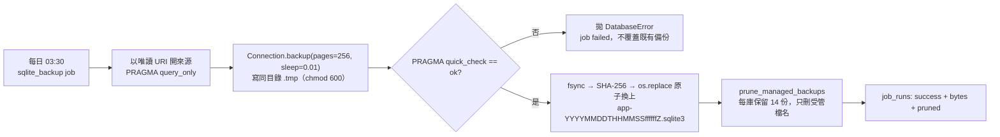

圖：備份流程——一致快照、完整性驗證、原子發布、輪替

## 正式環境啟用

備份隨服務啟動自動註冊（`backend/scheduler.py` 的 `sqlite_backup` job），不需額外設定；可調環境變數：

```text
SQLITE_BACKUP_DIR=data/backups/sqlite      # 輸出目錄（預設）
SQLITE_BACKUP_KEEP=14                       # 每庫保留份數（1~365，非法值退回 14）
```

修改後重啟服務。備份目的地與來源相同會拋 `ValueError`；`data/backups/` 已 gitignore，且刻意不放進搬遷包（新機每日排程會自己重新產生）。2026-09-02 實測：28 檔、645 MB、2026-08-19～2026-09-01、每日 19:30 UTC。

## 驗證與安全操作

- 看紀錄：後台監控頁 `job_runs` 的 `sqlite_backup`（訊息含總 bytes 與清除數）；或 `SELECT * FROM job_runs WHERE job_type='sqlite_backup' ORDER BY id DESC LIMIT 5`。
- 手動備份：`python -c "from backend.scheduler import run_sqlite_backup; run_sqlite_backup()"`。
- 驗證備份檔：`sqlite3 data/backups/sqlite/app-<時間>.sqlite3 "PRAGMA quick_check"` 應回 `ok`；`SELECT COUNT(*) FROM forecast_snapshot_v2` 應接近線上。
- 還原（停機操作）：`schtasks /end /tn CryptoQuantBackend` → 清殘留進程 → 把快照複製為 `data/app.db`（先刪 `app.db-wal`／`app.db-shm`）→ `schtasks /run` → 後台監控頁確認新鮮度，必要時手動跑管線補齊可重建表。
- 測試：`pytest tests/test_sqlite_backup.py -q`（含 WAL 內已提交列、失敗不覆蓋、命名與輪替只動受管檔、排程註冊不重疊）。
- 待辦：獨立排程工作並推送異地（#178）；每季還原演練。

## 換機搬遷

舊機器：

```bash
python scripts/make_migration_bundle.py               # → ../crypto-quant-migration/crypto-quant-migration-<日期>.zip
python scripts/make_migration_bundle.py --no-secrets  # 不含帳密
```

包含 `secrets.local.sh`（由 `secrets.local.cmd` 的 `set` 轉成 `export`）、`data/app.db` 與 `data/news.db` 的線上備份快照、`data/clean`、`data/raw`、`reports`。內含後台密碼，請用私人管道傳。

新機器：

```bash
git clone <repo> crypto-quant && cd crypto-quant
./setup.sh                                            # 建 .venv、裝相依、npm ci、build 前端
unzip -o ~/Downloads/crypto-quant-migration-*.zip -d .  # 還原 DB 與帳密（zip 內路徑相對 repo 根）
./start_backend.sh                                    # 或 Windows：建 secrets.local.cmd 後 .\start_backend.cmd
```

還原後檢查：後台監控頁各幣最後日期；`SELECT COUNT(*) FROM tasks`；`forecast_snapshot_v2` 筆數；下一個排程點（每小時 :06、每日 09:00）是否成功。Windows 新機另需：建立 Task Scheduler 工作 `CryptoQuantBackend`、改 `start_backend.cmd` 的路徑與 IP、同步 quant-portal 與台股平台的 API 位址。

# 附錄C. 訊號成績單與宏觀預測力檢定：操作與指標說明

更新日期：2026-09-02

> 文件定位：本文件是四個驗證工具的操作 Runbook——訊號成績單（`src/signal_eval.py`）、回測驗證器（`src/verify_backtest.py`）、指標交叉驗證（`src/verify_indicators.py`）、宏觀預測力檢定（`src/macro_eval.py`／`macro_longrun.py`）。策略結論與是否調整訊號以第 11 章為準；API 總覽見第 05 章。

## 目的與限制

這四個工具回答「資料對不對、回測有沒有作弊、訊號有沒有 edge、宏觀有沒有預測力」，全部唯讀、不改資料；結論是統計檢驗，不是績效保證。成績單與檢定的數字會隨資料成長漂移，文件中的快照只代表執行時點。

## 檢驗設計（共用的尺）

- 訊號成績單：訊號在第 `i` 天收盤可知 → `open[i+1]` 進場 → `N` 天後 `open[i+1+N]` 結算；只取 onset；基準＝任一天進場；暖身 `SKIP=200`；`HORIZONS=[5,10,20]`；因子單獨評估持有 10 天；有意義門檻 `+0.5pp`（約覆蓋來回成本 0.3%）。判定 `ok=True` 需三個天期的平均報酬與命中率皆優於基準且樣本 ≥ 100；單因子 `edge > 0.2pp` 且命中率高於基準判有預測力、`< −0.2pp` 判無。
- 回測驗證器：十組 PASS／FAIL（第 04 章 §9），第十組重算訊號驗時序：每筆進場須 `signals[i−1]=='BULL'` 且 `signals[i−2]!='BULL'`，成交價＝當根原始開盤價（相對誤差 < 1e-4）。
- 指標交叉驗證：前綴和自算 SMA、母體標準差、顯式遞迴 EMA 與 Wilder RSI（不重用產線程式）；自第 250 列起比對；RSI 絕對容差 0.05、其餘相對 `1e-3 × mean(|indep|)`。
- 宏觀檢定：`HORIZONS=(1,5,20)`；事先指定的唯一主檢定＝等權籃子 × 5 日 × RISK_ON 減 RISK_OFF；`regime[t]` 只用 `t` 及更早的宏觀收盤（美股行事曆對加密日曆 `ffill(limit=5)`）→ `open[t+1]` 進、`open[t+1+h]` 出；重疊報酬以 Newey–West（`lag=h`）修正 t 值並附不重疊子樣本對照；同時列天數與區段數（episodes）；門檻訂於檢定前且不回調；其餘（各幣、各 horizon、各單一因子、逆風不開新倉 overlay）皆屬探索性。

## 安裝與執行

```powershell
python src\signal_eval.py                    # 印成績單 JSON（後台現況頁同源，快取鍵含指標檔 + scoring.py + backtest.py mtime）
python src\signal_scorecard.py               # 15 幣彙總研究基線（只列印）
python src\signal_experiments.py             # 七個進場變體並排（含恐懼貪婪）
python src\verify_backtest.py BTCUSDT        # 十組檢查；改訊號/回測後必跑
python src\verify_indicators.py 1d           # 或 1h；後台 /api/admin/verify/indicators 同源
python src\macro_eval.py                     # 印報告並寫 reports/macro_evidence.json（每日管線步驟 10 亦執行）
python src\macro_longrun.py                  # 2017 起 8 年旁路（抓進 data/raw/macro_longrun_1d，正式資料不動）
python src\backtest_sentiment_ab.py          # 六因子 vs 七因子（新聞情緒）A/B
```

## 指標定義

| 指標 | 定義 |
|---|---|
| 命中率 | 結算報酬 > 0 的比例 |
| edge（pp） | 訊號命中率或平均報酬 − 基準（任一天進場） |
| 基準上漲率 | 全部日子的 N 日 forward 報酬 > 0 比例 |
| 隨機進場百分位 | 同筆數、同持有天數、同停損停利、只有買的日子亂選（500 次、固定種子）的策略總報酬百分位；約 50 表示選時無異於隨機 |
| 每筆報酬 t 統計量 | 慣例 `|t| > 2` 才算有統計意義 |
| 順風減逆風（宏觀） | RISK_ON 日與 RISK_OFF 日的 h 日等權籃子報酬差；`|HAC t| > 2` 判顯著；樣本 < 30 不可用 |
| 區段數 | 連續同標籤視為一段，是 regime 的真正獨立樣本量級 |
| 連動強度 | BTC 與 SPX／DXY／VIX／GOLD 的 60 日滾動相關；`≥ 0.5` HIGH、`≥ 0.3` MEDIUM、否則 LOW；歷史百分位 ≥ 80 或 ≤ 20 另標偏高／偏低 |

## API

| 端點 | 說明 |
|---|---|
| `GET /api/admin/signal/scorecard` | 訊號成績單（需登入） |
| `GET /api/admin/verify/indicators?interval=1d` | 指標交叉驗證（需登入）；前台 `GET /api/verify`、`GET /api/status` 同源 |
| `GET /api/backtest/{symbol}` | 含 `validation`（走查驗證）、隨機基準、t 統計量 |
| `GET /api/macro` | `evidence`（讀 `reports/macro_evidence.json`，含不顯著也照實回）與 `linkage` |
| `GET /api/macro/history` | 逐日環境標籤 |

## 系統整合位置

- 成績單快取鍵含 `scoring.py` 的 mtime：改訊號後後台自動重算；`verify_indicators.cached_result()` 以指標檔版本為鍵。
- `macro_eval.save_evidence()` 由每日管線步驟 10 呼叫；`services/macro.load_evidence()` 依檔案 mtime 快取，`_evidence_summary()` 產生 `SUPPORTED`／`DIRECTIONAL_ONLY` 等級。
- 前台信任徽章讀 `/api/status.verification`；統一判斷摘要第④格讀 `/api/macro.evidence`。

## 驗證

已記錄結論（2026-09-02）：指標交叉驗證 16/16、1h 2/2；六因子 5 日 45.2% vs 47.4%（無 edge）；宏觀主檢定 +0.66%、HAC t=0.72（不顯著）；長樣本 5 年（191 區段）+0.81%／t=0.90 → 8 年（327 區段）+0.29%／t=0.32——樣本翻倍而 t 值縮小，是「沒有效果」的典型指紋。對應自動測試：`tests/test_macro_regime.py`（無前視、湊不齊因子不表態、假日沿用前值、HAC 修正）、`tests/test_quant_reliability.py`（point-in-time 與績效量測保證）。

# 附錄D. 文件沿革與主來源規則

## 主來源規則：同一主題誰是最後答案

| 主題 | 最後答案 | 備註 |
|---|---|---|
| 進度與完成度 | 後台「工作項目」（`app.db` 的 `tasks` 表） | 本手冊第 07、12 章為定版快照 |
| 系統一有變動要改的活文件 | `README.md` | 本手冊與 SDD 在重大交付節點重新同步 |
| 端點契約 | 程式（`backend/routers/`）與非對外模式的 OpenAPI `/docs` | 第 05 章為框架與慣例 |
| 資料表結構 | `backend/services/app_db.py`、`news_store.py` 的 `CREATE TABLE` | 第 03 章、第 10 章 §3 |
| 計分規則 | `src/scoring.py` | 第 02 章 §5.1 |
| 動量策略常數 | `src/momentum_signal.py` | 第 11 章；後台現況頁為現值 |
| 宏觀門檻 | `src/macro_regime.py`（凍結） | 第 02 章 §5.5；附錄 C |
| 研究預測契約與門檻 | `src/forecasting.py`、`services/forecast_scorecard.py` | 第 13 章 |
| 安全門檻 | `backend/services/security_hardening.py`、`rate_limiter.py` | 第 08 章 |
| 部署與操作 | `start_backend.cmd`／`.sh`、`setup.sh`、`scripts/` | 第 10 章 §7；附錄 B |
| 詞庫與問答庫 | `backend/routers/sentiment.py` 詞庫常數、`services/canned_qa.py` | 第 09 章；審核文件由 `export_qa_docs.py` 重生 |
| 元件掛載狀態 | `frontend/src/App.jsx` 內註解 | 第 06 章 §3.6 |
| 主管決策事項 | 主管摘要 §5 | 拍板後更新對應章節與後台任務 |

## 歷次整理紀錄

2026-09-02（本次改版）：

- 依《TalentHub 系統文件與交接手冊》與《TalentHub 系統規格書》的書寫方式與章節順序重排：README、`docs/主管摘要.md`、`docs/archive/` 五份（部署與運維／API規格／成果匯報／訊號增準計畫／研究預測評估）、自動生成的預測模型指標章與問答範本章，全數合併為本手冊（主管摘要＋導讀＋第 01–13 章＋附錄 A–D）；原《crypto-quant 文件合集.docx》（9 章＋前言）退役，內容全數納入本手冊。
- 《crypto-quant 系統規格書》改為與 TalentHub 相同的 SDD 章節（1 簡介～6 附錄，含 4.5 成員函數與 5.2 追溯表），並以 2026-09-02 程式碼逐模組核對。
- 產生方式改為 `docs/src/*.md` → `scripts/build_docs.py`（`md2docx.py` 轉檔＋Word 更新目錄頁碼）；`merge_docx.py`、`export_readme_docx.py`、`export_forecast_metrics_docx.py` 退役；`export_qa_docs.py` 保留為問答審核文件產生器；`情緒詞庫範本.docx` 保留為手工審核表單。
- 以三組程式盤點校正數字：53 個端點（30 公開／23 需登入）、19＋2 張表、141 項測試、固定問答 65 條（原文件寫 54）、`ai_analysis` 保留 7 天、`access_log`／`job_runs` 保留 30 天。
- Markdown 原始檔保留於 `docs/src/`；舊來源檔與合集保留於 git 歷史。

2026-09-01（前次整理）：交接文件總體檢——合集 16 章校正後精簡為 9 章＋前言主管摘要；新增系統規格書初版；Word 排版對齊 iFare 專業主題；macOS 支援、換機搬遷包與時區／冷啟動補正同步進文件；歷史規劃文件（專案路線圖、PROJECT_PLAN）刪除，內容見 git 歷史。

2026-08-27 以前：README 為入口文件（2026-07-02 重寫）；情緒詞庫範本與 AI 固定問答範本 Word 版供主管審核（2026-07-02）；驗證成果表與訊號研究記錄（2026-06-29～07-02）；Forecast Scorecard P0 規格與校準研究（2026-07-21）；模型指標與校準結論更新至 Word 文件合集（2026-07-24）；宏觀面板重新上架與全站出處標註（2026-08-10）。
