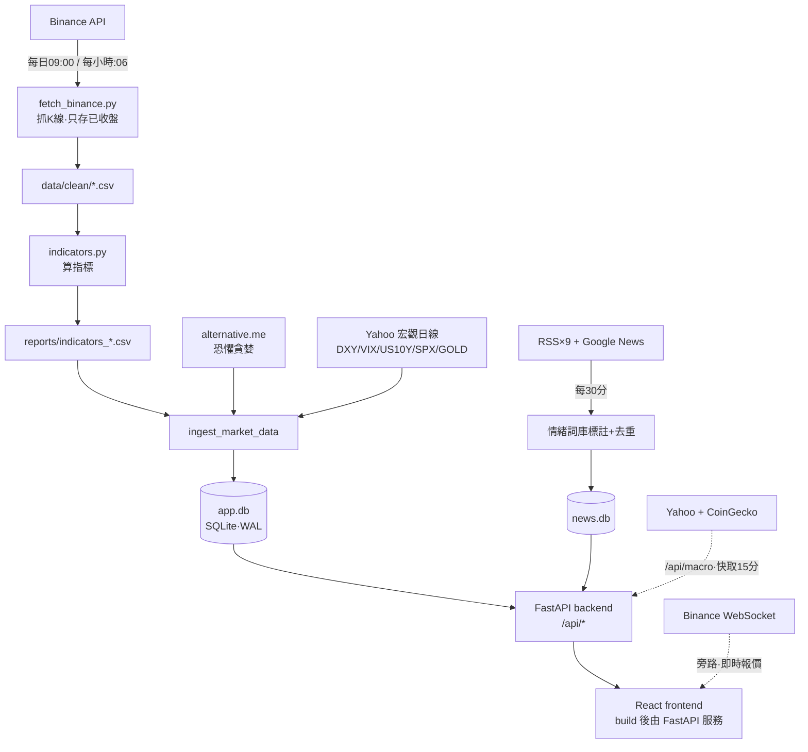
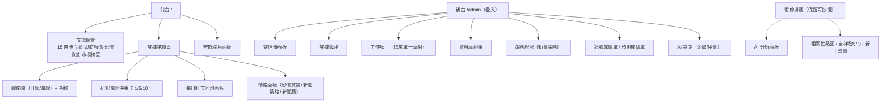
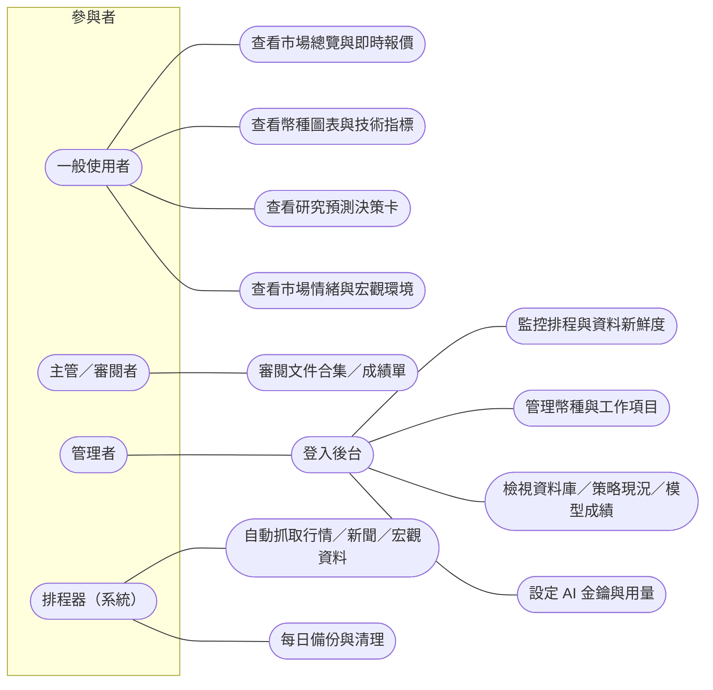
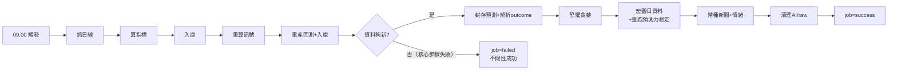
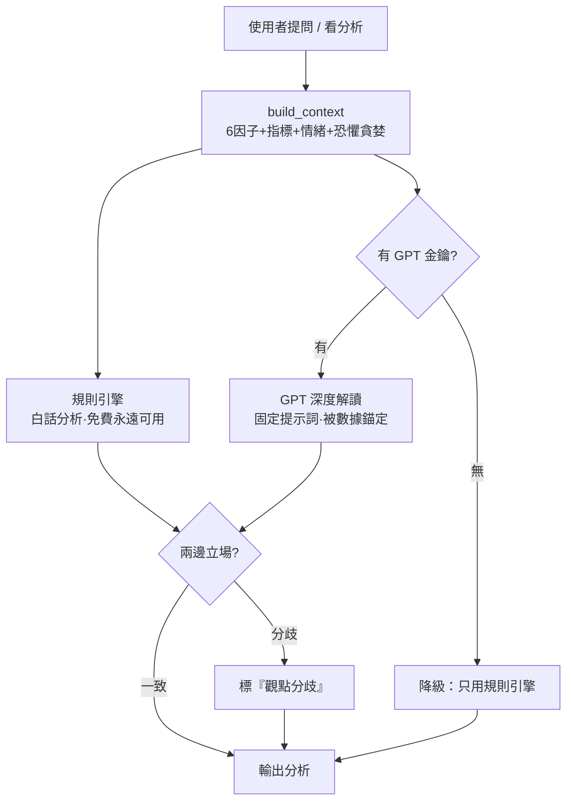

# 軟體系統規格書（SDD）— crypto-quant 加密貨幣量化分析平台

> 版本：v1.0（初稿）｜文件日期：2026-09-01｜資料截止：2026-08-31（收盤日線）
> 本文件依 SDD 標準章節（1 簡介～6 附錄）編排；內容取自本倉庫既有文件（README 與 docs/ 文件合集，2026-09-01 已全面校正），所有數字為當日唯讀實測。
> 尚未定案的管理決策（GPT 金鑰、對外固定網址、密碼輪替、策略去向）以「**決策狀態（2026-09-01）**」段落記錄現況；拍板後更新對應段落即可。

```
目錄
1. 簡介
    1.1 文件目的
    1.2 文件範圍
2. 系統概述
    2.1 系統目標
    2.2 系統範圍
    2.3 系統架構
    2.4 系統軟體需求概述
    2.5 系統軟體環境需求
    2.6 系統軟體設計限制
3. 系統初步設計
    3.1 系統使用者介面結構層次圖
    3.2 系統模組功能架構圖
    3.3 系統模組初步描述
4. 系統細部設計
    4.1 系統使用者介面流程設計
    4.2 系統模組功能細部描述
    4.3 系統資料結構細部描述
    4.4 系統對外介面（API）細部描述
    4.5 系統安全與防護設計
5. 系統需求至系統設計之追溯
    5.1 追溯工具與機制
    5.2 需求—設計—驗證追溯表
6. 附錄
    6.1 參考文件
    6.2 專有名詞解釋
    6.3 專有名詞中英對照
```

---

# 1. 簡介

## 1.1 文件目的

本文件為 crypto-quant（加密貨幣量化分析平台）之系統規格書，目的為：

- 提供**交接**依據：使接手開發／維運之同仁能在不依賴口頭說明的情況下，掌握系統目標、架構、模組、資料結構、介面與部署方式。
- 提供**審閱**依據：使主管能對照本規格書與實際系統，驗證功能範圍與已知限制。
- 建立**需求至設計之追溯**：每項功能需求對應到實作模組與驗證方式（見第 5 章）。

主管如僅需快速掌握全貌，建議先讀《crypto-quant 文件合集》前言之「主管摘要」（2 分鐘版），再回本文件查細節。

## 1.2 文件範圍

本文件涵蓋：系統目標與範圍（第 2 章）、架構與模組設計（第 3、4 章）、資料結構與 API 介面（第 4 章）、安全設計（4.5）、需求追溯（第 5 章）與名詞定義（第 6 章）。

下列主題**不在**本文件展開，僅摘述結論並指向權威文件（對照表見 6.1）：

| 主題 | 權威文件 |
|---|---|
| 部署、重啟、換機搬遷、對外入口操作步驟 | `docs/archive/部署與運維.md`（合集第貳章） |
| 每一個 API 端點之完整參數與回應規格 | `docs/archive/API規格.md`（合集第參章） |
| 每張資料表之完整欄位定義 | `docs/archive/API規格.md` 第二部：資料庫說明（合集第參章第二部） |
| 策略研究過程、績效證據與其誠實聲明 | `docs/archive/成果匯報.md`（合集第肆章；第二部＝訊號研究記錄） |
| 研究預測之資料契約與發布門檻 | `docs/archive/研究預測評估.md`（合集第陸章） |

---

# 2. 系統概述

## 2.1 系統目標

建置一個**自動運作**的加密貨幣分析平台：每日自動抓取 15 種主流幣之行情與新聞、計算技術指標與買賣訊號、產生可回溯（append-only）的研究預測，並以規則引擎（可選配 GPT）將數據轉為白話解讀；前台提供即時報價、互動圖表與市場情緒，後台提供監控與設定管理。

系統對「訊號有效性」採**誠實揭露**原則，此為本系統之核心立場：

- 前台 6 因子信心分數經統計檢驗**無預測力**（5 日勝率約 45% vs 隨機 47%），現定位為**教學用途**。
- 相對最有據者為後台之**防禦型跨幣動量策略**（2026-08-31 實跑檢驗段：年化 +25.6% vs 等權大盤 −16.4%；最大回撤 −20.6% vs −74.6%），惟該數字含**選參保留**（參數挑選時看過檢驗段資料）、會隨資料漂移、且尚未實盤——完整誠實聲明見合集第肆章。
- 宏觀環境判讀經事先指定之統計檢定**不顯著**，故僅作背景脈絡、不進買賣分數。

## 2.2 系統範圍

| 功能區塊 | 內容 |
|---|---|
| 市場總覽 | 15 幣訊號卡片牆、即時報價（前端直連 Binance WebSocket）、恐懼貪婪指數、市場摘要列 |
| 幣種詳細頁 | 蠟燭圖（日線／時線切換；MA、布林、成交量、RSI、MACD、KDJ、DMI、BIAS、ATR、OBV）、1／5／10 日研究預測決策卡、每日盯市回測、情緒面板 |
| 研究預測 | regime 歷史基準：漲跌機率、q10／q50／q90、下行風險、信心與證據；低信心／過期／樣本不足時明確拒答 |
| AI 智能分析 | 規則引擎（6 因子白話分析）＋GPT 深度解讀（需金鑰）；後端與後台已就緒，**前台面板目前依決策暫停顯示** |
| 市場情緒 | 恐懼貪婪錶盤與歷史、新聞情緒溫度（每日 −100～+100，全市場＋單幣）、新聞牆（10 個來源，中英文） |
| 宏觀環境 | 規則式宏觀環境引擎（DXY、VIX、美債、標普、黃金；另列日經、KOSPI、日圓對照）＋BTC 連動強度＋歷史證據 |
| 自動更新 | 前端每 60 秒輪詢資料版本，有新資料才重拉 |
| 管理後台 | 監控儀表板、幣種管理、工作項目追蹤、資料庫檢視、訊號成績單、策略現況、AI 設定 |

範圍外（規劃中，見 5.2 與 README 第 12 節）：到價／訊號通知、AI 每日晨報、投資組合追蹤、簡易／專業模式切換、ML 訊號（LightGBM）。

## 2.3 系統架構

系統為單機三層式：資料管線（Python 排程）→ 資料中心（SQLite×2，WAL 模式）→ 應用層（FastAPI 後端＋React 前端，build 後由 FastAPI 直接服務）。



架構原則：

- **CSV 為中繼／備援，前後台一律讀 SQLite**；所有排程執行紀錄寫入 `job_runs` 表，後台監控頁可視。
- **旁路即時資料**不經排程管線：即時報價由前端直連 Binance WebSocket；宏觀即時面板由後端即時抓 Yahoo／CoinGecko（快取 15 分鐘），與歷史檢定共用 `src/macro_regime.py` 同一套規則定義。
- **對外入口**：區網主入口為另一倉庫 quant-portal（`http://10.201.7.12:8080/`，加密／台股切換器），其 `/crypto/` 為本系統前端**另行建置**之靜態檔＋API 反向代理至本後端 `:8000`。**改前端須 build 兩次**（本倉庫 `npm run build` 之後，再至 quant-portal 執行 `build.ps1`）。

## 2.4 系統軟體需求概述

| 編號 | 功能需求 | 說明 |
|---|---|---|
| FR-1 | 行情自動抓取 | 每日 09:00 抓 15 幣日線、每小時 :06 抓 BTC／ETH 時線；僅儲存已收盤 K 棒 |
| FR-2 | 技術指標計算 | MA、布林、RSI、MACD、KDJ、DMI、BIAS、ATR、OBV 等，日線／時線雙週期 |
| FR-3 | 買賣訊號 | 6 因子計分（單一真相 `src/scoring.py`）；前台展示與回測共用同一把尺 |
| FR-4 | 回測 | 依訊號之動作延至**隔根開盤**成交（不前視）；每日重產並入庫 |
| FR-5 | 研究預測 | 1／5／10 日機率與分位數預測；內容定址、append-only 封存；不足即拒答 |
| FR-6 | 宏觀環境 | 規則式環境判讀＋十年歷史＋預測力檢定（結論：不顯著，僅作背景） |
| FR-7 | 新聞情緒 | 10 來源、每 30 分鐘抓取、中英雙語詞庫標註、每日情緒分數（全市場＋單幣） |
| FR-8 | AI 解讀 | 規則引擎恆可用；GPT 深度解讀需金鑰（固定提示詞、被本地數據錨定、觀點分歧標示） |
| FR-9 | 即時報價 | 前端直連 Binance WebSocket，秒級跳動 |
| FR-10 | 管理後台 | 登入驗證、監控、幣種與工作項目管理、資料庫檢視、成績單、AI 設定 |
| FR-11 | 自動備份 | 每日 03:30 以 SQLite online backup API 產生一致快照並輪替保留 |

> **決策狀態（2026-09-01）**：FR-8 之 GPT 深度解讀**金鑰未設定**，系統以規則引擎模式運作（功能完整、零 API 成本）。若日後啟用：於後台「AI 設定」頁填入金鑰即時生效（免重啟）；成本控制已內建（每小時 80 次上限、15 分鐘快取、token 用量後台可視），既有評估顯示 GPT 新聞批次情緒標註成本約每日不足 0.01 美元。是否申請由主管於策略去向決策（見 5.2）時一併裁示。

## 2.5 系統軟體環境需求

| 項目 | 需求 |
|---|---|
| 正式主機 | Windows Server 2022（現部署於 `10.201.7.12`）；亦支援 macOS／Linux（`setup.sh`＋`start_backend.sh`） |
| 執行環境 | Python 3.x（`.venv` 虛擬環境）、Node.js（前端建置與 mermaid 渲染）、SQLite（WAL 模式，隨 Python 內建） |
| 後端框架 | FastAPI＋Uvicorn＋APScheduler（排程隨應用啟動） |
| 前端框架 | React 19＋Vite 8＋lightweight-charts＋recharts |
| 網路埠 | 正式 `:8000`（本系統）；開發 API `:8001`、Vite `:5174`；區網主入口 `:8080`（quant-portal）；同機另有台股系統 `:8011`／`:5188`，維運時勿誤殺 |
| 開機自啟 | Windows 排程工作 `CryptoQuantBackend`（30 秒看門狗）；入口為 `Portal-LAN-Web`；macOS 用 launchd plist |
| 憑證注入 | `secrets.local.cmd`（Windows）／`secrets.local.sh`（macOS）注入 `ADMIN_PASS`、`ADMIN_SECRET`（已 gitignore） |
| 對外公開 | 選用 Cloudflare Quick Tunnel 指向 `:8000`（網址每次重啟會變）；固定網址（named tunnel）為待辦 |

> **決策狀態（2026-09-01）**：固定對外網址**尚未申請**——named tunnel／Cloudflare Access 需外部網域與帳號權限，非本倉庫可自動完成（後台待辦 #165）。現行對外方式：區網主入口 `http://10.201.7.12:8080/`（常駐）；需要網際網路臨時分享時以 Cloudflare Quick Tunnel 指向 `:8000`（每次重啟網址會變）。申請網域與時程待主管裁示後補記。

## 2.6 系統軟體設計限制

- **資料正確性鐵律**：僅儲存已收盤 K 棒（避免半根 K 棒污染尾端指標）；回測不前視（訊號動作延至隔根開盤成交）；改動訊號／回測後必須重跑 `src/verify_backtest.py`。
- **研究紀錄不可竄改**：`forecast_snapshot*`／`forecast_outcome*` 為 append-only（資料庫觸發器強制），重跑僅能產生新快照，舊紀錄無法重算——此類資料**不可重建**，依賴每日備份保全。
- **宏觀規則凍結**：`src/macro_regime.py` 之門檻訂於檢定之前，**不得依檢定結果回頭調整**（否則證據退化為事後配適）；若需納入宏觀因子須另行宣告新 holdout。
- **安全 fail-closed**：對外模式下 `ADMIN_SECRET` 未達 32 字元或為預設值即**拒絕啟動**；`ADMIN_PASS` 須 12 字元以上，唯一例外為明確設定之 legacy 密碼（啟動時記高風險警告）。
- **單機架構限制**：SQLite 單機、無分散式；多進程共享限流／備份鎖為已知待辦（#167）。排程使用**系統本地時區**（設計基準為台灣時間），主機時區改變會使抓取時間點漂移。
- **版控紀律**：排程產出之 `data/`、`reports/` 執行期產物不進版控；提交前以 `scripts/check_staged_runtime_artifacts.py` 把關（發現產物即阻擋）。

> **決策狀態（2026-09-01）**：`ADMIN_PASS` 目前為 legacy 弱密碼（2026-07-06 依當時決策沿用；系統啟動時記高風險警告；輪替追蹤 #166，**尚未排程**）。輪替步驟已備妥：更新 `secrets.local.cmd`（Windows）／`secrets.local.sh`（macOS）→ 重啟排程工作 `CryptoQuantBackend` → 以新密碼登入驗證；新密碼須 12 字元以上，建議保管於私人密碼管理工具（勿入版控）。執行日期待定後補記。

---

# 3. 系統初步設計

## 3.1 系統使用者介面結構層次圖



使用案例圖（use case diagram）：



## 3.2 系統模組功能架構圖

每日資料管線（09:00 觸發）：



失敗語意：核心行情步驟（抓取→指標→入庫→訊號→新鮮度）任一失敗，整個 job 標 `failed`；回測報表、恐懼貪婪、宏觀、新聞、清理為附屬步驟，失敗僅記錄警告；研究預測另立獨立 `forecast_pipeline` job。

AI 雙引擎決策流：



## 3.3 系統模組初步描述

後端（`backend/`）：

| 模組 | 職責 |
|---|---|
| `main.py` | FastAPI 入口：掛載 11 個 router（前綴 `/api`）、服務 `frontend/dist` |
| `scheduler.py` | 四個排程工作：每日 pipeline（09:00）、時線（每時 :06）、新聞（每 30 分）、SQLite 備份（03:30） |
| `routers/`（11 支） | meta、prices、indicators、signals、backtest、forecast、correlation、sentiment、ai、macro、admin |
| `services/app_db.py` | `data/app.db` 全部 19 張表之建立與存取 |
| `services/reader.py` | 前台讀取層（多週期查詢、資料版本、停用幣自動隱藏） |
| `services/signal_engine.py` | 6 因子訊號（計分核心共用 `src/scoring.py`） |
| `services/ai_analyst.py` | AI 雙引擎：規則分析→GPT（固定提示詞）→交叉檢核；限流與快取 |
| `services/news_store.py` | `news.db` 存取與每日情緒彙總 |
| `services/backtest_engine.py` | 回測引擎（核心共用 `src/backtest.py`） |
| `services/macro.py` | 宏觀環境引擎（規則核心共用 `src/macro_regime.py`） |
| `services/forecast_scorecard.py` | 預測成績單：不可變 ledger 去重、point-in-time 基準、發布閘門 |
| `services/security_hardening.py`、`rate_limiter.py`、`sqlite_backup.py` | 啟動安全檢查、登入鎖定與限流、線上備份 |

計算核心（`src/`）：

| 模組 | 職責 |
|---|---|
| `fetch_binance.py`、`indicators.py` | 抓 K 線（過濾未收盤）、算指標——排程與手動共用 |
| `scoring.py` | 6 因子計分**單一真相來源**（前台訊號與回測共用） |
| `backtest.py` | 回測核心（隔根開盤成交） |
| `forecasting.py`、`forecast_evaluation.py`、`forecast_replay.py`、`forecast_calibration.py` | 研究預測、評估指標、嚴格 replay、機率校準研究 |
| `momentum_signal.py` | 防禦型跨幣動量策略（後台「現況」頁） |
| `macro_regime.py`、`macro_eval.py`、`macro_longrun.py` | 宏觀規則（門檻凍結）、預測力檢定、長樣本旁路 |
| `verify_backtest.py`、`verify_indicators.py`、`signal_eval.py` | 回測驗證器、指標交叉驗證、訊號成績單 |
| `cross_sectional*.py`（6 支） | 跨幣動量研究血脈（收斂為 `momentum_signal.py`；歷史證據，勿刪） |

前端（`frontend/src/`）：

| 模組 | 職責 |
|---|---|
| `App.jsx` | 根元件：總覽／詳細切換、60 秒輪詢自動更新、時線切換 |
| `api/client.js`、`api/admin.js` | 公開／後台 API client |
| `lib/useLivePrices.js` | Binance WebSocket 即時報價 hook |
| `components/`（13 支） | CandlestickChart、MarketOverview、MarketSummary、MacroPanel、SentimentPanel、ForecastDecisionCard、HeroSignal、BacktestPanel、IndicatorCards 等；AIAnalystPanel、CorrelationHeatmap、BotWidget、OnboardingTour 暫停掛載 |
| `admin/AdminApp.jsx`、`admin/ForecastScorecardPage.jsx` | 後台整體與預測成績單頁 |

---

# 4. 系統細部設計

## 4.1 系統使用者介面流程設計

前台主流程：

- 進站 → 市場總覽（卡片牆即時跳動）→ 點選幣種 → 詳細頁（預設日線）→ 可切換時線（BTC／ETH）→ 圖表與指標連動。
- 前端每 60 秒查詢 `/api/status` 之 `data_version`，偵測到新資料才重新拉取，無須手動重整。
- 研究預測決策卡：顯示 1／5／10 日機率與區間；低信心／樣本不足／資料過期時顯示**明確拒答**而非假精準數字。

後台主流程：

- `/admin` 登入（帳密由環境變數注入；連續失敗 5 次鎖定 15 分鐘）→ 分頁操作（監控／幣種／工作項目／資料庫／現況／AI 設定）。
- 「工作項目」為全專案**進度單一真相來源**：完成標 done、新待辦即時補上。

實際畫面（2026-09-01 擷取自正式站 `10.201.7.12:8000`）：


（研究預測決策卡收合於詳細頁「詳細資訊（決策摘要／研究預測）」區塊，線上展開即可檢視；現況全數拒答屬預期行為，見 5.2 之 FR-5。）

## 4.2 系統模組功能細部描述

排程工作（`backend/scheduler.py`，隨 FastAPI 啟動，系統本地時區）：

| 時間 | 工作 | 內容 |
|---|---|---|
| 每日 09:00（台灣＝UTC 01:00，日 K 收盤後 1 小時） | `daily_pipeline` | 抓日線→算指標→入庫→重算訊號→重產回測＋入庫→新鮮度檢查→封存研究預測＋解析 outcome→恐懼貪婪→宏觀日資料＋預測力檢定→幣種新聞＋情緒→清理 |
| 每小時 :06 | `hourly_pipeline` | BTC／ETH 1h 增量抓取→指標→入庫（清單在 `app_config.hourly_symbols`） |
| 每 30 分 | `news_fetch` | 9 家 RSS＋Google News 中文→詞庫標註→去重入庫→滾動更新今日情緒 |
| 每日 03:30 | `sqlite_backup` | online backup API 產生一致快照→`quick_check` 驗證→原子發布→保留 14 份 |

核心機制細部：

- **訊號計分**：唯一入口 `src/scoring.py`；改動後必須重跑回測與 `verify_backtest.py`（前台建議與回測佐證才會一致）。
- **回測成交規則**：訊號於第 t 根收盤確立，買賣一律於第 t+1 根**開盤價**成交；含手續費與滑價設定。
- **研究預測封存**：輸入之完成日線做 SHA-256 內容定址；`reference_close`、預測與 outcome 分開 append-only 封存；同一資料日若歷史 K 線被修訂，另建快照而不覆寫。
- **宏觀引擎**：即時面板與歷史檢定共用同一規則；每格標示標的代號與該筆收盤日（各序列交易日不一致，不共用單一「更新時間」）。
- **新聞管線**：URL 唯一鍵＋近 7 日標題正規化去重；中英雙語加權詞庫判讀；幣種歸屬寫入 `coins` 欄。

## 4.3 系統資料結構細部描述

`data/app.db`（19 張表，WAL）：

| 分類 | 資料表 | 用途 | 可否重建 |
|---|---|---|---|
| 行情 | `prices`、`indicators` | 多週期 K 線與指標（PK＝symbol＋interval＋ts） | 可（自 Binance／CSV） |
| 訊號 | `daily_signal` | 每日訊號歷史 | 可（重算） |
| 情緒 | `fear_greed` | 恐懼貪婪歷史 | 可（外部 API） |
| 宏觀 | `macro_daily` | DXY／VIX／US10Y／SPX／GOLD 日線 | 可（Yahoo 回補） |
| 設定 | `app_config` | 幣種清單、時線幣種、AI 設定（集中設定，後台可改） | 部分（設定需人工重建） |
| 追蹤 | `tasks`、`job_runs`、`access_log` | 工作項目（**進度單一真相**）、排程紀錄、存取紀錄 | **tasks 不可重建** |
| 研究預測 | `model_registry`、`forecast_snapshot(_v2)`、`forecast_outcome(_v2)` | append-only 研究 ledger（觸發器禁改禁刪） | **不可重建** |
| AI | `ai_analysis`、`ai_chat`、`ai_usage` | 分析快取、對話（90 天）、token 用量 | 可捨棄 |

`data/news.db`（2 張表，WAL）：

| 資料表 | 用途 |
|---|---|
| `news` | URL 唯一、標題、來源、情緒、分類、`coins` 幣種標記、`summary` |
| `news_sentiment_daily` | 每日×每幣情緒分數（−100～+100） |

備份設計：兩庫每日 03:30 以 SQLite online backup API 產生一致快照至 `data/backups/sqlite/`（先暫存→`PRAGMA quick_check`→原子發布，各保留 14 份）。**禁止直接複製執行中的 `.db` 檔**（WAL 未 checkpoint 資料在 `.db-wal`，直接複製會得到不一致快照）；換機一律使用 `scripts/make_migration_bundle.py`。

## 4.4 系統對外介面（API）細部描述

通則：

- 全部端點掛於 `/api` 前綴；公開端點免驗證，後台端點（`/api/admin/*` 與部分寫入操作）需登入 token（8 小時效期）。
- 伺服器端快取：恐懼貪婪 1 小時、新聞 30 分、宏觀 15 分、AI 分析 15 分、預測累積狀態 600 秒。
- 錯誤碼：400 參數錯誤、401 未登入、404 不存在、409 衝突（排程互斥／預測快照寫入衝突）、422 不支援之 horizon、429 觸及限流（11 組限流規則，見 API 規格）、502 上游失敗。

端點分組（52 個端點之概覽；完整參數與回應見 `docs/archive/API規格.md`）：

| 分組 | 代表端點 | 功能 |
|---|---|---|
| meta | `/api/symbols`、`/api/status`、`/api/verify` | 幣種清單、資料版本心跳、指標驗證徽章 |
| 行情 | `/api/prices/{sym}`、`/api/indicators/{sym}` | K 線與指標（`interval=1d|1h`） |
| 訊號 | `/api/signals`、`/api/signals/{sym}/history` | 6 因子訊號與歷史 |
| 回測 | `/api/backtest/{sym}`、`/api/backtest/db/*` | 即時回測與入庫結果 |
| 研究預測 | `/api/forecast/{sym}`、`/api/forecast/scorecard`、`/api/forecast/ledger-status` | 預測決策卡、樣本外成績單（後台）、累積狀態（公開） |
| 情緒 | `/api/sentiment/news`、`/api/sentiment/summary`、`/api/sentiment/fear_greed`、`/api/sentiment/sources` | 新聞牆、情緒彙總、恐懼貪婪、來源統計 |
| AI | `/api/ai/analysis`、`/api/ai/ask`、`/api/ai/config` | 雙引擎分析、問答、設定 |
| 宏觀 | `/api/macro`、`/api/macro/history` | 即時環境判讀（含證據與連動強度）、逐日環境標籤 |
| 相關性 | `/api/correlation` | 相關性矩陣 |
| 後台 | `/api/admin/*`（23 個端點） | 登入、監控、幣種、任務、DB 檢視、成績單、策略現況、操作 |

## 4.5 系統安全與防護設計

- **啟動安全檢查**（fail-closed）：對外模式（bind 非 loopback 或宣告 external）下，簽章密鑰為預設值／未達 32 字元、或密碼未達 12 字元即拒絕啟動；loopback 開發沿用預設需明確設定 `ALLOW_INSECURE_ADMIN_DEFAULTS=1`。
- **登入防護**：連續失敗 5 次鎖定 15 分鐘（回 429＋Retry-After）。
- **限流**：登入、AI（分析／問答／測試）、新聞回補、預測、回測、後台操作共 11 組 per-IP／per-帳號限流。
- **HTTP 安全標頭**與敏感端點 per-IP 配額已落地；Cloudflare named tunnel／Access／WAF 為待辦（#165）。
- **資料防線**：每日自動備份（4.3）；版控產物防線 `check_staged_runtime_artifacts.py`；append-only 觸發器保護研究 ledger。

---

# 5. 系統需求至系統設計之追溯

## 5.1 追溯工具與機制

- **進度單一真相**：後台「工作項目」（`app.db` 之 `tasks` 表，2026-09-01 實測 done 137／in_progress 2／planned 44）。文件為規劃視角快照，以 tasks 表為準。
- **執行追溯**：每次排程寫入 `job_runs`（成功／失敗／訊息），後台監控頁可視。
- **驗證工具**：`src/verify_backtest.py`（改訊號／回測後必跑）、`src/verify_indicators.py`（指標交叉驗證，前台信任徽章）、`scripts/check_staged_runtime_artifacts.py`（版控防線）、`pytest tests`（141 個測試）。
- **版控慣例**：單人倉庫直接 commit＋push `main`；只提交當次工作之檔案；同步推送兩個遠端（SSH 舊帳號＋HTTPS 新帳號）。

## 5.2 需求—設計—驗證追溯表

| 需求 | 實作模組 | 驗證方式 | 現況 |
|---|---|---|---|
| FR-1 行情抓取 | `src/fetch_binance.py`＋`scheduler.py` | `job_runs`＋新鮮度防線 | 已上線 |
| FR-2 指標 | `src/indicators.py` | 獨立交叉驗證（16／16 全對，驗證當時 16 幣） | 已上線 |
| FR-3 訊號 | `src/scoring.py`＋`signal_engine.py` | 成績單 forward 檢驗（**結論：無預測力，降教學**） | 已上線（教學定位） |
| FR-4 回測 | `src/backtest.py` | `verify_backtest.py`（含不前視檢查） | 已上線 |
| FR-5 研究預測 | `src/forecasting.py`＋forecast ledger | scorecard 閘門（現況 `insufficient_evidence`；全數 abstain 再評估＝#191） | 已上線（持續拒答） |
| FR-6 宏觀 | `src/macro_regime.py`＋`macro_eval.py` | 事先指定檢定（**不顯著**；長樣本複核同結論） | 已上線（僅背景） |
| FR-7 新聞情緒 | `sentiment.py`＋`news_store.py` | 來源統計端點＋詞庫審核流程 | 已上線 |
| FR-8 AI 解讀 | `services/ai_analyst.py` | 固定問答測試＋交叉檢核 | 後端就緒；前台面板暫停；GPT 金鑰未設 |
| FR-9 即時報價 | `lib/useLivePrices.js` | 前端直連驗證 | 已上線 |
| FR-10 後台 | `routers/admin.py`＋`AdminApp.jsx` | 登入／限流測試 | 已上線 |
| FR-11 備份 | `services/sqlite_backup.py` | `quick_check`＋輪替驗證 | 已上線 |
| 動量策略上前台 | `src/momentum_signal.py`（現僅後台） | 訊號增準計畫 Phase A 驗收門檻 | **待主管拍板**（#79，A／B／C 選項見合集第肆章） |

> **決策狀態（2026-09-01）**：策略去向 A（接進平台）／B（實盤前測）／C（重新定位）**尚未拍板**——提案於 2026-06-30（後台追蹤 #79），研究端建議順序為 **B → A**（先紙上實盤驗證數月確認穩健度，再產品化搬上前台）。拍板後：將結果與日期補記於此、更新後台 #79、並於成果匯報（合集第肆章）補記決策。

---

# 6. 附錄

## 6.1 參考文件

本倉庫文件（單一交付檔為《crypto-quant 文件合集.docx》，9 章＋前言主管摘要；改動任一來源後執行 `scripts/merge_docx.py` 重生）：

| 合集章次 | 來源檔 | 內容 |
|---|---|---|
| 前言 | `docs/主管摘要.md` | 主管 2 分鐘版 |
| 壹 | `README.md` | 專案入口總覽 |
| 貳 | `docs/archive/部署與運維.md` | 部署、排程、備份、對外入口（:8080）；第二部＝開發指南（開發鐵律與測試） |
| 參 | `docs/archive/API規格.md` | 全部端點規格；第二部＝資料庫說明（19＋2 張表完整結構） |
| 肆 | `docs/archive/成果匯報.md` | 給主管的成果與 A／B／C 決策；第二部＝訊號研究記錄（研究軌跡含誠實聲明） |
| 伍 | `docs/archive/訊號增準計畫.md` | 規則式增準；第二部＝ML 研究計畫 |
| 陸 | `docs/archive/研究預測評估.md` | 第一部＝預測成績單規格、第二部＝校準研究 |
| 柒 | （自動生成）預測模型指標報告 | F1／Recall／AUC／AP／SHAP 與參考門檻 |
| 捌／玖 | 問答庫／情緒詞庫範本 | AI 固定問答、詞庫審核 |

外部參考文件（依系統實際使用之資料來源與技術）：

| 類別 | 參考 |
|---|---|
| 行情資料 | Binance Spot REST API（K 線 `klines` 端點）與 Binance WebSocket 行情串流官方文件 |
| 市場情緒 | alternative.me Crypto Fear and Greed Index API |
| 宏觀行情 | Yahoo Finance 歷史行情（美元指數／VIX／美債 10Y／標普 500／黃金／日經 225／KOSPI／日圓）；CoinGecko Global API（BTC 主導率、加密總市值） |
| 後端框架 | FastAPI、Uvicorn、APScheduler 官方文件 |
| 資料庫 | SQLite 官方文件（WAL 模式、Online Backup API） |
| 前端 | React、Vite、TradingView lightweight-charts、Recharts 官方文件 |
| 文件工具 | python-docx、docxcompose、mermaid-cli（本規格書與文件合集之產生工具） |
| 學術文獻 | Kull, Silva Filho and Flach（2017）,“Beta calibration: a well-founded and easily implemented improvement on logistic calibration for binary classifiers”, AISTATS——見合集第陸章第二部文末；機率評分（Brier／log loss）、區間評估（WIS）與 moving-block bootstrap 之一手文獻已列於合集第陸章第一部「主要一手文獻」 |

## 6.2 專有名詞解釋

| 名詞 | 解釋 |
|---|---|
| K 棒（K 線） | 一段時間內開高低收之價格紀錄；本系統僅儲存**已收盤** K 棒 |
| 前視偏誤 | 回測時使用了當下不可能取得的未來資訊，使績效虛高；本系統以「隔根開盤成交」避免 |
| 樣本外 | 未參與模型設計之資料段；本系統誠實標註動量策略之「樣本外」含選參保留，嚴格而言不純 |
| 選參保留 | 挑選參數時看過檢驗段表現，導致檢驗成績偏樂觀之風險 |
| regime | 市場狀態（多頭／空頭／震盪）；動量策略以 BTC 是否高於 100 日均線作空頭過濾 |
| 波動目標 | 依近期波動調整曝險，使組合波動貼近目標值（本策略 30%） |
| 最大回撤（MDD） | 淨值自高點回落之最大幅度 |
| Sharpe | 風險調整後報酬（超額報酬÷波動） |
| HAC t 值 | 對自相關與異質變異穩健之 t 統計量；本系統宏觀檢定 t=0.72，未達顯著 |
| abstain（拒答） | 預測信心不足時明確不給結論；優於輸出假精準數字 |
| Brier score／ECE | 機率預測品質指標（誤差平方）／校準誤差（宣稱機率與實際頻率之落差） |
| append-only | 只可新增、不可修改刪除；本系統研究 ledger 以資料庫觸發器強制 |
| WAL | SQLite 之寫前日誌模式；耐當機、讀寫不互鎖，但**禁止直接複製執行中之資料庫檔** |
| fail-closed | 安全設定不合格時直接拒絕啟動，而非降級放行 |
| 恐懼貪婪指數 | alternative.me 之市場情緒指標（0 極度恐懼～100 極度貪婪） |

## 6.3 專有名詞中英對照

| 中文 | 英文 |
|---|---|
| 蠟燭圖／K 線圖 | candlestick chart |
| 移動平均線 | moving average（MA） |
| 布林通道 | Bollinger Bands |
| 相對強弱指標 | Relative Strength Index（RSI） |
| 指數平滑異同移動平均線 | MACD |
| 平均真實區間 | Average True Range（ATR） |
| 能量潮 | On-Balance Volume（OBV） |
| 回測 | backtest |
| 樣本外 | out-of-sample（OOS） |
| 前視偏誤 | look-ahead bias |
| 選擇偏誤 | selection bias |
| 跨幣動量 | cross-sectional momentum |
| 波動目標 | volatility targeting |
| 最大回撤 | maximum drawdown（MDD） |
| 市場狀態過濾 | regime filter |
| 拒答 | abstain |
| 校準 | calibration |
| 逐步向前驗證 | walk-forward validation |
| 排程器 | scheduler |
| 看門狗 | watchdog |
| 限流 | rate limiting |
| 反向代理 | reverse proxy |
| 恐懼貪婪指數 | Fear and Greed Index |
| 單一真相來源 | single source of truth |
| 增量抓取 | incremental fetch |
| 資料版本 | data version |
| 內容定址 | content-addressed |
| 不可變帳本 | append-only ledger |
| 觸發器 | trigger |
| 分位數 | quantile |
| 信賴區間 | confidence interval |
| 統計顯著性 | statistical significance |
| 滾動相關 | rolling correlation |
| 等權 | equal-weight |
| 年化報酬率 | CAGR（compound annual growth rate） |
| 夏普比率 | Sharpe ratio |
| 校準誤差 | expected calibration error（ECE） |
| 發布覆蓋率 | publication coverage |
| 搬遷包 | migration bundle |
| 開機自啟 | auto-start on boot |
| 排程工作 | scheduled task |
